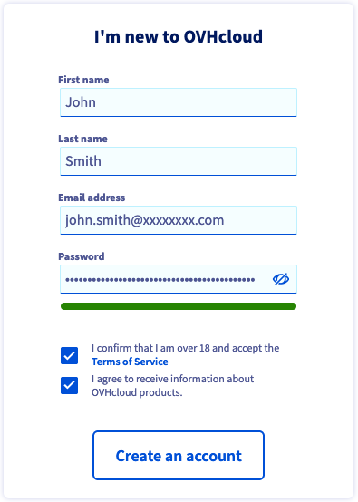
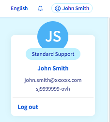

> [!primary]
> Tłumaczenie zostało wygenerowane automatycznie przez system naszego partnera SYSTRAN. W niektórych przypadkach mogą wystąpić nieprecyzyjne sformułowania, na przykład w tłumaczeniu nazw przycisków lub szczegółów technicznych. W przypadku jakichkolwiek wątpliwości zalecamy zapoznanie się z angielską/francuską wersją przewodnika. Jeśli chcesz przyczynić się do ulepszenia tłumaczenia, kliknij przycisk “Zaproponuj zmianę” na tej stronie.
>

**Ostatnia aktualizacja z dnia 01-07-2021**

## Wprowadzenie

Aby korzystać z usług OVHcloud, należy najpierw założyć konto.
Konto może zostać utworzone przed lub podczas składania zamówienia na pierwszą usługę OVHcloud.

**Dowiedz się, jak założyć konto OVHcloud.**

## Wymagania początkowe

- Posiadanie poprawnego i dostępnego adresu e-mail

## W praktyce

### Jak założyć konto OVHcloud?

Aby utworzyć konto OVHcloud, wystarczy przejść na [tę stronę](https://www.ovh.com/auth/?action=gotomanager&from=https://www.ovh.pl/&ovhSubsidiary=pl){.external} i wypełnić formularz online.

{.thumbnail}

|Informacje|Opis|
|---|---|
|Imię - Nazwisko|Wpisz **tutaj zwyczajowe** imię i nazwisko.|
|Konto e-mail|Wpisz **prawidłowy adres e-mail, do którego aktualnie masz dostęp**.  Unikaj korzystania z konta e-mail powiązanego z domeną, którą zarządzasz w Panelu klienta. W przypadku awarii tej domeny nie otrzymasz już naszych powiadomień.|
|Hasło|Hasło musi być unikalne (utworzone i używane tylko dla Twojego konta OVHcloud) i wystarczająco złożone.  Aby utworzyć skuteczne hasło, zapoznaj się z [przewodnikiem dotyczącym zarządzania hasłem](https://docs.ovh.com/pl/customer/zarzadzanie-haslem/#w-praktyce).|

Po wypełnieniu pierwszego formularza otrzymasz kod jednorazowy na podany adres e-mail. Ten kod pozwoli na potwierdzenie Twojego konta e-mail. Wprowadź go w polach przewidzianych do tego celu.

{.thumbnail}

> [!primary]
> Jeśli nie otrzymałeś e-maila zawierającego kod, sprawdź foldery "spam" / "niechciane wiadomości" Twojego konta e-mail.
>
> Możesz aktywować wysyłkę nowego kodu, klikając na link podany w tym celu na dole strony.
>
> Jeśli podany przez Ciebie adres e-mail jest nieprawidłowy lub dostępny, kliknij przycisk `Zmień adres e-mail`{.action}.
>

Po wpisaniu i zatwierdzeniu kodu uzupełnij formularz. W szczególności należy dokładnie zdefiniować **rodzaj konta** spośród proponowanych opcji.

{.thumbnail}

Twoje konto zostało utworzone, po zalogowaniu się do strony głównej konta, zwanego "Dashboardem".

### Jaki jest mój identyfikator klienta?

Każde konto klienta OVHcloud jest przypisane do unikalnego identyfikatora, zwanego również *identyfikatorem klienta*.

Identyfikator składa się najczęściej z dwóch liter i następujących po nich cyfr. Na przykład: **xx11111-ovh**.

Ten identyfikator klienta pozwala na:

- składać zamówienia online;
- zalogować się do panelu klienta, aby zarządzać wszystkimi Twoimi usługami;
- zalogować się podczas kontaktu z zespołem obsługi klienta OVHcloud, co ułatwia rozpatrywanie pytań.

Identyfikator klienta jest wyświetlany w prawym górnym rogu pod Twoją nazwą i adresem e-mail.

{.thumbnail}

> [!warning]
> Zapisz się na swój identyfikator klienta, ponieważ będziesz potrzebował go przy każdym logowaniu do konta.

## Sprawdź również

Po utworzeniu konta OVHcloud zalecamy zastosowanie się do naszych [zaleceń dotyczących bezpieczeństwa konta i zarządzania danymi osobowymi](https://docs.ovh.com/pl/customer/identyfikator_klienta/).

Sprawdź nasze przewodniki:

[Zaloguj się do Panelu klienta OVHcloud](https://docs.ovh.com/pl/customer/logowanie-panelu-klienta-ovhcloud/)

[Zmiana hasła do konta OVHcloud](https://docs.ovh.com/pl/customer/zarzadzanie-haslem/)

[Zabezpieczenie konta OVHcloud za pomocą weryfikacji dwuetapowej](https://docs.ovh.com/pl/customer/zabezpieczenie-konta-za-pomoca-2FA/)

Dołącz do społeczności naszych użytkowników na stronie <https://community.ovh.com/en/>.
