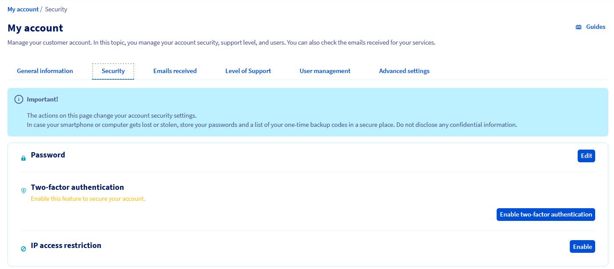
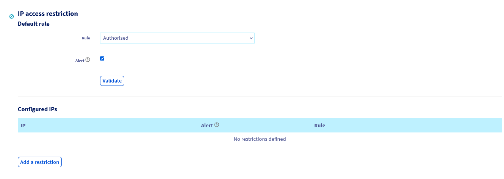
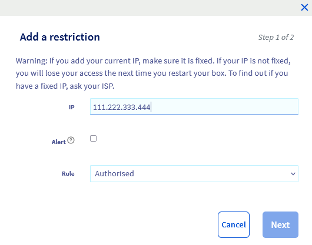
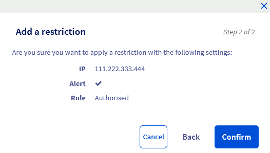
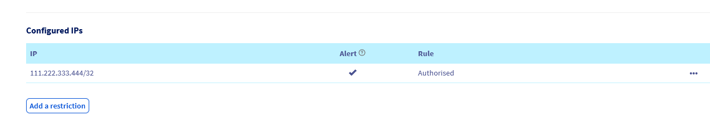
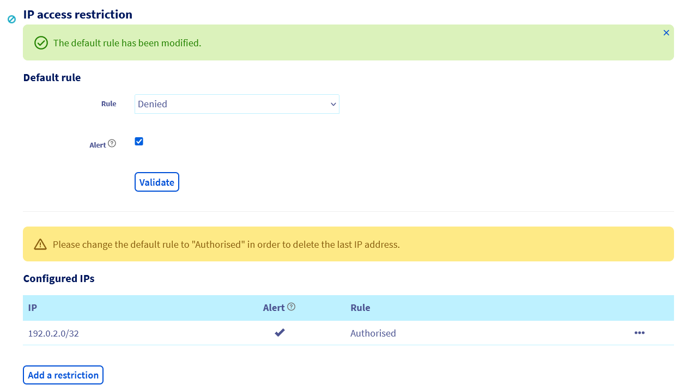
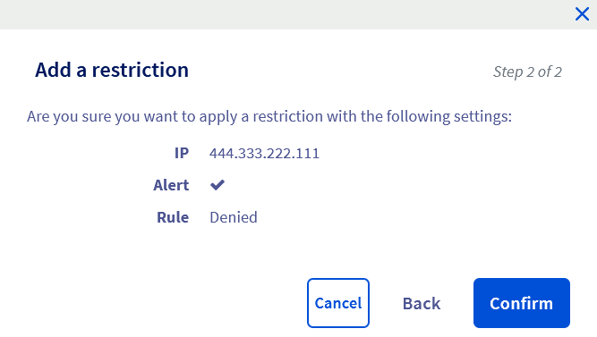
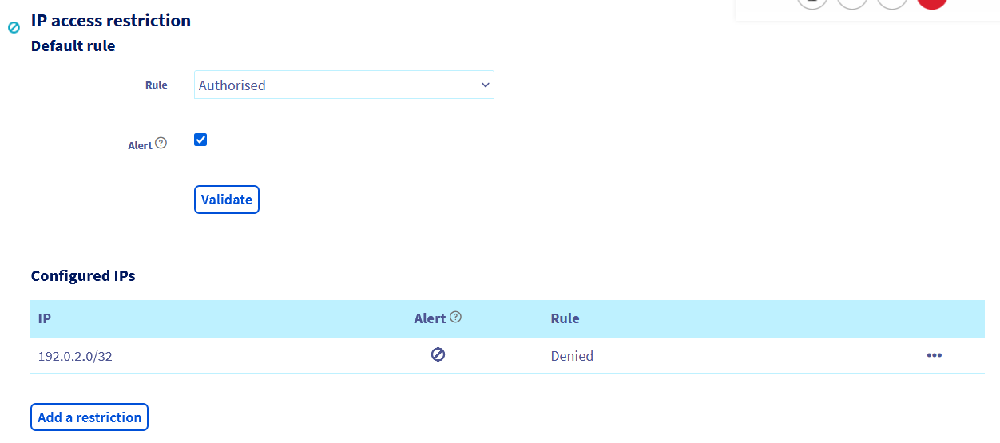
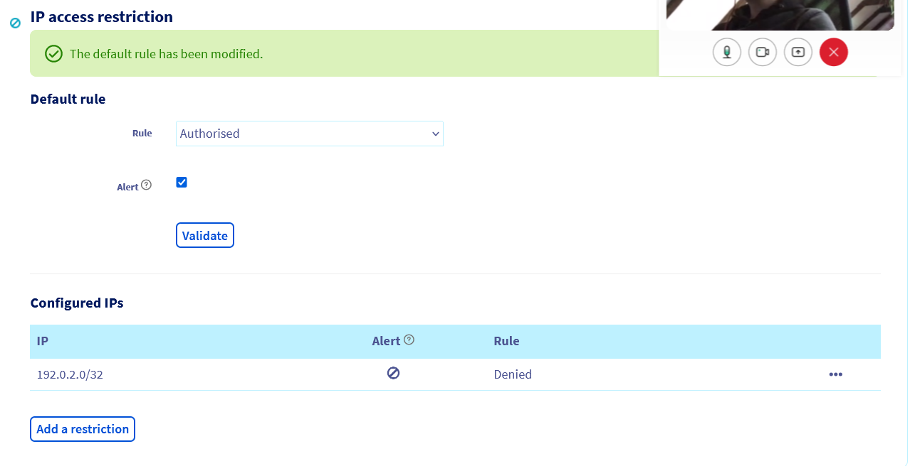

**Last updated 12th December 2022**
  
## Objective

OVHcloud provides you with options to enhance the security of your OVHcloud Control Panel and your services.

You can restrict access to your [OVHcloud Control Panel](https://ca.ovh.com/auth/?action=gotomanager&from=https://www.ovh.com/world/&ovhSubsidiary=we) to certain IP addresses.
By setting this option and securing your account with [two-factor authentication](https://docs.ovh.com/us/en/customer/secure-account-with-2FA/), you can optimally secure your OVHcloud Control Panel against intrusion attempts.

**Find out how to secure your OVHcloud account by limiting the IP addresses authorised to access it**

> [!warning]
>
> IP access restriction and/or two-factor authentication only secure access to the OVHcloud Control Panel from which you can order, manage, renew or delete your OVHcloud services. These options do not secure your services by themselves, for which you must implement specific security measures.
>

## Requirements

- Access into your [OVHcloud Control Panel](https://ca.ovh.com/auth/?action=gotomanager&from=https://www.ovh.com/world/&ovhSubsidiary=we).
- Have read the [password management recommendations for accessing your account](https://docs.ovh.com/us/en/customer/manage-password/).

## Instructions

### Step 1 - Retrieve public IP addresses authorised to access your OVHcloud Control Panel

There are two types of IP addresses:

- **Public IP addresses**: they are visible throughout the internet. For example, these are used by your internet access point/box so that you have an internet address to access the entire network.
- **Private IP addresses**: invisible and unusable on the internet, they are allocated in a local network. To take our example, your Internet box will allocate a private IP address to each of the devices (computers, smartphones, tablets, etc.) connected to it. Your Internet access point/box allows these devices to use their public IP to access the Internet. These IP addresses are easy to recognise because they usually start with 10.0.X.X, 172.16.X.X or 192.168.X.X (where the X are values between 0 and 255).

To use the IP restriction option in the OVHcloud Control Panel, you will need to enter your public IP address(es) **only**.

To retrieve the public IP address of a device that will be authorised to access your OVHcloud Control Panel, go to [mon-ip.com](https://mon-ip.com){.external} (not managed by OVHcloud).

Take note of the IP address that appears, then repeat the operation for each device that will be authorised to access your OVHcloud Control Panel.

If you are using a 4G/5G network as an addition, remember to also retrieve the IP address of this network(s).

> [!warning]
>
> Most Internet Service Providers (ISPs) allocate a **dynamic** IP address to your Internet access point/box. These dynamic IP addresses change when you reboot your box or every 24/48 hours. However, some ISPs may allocate **static** IP addresses to you on request.
>
> For a 3G/4G/5G connection, IP addresses are systematically **dynamic**.
>
> **Before** setting up an IP restriction on your OVHcloud Control Panel, check with your ISP to make sure that the IP addresses retrieved earlier are **fixed** IP addresses. Otherwise, you risk losing access to your OVHcloud Control Panel quickly by declaring a dynamic IP.
>

### Step 2 - Set up access restriction by IP

Login to your [OVHcloud Control Panel](https://ca.ovh.com/auth/?action=gotomanager&from=https://www.ovh.com/world/&ovhSubsidiary=we). Click on your `first and last name` in the top right **then** on your `initials` in the blue column that appears on your right.

{.thumbnail}

Then click on the `Security`{.action} tab to go to the next page:

{.thumbnail}

Click `Enable`{.action} to the right of `IP access restriction'.

#### Interface Overview

{.thumbnail}

There are two sections for setting IP restrictions:

- **Default rule**. Use this field to:
    - deny access to all IP addresses except those previously declared as **authorised** in the second section *configured IPs*. 
    - allow access to all IP addresses except those previously declared as **denied** in the second section *configured IP*.
    > Check the `Alert`{.action} box if you want to be notified by email, on your contact email address, when an unauthorised login attempt was made to access your Control Panel.

- **Configured IPs**. Use this field to declare IP addresses that will be restricted or authorised. You can also view the rules you have set up beforehand.

> [!alert]
>
> Warning before continuing with your actions.
>
> In the `Default rule`{.action} section, do not validate **ever** the default rule in `Denied`{.action} **status without having properly authorised** and in advance at least one of your public IP addresses in the `Configured IPs` section. 
>
> Otherwise, you will block **absolutely all public IPs (including yours)** without any exceptions. No one will have access to your [OVHcloud Control Panel](https://ca.ovh.com/auth/?action=gotomanager&from=https://www.ovh.com/world/&ovhSubsidiary=we) any more, and you will need to carry out an administrative procedure to unblock your situation.
>
> Be extremely vigilant on this point.
>

#### Deny all IP addresses except legitimate addresses

To authorise access to the OVHcloud Control Panel only for one or more legitimate IP addresses, click the `Add a restriction`{.action} button.

> In the screenshots that follow, the IP **192.0.2.0** will need to be replaced with an IP address for you.
> 

{.thumbnail}

In the window that pops up, enter the public IP address you want to authorise in the `IP`{.action} form. Check the `Alert`{.action} box if you want to be notified by email of connection attempts via this IP address then leave the `Rule`{.action} on the `Authorised`{.action} status.

Click `Next`{.action} and check your IP address and rule before clicking `Confirm`{.action}.

{.thumbnail}

The rule should then appear in the `Configured IPs` section.

{.thumbnail}

> [!primary]
>
> **Before** you continue with the actions described in this step, repeat the above operation for any other IP addresses you wish to authorise to access your OVHcloud Control Panel.
>

Once you have **set all** of your public IP addresses in the `Configured IPs` section, switch the rule to the `Denied` status in the `Default rules` section. Select the `Alert`{.action} check box if you want to receive email notification of login attempts, then click `Validate`{.action}.

{.thumbnail}

> From now on, **only** public IP addresses previously authorised in the `Configured IPs` section can access your OVHcloud Control Panel.

#### Authorise all IP addresses except some addresses

With the IP access restriction option, you can also authorise all IP addresses to access your OVHcloud Control Panel, with the exception of a few that you have previously identified as illegitimate.

To block access to your OVHcloud Control Panel for one or more IP addresses, click on the `Add a restriction`{.action} button in the `Configured IPs` section.

{.thumbnail}

In the window that pops up, enter the public IP address you want to block in the `IP`{.action} field. Check the `Alert`{.action} box if you want to be notified by email of connection attempts via this IP address, then change the `Rule`{.action} to `Denied`{.action}.

Click `Next`{.action}, check the IP address and rule before clicking `Confirm`{.action}.

{.thumbnail}

The rule should then appear in the `Configured IPs` section.

{.thumbnail}

> [!primary]
>
> **Before** you continue with the actions described in this step, repeat the operation for any other IP addresses you wish to block from accessing your OVHcloud Control Panel.
>

Once you have entered all of the public IP addresses in the `configured IPs` section, leave the rule in the `Default rules` section in the `Authorised`{.action}. Select the `Alert`{.action} check box if you want to be notified by email of connection attempts, then click `Validate`{.action}.

{.thumbnail}

> From now on, **all** public IP addresses can access your OVHcloud Control Panel, **with the exception of** those declared in the `Configured IPs` section.

## Go further

[Set up two-factor authentication on your OVHcloud Control Panel](https://docs.ovh.com/us/en/customer/secure-account-with-2FA/)

For specialised services (SEO, development, etc.), contact [OVHcloud partners](https://partner.ovhcloud.com/en/).

If you would like assistance using and configuring your OVHcloud solutions, please refer to our [support offers](https://www.ovhcloud.com/en/support-levels/).

Join our community of users on <https://community.ovh.com/en/>.