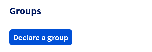
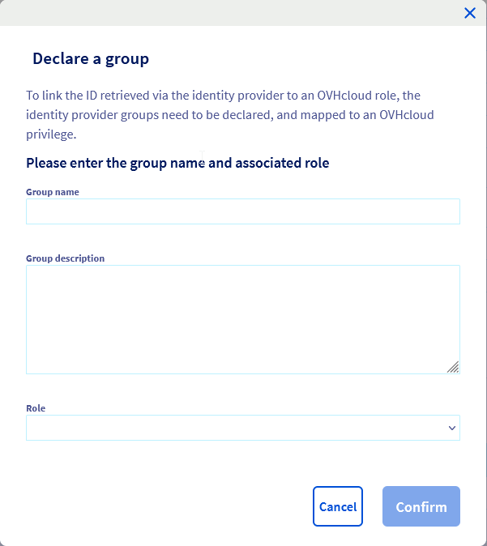
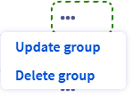

## Objective

With OVHcloud, you can create additional users with read or write access to your customer account. This means that you can grant other members of your company access to your OVHcloud services, without having to resort to risky practices like sharing passwords or two-factor authentication details.

> [!primary]
>
> User management is different to contact management. A user will have an access to all sections of the OVHcloud Control Panel according to the level of rights he's granted.
>
> The purpose of contact management is to delegate full management of the administrative, technical and billing aspects of one or more services on your OVHcloud account. For further information on contact management, please refer to [this guide](/pages/account/customer/managing_contact).
>

**This guide details the privileges a user can hold, as well as the method for adding and managing users.**

## Requirements

- an active OVHcloud account
- access to the [OVHcloud Control Panel](https://ca.ovh.com/auth/?action=gotomanager&from=https://www.ovh.com/world/&ovhSubsidiary=we)

## Instructions

### User management

#### Add a user

Log in to the [OVHcloud Control Panel](https://ca.ovh.com/auth/?action=gotomanager&from=https://www.ovh.com/world/&ovhSubsidiary=we), click `your name`{.action} (1) in the top right-hand corner, then click on your initials (2).
Next, click on the `User management`{.action} tab (3), and `Add a user`{.action} (4).

{.thumbnail}

A window will pop up, and you will need to complete the required fields. Click `Confirm`{.action} to create the user.

{.thumbnail}

| Field | Details |
|--------------|----------------------------------------------------------------------------------------------------------------------------------------------------------------------------------------------------------------------------------------------------------------------------------------------------------|
| ID | Enter the user’s name or their role, for example. |
| Email | Enter the user’s full email address. |
| Password | Set the user password. The user can then change this password once their access has been created.  We also suggest reading our [guide on password management](/pages/account/customer/manage-ovh-password) to define this password. |
| Group | Choose a group from those available |
| Description | You can add a user description (such as their role within the company). |

The user then gets their own ID made up of your account’s digital ID (which is listed in the “User management” menu) and their username, with the two values separated by a “/”.

Example: **1234-567-89/johnsmith**.

{.thumbnail}

The user you have created can then log in to the [OVHcloud Control Panel](https://ca.ovh.com/auth/?action=gotomanager&from=https://www.ovh.com/world/&ovhSubsidiary=we) using this ID. 

They can also change their password and secure their own access to your account by enabling two-factor authentication (this is only for their access as a user). To find out how to enable two-factor authentication, you can refer to [this guide](/pages/account/customer/secure-ovhcloud-account-with-2fa).

#### Manage users

You can disable/enable or remove a user by clicking on the `…`{.action} button to the right of the user’s name.

{.thumbnail}

When you edit a user you can update their email address, group and description.

{.thumbnail}

### Group management

#### Add a group

On the `User management`{.action} tab, click on `Declare a group`{.action}.

{.thumbnail}

A window will pop up and you will need to complete the required fields. Click `Confirm`{.action} to create the user.

{.thumbnail}

Groups give a default privilege level for the users they contain, according to the role you choose:

| Role | Details |
|------------------|----------------------------------------------------------------------------------------------------------------------|
| None | Gives no access to the OVHcloud Control Panel if no IAM policy is set-up. |
| Read-Only | Gives read access to the OVHcloud Control Panel and all of its sections. |
| Restricted Admin | Gives write access to the OVHcloud Control Panel and all of its sections, **except for** user management. |
| Administrator | Gives write access to the OVHcloud Control Panel and all of its sections, **including** user management. |

#### Manage groups

You can update or remove a group by clicking on the `…`{.action} button to the right of the group name.

{.thumbnail}

When you edit a group you can update its description and role.

{.thumbnail}

### Right management

On top of the role associate to users groups, you can fine tune access privileges using OVHcloud IAM.
OVHcloud IAM policies management is cover on the [dedicated guide](/pages/account/customer/iam-policy-ui)

## Go further

Join our community of users on <https://community.ovh.com/en/>.
