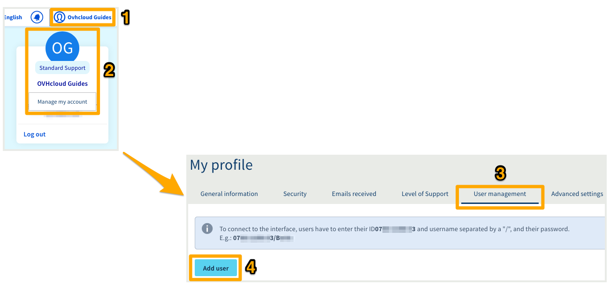

**Ultimo aggiornamento: 20/05/2020**

## Obiettivo

OVHcloud ti offre la possibilità di creare utenti che possano eseguire operazioni di lettura e scrittura nel tuo Spazio Cliente. Questo significa che puoi fornire ai dipendenti della tua azienda un accesso ai tuoi servizi OVHcloud, senza dover ricorrere a pratiche rischiose come la condivisione di password o di codici di doppia autenticazione.

> [!primary]
>
> Le gestione degli utenti è diversa dalla gestione dei contatti. Infatti, un utente avrà, come minimo, un accesso in lettura a tutte le sezioni del tuo Spazio Cliente.
>
> Le gestione dei contatti consiste, invece, nel delegare la completa gestione degli aspetti amministrativi, tecnici o di fatturazione di uno o più servizi sul tuo account OVHcloud. Per maggiori informazioni sulla gestione dei contatti, consulta [questa guida](../gestisci_i_tuoi_contatti/).
>

**Questa guida ti mostra i diversi privilegi di cui un utente può usufruire e il metodo per aggiungere e gestire gli utenti.**

## Prerequisiti

- Disporre di un account OVHcloud attivo
- Avere accesso allo Spazio Cliente OVHcloud

## Procedura

### Step 1: scopri i diversi privilegi degli utenti

È possibile scegliere tra tre livelli di privilegi per ciascuno dei tuoi utenti.

| Privilegi | Descrizione |
|----------------|----------------------------------------------------------------------------------------------------------------------|
| Nessuno | Consente l’accesso in lettura allo Spazio Cliente e a tutte le sue sezioni. |
| Utente | Consente l’accesso in scrittura allo Spazio Cliente e a tutte le sue sezioni, **ad eccezione della** gestione degli utenti. |
| Amministratore | Consente l’accesso in scrittura allo Spazio Cliente e a tutte le sue sezioni, **inclusa** la gestione degli utenti. |

#### Esempio di gestione degli utenti

Il proprietario dell’account xx11111-ovh crea due utenti:

- l’utente Jane, che dispone del privilegio **Utente**, ovvero il diritto di accedere in scrittura a tutte le sezioni dell’account, ad eccezione della gestione degli utenti.
- l’utente Martin, che dispone del privilegio **Nessuno**, e quindi il diritto di accedere in lettura a tutte le sezioni dell’account.

Il proprietario dell’account xx11111-ovh, dispone necessariamente del privilegio **Amministratore** e, pertanto, mantiene i diritti di accesso in scrittura a tutte le sezioni dello Spazio Cliente. Inoltre può aggiungere nuovi utenti e/o rimuovere gli utenti esistenti.

{.thumbnail}

### Step 2: Aggiungi un utente

Accedi allo [Spazio Cliente OVHcloud](https://www.ovh.com/auth/?action=gotomanager){.external}, clicca sul tuo`nome`{.action} (1) e poi sulle tue iniziali (2).
A questo punto, clicca sulla scheda `Gestione utenti`{.action} (3), quindi su `Aggiungi un utente`{.action} (4).

{.thumbnail}

Nella nuova finestra, inserisci le informazioni richieste. Clicca su `Conferma`{.action} per completare l’operazione.

{.thumbnail}

| Campo | Descrizione |
|--------------|----------------------------------------------------------------------------------------------------------------------------------------------------------------------------------------------------------------------------------------------------------------------------------------------------------|
| Identificativo | Ad esempio, inserisci il nome dell’utente oppure il suo ruolo. |
| Email | Inserisci l’indirizzo email dell’utente |
| Password | Definisci la password dell'utente. Potrà modificarla più avanti, una volta creato il suo accesso.  Per impostare la password, consulta [la guida sulla gestione delle password](../gestire-la-password/). |
| Privilegi | Scegli tra Nessuno/Utente/Amministratore |
| Descrizione | È possibile aggiungere una descrizione dell’utente Esempio: il suo ruolo nell’azienda |

L’utente otterrà quindi il proprio identificativo composto dall’identificativo numerico del tuo account (indicato nel menu “Gestione degli utenti”) e dal suo nome utente, entrambi i valori sono separati da uno slash “/”.

Esempio: **1234-567-89/john.smith**.

{.thumbnail}

A questo punto l’utente appena creato potrà accedere allo [Spazio Cliente OVHcloud](https://www.ovh.com/auth/?action=gotomanager){.external}usando questo identificativo. 

Inoltre potrà modificare password e proteggere l’accesso al tuo account attivando la doppia autenticazione (solo ed esclusivamente per il suo accesso in qualità di utente). A questo proposito consulta [la guida relativa all’attivazione della doppia autenticazione](../proteggi_il_tuo_account_con_2FA/){.external}.

### Step 3: gestisci gli utenti

Per modificare, disattivare/attivare o rimuovere un utente clicca sui tre puntini `...`{.action} situati a destra in corrispondenza del nome utente.

{.thumbnail}

La modifica dell’utente ti consentirà di aggiornare il suo indirizzo-mail, i suoi privilegi e infine il suo profilo.

{.thumbnail}

## Per saperne di più

Contatta la nostra Community di utenti all’indirizzo <https://community.ovh.com/en/>.