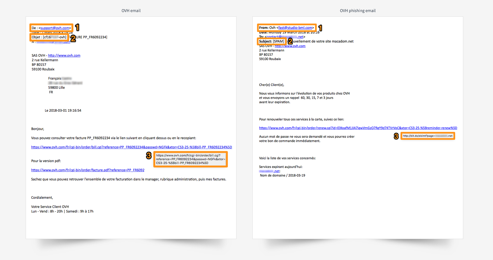

**Last updated 31st May 2018**

## Objective

Phishing is the act of sending an email asking you to click on a link that redirects you to a form. This form fraudulently imitates a known brand’s design, and asks you to enter your personal information.

**This guide will show you how to recognise a phishing email, and what to do if you click on a fraudulent link.**

## Requirements

- no specific requirements

## Instructions

### Receiving phishing emails that claim to be from OVH

#### Identifying a phishing email

If you have received an email claiming to be from OVH and you are unsure whether it genuinely originated from us, you should look for any signs that it is a phishing attempt. Here are a few visual details that will help you tell an OVH email apart from a phishing attempt.

{.thumbnail}

> [!alert]
> 
> Remember to make sure that the following three conditions are met:
> 

|Number/description|OVH email|Phishing email|
|---|---|---|
|1. Sender|Check that the address used to send the email ends in “@ovh.com”, “@soyoustart.com” or “@kimsufi.com”.|Most of the time, the email will be marked as spam between brackets, and your NIC handle will not be shown OR will be incorrect.|
|2. Subject|Check that your NIC handle **(beginning with the first letter of the surname and the first letter of your first name you have registered with OVH)** and/or the email address associated with your account appear in the message’s subject line.|Most of the time, the email will be marked as spam between brackets, and your NIC handle will not be shown OR will be incorrect.|
|3. Link|Move your mouse over the link, and you will be able to see its contents at the bottom of your browser, without having to click on it. Here, the link does indeed point to https://www.ovh.com/.| In our example, you can can see when you move your mouse over the link that it has nothing to do with OVH. Do not click it.|

> [!primary]
> 
> If you are a Kimsufi or So you Start customer, you will never have to pay anything to OVH. You can therefore ignore this type of email.
> 

#### Reporting a phishing email

If you have carried out the checks set out above and are sure you have received a phishing email spoofing the identity of OVH, please send us as much information as you can (the contents of the email, at the minimum) to the following address: **<fraud@ovh.com>**.

> [!primary]
> 
> Please note that the information you provide to us may be shared with third parties to enable us to combat these threats.
> 

### I entered my personal details – what do I do now?

#### If you entered your credit card number on a fraudulent site

The only thing you can do is contact your bank as soon as possible, to have your card blocked. Tell them the date and (if possible) the time at which you entered your credit card number.

**Only your bank can cancel fraudulent transactions that may have been made without your knowledge.**

#### If you entered your OVH password on a fraudulent site

Log in to your [OVH Control Panel](https://www.ovh.com/auth/?action=gotomanager&){.external}, and change your password. We strongly advise you to activate two-factor authentication, to permanently secure your account.

> [!primary]
>
> To ensure that your data is secure, your password must meet the criteria listed below:
>
> - It must contain at least 12 characters.
> - It must contain at least three character types.
> - It must not contain a dictionary word.
> - It must not contain any personal information (e.g. your first name, surname or date of birth).
> - It must not be used as a password by any other user accounts.
> - It must be stored in a password manager.
> - It must be changed every three months.
> - It must not be identical to any previously used passwords.
>

## Go further

Join our community of users on <https://community.ovh.com/en/>.