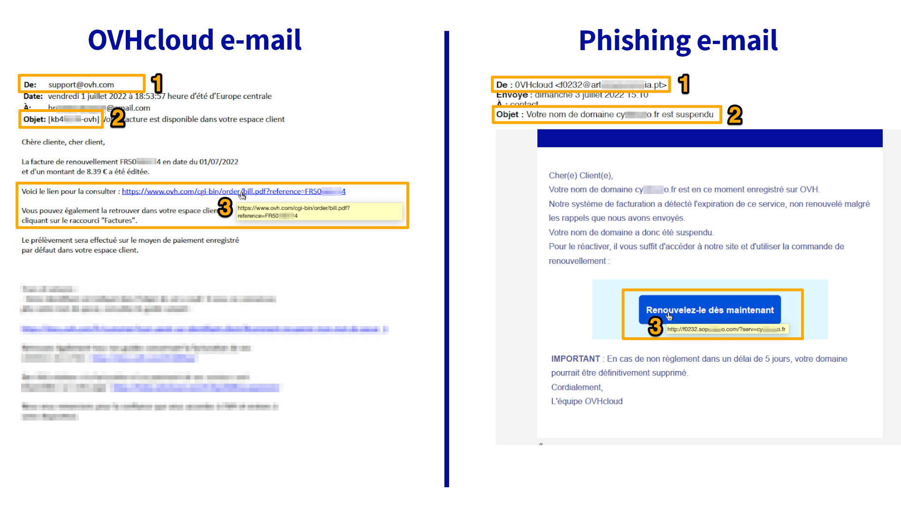

**Dernière mise à jour le 03/08/2022**

## Objectif

L'hameçonnage (ou *phishing* en anglais) est une technique frauduleuse destinée à leurrer l'internaute pour l'inciter à communiquer des données personnelles (comptes d'accès, mots de passe, etc...) et/ou bancaires en se faisant passer pour un tiers ou un site de confiance. 
Dans la pratique, il s'agit souvent de l’envoi d’un e-mail ou d'un SMS vous invitant à cliquer sur un lien. Ce lien vous redirige vers un formulaire qui reprend frauduleusement les couleurs d’une marque et vous invite à entrer vos identifiants personnels.

**Ce guide vous explique comment reconnaître un e-mail ou un SMS de phishing et quelles mesures prendre si vous avez cliqué sur un lien frauduleux.**

## En pratique

### J'ai reçu un e-mail ou un SMS de phishing au nom d'OVHcloud

#### Identifier un e-mail de phishing

Vous avez reçu un e-mail au nom d'OVHcloud et vous voulez être sûr qu'il est légitime ?  
Voici quelques éléments pour vous aider à distinguer visuellement un e-mail OVHcloud d'une tentative de phishing.

Cliquez sur l'image pour l'agrandir. Retrouvez les détails et explications dans le tableau ci-dessous.

{.thumbnail}

> [!alert]
> 
> Pensez à bien vérifier que les trois conditions suivantes sont remplies.
> 
> Les numéros du tableau correspondent à ceux de l'exemple ci-dessus.

|Numéro - description|E-mail OVHcloud légitime|E-mail de phishing frauduleux|
|---|---|---|
|1 - Expéditeur|Vérifiez que l’adresse utilisée pour l’envoi de l’e-mail se termine par un domaine tel que « @ovhcloud.com », « @ovh.com », « @soyoustart.com » , « @kimsufi.com », « @ovh.net » ou un sous-domaine tel que « @events.ovhcloud.com », « @news.soyoustart.com », « @services.kimsufi.com », etc... |L'expéditeur de l'e-mail sera forcément une adresse qui ne vient pas d'OVHcloud.|
|2 - Objet|Vérifiez que votre identifiant **(commençant par la première lettre du nom enregistré chez OVHcloud puis par la première lettre du prénom enregistré chez OVHcloud)** et/ou l’adresse e-mail de votre compte figurent dans l’objet du message.|Très souvent, l'e-mail sera marqué comme \[SPAM] et **votre identifiant n'apparaîtra pas ou sera incorrect**.|
|3 - Lien|**Sans cliquer dessus, passez votre pointeur de souris sur le lien ou le bouton** et vous en verrez directement la cible (en dessous ou tout en bas de votre navigateur). Dans notre exemple, le lien renvoie bien vers une adresse https://www.ovh.com/.|Dans notre exemple, en passant le pointeur de la souris sur le lien, vous remarquez que celui-ci n'a rien à voir avec OVHcloud. **Ne cliquez pas dessus.**|

> [!success]
> 
> Une grande partie des e-mails légitimes envoyés par OVHcloud à propos de vos services peut être consultée dans votre [espace client OVHcloud](https://www.ovh.com/auth/?action=gotomanager&from=https://www.ovh.com/fr/&ovhSubsidiary=fr). Une fois connecté, cliquez sur votre nom en haut à droite puis sur `E-mails de service`{.action}
>
> L'e-mail que vous avez reçu n'y figure pas ? Il peut alors s'agir soit d'un e-mail de phishing, soit d'un e-mail destiné à un autre identifiant client OVHcloud (vérifiez l'identifiant qui figure dans l'objet de l'e-mail).
>

#### Identifier un SMS de phishing

OVHcloud ne vous transmettra **jamais** de lien par SMS. Les SMS que nous envoyons sont généralement liés à la [double authentification dans votre espace client](https://docs.ovh.com/fr/customer/securiser-son-compte-avec-une-2FA/). 

Vous trouverez ci-dessous 2 exemples de SMS, le premier est légitime et correspond à la double authentification. Le second SMS est frauduleux.

{.thumbnail}

#### Signaler un e-mail de phishing

Après avoir effectué les vérifications expliquées au-dessus, si vous êtes certain que vous avez effectivement reçu un e-mail de phishing usurpant l'identité d'OVHcloud, vous pouvez nous faire parvenir un maximum d’informations (le contenu de l'e-mail au minimum) à l’adresse e-mail suivante : **<fraude@ovh.com>**.

> [!primary]
> 
> Veuillez noter que les informations que vous nous communiquerez pourront être partagées à des tiers afin de nous permettre de lutter contre ces menaces.
> 

### J'ai saisi mes informations personnelles : que faire ?

#### Si vous avez entré votre numéro de carte bancaire sur un site frauduleux

La seule chose à faire est de contacter rapidement votre banque afin de faire opposition sur votre moyen de paiement. Indiquez-leur la date et si possible l’heure à laquelle vous avez entré votre numéro de carte bancaire.

**Votre banque est la seule à pouvoir annuler les transactions frauduleuses qui pourraient avoir été effectuées à votre insu.**

#### Si vous avez entré votre mot de passe OVHcloud sur un site frauduleux

Connectez-vous sur votre [espace client OVHcloud](https://www.ovh.com/auth/?action=gotomanager&from=https://www.ovh.com/fr/&ovhSubsidiary=fr){.external} et modifiez immédiatement votre mot de passe. 

Vous trouverez, sur notre guide « [Modifier le mot de passe de votre compte](https://docs.ovh.com/fr/customer/gerer-son-mot-de-passe/) », la méthode pour modifier votre mot de passe depuis votre espace client, ainsi que nos recommandations pour générer un mot de passe efficace et le sauvegarder dans un gestionnaire de mots de passe. 

Nous vous conseillons fortement d’activer également la [double authentification](https://docs.ovh.com/fr/customer/securiser-son-compte-avec-une-2FA/) pour sécuriser durablement votre compte.

> [!primary]
>
> Pour rappel, afin de sécuriser efficacement vos données, votre mot de passe doit :
>
> - comporter au minimum douze caractères ;
> - comporter au moins 1 lettre majuscule, 1 lettre minuscule et 1 chiffre ;
> - comporter des caractères spéciaux (par exemple : %, #, :, $, *)
> - ne pas être tiré du dictionnaire ;
> - ne pas comporter d’informations personnelles (votre prénom, nom ou date de naissance) ;
> - ne pas être utilisé pour plusieurs accès utilisateur ;
> - être stocké dans un coffre-fort de mots de passe ;
> - être changé tous les trois mois ;
> - être différent des mots de passe précédents.
>

## Aller plus loin

[Définir et gérer le mot de passe de votre compte](https://docs.ovh.com/fr/customer/gerer-son-mot-de-passe/)

[Sécuriser son compte OVHcloud avec la double authentification](https://docs.ovh.com/fr/customer/securiser-son-compte-avec-une-2FA/)

[Sécuriser mon compte OVHcloud et gérer mes informations personnelles](https://docs.ovh.com/fr/customer/tout-savoir-sur-identifiant-client/)

Échangez avec notre communauté d'utilisateurs sur <https://community.ovh.com>.
