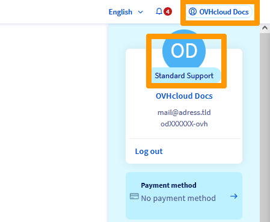
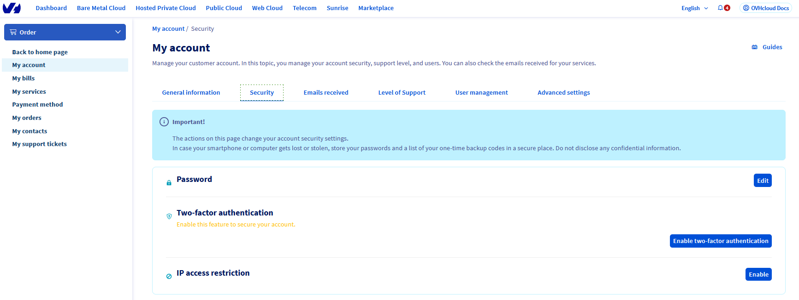
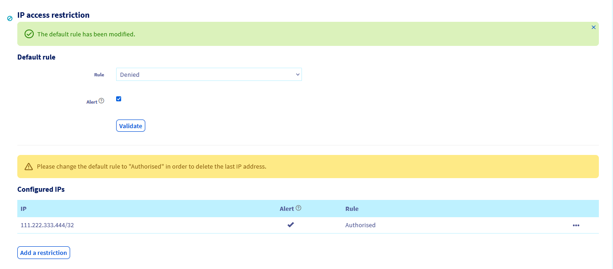
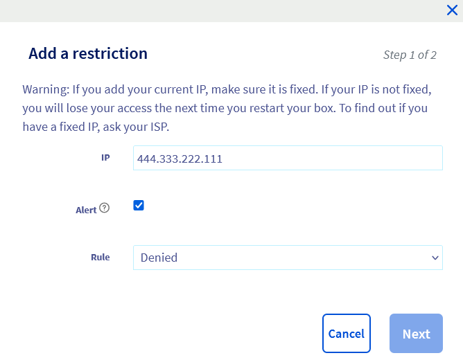
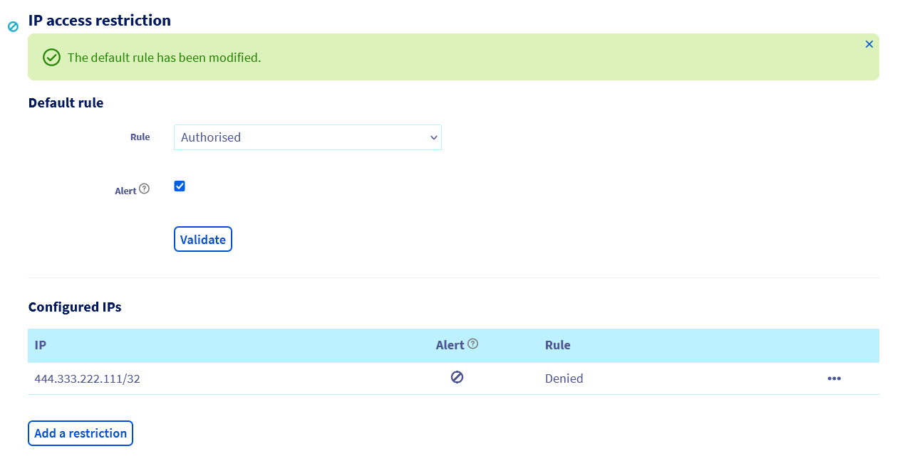

**Dernière mise à jour le 09/11/2022**

## Objectif

OVHcloud met à votre disposition des options pour renforcer la sécurité de votre espace client OVHcloud et de vos services.

Vous pouvez notamment autoriser l'accès à votre [espace client OVHcloud](https://www.ovh.com/auth/?action=gotomanager&from=https://www.ovh.com/fr/&ovhSubsidiary=fr) qu'à certaines adresses IP. Ceci couplé à la mise en place d'un [système de double authentification](https://docs.ovh.com/fr/customer/securiser-son-compte-avec-une-2FA/), votre espace client OVHcloud sera parfaitement sécurisé contre d'éventuelles tentatives d'intrusion.

**Découvrez comment sécuriser votre compte OVHcloud en limitant les adresses IP autorisées à y accéder**

> [!warning]
>
> La restriction d'accès par IP et/ou la double authentification ne sécurise que l'accès à l'espace client OVHcloud depuis lequel vous pouvez commander, gérer, renouveler ou supprimer vos services OVHcloud. Cela ne sécurise pas les services en eux-mêmes.
>
> Cela permet d'éviter qu'une personne malveillante parvienne à se connecter à votre [espace client OVHcloud](https://www.ovh.com/auth/?action=gotomanager&from=https://www.ovh.com/fr/&ovhSubsidiary=fr) pour créer, modifier ou supprimer des services dans ce dernier sans votre consentement.
>

## Prérequis

- Être connecté à l'[espace client OVHcloud](https://www.ovh.com/auth/?action=gotomanager&from=https://www.ovh.com/fr/&ovhSubsidiary=fr).
- Avoir pris connaissance des [recommandations sur la gestion du mot de passe d'accès à votre compte](https://docs.ovh.com/fr/customer/gerer-son-mot-de-passe/).

## En pratique

### Etape 1 - récupérer les adresses IP publiques autorisées à accéder à votre espace client OVHcloud

Il existe deux types d'adresse IP :

- **Les adresses IP publiques** : elles sont visibles sur l'ensemble du réseau Internet. Celles-ci sont par exemple utilisées par votre point d'accès/box Internet afin que vous ayez une adresse sur Internet pour accéder à l'ensemble du réseau.
- **Les adresses IP privées** : Invisibles et inutilisables sur le réseau Internet, elles sont allouées dans un réseau local. Pour reprendre notre exemple, votre box Internet va allouer une adresse IP privée à chacun des appareils (ordinateurs, smartphones, tablettes, ...) connectés à celle-ci. Ceci afin que celle-ci puisse permettre à ses appareils d'utiliser son IP publique pour accéder à Internet. Ces adresses IP sont faciles à reconnaître car elles commencent généralement par 10.0.X.X, 172.16.X.X ou 192.168.X.X (où les X sont des valeurs comprises entre 0 et 255).

Pour utiliser l'option de restrictions par IP de l'[espace client OVHcloud](https://www.ovh.com/auth/?action=gotomanager&from=https://www.ovh.com/fr/&ovhSubsidiary=fr), vous devrez renseigner **uniquement** vos adresses IP publiques.

Pour récupérer l'adresse IP publique d'un appareil qui sera autorisé à accéder à votre [espace client OVHcloud](https://www.ovh.com/auth/?action=gotomanager&from=https://www.ovh.com/fr/&ovhSubsidiary=fr), rendez-vous sur le site [mon-ip.com](https://mon-ip.com){.external} (non géré par OVHcloud).

Notez l'adresse IP qui s'affiche puis répétez l'opération pour chacun des appareils qui sera autorisé à accéder à votre [espace client OVHcloud](https://www.ovh.com/auth/?action=gotomanager&from=https://www.ovh.com/fr/&ovhSubsidiary=fr).

Si vous utilisez un réseau 4G/5G en complément, n'oubliez pas de récupérer l'adresse IP via ce type de connexion à Internet.

> [!warning]
>
> Certains Fournisseurs d'Accès à Internet (FAI) allouent une adresse IP fixe à votre point d'accès Internet/box. D'autres allouent des adresses IP dynamiques. Ces adresses IP dynamiques changent au redémarrage de votre box ou toutes les 24/48 heures.
>
> Vérifiez auprès de votre FAI que les adresses IP récupérées précédemment sont bien des adresses IP **fixes**. Le cas échéant, vous risquez de perdre l'accès à votre [espace client OVHcloud](https://www.ovh.com/auth/?action=gotomanager&from=https://www.ovh.com/fr/&ovhSubsidiary=fr) en déclarant une IP dynamique.
>

### Etape 2 - accéder au menu de restriction d'accès par IP

Connectez-vous à votre [espace client OVHcloud](https://www.ovh.com/auth/?action=gotomanager&from=https://www.ovh.com/fr/&ovhSubsidiary=fr). Cliquez sur votre `nom et prénom` en haut à droite **puis** sur vos `initiales` dans la colonne bleue qui apparaît sur votre droite.

{.thumbnail}

Sur la nouvelle page, cliquez sur l'onglet `Sécurité`{.action} pour arriver sur la page suivante :

{.thumbnail}

Au niveau de la mention `Restriction d'accès par IP`{.action} cliquez sur `Activer`{.action}.

### Etape 3 - mettre en place les restrictions par IP pour votre espace client OVHcloud

{.thumbnail}

#### 3.1 - Présentation de l'interface

Deux sections sont présentes pour la mise en place des restrictions par IP :

- **Règle par défaut** : Permet de refuser l'accès à l'ensemble des adresses IP sauf celles préalablement déclarées comme **autorisées** dans la seconde section *IP configurées*. Permet aussi d'autoriser l'accès à l'ensemble des adresses IP sauf celles préalablement déclarées comme **refusées** dans la seconde section *IP configurées*.

    Vous pouvez demander à être notifié par e-mail sur votre adresse mail de contact lorsqu'une tentative de connexion non autorisée a été effectuée pour votre espace client en cochant la case `Alerte`{.action}

- **IP configurées** : Permet de déclarer les adresses IP qui feront l'objet d'une restriction ou d'une autorisation d'accès. Permet aussi de visualiser les règles préalablement mises en place.

> [!alert]
>
> Attention avant de poursuivre vos actions.
>
> Dans la section `Règle par défaut`{.action}, ne validez **jamais** la règle par défaut en statut `Refusé`{.action} **sans avoir autorisé** correctement et au préalable au moins une de vos adresses IP publiques dans la section `IP configurées`{.action}. 
>
> Si non, vous bloquez **absolument toutes les IP publiques (y compris les vôtres)** sans aucune exception. Plus personne n'aura accès à votre [espace client OVHcloud](https://www.ovh.com/auth/?action=gotomanager&from=https://www.ovh.com/fr/&ovhSubsidiary=fr) et vous devrez réaliser une procédure administrative pour débloquer votre situation.
>
> Soyez donc extrêmement vigilant sur ce point.
>

#### 3.2 - Refuser toutes les adresses IP à l'exception de quelques unes

Pour autoriser l'accès d'une seule ou de quelques adresse(s) IP à votre [espace client OVHcloud](https://www.ovh.com/auth/?action=gotomanager&from=https://www.ovh.com/fr/&ovhSubsidiary=fr), cliquez dans la section `IP configurées`{.action} sur le bouton `Ajouter une restriction`{.action}.

{.thumbnail}

Dans la fenêtre qui s'ouvre, renseignez l'adresse IP publique que vous souhaitez autoriser dans le formulaire `IP`{.action}, cochez la case `Alerte`{.action} si vous souhaitez être notifié par mail des tentatives de connexion via cette adresse IP puis laissez la `Règle`{.action} sur le statut `Autorisé`{.action}.

Cliquez sur `Suivant`{.action} et vérifiez votre adresse IP ainsi que la règle avant de cliquez sur `Valider`{.action}.

{.thumbnail}

La règle devrait alors apparaître dans la deuxième section :

{.thumbnail}

> [!primary]
>
> Répétez l'opération pour toutes les autres éventuelles adresses IP que vous souhaitez autoriser pour accéder à votre [espace client OVHcloud](https://www.ovh.com/auth/?action=gotomanager&from=https://www.ovh.com/fr/&ovhSubsidiary=fr). Ceci **avant** de poursuivre.
>

Une fois l'ensemble de vos adresses IP publiques renseignées dans la section `IP configurées`{.action}, passez dans la section `Règles par défaut`{.action} la règle en statut `Refusé`{.action}, cochez la case `Alerte`{.action} si vous souhaitez être notifiés des tentatives de connexion par mail puis cliquez sur `Valider`{.action}.

{.thumbnail}

Désormais, vous pourrez accéder à votre [espace client OVHcloud](https://www.ovh.com/auth/?action=gotomanager&from=https://www.ovh.com/fr/&ovhSubsidiary=fr) uniquement en passant par les IP publiques préalablement autorisées dans la section `IP configurées`{.action}.

#### 3.3 - Autoriser toutes les adresses IP à l'exception de quelques unes

La restriction d'accès par IP permet aussi d'autoriser toutes les adresses IP à accéder à votre [espace client OVHcloud](https://www.ovh.com/auth/?action=gotomanager&from=https://www.ovh.com/fr/&ovhSubsidiary=fr) à l'exception de quelques unes.

Pour restreindre l'accès à une ou plusieurs adresse(s) IP à votre [espace client OVHcloud](https://www.ovh.com/auth/?action=gotomanager&from=https://www.ovh.com/fr/&ovhSubsidiary=fr), cliquez dans la section `IP configurées`{.action} sur le bouton `Ajouter une restriction`{.action}.

{.thumbnail}

Dans la fenêtre qui s'ouvre, renseignez l'adresse IP publique que vous souhaitez bloquer dans le formulaire `IP`{.action}, cochez la case `Alerte`{.action} si vous souhaitez être notifié par mail des tentatives de connexion via cette adresse IP puis passez la `Règle`{.action} sur le statut `Refusé`{.action}.

Cliquez sur `Suivant`{.action} et vérifiez l'adresse IP ainsi que la règle avant de cliquez sur `Valider`{.action}.

{.thumbnail}

La règle devrait alors apparaître dans la deuxième section :

{.thumbnail}

> [!primary]
>
> Répétez l'opération pour toutes les autres éventuelles adresses IP que vous souhaitez bloquer en accès à votre [espace client OVHcloud](https://www.ovh.com/auth/?action=gotomanager&from=https://www.ovh.com/fr/&ovhSubsidiary=fr). Ceci **avant** de poursuivre.
>

Une fois l'ensemble de des adresses IP publiques renseignées dans la section `IP configurées`{.action}, laissez dans la section `Règles par défaut`{.action} la règle en statut `Autorisé`{.action}, cochez la case `Alerte`{.action} si vous souhaitez être notifiés des tentatives de connexion par mail puis cliquez sur `Valider`{.action}.

{.thumbnail}

Désormais, vous pourrez accéder à votre [espace client OVHcloud](https://www.ovh.com/auth/?action=gotomanager&from=https://www.ovh.com/fr/&ovhSubsidiary=fr) depuis toutes les adresses IP publiques à l'exception de celles déclarées dans la section `IP configurées`{.action}.

## Aller plus loin

[Mettre en place une double authentification](https://docs.ovh.com/fr/customer/securiser-son-compte-avec-une-2FA/)

Pour des prestations spécialisées (référencement, développement, etc), contactez les [partenaires OVHcloud](https://partner.ovhcloud.com/fr/).

Si vous souhaitez bénéficier d'une assistance à l'usage et à la configuration de vos solutions OVHcloud, nous vous proposons de consulter nos différentes [offres de support](https://www.ovhcloud.com/fr/support-levels/).

Échangez avec notre communauté d'utilisateurs sur <https://community.ovh.com>.