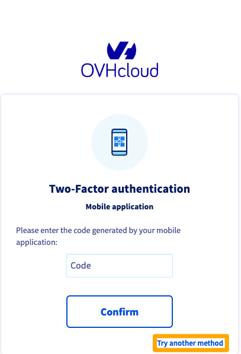
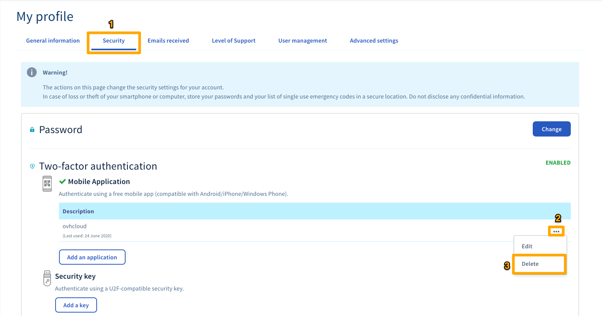

**Last updated 21st July 2022**

## Objective

OVHcloud offers tools to optimise security for your account and services.
You can enable two-factor authentication (2FA). This is linked to your username-password couple, and you can use it via a device: e.g. a smartphone, tablet, or security key. 

**Find out more about the methods we offer, and how to enable them.**

## Requirements

- access to the [OVHcloud Control Panel](https://ca.ovh.com/auth/?action=gotomanager&from=https://www.ovh.com.au/&ovhSubsidiary=au)
- a smartphone or tablet (for the mobile application method), or a Universal Second Factor (U2F) security key
- an understanding of the [password management recommendations for accessing your account](../manage-password/)

## Instructions

You can enable one or more two-factor authentication methods to secure and control access to the OVHcloud Control Panel.
We offer two different methods:

- **via an OTP mobile application**. Install an OTP mobile application on to your Android or iOS smartphone or tablet. Next, link the application to your OVHcloud account. Each time you try to log in to your account, the application will generate a one-time code valid for a short time period.
Once you have linked the application to your account, your device no longer needs an internet connection for the codes to be generated.

- **via a U2F security key**. This method involves plugging a U2F USB security key into your computer each time you log in to your OVHcloud account. When you plug in the key, the authentication process takes place automatically. This method offers a higher level of security, as it is based on independent security hardware that is completely separate from your computer, smartphone or tablet. As a result, it is less exposed to the risk of hacking.

### Step 1: Enable your first two-factor authentication method

- [Enabling two-factor authentication via mobile application](../enable-two-factor-authentication-via-mobile-application/)
- [Enabling two-factor authentication via security key](../enable-two-factor-authentication-via-security-key/)

Once you have added your first method, you can also add one or two other methods, so that you have more choice in how you log in to your account.

### Step 2: Save the emergency security codes

When you add two-factor authentication for the first time, you are sent emergency codes. Please keep them saved somewhere safe. We recommend saving them in a password manager.

{.thumbnail}

You can delete or regenerate them via the OVHcloud Control Panel:

{.thumbnail}

> [!warning]
>
> As a reminder, please note that it is important to save these emergency codes and ensure that they are valid. If one of the security methods you have selected becomes unavailable (theft or loss of your mobile phone or security key), access to your account may be blocked.
>

### Step 3: Log in to the OVHcloud Control Panel with two-factor authentication

Once you have enabled two-factor authentication, the login screen will show the security method selected. If you would like to use another method, click `Try another method`{.action}.

{.thumbnail}

All of the methods you have enabled will then appear:

{.thumbnail}

### What do I do if I lose one of my devices, or if it stops working?

If you have lost one of your devices (mobile phone/smartphone/security key) or it stops working, we advise using one of the other two-factor authentication methods enabled on your account.

You can also use one of the security codes provided to you. 

### Remove a device linked to two-factor authentication 

> [!warning]
>
> Removing a device does not disable two-factor authentication. 
> 
> To avoid the risk of blocking access to your account, please check that you can use one of the following login methods before removing a device:
> 
> - via a working device
> 
> - via another working method of two-factor authentication 
> 
> - via valid security codes
> 

To remove a device, please log in to the [OVHcloud Control Panel](https://ca.ovh.com/auth/?action=gotomanager&from=https://www.ovh.com.au/&ovhSubsidiary=au){.external}. Click on your name in the top right-hand corner (first step on the image below), then click your initials (second step). 

{.thumbnail}

Next, click `Security`{.action} (the first step on the image below), then click on the `...`{.action} icon (second step) to the right of the device you want to delete, and finally, click `Remove`{.action} (third step).

{.thumbnail}

### Disable two-factor authentication completely 

#### If you still have access to your OVHcloud Control Panel

To disable two-factor authentication completely on your OVHcloud account, you will need to delete **all** of the devices entered, **and also disable the emergency codes**.

To remove each device, please refer to the dedicated [part of this guide](#delete-device).

Once you have removed all your devices, disable the emergency codes by clicking the `Disable 2FA codes`{.action}  button.

{.thumbnail}

#### If you no longer have access to your OVHcloud Control Panel

If you no longer have valid devices and if you no longer have valid emergency codes, you can request two-factor authentication to be disabled by contacting our support teams.

Before contacting us, you must gather the following documents:

|OVHcloud account type|Needed documents|
|---|---|
|Private individual|- Proof of identity (identity card, driving licence, passport) mentioning full name, date of birth and expiry date, in the name of the OVHcloud account holder  - One proof of address corresponding to the one registered in the OVHcloud account, less than two months old **If, following a move, you have not updated your address in your OVHcloud Control Panel, you will need to provide:** - A proof of address at the old address - A proof of address at the new address, less than two months old If you are now living with a third party, you will need to provide: - A proof of address in the name of the person hosting you, less than two months old - A certificate of accommodation signed by the person hosting you|
|Company|- Proof of identity (identity card, driving licence, passport) mentioning full name, date of birth and expiry date, in the name of the OVHcloud account holder, or in the name of a person authorized to represent the company.  - One proof of address for the company, corresponding to the one registered in the OVHcloud account, less than two months old. |

Once you have gathered your supporting documents, contact our OVHcloud support teams by calling +61 (3) 83758172. 

> [!warning]
>
> Your documents must be sent to us from an email address **registered in your OVHcloud account**.

After verifying your documents, a support agent will manually disable two-factor authentication on your OVHcloud account and get back to you once done.

As a matter of security, once the access is regain, we recommend that you re-enable two-factor authentication on your account as soon as possible.

## Go further

Join our community of users on [https://community.ovh.com/en/](https://community.ovh.com/en/).