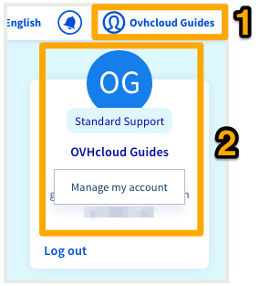

**Dernière mise à jour le 15/04/2020**

## Objectif

OVHcloud met à votre disposition des outils pour renforcer la sécurité de votre compte et de vos services. 
Vous pouvez activer une authentification à deux facteurs (2FA). Celle-ci vient s'ajouter à votre couple identifiant-mot de passe et est gérée depuis un appareil que vous possédez : un téléphone, une tablette ou une clé de sécurité. 

**Découvrez les différentes méthodes proposées et comment les activer.**

## Prérequis

- Être connecté à l'[espace client OVHcloud](https://www.ovh.com/auth/?action=gotomanager).
- Posséder un téléphone mobile (pour la méthode par SMS), un smartphone ou une tablette (pour la méthode via application mobile) ou une clé de sécurité Universal Second Factor (U2F).
- Avoir pris connaissance des [recommandations sur la gestion du mot de passe d'accès à votre compte](https://docs.ovh.com/fr/customer/gerer-son-mot-de-passe/).

## En pratique

Vous pouvez activer une ou plusieurs méthodes de double authentification afin de sécuriser et de contrôler l'accès à votre espace client. 
Nous vous proposons trois méthodes différentes :

- **via SMS**. Renseignez votre numéro de téléphone mobile. Un code à usage unique vous sera envoyé par SMS à chaque tentative de connexion à votre compte OVHcloud. Le principal avantage de cette méthode est d'utiliser un code envoyé sur un autre périphérique que votre ordinateur. En cas d'intrusion sur celui-ci, via un malware par exemple, votre compte restera sécurisé. Vous devez cependant bénéficier d'une couverture réseau suffisante pour recevoir les SMS ;

- **via une application mobile OTP**. Installez une application mobile OTP sur votre smartphone ou tablette Android ou iOS. Associez ensuite l'application à votre compte OVHcloud. À chaque tentative de connexion, l'application générera un code à usage unique valable pendant un court laps de temps.
Une fois la première association de l'application à votre compte effectuée, il n'est plus nécessaire d'être connecté à Internet sur votre périphérique pour que les codes soient générés ;

- **via une clé de sécurité U2F**. Cette méthode nécessite de brancher une clé USB de sécurité U2F sur votre ordinateur à chaque connexion à votre compte OVHcloud. L'authentification s'effectue alors automatiquement. Cette méthode offre un niveau de sécurité plus élevé, car elle repose sur un équipement de sécurité indépendant, totalement séparé de votre ordinateur, smartphone ou tablette, et qui est moins exposé aux risques de piratage.

### Étape 1 : activer votre première méthode de double authentification

- [Activer la méthode de double authentification par SMS](https://docs.ovh.com/fr/customer/activer-la-double-authentification-par-sms/).
- [Activer la méthode de double authentification par application mobile](https://docs.ovh.com/fr/customer/activer-la-double-authentification-par-application-mobile/).
- [Activer la méthode de double authentification par clé de sécurité](https://docs.ovh.com/fr/customer/activer-la-double-authentification-par-cle-de-securite/).

Une fois la première méthode ajoutée, vous pouvez également en ajouter une ou deux autres afin de disposer de multiples moyens de vous connecter à votre compte.

### Étape 2 : sauvegarder les codes de sécurité

Lorsque vous ajoutez une double authentification pour la première fois, des codes de secours vous seront communiqués. Conservez-les précieusement. Nous vous conseillons de les sauvegarder dans un gestionnaire de mots de passe.

{.thumbnail}

Vous pourrez les supprimer ou les regénérer depuis votre espace client :

{.thumbnail}

> [!warning]
>
> Nous vous rappelons qu’il est indispensable de sauvegarder ces codes de secours et de vous assurer qu’ils sont valides. En cas d’indisponibilité de votre ou vos méthodes de sécurité sélectionnées (vol ou perte de votre téléphone ou de votre clé de sécurité), l’accès à votre espace client pourrait être bloqué.
> 
> 
> 

### Étape 3 : se connecter à l'espace client avec la double authentification

Une fois la double authentification activée, l'écran d'identification affiche la méthode de sécurité sélectionnée. Si vous souhaitez en utiliser une autre, cliquez sur `Essayer une autre méthode`{.action}.

{.thumbnail}

Toutes les méthodes que vous avez activées apparaîtront alors :

{.thumbnail}

### Que faire si l'un de mes périphériques est perdu ou cesse de fonctionner ?

Si votre périphérique (téléphone mobile/smartphone/clé de sécurité) est perdu ou ne fonctionne plus, nous vous conseillons d'utiliser les autres méthodes de double authentification actives sur votre compte.

Vous pouvez également utiliser l'un des codes de sécurité mis à votre disposition. 

### Supprimer un périphérique lié à la double authentification

> [!warning]
>
> La suppression d'un périphérique ne désactive pas la double authentification. 
> 
> Avant de supprimer un périphérique et afin de ne pas bloquer l'accès à votre compte, vérifiez donc que vous disposez au choix :
> 
> - d'un périphérique fonctionnel ;
> 
> - d'une autre méthode de double authentification fonctionnelle ; 
> 
> - de codes de sécurité valides.
> 

Pour supprimer un périphérique, connectez-vous à votre [espace client OVHcloud](https://www.ovh.com/auth/?action=gotomanager){.external}. Cliquez sur votre nom en haut à droite (première étape sur l'image ci-dessous), puis sur vos initiales (seconde étape). 

{.thumbnail}

Cliquez ensuite sur `Sécurité`{.action} (première étape sur l'image ci-dessous), puis sur les `...`{.action} (deuxième étape) à droite de votre périphérique à supprimer et enfin sur `Supprimer`{.action} (troisième étape).

{.thumbnail}

## Aller plus loin

Échangez avec notre communauté d'utilisateurs sur [https://community.ovh.com](https://community.ovh.com).
