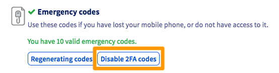

> [!primary]
> Questa traduzione è stata generata automaticamente dal nostro partner SYSTRAN. I contenuti potrebbero presentare imprecisioni, ad esempio la nomenclatura dei pulsanti o alcuni dettagli tecnici. In caso di dubbi consigliamo di fare riferimento alla versione inglese o francese della guida. Per aiutarci a migliorare questa traduzione, utilizza il pulsante "Modifica" di questa pagina.
>

**Ultimo aggiornamento: 30/12/2021**

## Obiettivo

OVHcloud mette a disposizione gli strumenti per rafforzare la sicurezza del tuo account e dei tuoi servizi.
Hai la possibilità di attivare un’autenticazione a due fattori (2FA) che si aggiunge alle tue credenziali di accesso (nome utente e password) ed è gestita dal tuo dispositivo: telefono, tablet o chiave di sicurezza. 

**Questa guida ti mostra i diversi metodi proposti e come attivarli.**

## Prerequisiti

- Avere accesso allo [Spazio Cliente OVHcloud](https://www.ovh.com/auth/?action=gotomanager&from=https://www.ovh.it/&ovhSubsidiary=it)
- Disporre di un cellulare (per il metodo SMS), uno smartphone o un tablet (per il metodo applicazione mobile) o una chiave di sicurezza Universal Second Factor (U2F).
- Aver letto i [consigli su come gestire la password di accesso al tuo account](https://docs.ovh.com/it/customer/gestire-la-password/).

## Procedura

Puoi attivare uno o più metodi di autenticazione a due fattori per proteggere e controllare l’accesso al tuo Spazio Cliente. 
Ti proponiamo tre diversi metodi:

- **tramite SMS**. Inserisci il tuo numero di telefono cellulare. Ad ogni tentativo di connessione al tuo account OVHcloud ti sarà inviato un codice monouso via SMS. Il vantaggio principale di questa modalità è quello di utilizzare un codice inviato su un dispositivo diverso dal computer. Se quest’ultimo dovesse subire un tentativo di intrusione (ad esempio tramite un malware) il tuo account resterà protetto. È tuttavia necessaria una copertura di rete sufficiente per ricevere gli SMS.

- **tramite applicazione mobile OTP**. Installa un’applicazione mobile OTP sul tuo smartphone o tablet Android o iOS e poi associala al tuo account OVHcloud. Ad ogni tentativo di connessione, verrà generato un codice monouso che rimarrà valido per un breve lasso di tempo.
Dopo aver associato per la prima volta l’applicazione al tuo account, non sarà più necessario essere connessi a Internet sul tuo dispositivo perché i codici siano generati.

- **tramite chiave di sicurezza U2F**. Questo metodo richiede il collegamento di una chiave USB di sicurezza U2F al tuo computer ogni volta che accedi al tuo account OVHcloud. L’autenticazione avviene quindi automaticamente. Questo metodo offre un livello di sicurezza più elevato, poiché si basa su uno strumento di sicurezza indipendente, completamente separato dal tuo computer, smartphone o tablet e meno esposto al rischio di pirateria.

### Step 1: attiva il tuo primo metodo di doppia autenticazione

- [Attiva la doppia autenticazione via SMS](https://docs.ovh.com/it/customer/attiva_la_doppia_autenticazione_via_sms/)
- [Attiva la doppia autenticazione tramite applicazione mobile](https://docs.ovh.com/it/customer/attiva_la_doppia_autenticazione_tramite_applicazione_mobile/).
- [Attiva la doppia autenticazione tramite chiave di sicurezza](https://docs.ovh.com/it/customer/attiva_la_doppia_autenticazione_tramite_chiave_di_sicurezza/).

Una volta aggiunto il primo metodo, è possibile aggiungerne uno o due per avere più modi per accedere al tuo account.

### Step 2: salvare i codici di sicurezza

Quando aggiungi per la prima volta un metodo di autenticazione a due fattori, ti vengono forniti codici di riserva.  Conservali con cura. Ti consigliamo di salvarli su un gestore di password.

{.thumbnail}

Puoi eliminarli o rigenerarli dal tuo Spazio Cliente: 

{.thumbnail}

> [!warning]
>
> Ti ricordiamo che è fondamentale salvare i codici di riserva e assicurarsi che siano validi. Se uno o più metodi di sicurezza da te selezionati non sono disponibili (per furto o perdita del telefono o della chiave di sicurezza), l’accesso al tuo Spazio Cliente potrebbe essere bloccato.
> 

### Step 3: accedere allo Spazio Cliente con la doppia autenticazione

Una volta attivata la doppia autenticazione, nella schermata di login appare il metodo di sicurezza selezionato. Se vuoi utilizzarne un altro, clicca su `Prova un altro metodo`{.action}.

{.thumbnail}

A questo punto visualizzi tutti i metodi da te attivati:

{.thumbnail}

### Che fare se uno dei miei dispositivi è stato smarrito o ha smesso di funzionare?

Se il tuo dispositivo (telefono cellulare/smartphone/chiave di sicurezza) è stato smarrito o non funziona più, ti consigliamo di utilizzare gli altri metodi di doppia autenticazione attivi sul tuo account.

È inoltre possibile utilizzare uno dei codici di sicurezza a tua disposizione. 

### Rimuovere un dispositivo collegato alla doppia autenticazione 

> [!warning]
>
> La rimozione di un dispositivo non disattiva la doppia autenticazione. 
> 
> Prima di rimuovere un dispositivo e per evitare di bloccare l’accesso al tuo account, assicurati di avere una di queste opzioni:
> 
> - un dispositivo funzionante
> 
> - un altro metodo di doppia autenticazione valido 
> 
> - codici di sicurezza validi
> 

Per rimuovere un dispositivo, accedi al tuo [Spazio Cliente OVHcloud](https://www.ovh.com/auth/?action=gotomanager&from=https://www.ovh.it/&ovhSubsidiary=it){.external}. Clicca sul tuo nome in alto a destra (primo step nell’immagine qui di seguito) e poi su e clicca sulle iniziali(secondo step). 

{.thumbnail}

Clicca su `Sicurezza`{.action}(primo step nell’immagine qui di seguito) e poi sui tre puntini `...`{.action}(secondo step) a destra del dispositivo da rimuovere e infine clicca su`Rimuovi`{.action}(terzo step).

{.thumbnail}

### Disattiva completamente la doppia autenticazione 

#### Se hai accesso allo Spazio Cliente OVHcloud

Per disattivare completamente la doppia autenticazione sul tuo account OVHcloud, è necessario eliminare **tutte** le periferiche **e disattivare anche i codici di backup**.

Per eliminare ogni periferica, consulta la [sezione dedicata di questa guida](#delete-device).

Una volta eliminati tutti i dispositivi, disattiva i codici di sicurezza cliccando sul pulsante `Disattiva i codici 2FA`{.action}.

{.thumbnail}

#### Se non hai più accesso allo Spazio Cliente OVHcloud

Se non disponi più di periferiche valide e non disponi più di codici di sicurezza validi, puoi richiedere la disattivazione della doppia autenticazione contattando il nostro supporto.

Prima di contattarci, dovete raccogliere i seguenti elementi giustificativi:

|Tipo di account OVHcloud|Giustificativi da fornire|
|---|---|
|Privato|- Documento d'identità (carta d'identità, patente di guida, passaporto) con indicazione del nome completo, della data di nascita e di scadenza, a nome del titolare dell'account OVHcloud|
|Società|- Documenti d'identità di una persona autorizzata a rappresentare l'impresa (carta d'identità, patente di guida, passaporto) con indicazione del nome completo, della data di nascita e di scadenza.  - Documenti comprovanti le coordinate della società e la persona che rappresenta la società.|

Una volta raccolti i giustificativi, contatta il supporto OVHcloud al +39 02 5560 0423. 

> [!warning]
> I giustificativi da inviare devono provenire da un indirizzo email registrato sul tuo account OVHcloud.

Dopo aver verificato i documenti, un consulente può disattivare manualmente la doppia autenticazione sul tuo account OVHcloud.

## Per saperne di più

Contatta la nostra Community di utenti all’indirizzo [https://community.ovh.com](https://community.ovh.com).