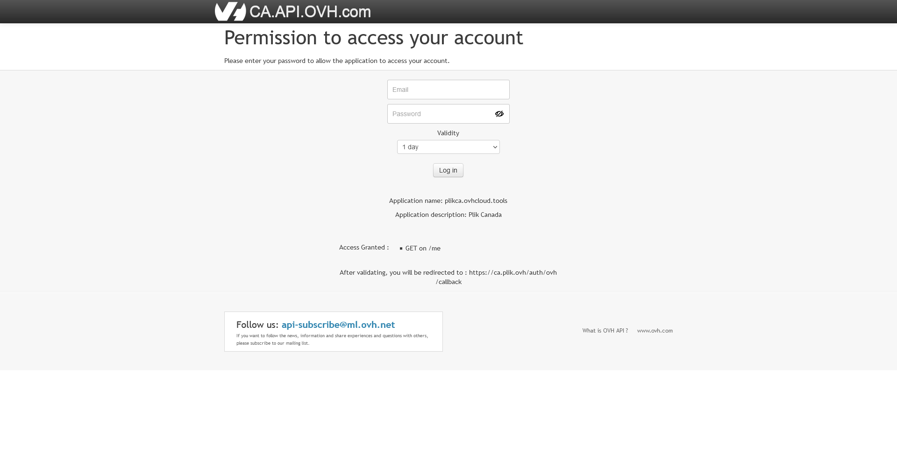

**Última actualización 5 de julio de 2021**

## Objetivo

**Esta guía proporciona información básica sobre cómo utilizar [Plik](https://ca.plik.ovh/#/), algunos casos de uso y las diferentes opciones para compartir archivos.**

## Requerimientos

- Una cuenta OVHcloud

Si aún no tiene una, puede crear una [aca](https://ca.ovh.com/auth/?action=gotomanager&from=https://www.ovh.com/world/&ovhSubsidiary=ws).

## Instrucciones

### Inicio de sesión de API

Para cargar archivos, debe estar autenticado. Hacer clic `Login with OVH`{.action} para empezar.

Inicie sesión con su cuenta de OVHcloud, dando acceso a la API a la herramienta. Escriba sus credenciales y haga clic en el botón `Log In`{.action} para continuar

Esto lo llevará a la página de carga.

### Carga de archivos

Una vez que haya iniciado sesión, podrá cargar archivos, cerrar sesión, crear tokens de acceso o eliminar todas las cargas.

Para cargar un archivo, seleccione el botón `Upload Files`{.acción}. Esto abrirá una nueva página. En esta página, tiene muchas opciones sobre cómo hacer que sus cargas estén disponibles.

- Destruct after the first download: esta opción eliminará su carga después de la primera vez que se descargue
- Streaming: el archivo no se almacenará en el servidor. En cambio, la carga del archivo comenzará cuando el usuario remoto comience la descarga.
- Removable: permite a los usuarios finales eliminar el archivo
- Password: proteja su carga con credenciales
- Comments: agregue comentarios a su carga, se admite el lenguaje Markdown
- Files will be automatically removed in - Elija la cantidad de días (30 como máximo), horas o minutos en los que desea que sus archivos se eliminen automáticamente.

> [!primary]
>
> Nota: al proteger su carga con una contraseña, el nombre de usuario predeterminado es plik.
>

Seleccione las opciones que desea utilizar y haga clic en el botón `Add files`{.action}.

> [!primary]
>
> Nota: los archivos están limitados a 10 GB de tamaño.
>

Después de seleccionar los archivos que desea cargar, seleccione el botón verde `Upload`{.acción} en el lado izquierdo. Esto abrirá una nueva página con sus archivos adjuntos; desde aquí, repasaremos nuestras opciones de descarga.

### Descargando archivos

En la página de descarga, tenemos nuevas opciones:

- Archivo zip: coloca todos los archivos que cargó en una carpeta zip
- Agregar archivos: agregue más archivos a este enlace
- Eliminar: elimina todos los archivos adjuntos a este enlace

También puede eliminar archivos de uno en uno haciendo clic en el botón `X`{.action} junto al archivo.

Para permitir que sus usuarios finales descarguen sus archivos, proporcióneles el enlace al archivo individual ubicado debajo del nombre del archivo. También puede darles el enlace a todos los archivos de la sesión dándoles la URL que se encuentra en la barra de direcciones web.

## Más información

Interactúe con nuestra comunidad de usuarios en <https://community.ovh.com/en/>.
