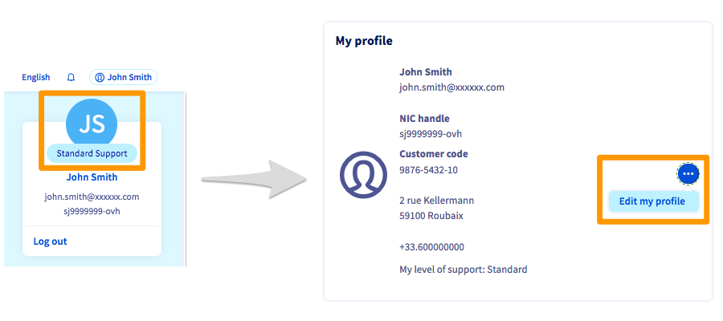
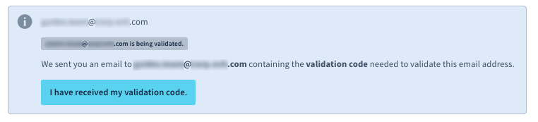

## Objectif

La gestion de vos services et données s'effectue principalement via l'espace client OVHcloud.
Il est donc essentiel d'adopter des bonnes pratiques sur la gestion de votre compte afin d'en sécuriser et conserver l'accès.

L'espace client OVHcloud vous permet aussi de gérer vos données personnelles et de déléguer l'accès à vos services à d'autres utilisateurs.

**Découvrez les bonnes pratiques de gestion de votre compte et de vos données personnelles.**

<iframe width="560" height="315" src="https://www.youtube-nocookie.com/embed/odO58c4gJfc" frameborder="0" allow="accelerometer; autoplay; clipboard-write; encrypted-media; gyroscope; picture-in-picture" allowfullscreen></iframe>

## Prérequis

- Avoir créé [votre compte OVHcloud](/pages/account_and_service_management/account_information/ovhcloud-account-creation)
- Être connecté à votre [espace client OVHcloud](https://www.ovh.com/auth/?action=gotomanager&from=https://www.ovh.com/fr/&ovhSubsidiary=fr)

> [!primary]
> En cas de difficultés de connexion à votre compte, consultez la partie « [Je ne parviens pas à me connecter](/pages/account_and_service_management/account_information/ovhcloud-account-login#login-failure) » de notre guide « [Se connecter à l'espace client OVHcloud](/pages/account_and_service_management/account_information/ovhcloud-account-login)».
>

## En pratique

Ce guide vous détaille :

- [les bonnes pratiques de gestion et de sécurisation du compte OVHcloud](#best-practices);
- [comment gérer et modifier vos informations personnelles](#personal-information);
- [comment déléguer de manière sécurisée les accès à votre compte OVHcloud](#delegation).

### Bonnes pratiques de gestion du compte OVHcloud 

Les bonnes pratiques listées ci-dessous sont à mettre en application dès la création de votre compte OVHcloud, afin d'optimiser la sécurité de vos services et données.

### Créer un mot de passe solide et unique

La sécurité de vos services et données dépend de l'efficacité de votre mot de passe. Celui-ci doit être **complexe, unique et renouvelé régulièrement**.

Retrouvez toutes nos recommandations sur les mots de passe sur notre guide « [Modifier le mot de passe de votre compte](/pages/account_and_service_management/account_information/manage-ovh-password) ».

#### Sauvegarder votre mot de passe

Si vous ne l'avez pas encore fait, sauvegardez votre mot de passe dans un [gestionnaire de mots de passe](/pages/account_and_service_management/account_information/manage-ovh-password#utiliser-un-gestionnaire-de-mots-de-passe).

> [!primary]
> Les logiciels **KeePass** et **Bitwarden** sont des gestionnaires de mots de passe gratuits et libres de droits.
>

#### Ajouter une adresse e-mail de secours 

En cas de difficulté d'accès à votre adresse e-mail principale, une adresse e-mail de secours permet de conserver l'accès à votre compte et donc à la gestion de vos services.
 Cette seconde adresse **doit être différente** de la première, notamment pour faciliter vos démarches en cas de récupération de mot de passe.

Pour renseigner cette adresse e-mail de secours, cliquez sur votre nom en haut à droite de votre compte puis cliquez sur vos initiales.

Cliquez alors sur `Éditer mon profil`{.action}, dans le cadre `Mon profil`.

Vous aurez ainsi accès aux informations personnelles de votre compte. Faites défiler l'écran jusqu'à la rubrique `Vos informations de contact` pour trouver le champ `E-mail de secours`, en-dessous du champ dédié à l'adresse e-mail principale. 

> [!warning]
> Pour rappel, il est **primordial** que l'adresse e-mail de secours soit **différente** de l'adresse e-mail principale du compte.
>
> Évitez d'utiliser des adresses e-mail liées à un nom de domaine que vous gérez depuis votre espace client. En cas de coupure sur ce domaine, vous ne recevriez plus nos notifications.
>

#### Activer la double authentification

La double authentification permet de renforcer la sécurité de votre compte OVHcloud.

Vous trouverez tous les détails pour l'activer sur notre guide « [Sécuriser son compte OVHcloud avec la double authentification](/pages/account_and_service_management/account_information/secure-ovhcloud-account-with-2fa) ».

> [!primary]
> L'activation de la double authentification sur votre compte OVHcloud est un prérequis obligatoire pour être en conformité avec [l'hébergement des données de santé en France (HDS)](https://www.ovhcloud.com/fr/enterprise/certification-conformity/hds/).

### Comment gérer mes informations personnelles ? 

#### Modifier mes informations personnelles

Vous pouvez modifier les informations de votre compte depuis votre [espace client OVHcloud](https://www.ovh.com/auth/?action=gotomanager&from=https://www.ovh.com/fr/&ovhSubsidiary=fr). Pour cela, cliquez sur votre nom en haut à droite dans votre espace client, puis sur vos initiales.

Cliquez alors sur le bouton `...`{.action} dans le cadre `Mon profil`, puis sur `Éditer mon profil`{.action}.

{.thumbnail}

Modifiez vos informations, puis cliquez sur le bouton `Valider`{.action} .

> [!warning]
>
> Il est important que vos informations personnelles soient **à jour** et **exactes**. Elles vous seront demandées lors de vos contacts avec le support OVHcloud et vous devez être en capacité d'en justifier l'exactitude le cas échéant (exemple : lors d'une procédure de changement d'adresse e-mail, un justificatif de domicile identique à l'adresse renseignée sur votre compte peut vous être demandé).
>

#### Modifier l'adresse e-mail principale

Si vous désirez renseigner une nouvelle adresse e-mail principale de contact, vous devrez valider celle-ci à l'aide d'un code envoyé à votre adresse de contact principale actuelle. Une fois ce code reçu, cliquez sur le bouton `J'ai reçu mon code de validation`{.action}.

{.thumbnail}

Renseignez alors le code dans le champ intitulé `Code de validation`, puis validez.

{.thumbnail}

#### Modifier le type de compte

Cliquez sur la mention `type de compte` lorsque vous éditez votre profil. Un menu déroulant vous permet de définir le type de compte correspondant à votre situation.

{.thumbnail}

Une fois vos informations complétées, cliquez sur le bouton `Valider`{.action}.

#### Exercer mes droits sur mes données personnelles

Conformément au Réglement général sur la protection des données (RGPD), vous pouvez demander à exercer les droits relatifs à la protection de vos données à caractère personnel en complétant [ce formulaire](https://www.ovh.com/fr/protection-donnees-personnelles/exercer-vos-droits/){.external}.

#### Supprimer mon compte OVHcloud

Vous pouvez demander à supprimer votre compte OVHcloud et les données liées en complétant [le formulaire d'exercice des droits RGPD](https://www.ovh.com/fr/protection-donnees-personnelles/exercer-vos-droits/){.external} et en y choisissant le « Droit d'effacement ».

> [!warning]
>
> La suppression de votre compte OVHcloud nécessite que les conditions suivantes soient remplies :
>
> - votre compte ne doit plus contenir aucun service ;
>
> - votre compte doit être exempt de toute facture ou commande impayée.
>

### Gérer les accès à mon compte 

Les informations d'identification de votre compte n'ont pas vocation à être partagées et/ou divulguées.

Vous pouvez cependant éprouver le besoin de déléguer l'accès à vos services OVHcloud à des tiers, qu'il s'agisse de membres de votre entreprise (le webmaster de votre entreprise par exemple) ou d'entités indépendantes (par exemple, un cabinet comptable).

Dans ces cas de figure, OVHcloud vous permet de donner des accès à votre compte tout en protégeant vos informations d'identification (mot de passe, double authentification).

#### Créer des utilisateurs

Un utilisateur pourra détenir des droits en lecture ou en écriture sur votre compte et l'ensemble de vos services. Vous pourrez créer, administrer et supprimer ces utilisateurs depuis votre espace client.

Ainsi, non seulement votre propre accès au compte restera sécurisé par la double authentification, mais chaque utilisateur bénéficiera de :

- son propre identifiant;
- son propre mot de passe;
- sa propre double-authentification.

En tant qu'utilisateur principal du compte, vous restez gestionnaire des utilisateurs et de leurs droits.

Pour en savoir davantage, consultez le [guide sur la gestion des utilisateurs](/pages/account_and_service_management/account_information/ovhcloud-users-management).

#### Gérer les contacts

Vous pouvez déléguer la gestion administrative **ou** technique **ou** de facturation d'un ou plusieurs services de votre compte à un autre identifiant client. Consultez le guide sur [la gestion des contacts](/pages/account_and_service_management/account_information/managing_contacts) pour en savoir plus.

### Que faire en cas de suspicion d'usurpation d'identité ?

Si vous recevez un e-mail vous indiquant une connexion inconnue à votre espace client, nous vous conseillons de [modifier immédiatement le mot de passe de votre compte](/pages/account_and_service_management/account_information/manage-ovh-password#modifier-votre-mot-de-passe) et de [sécuriser votre compte avec une double authentification](/pages/account_and_service_management/account_information/secure-ovhcloud-account-with-2fa).

Si vous constatez une activité suspecte sur votre compte, [contactez le support OVHcloud](https://www.ovh.com/fr/support/nous-contacter/) au 1007 (composez le 0033 9 72 10 10 07 depuis une ligne en dehors de la France) afin que nos équipes vous assistent dans les démarches à entreprendre.

## Aller plus loin

[Modifier le mot de passe de votre compte](/pages/account_and_service_management/account_information/manage-ovh-password)

[Sécuriser son compte OVHcloud avec la double authentification](/pages/account_and_service_management/account_information/secure-ovhcloud-account-with-2fa)

[Se connecter à l'espace client OVHcloud](/pages/account_and_service_management/account_information/ovhcloud-account-login)

[En cas d'échec de connexion à l'espace client](/pages/account_and_service_management/account_information/ovhcloud-account-login#login-failure)

Échangez avec notre communauté d'utilisateurs sur <https://community.ovh.com>.
