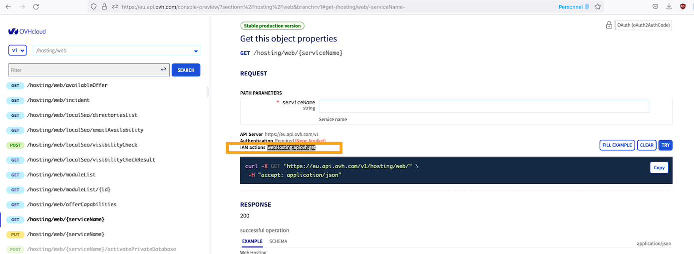

 

## Objective

To carry out automations on your infrastructure, you need to provide credentials to the code that does it. With OVHcloud service accounts, it is possible to have a single ID per script for the use of the different APIs offered by OVHcloud products ([OVHcloud API](/pages/manage_and_operate/api/console-preview), [OpenStack API](/pages/public_cloud/compute/starting_with_nova), etc. )

**This guide details how to use service accounts to connect to OVHcloud APIs.**

This can allow you to:

- order or cancel certain products automatically
- manage your billing
- manage your product infrastructure
- provide your monitoring with information from our infrastructure
- etc...

The service accounts work with the Oauth2 *client credentials* flow. This means you can integrate the use of the OVHcloud API with all the tools that follow this protocol. The v1 and v2 versions of the OVHcloud API are compatible with the *client credentials* and *authorization code* flows of Oauth2.

Oauth2 also allows you to develop third-party applications that connect to OVHcloud APIs, without collecting credentials. If you would like to create your own applications using OVHcloud account information, you can use the *authorization code* flow, which is not described in this guide.

## Requirements

- An [OVHcloud customer account](/pages/account_and_service_management/account_information/ovhcloud-account-creation).
- You know [how to configure access policies via API](/pages/account_and_service_management/account_information/iam-policies-api).
- You know [how to use the OVHcloud APIs](/pages/manage_and_operate/api/first-steps).
- You must have created a [service account via API](/pages/manage_and_operate/api/manage-service-account).

## Instructions

For example purposes in this guide, we will use the service account `urn:v1:eu:identity:credential:xx11111-ovh/oauth2-0f0f0f0f0f0f0f0f0f` to access the configuration of the web hosting `urn:v1:eu:resource:webHosting:xxxxxxx.cluster001.hosting.ovh.net`. Please remember to replace the variables with the ones that match your needs.

### Assign API access rights to their service account

First of all, our service account must be able to access the useful APIs. OVHcloud provides rights for each API call. To find out what permissions are required, you can go to the OVHcloud API console:

- [EU API console](https://eu.api.ovh.com/console-preview/)
- [CA API console](https://ca.api.ovh.com/console-preview/)

For each API call, you will find the name of the action corresponding to the line **IAM actions**.
For example, for the */v1/hosting/web* call, the name of the action required is *webHosting:apiovh:get* as you can see in the following example:

{.thumbnail}

You can also use the **\*** operator to designate a subset of rights. In our example, we would like to provide all rights to the APIs linked to the product **Web Hosting plans**. We will then use the **webHosting:** action

As part of our example, we have created the following access policy: 

```json
{
  "name": "Demo-service-account",
  "description": "Demo for service account guide with webhosting",
  "identities": [
    "urn:v1:eu:identity:credential:xx11111-ovh/oauth2-0f0f0f0f0f0f0f0f"
  ],
  "resources": [
    {
      "urn": "urn:v1:eu:resource:webHosting:xxxxxxx.cluster001.hosting.ovh.net"
    }
  ],
  "permissions": {
    "allow": [
      {
        "action": "webHosting:*"
      }
    ]
  }
}
```

### Retrieve an API token from a service account

In order to retrieve an API token, you must use the following HTTP call:

```bash
curl --request POST \
  --url 'https://www.ovh.com/auth/oauth2/token' \
  --header 'content-type: application/x-www-form-urlencoded' \
  --data grant_type=client_credentials \
  --data client_id=0f0f0f0f0f0f0f0f \
  --data client_secret=xxxxx \
  --data scope=all
```

By modifying the following data: 

- **client_id**: your service account ID
- **client_secret**: token for your service account

Depending on the location of your API, you will need to use the following URL:

- **EU API**: `https://www.ovh.com/auth/oauth2/token`
- **CA API**: `https://www.ovh.ca/auth/oauth2/token`

Following this API call, you will receive a response in the following format:

```json
{
  "access_token":"your-api-token",
  "token_type":"Bearer",
  "expires_in":3599,
  "scope":"all"
}
```

Save the token in the **access_token** field. You will need it to authenticate your API calls.

To get information on your web hosting plan, you can now make a call on:

> [!api]
>
> @api {v1} /hosting/web GET /hosting/web/xxxxxxx.cluster001.hosting.ovh.net
>

To do this, you will need to provide the token retrieved earlier in the header of your request, as follows:

```bash
curl -i -X GET "https://{eu|ca}.api.ovh.com/v1/hosting/web/xxxxxxx.cluster001.hosting.ovh.net" \
  -H "accept: application/json"\
  -H "authorization: your-api-token" 
```

With this access policy, you only have access to the webhosting APIs. The other APIs will return the following HTTP 403 error:

```json
{
    "class":"Client::Forbidden",
    "message":"User not granted for this request"
}
```

If you would like to use these other APIs, you will need to modify your access policy to grant it the corresponding rights.

## Go further

Join our community of users on <https://community.ovh.com/en/>.
