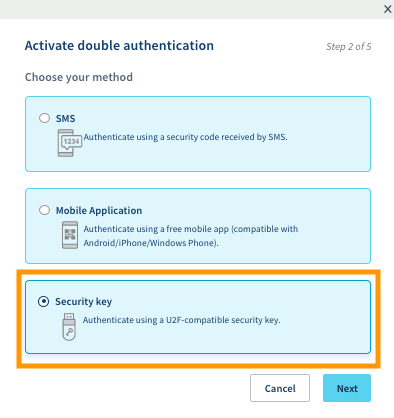
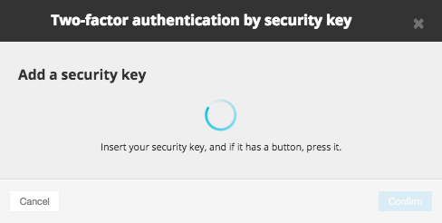

## Objectif

La double authentification par clé de sécurité Universal Second Factor (U2F) est l'une des méthodes proposées par OVHcloud afin de vous permettre de sécuriser l'accès à votre compte. Cette technique de protection par une clé USB, de plus en plus utilisée pour la double authentification dans de nombreux domaines, appartient à la FIDO Alliance.

**Ce guide vous permettra d'activer la double authentification par clé de sécurité U2F et de comprendre comment l'utiliser pour vos prochaines connexions à votre espace client.**

## Prérequis

- Prendre connaissance des [différentes méthodes de double authentification proposées par OVHcloud](/pages/account_and_service_management/account_information/secure-ovhcloud-account-with-2fa).
- Être connecté à l'[espace client OVHcloud](https://www.ovh.com/auth/?action=gotomanager&from=https://www.ovh.com/fr/&ovhSubsidiary=fr){.external}.
- Posséder une clé de sécurité U2F.
- Disposer d'un port USB libre sur votre ordinateur.

## En pratique

### Étape 1 : activer la double authentification

Connectez-vous à votre [espace client OVHcloud](https://www.ovh.com/auth/?action=gotomanager&from=https://www.ovh.com/fr/&ovhSubsidiary=fr){.external}, cliquez sur votre nom en haut à droite (1), puis sur vos initiales (2). Cliquez ensuite sur `Sécurité`{.action} (3) et enfin sur `Activer la double authentification`{.action} (4).

{.thumbnail}

### Étape 2 : Choisir la méthode par clé de sécurité

Choisissez la méthode par clé de sécurité et validez.

{.thumbnail}

### Étape 3 : valider la double authentification

Branchez votre clé de sécurité lorsque cela vous est demandé. Si elle est équipée d'un bouton, appuyez sur celui-ci. 

{.thumbnail}

> [!warning]
>
> Une fenêtre de type pop-up s'ouvrira pour vous demander la validation de la clé. Si vous ne voyez pas cette fenêtre, vérifiez que votre navigateur ne les bloque pas.

Une fois la clé reconnue, vous pouvez également ajouter une description. Celle-ci peut être utile afin d'identifier les personnes susceptibles d'utiliser cette méthode d'authentification sur votre compte.

{.thumbnail}

### Étape 4 : sauvegarder les codes de sécurité

Au premier ajout d'une méthode de sécurité par double authentification, des codes de secours vous sont communiqués. **Ils sont à conserver précieusement**. Nous vous conseillons donc de les sauvegarder dans un gestionnaire de mots de passe, tel que [KeePass](https://keepass.info/){.external}.

{.thumbnail}

Vous pourrez les supprimer ou les regénérer depuis votre espace client.

{.thumbnail}

> [!warning]
>
> Nous vous rappelons qu’il est indispensable de **sauvegarder ces codes de secours** et de vous assurer qu’ils sont valides. En cas d’indisponibilité de votre ou vos méthodes de sécurité sélectionnées (vol ou perte de votre téléphone ou de votre clé de sécurité), l’accès à votre espace client pourrait être bloqué.
>

### Étape 5 : se connecter à l'espace client avec la double authentification

Une fois votre authentification à double facteur activée, l'écran d'identification vous présentera une de vos méthodes de sécurité. Si vous souhaitez en utiliser une autre, cliquez sur le bouton `Essayer une autre méthode`{.action}.

{.thumbnail}

Tous les choix que vous avez activés apparaîtront alors.

{.thumbnail}

## Aller plus loin

[Sécuriser son compte OVHcloud avec la double authentification](/pages/account_and_service_management/account_information/secure-ovhcloud-account-with-2fa)

[Désactiver la double authentification sur son compte OVHcloud](/pages/account_and_service_management/account_information/secure-ovhcloud-account-with-2fa#desactivation)

Le site officiel de la [FIDO Alliance](https://fidoalliance.org/){.external}.

Échangez avec notre communauté d'utilisateurs sur <https://community.ovh.com>.
