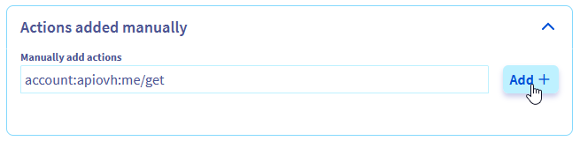

## Objectif

Ce guide explique comment fournir à un utilisateur les droits essentiels lui permettant de se connecter à l'espace client OVHcloud.

## Prérequis

- Disposer d'un [compte OVHcloud](/pages/account_and_service_management/account_information/ovhcloud-account-creation)
- Savoir [gérer les utilisateurs du compte](/pages/account_and_service_management/account_information/ovhcloud-users-management)
- Savoir [comment configurer des stratégies pour IAM](/pages/account_and_service_management/account_information/iam-policy-ui)

## En pratique

Pour pouvoir se connecter à l'espace client OVHcloud, un utilisateur doit disposer au moins de cet ensemble minimal de droits sur la ressource du compte :

- account:apiovh:me/get
- account:apiovh:me/supportLevel/get
- account:apiovh:me/certificates/get
- account:apiovh:me/tag/get

Grâce à ces droits, un utilisateur pourra se connecter à l'espace client. Cependant, pour pouvoir effectuer des actions à l’intérieur de celui-ci, des droits supplémentaires doivent être attribués via IAM.

### Via l'interface utilisateur

L'interface utilisateur permet de configurer une stratégie avec la configuration suivante :

Ajouter un `resourceType` « OVHcloud customer account » et ajouter votre compte en tant que ressource.

{.thumbnail}

Ensuite il est possible soit d'utiliser un groupe de permissions managée `controlPanelAccess`

{.thumbnail}

Ou d'ajouter les 4 droits listés ci-dessus en tant qu'action

{.thumbnail}

Vous pouvez maintenant associer vos utilisateurs à cette politique pour leur donner le droit de se connecter à votre espace client.

### Via l'API

L'API vous permet de mettre en place une policy selon l'exemple suivant :

```json
{
  "name": "manager_ro",
  "description": "manager_ro",
  "identities": [
    .... 
  ],
  "resources": [ 
     {
         "urn": "urn:v1:eu:resource:account:xx1111-ovh" 
     }],
  "permissions": {
    "allow": [
      {
        "action": "account:apiovh:me/get"
      },
      {
        "action": "account:apiovh:me/supportLevel/get"
      },
      {
        "action": "account:apiovh:me/certificates/get"
      },
      {
        "action": "account:apiovh:me/tag/get"
      }
    ]
  }
}
```

## Aller plus loin

Échangez avec notre communauté d’utilisateurs sur <https://community.ovh.com/>.
