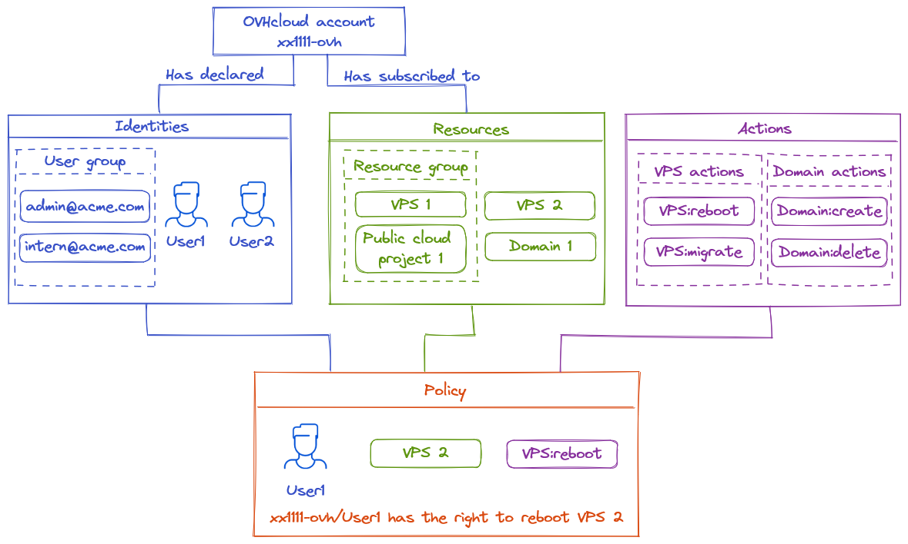
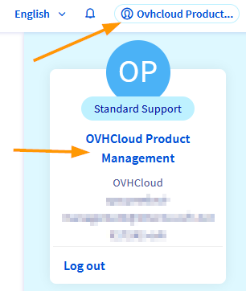
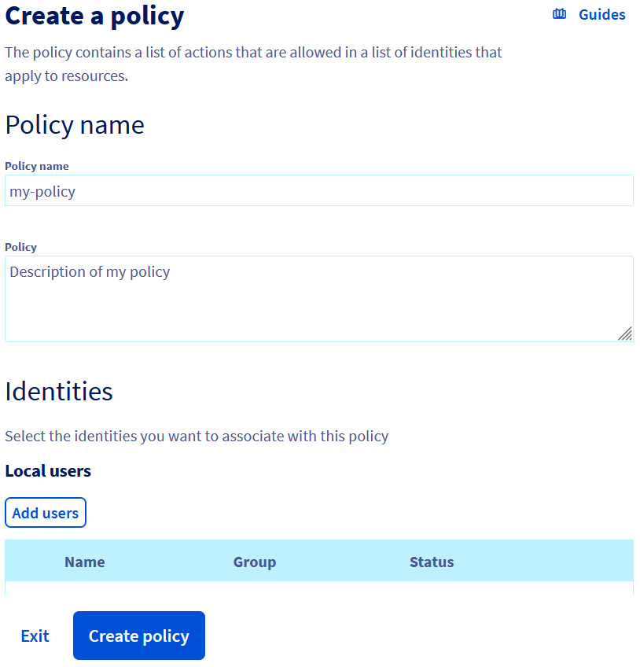
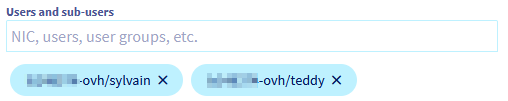

> [!primary]
> Diese Übersetzung wurde durch unseren Partner SYSTRAN automatisch erstellt. In manchen Fällen können ungenaue Formulierungen verwendet worden sein, z.B. bei der Beschriftung von Schaltflächen oder technischen Details. Bitte ziehen Sie im Zweifelsfall die englische oder französische Fassung der Anleitung zu Rate. Möchten Sie mithelfen, diese Übersetzung zu verbessern? Dann nutzen Sie dazu bitte den Button "Beitragen" auf dieser Seite.
>

> [!warning]
>
> Diese Funktion ist derzeit in der Beta-Phase. Weitere Informationen finden Sie auf <https://labs.ovhcloud.com/de/>.
>

## Ziel

In dieser Anleitung erfahren Sie, wie Sie Benutzern eines OVHcloud Kunden-Accounts bestimmte Zugriffsrechte gewähren.

Die OVHcloud Zugangsverwaltung basiert auf einem System zur Verwaltung von Richtlinien. Es können verschiedene Richtlinien erstellt werden, die Benutzern Zugriff auf bestimmte Funktionen der Produkte eines OVHcloud Kunden-Accounts geben.

Eine Richtlinie enthält im Detail:

- Eine oder mehrere **Identitäten**, auf die sich diese Richtlinie bezieht.
    - Es kann sich um Account-IDs, Benutzer oder Benutzergruppen handeln (wie sie auch für den Zugang über [Federation](/pages/account_and_service_management/account_information/ovhcloud-account-connect-saml-adfs) verwendet werden - weitere SSO-Hilfen stehen zur Verfügung).
- Eine oder mehrere **Ressourcen**, die von dieser Richtlinie betroffen sind.
    - Eine Ressource ist ein OVHcloud Produkt, das von dieser Richtlinie betroffen ist (ein Domainname, ein Nutanix-Server, ein Load Balancer etc.).
- Eine oder mehrere **Aktionen**, die von dieser Richtlinie zugelassen oder ausgenommen sind.
    - Aktionen sind die spezifischen Rechte, die von dieser Richtlinie betroffen sind (Neustart eines Servers, Erstellung eines E-Mail-Accounts, Kündigung eines Abonnements etc.)
 
Es kann beispielsweise eine Richtlinie erstellt werden, um einem Benutzer namens John für einen VPS den Zugriff auf die Aktion "Reboot" zu geben.

**Diese Anleitung erklärt, wie Sie diese Richtlinien über das OVHcloud Kundencenter deklarieren und welche Identitäten, Ressourcen und Aktionen verfügbar sind.**

{.thumbnail}

## Voraussetzungen

- Sie haben einen [OVHcloud Kunden-Account](/pages/account_and_service_management/account_information/ovhcloud-account-creation).
- Sie kennen die [Benutzerverwaltung für OVHcloud Kunden-Accounts](/pages/account_and_service_management/account_information/ovhcloud-users-management).
- Sie haben mindestens eine aktive OVHcloud Dienstleistung, die mit diesem Account verbunden sind (Load Balancer, Domainname, VPS etc.)

## In der praktischen Anwendung

### Menü für IAM aufrufen

Klicken Sie oben rechts auf den Namen Ihres Accounts und dann erneut in der Seitenleiste auf Ihren Namen.

{.thumbnail}

Sie können das IAM-Menü über den dedizierten Eintrag in Ihrem Kundencenter aufrufen.

{.thumbnail}

Das Menü enthält eine Liste aller aktuellen Richtlinien, die für Ihren Account erstellt wurden.

{.thumbnail}

Jede Richtlinie wird mit Name, Anzahl der verbundenen Identitäten und der Anzahl der darin enthaltenen Aktionen angezeigt.

> [!primary]
>
> Wenn Sie auf „Erweiterter Modus“ klicken, wird eine Liste mit allen OVHcloud Richtlinien angezeigt. Die internen Richtlinien werden automatisch von OVHcloud erstellt, um die bereits bestehende Delegation von `NIC Tech` (technischer Kontakt) und `NIC Admin` (Administrator-Kontakt) zur neuen IAM-Funktion zu konvertieren. 
>
> Kunden können diese Richtlinien nicht ändern oder löschen.

### Verwaltung der Richtlinien

#### Eine Richtlinie erstellen

Klicken Sie auf den Button `Policy erstellen`{.action}.

Das folgende Formular wird angezeigt:

{.thumbnail}

- **Policy-Name** (erforderlich): Dies ist der Name, der in den Benutzer-Oberflächen angezeigt wird. Der Name muss eindeutig sein und darf keine Leerzeichen enthalten.
- **Produkttypen**: Wählen Sie die Produkttypen aus, um den Umfang der Richtlinie festzulegen. Mehrere Produkttypen können in derselben Richtlinie enthalten sein.
- **Ressourcen**: Fügen Sie Ressourcen oder Ressourcengruppen hinzu, die durch die Richtlinie abgedeckt werden sollen. Die verfügbaren Ressourcen werden nach dem zuvor ausgewählten Produkttyp gefiltert.
- **Aktionen**.

Es gibt drei Möglichkeiten, Aktionen hinzuzufügen:

- Aktivieren der Option `Alle Aktionen zulassen`{.action}

{.thumbnail}

Wenn Sie diese Option aktivieren, lassen Sie alle Aktionen zu, die sich auf die ausgewählten Produkte beziehen. Dies schließt alle bestehenden und in Zukunft hinzugefügten Aktionen für diese Produktkategorien ein.

- Manuelles Hinzufügen von Aktionen

Wenn Sie den Namen der Aktion kennen, können Sie sie manuell hinzufügen.

{.thumbnail}

Sie können die *Wildcard* `*` am Anfang oder Ende des Aktionsnamens verwenden.

Wenn Sie beispielsweise `vps:apiovh:ips/*` hinzufügen, geben Sie folgende Rechte:

vps:apiovh:ips/edit  
vps:apiovh:ips/delete  
vps:apiovh:ips/get  

- Auswählen von Aktionen aus der Liste

Aktionen können in der Liste ausgewählt werden.

{.thumbnail}

Die verfügbaren Aktionen hängen vom Ressourcentyp ab und gehören zu einer der folgenden fünf Kategorien:

- **Read**: Produkte auflisten und dessen Informationen anzeigen (*Bsp.: IP eines VPS anzeigen*).
- **Create**: Aktion, um etwas für ein Produkt erstellen zu können (*Bsp.: Support-Ticket erstellen*).
- **Delete**: Aktion, um Löschungen bezüglich eines Produkts durchzuführen (*Bsp.: Public Cloud Instanz löschen*).
- **Edit**: Aktion zum Ändern eines vorhandenen Elements für ein Produkt (*Bsp.: Ändern der TCP-Route eines Load Balancers*).
- **Operate**: Änderungen an der produktbezogenen Infrastruktur ausführen (*Bsp.: Neustart eines Dedicated Servers*).

Ein Suchfeld ist verfügbar, mit dem Sie eine bestimmte Aktion in der Liste identifizieren können.

#### Richtlinien bearbeiten

Um eine bestehende Richtlinie zu bearbeiten, klicken Sie auf den Button `...`{.action} rechts neben der Richtlinie und dann auf `Richtlinie bearbeiten`{.action}.

{.thumbnail}

Anschließend können Sie den Geltungsbereich der Richtlinie ändern.

#### Richtlinie löschen

Um eine bestehende Richtlinie zu löschen, klicken Sie auf `...`{.action} rechts neben der Richtlinie und dann auf `Richtlinie löschen`{.action}.

In einem Popup-Fenster werden Sie aufgefordert, den Löschvorgang zu bestätigen.

### Eine Identität mit einer Richtlinie verknüpfen

Um eine Identität mit einer Richtlinie zu verknüpfen, klicken Sie rechts neben der Richtlinie auf `...`{.action} und dann auf `Identitäten verwalten`{.action}.

{.thumbnail}

Auf diese Weise können Sie die Benutzer oder Gruppen, für die die Richtlinie gelten soll, hinzufügen oder entfernen.

{.thumbnail}

### Verwaltung von Identitäten

Die für die Richtlinien verfügbaren Identitäten werden über den Tab `Verwaltung der Nutzer`{.action} im Menü `Mein Account`{.action} verwaltet.

Der Tab `Identitäten`{.action} des IAM-Menüs leitet Sie zu diesem Bereich weiter.

Details zur Benutzerverwaltung finden Sie in [unserer Dokumentation](/pages/account_and_service_management/account_information/ovhcloud-users-management).

### Verwaltung von Ressourcengruppen

Richtlinien können auf Ressourcengruppen abzielen (anstatt direkt auf Ressourcen). Diese Ressourcengruppen können Ressourcen aus verschiedenen Produktbereichen zusammenfassen, etwa zum Konfigurieren einer Testumgebung.

#### Ressourcengruppe erstellen

Um eine Ressourcengruppe zu erstellen, öffnen Sie im IAM-Menü den entsprechenden Tab.

{.thumbnail}

Klicken Sie auf `Ressourcengruppe erstellen`{.action}.

{.thumbnail}

- **Ressourcengruppenname**: Dies ist der Name, der in den Benutzer-Oberflächen angezeigt wird. Der Name muss eindeutig sein und darf keine Leerzeichen enthalten.
- **Produkttypen**: Liste der Produkttypen, die von dieser Ressourcengruppe betroffen sind.
- **Ressourcen**: Liste der Ressourcen, die die Gruppe enthalten wird.

### Ressourcengruppe bearbeiten

Um eine Ressourcengruppe zu bearbeiten, klicken Sie in der Liste auf den entsprechenden Namen.

#### Ressourcengruppe löschen

Um eine vorhandene Ressourcengruppe zu löschen, klicken Sie rechts neben der Gruppe auf `...`{.action} und dann auf `Ressourcengruppe löschen`{.action}.

In einem Popup-Fenster werden Sie aufgefordert, den Löschvorgang zu bestätigen.

## Weiterführende Informationen

Für den Austausch mit unserer User Community gehen Sie auf <https://community.ovh.com/en/>.
