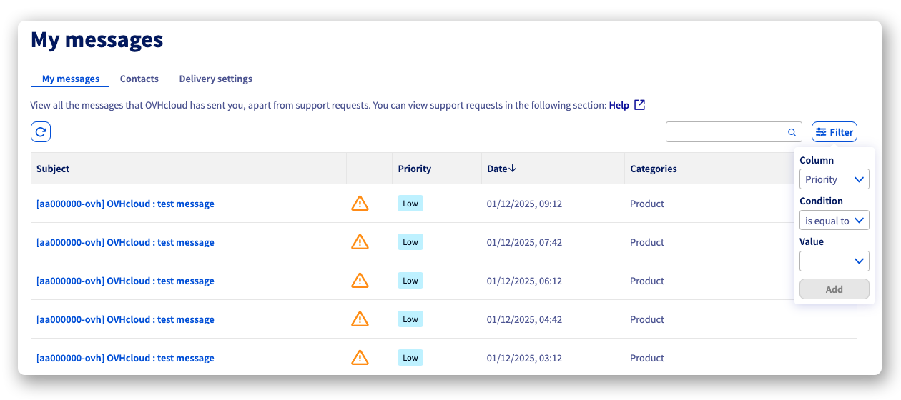
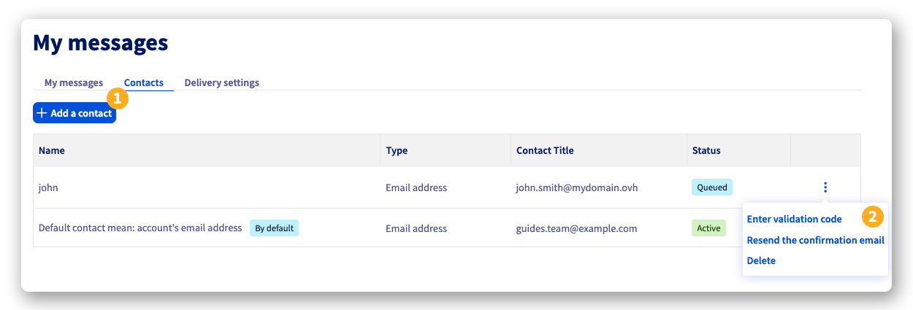
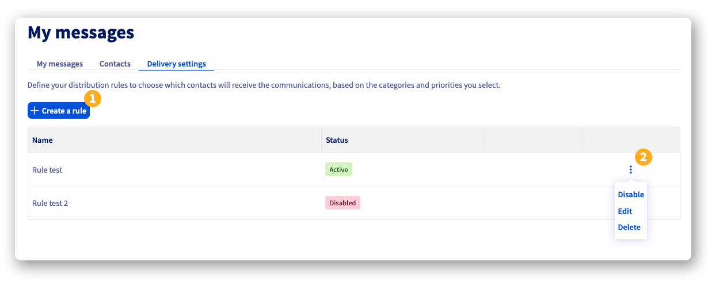
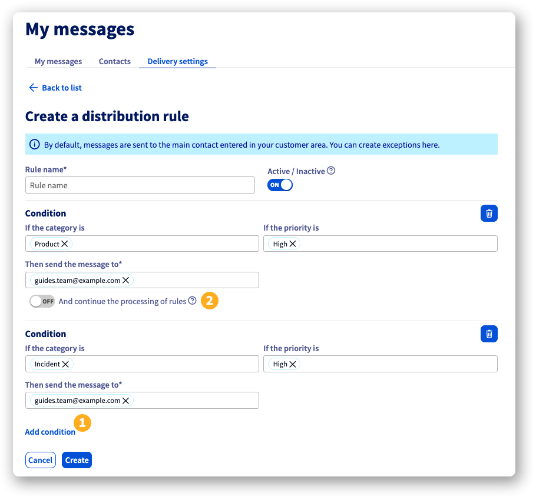

## Wprowadzenie

Podczas zakładania konta OVHcloud podałeś adres e-mail kontaktowy. Jeśli chcesz podzielić się lub zdelegować zarządzanie komunikacją związaną z Twoim kontem, możesz dodać nowe adresy e-mail kontaktowe i skonfigurować reguły zarządzania tą komunikacją.

**Dowiedz się, jak dodać dodatkowe adresy e-mail kontaktowe do swojego konta OVHcloud i skonfigurować reguły dystrybucji wiadomości.**

## Wymagania początkowe

<!-- CP-NAV-START:account-messages -->
---

### Dostęp do Panelu klienta OVHcloud

- **Link bezpośredni:** [Połączenia](/links/control-panel/account-messages)
- **Ścieżka nawigacji:** Kliknij swoją nazwę w prawym górnym rogu > `Połączenia`{.action}

---
<!-- CP-NAV-END:account-messages -->

## W praktyce

### Wiadomości

<!-- CP-STEPS-START:my-messages -->
W zakładce `Wiadomości`{.action} znajdziesz wszystkie wiadomości wysłane na Twój adres e-mail kontaktowy. W prawym górnym rogu tabeli możesz włączyć filtr, aby posortować wiadomości według priorytetu, daty i kategorii.

{.thumbnail .w-600}
<!-- CP-STEPS-END:my-messages -->

### Kontakty

<!-- CP-STEPS-START:contacts -->
W zakładce `Kontakty`{.action} znajdziesz główny adres e-mail konta OVHcloud, który nie może zostać usunięty ani zmodyfikowany z poziomu panelu klienta.

> [!primary]
>
> Jeśli nie masz już dostępu do swojego głównego adresu e-mail kontaktowego i nie posiadasz adresu e-mail rezerwowego, musisz postępować zgodnie z [tą procedurą](/links/transversal/procedure-email-change), aby zażądać jego zmiany u naszych zespołów.

Oprócz kontaktu `domyślny`, możesz dodać nowe adresy e-mail kontaktowe do swojego konta OVHcloud:

- **(1)**: Kliknij przycisk `Dodaj kontakt`{.action}, wprowadź adres e-mail i imię kontaktu, a następnie kliknij `Dodaj`{.action}. Kod weryfikacyjny zostanie wysłany na ten adres e-mail.

- **(2)**: Kliknij przycisk `⋮`{.action} obok nowego kontaktu, aby wyświetlić opcje:
    - `Wprowadź kod weryfikacyjny`{.action}: Pozwala wpisać kod weryfikacyjny wysłany nowemu kontaktowi przez e-mail.
    - `Prześlij ponownie e-mail potwierdzający`{.action}: Pozwala wysłać ponownie e-mail z kodem weryfikacyjnym do tego kontaktu.
    - `Usuń`{.action}: Pozwala usunąć ten kontakt.

{.thumbnail .w-600}
<!-- CP-STEPS-END:contacts -->

### Ustawienia wysyłki wiadomości

<!-- CP-STEPS-START:delivery-settings -->
W zakładce `Ustawienia wysyłki wiadomości`{.action} możesz tworzyć reguły, aby zorganizować dystrybucję wiadomości do swoich adresów e-mail kontaktowych.

- **(1)**: Kliknij przycisk `Utwórz regułę`{.action}, aby określić, którzy kontakt będzie otrzymywał komunikaty, w zależności od kategorii i poziomów priorytetu, które wybierzesz.

- **(2)**: Kliknij przycisk `⋮`{.action} obok reguły, aby uzyskać dostęp do opcji:
    - `Włącz / Wyłącz`{.action}: Pozwala włączyć lub wyłączyć regułę **bez jej usuwania**.
    - `Zmodyfikuj`{.action} regułę.
    - `Usuń`{.action} regułę.

{.thumbnail .w-600}

Reguły są stosowane zgodnie z dwoma kryteriami:

- **Kategoria**: Konto, Płatności, Awaria, Konserwacja, Produkt i Bezpieczeństwo.
- **Priorytet**, ustalony na 3 poziomach: Niski, Średni i Wysoki.

Możesz tworzyć reguły po jednej, wszystkie zostaną zastosowane, gdy wiadomość zostanie wysłana na Twoje konto.

Możesz również utworzyć regułę zawierającą wiele warunków, które zostaną zastosowane kaskadowo. Aby to zrobić, podczas konfigurowania reguły kliknij przycisk `Dodaj warunek`{.action} **(1)**. Możesz dodać tyle warunków, ile jest to konieczne. 
Domyślnie, jeśli warunek zostanie spełniony, proces się zatrzyma. Jeśli chcesz, aby proces kontynuował stosowanie kolejnych warunków, włącz przycisk `I kontynuuj przetwarzanie reguł`{.action} **(2)** pod regułą, którą skonfigurowałeś.

{.thumbnail .w-600}
<!-- CP-STEPS-END:delivery-settings -->

## Sprawdź również

Dołącz do [grona naszych użytkowników](/links/community).