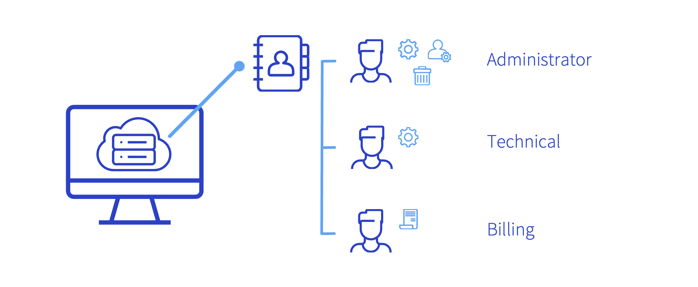
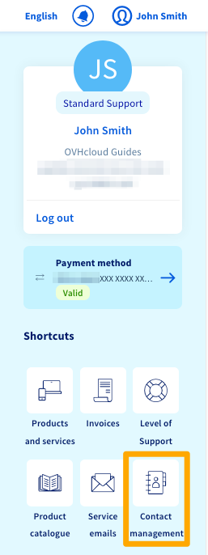
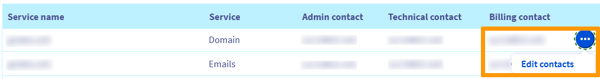
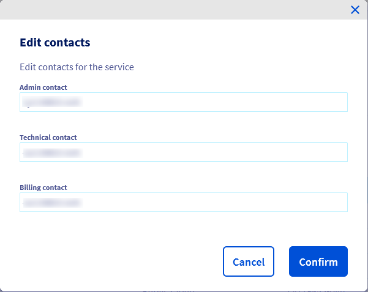
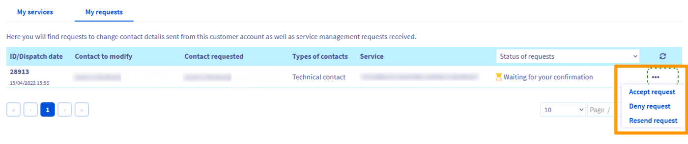
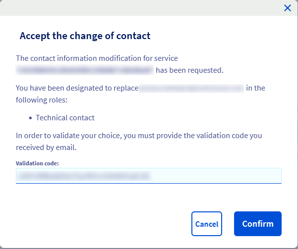
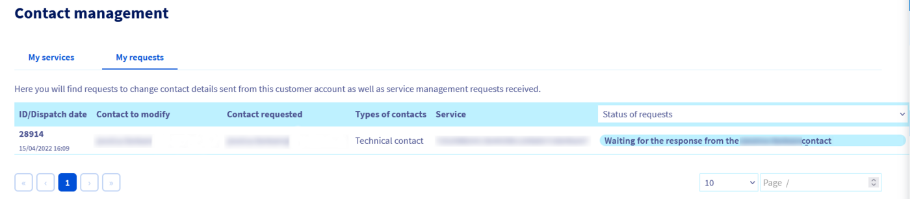

## Objectif

La plupart des services créés chez OVHcloud sont gérés par plusieurs contacts. Chacun de ces contacts est associé à un compte client.

**Apprenez comment gérer les contacts de vos services OVHcloud.**

## Définition

Trois types de contacts existent:

- **le contact administrateur** gère les aspects administratifs et techniques d'un service. Il possède des droits de modification sur l'ensemble des contacts et peut effectuer des changements dans les informations du propriétaire d'un service, comme les noms de domaine par exemple .
- **le contact technique** gère uniquement les aspects techniques d'un service .
- **le contact facturation** gère uniquement la facturation d'un service dont ses prélèvements. Ce contact reçoit notamment les notifications liées au renouvellement. 

{.thumbnail}

## Prérequis

- Être connecté à votre [espace client OVHcloud](/links/manager){.external}
- Disposer de droits suffisants  sur le service concerné.
- Disposer d'un accès à l'adresse e-mail renseignée dans votre compte OVHcloud
- Connaître l'adresse e-mail principale renseignée dans le compte OVHcloud du nouveau contact (pour qui vous réalisez la modification).
- Le nouveau contact doit quant à lui disposer d'un accès à l'adresse e-mail principale renseignée dans son compte OVHcloud.
- L'ancien et le nouveau contact facturation doivent être à jour de leurs règlements.

## En pratique

> [!primary]
> La gestion des contacts n'est possible qu'entre deux comptes OVHcloud situés dans la même zone géographique.
> Par exemple, il est impossible de faire une gestion des contacts entre un compte en Europe et un compte au Canada.

### Accéder à la gestion des contacts

Connectez-vous à votre [espace client OVHcloud](/links/manager){.external}, cliquez sur le nom rattaché à votre compte client dans la barre de menu en haut à droite, puis cliquez sur `Gestion des contacts`{.action}.

{.thumbnail}

Le tableau qui apparaît permet ainsi de visionner les différents services pour lesquels votre compte client est renseigné en tant que contact.

{.thumbnail}

### Modifier les contacts d'un service

Une fois sur la page de gestion des contacts, cliquez sur `...`{.action} à droite du service à modifier, puis sur `Modifier les contacts`{.action}. Renseignez le ou les nouveaux contacts souhaités (renseignez l'addresse e-mail principale du compte concerné) puis cliquez sur `Valider`{.action}.

{.thumbnail}

{.thumbnail}

Un e-mail va être envoyé aux contacts impliqués dans ce processus de modification.

#### Je suis contact administrateur

En qualité d'administrateur, vous pouvez réaliser plusieurs manipulations sur les contacts d'un service :

- Nommer un nouveau contact sur la gestion technique et/ou la facturation. Une validation de votre part ainsi que de celle du nouveau contact seront nécessaires . L'ancien contact recevra un e-mail l'informant de la modification si celle-ci arrive à son terme.

- Récupérer la gestion technique et/ou la facturation. Vous devrez valider cette demande. L'ancien contact recevra un e-mail l'informant de la modification.

- Désigner un nouveau contact administrateur à votre place. Une validation de votre part ainsi que de celle du nouveau contact seront nécessaires.

#### Je suis contact technique

Vous pouvez uniquement désigner un autre contact technique pour vous remplacer. Une validation de votre part ainsi que de celle du nouveau contact technique seront nécessaires.

#### Je suis contact facturation

Vous pouvez uniquement désigner un autre contact facturation pour vous remplacer. Une validation de votre part ainsi que de celle du nouveau contact facturation seront nécessaires.

> [!warning]
> L'ancien et le nouveau contact facturation doivent être exempts de toute facture impayée.

### Valider, refuser ou suivre un changement de contact

Pour suivre et gérer les demandes en cours, cliquez sur l'onglet `Mes demandes`{.action}. C'est ici que vous pourrez accepter ou refuser une demande.

{.thumbnail}

Pour cela, vous devez être en possession du code de validation (aussi appelé token) contenu dans l'e-mail pour valider ou refuser la demande.

> [!primary]
> Ce code est personnel, à usage unique et sa composition différera pour les deux contacts.

L'e-mail reçu contient  également un lien menant directement sur la page permettant de valider ou de refuser la demande. En passant par cet e-mail, le code de validation (token) sera automatiquement prérempli.

Si l'un des contacts n'a pas reçu l'e-mail, il se peut que l'adresse de contact renseignée dans le profil ne soit pas à jour. Vous pouvez la vérifier dans votre profil, la modifier si nécessaire puis redemander l'envoi de l'e-mail en cliquant sur `Renvoyer la demande`{.action}.

{.thumbnail}

Si un seul contact a validé le changement, un message apparaîtra, vous informant que la demande est toujours en attente de validation par l'autre contact. Si l'un des contacts vient tout juste de valider une demande, l'affichage dans [l'espace client OVHcloud](/links/manager){.external} se mettra à jour sous quelques minutes.

{.thumbnail}

Dès que les deux contacts ont validé la demande, le changement sera effectif sous quelques minutes. Les deux contacts recevront un e-mail les informant que la demande a bien été traitée.

## Aller plus loin

Échangez avec notre communauté d'utilisateurs sur [https://community.ovh.com](https://community.ovh.com).
