> [!primary]
> Diese Übersetzung wurde durch unseren Partner SYSTRAN automatisch erstellt. In manchen Fällen können ungenaue Formulierungen verwendet worden sein, z.B. bei der Beschriftung von Schaltflächen oder technischen Details. Bitte ziehen Sie im Zweifelsfall die englische oder französische Fassung der Anleitung zu Rate. Möchten Sie mithelfen, diese Übersetzung zu verbessern? Dann nutzen Sie dazu bitte den Button "Beitragen" auf dieser Seite.
>


## Ziel

Sie können die Authentifizierungsmethode **Single Sign-On** (SSO) verwenden, um sich in Ihren OVHcloud Kunden-Account einzuloggen. Um diese Verbindungen zu aktivieren, müssen Ihr Account und Ihr **AD FS** (*Active Directory Federation Services*) mithilfe von SAML-Authentifizierungen (*Security Serving Markup Language*) konfiguriert werden.

**Diese Anleitung erklärt, wie Sie Ihren OVHcloud Kunden-Account mit einem externen Active Directory verbinden.**

## Voraussetzungen

- AD FS (Active Directory Federation Services) wird auf Ihrem Server ausgeführt.
- Sie verfügen über einen [OVHcloud Kunden-Account](/pages/account_and_service_management/account_information/ovhcloud-account-creation).
- Sie haben Zugriff auf Ihr [OVHcloud Kundencenter](https://www.ovh.com/auth/?action=gotomanager&from=https://www.ovh.de/&ovhSubsidiary=de).

## In der praktischen Anwendung

> [!primary]
>
> Damit ein Service Provider (Ihr OVHcloud Account) eine SSO-Verbindung zu einem Identity Provider (Ihrem AD FS) herstellen kann, ist es notwendig, das gegenseitige Vertrauensverhältnis zu konfigurieren (*Party Trust*).
>

### AD FS Trust aufbauen

Ihr AD FS fungiert als Identity Provider. Authentifizierungsanfragen für Ihren OVHcloud Account werden nur dann akzeptiert, wenn Sie diesen zuerst als Relying Party deklariert haben.

Im Zusammenhang mit Active Directory bedeutet dies, dass er als `Relying Party Trust` hinzugefügt werden muss.

Öffnen Sie im Server-Manager `Tools`{.action} und wählen Sie `AD FS Management`{.action} aus.

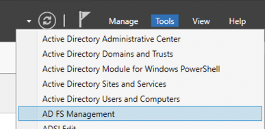{.thumbnail}

Klicken Sie auf `Relying Party Trusts`{.action}.

{.thumbnail}

Klicken Sie dann auf `Add Relying Party Trust...`{.action}.

{.thumbnail}

Wählen Sie `Claims aware`{.action} aus und bestätigen Sie mit dem `Start`{.action} Button.

{.thumbnail}

Sie können die Informationen über die Relying Party manuell eingeben oder aus einer Metadatendatei importieren.

#### OVHcloud SP Metadaten importieren

Sie erhalten die passende Metadatendatei über folgende Links:

- [Metadaten der EU-Region](https://www.ovh.com/auth/sso/saml/sp/metadata.xml)
- [Metadaten der CA-Region](https://ca.ovh.com/auth/sso/saml/sp/metadata.xml)

Wählen Sie `Import data about the relying party from a file`{.action} und dann Ihre Metadatendatei aus.

Klicken Sie anschließend auf den Button `Next`{.action}.

{.thumbnail}

Geben Sie einen Anzeigenamen für die Relying Party ein und klicken Sie auf den Button `Next`{.action}.

{.thumbnail}

Klicken Sie im `Next`{.action} im Fenster der Zugriffskontrolle.

{.thumbnail}

Klicken Sie erneut auf `Next`{.action}, um fortzufahren.

{.thumbnail}

Klicken Sie im letzten Fenster auf den Button `Close`{.action}. Die Genehmigung von OVHcloud als Relying Party wird nun zu Ihrem AD FS hinzugefügt.

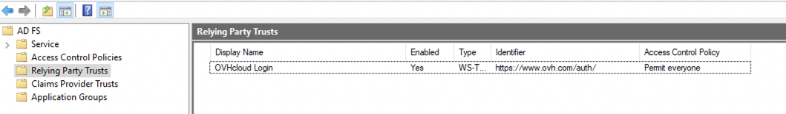{.thumbnail}

> [!primary]
>
> Mit OVHcloud als hinzugefügter Relying Party sollten Sie sich bereits über eine SSO-Verbindung einloggen können. Alle Informationen zur Identität des Benutzers (als SAML "*assertion*") sind jedoch nicht verfügbar, bis Sie eine Policy konfigurieren, um die Active Directory LDAP Eigenschaften Attributen der SAML *Assertion* in Einklang zu bringen.
>

#### Zuordnung derLDAP Attribute zu den SAML Attributen

Klicken Sie auf den Eintrag für OVHcloud im Bereich "Relying Party Trusts".

{.thumbnail}

Klicken Sie anschließend auf `Edit Claim Issuance Policy ...`{.action}.

{.thumbnail}

Klicken Sie auf den Button `Add Rule...`{.action}.

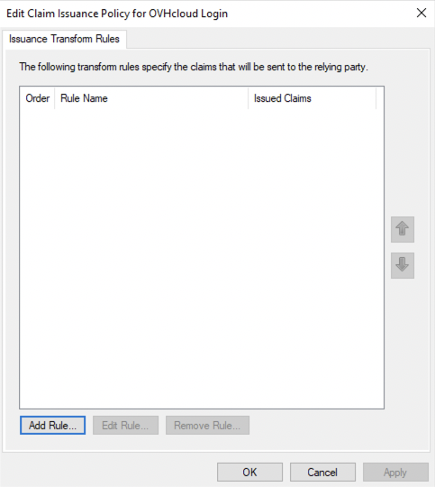{.thumbnail}

Klicken Sie auf `Next`{.action}.

Geben Sie einen Regelnamen ein und definieren Sie Ihre Entsprechungstabelle.

Wählen Sie `Active Directory` als `Attribute Store` aus.

> [!primary]
>
> Folgende Einstellungen können frei konfiguriert werden, damit der Service Provider die Daten des LDAP Active Directory korrekt interpretieren kann. Als Beispiel können Sie das unten stehende Bild verwenden.

Wenn Sie fertig sind, klicken Sie auf den Button `Finish`{.action}.

{.thumbnail}

{.thumbnail}

Klicken Sie auf den Button `Apply`{.action} und bestätigen Sie mit `OK`{.action}.

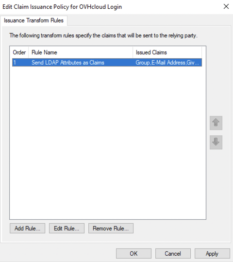{.thumbnail}

Wenn die Entsprechungstabelle vollständig ist, vertraut Ihr AD FS nun OVHcloud als Service Provider. Stellen Sie im nächsten Schritt sicher, dass der OVHcloud Account Ihrem AD FS als Identity Provider vertraut.

### Das Vertrauen zum OVHcloud Account und die Verbindung konfigurieren

Das Hinzufügen Ihrer AD FS als vertrauenswürdiger Identity Provider erfolgt im [OVHcloud Kundencenter](https://www.ovh.com/auth/?action=gotomanager&from=https://www.ovh.de/&ovhSubsidiary=de), in dem Sie die Metadaten des Identity Providers hinterlegen können.

Loggen Sie sich ein und klicken Sie oben rechts auf Ihren Account-Namen.

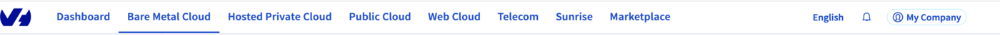{.thumbnail}

Klicken Sie auf die Initialen, um auf die Verwaltungsseite Ihres Accounts zuzugreifen.

{.thumbnail}

Öffnen Sie den Tab `Verwaltung der Nutzer`{.action}.

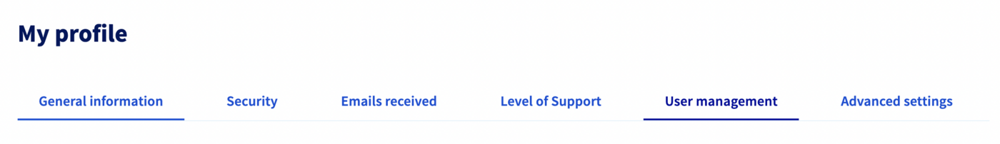{.thumbnail}

Klicken Sie auf den Button `SSO-Verbindung`{.action}.

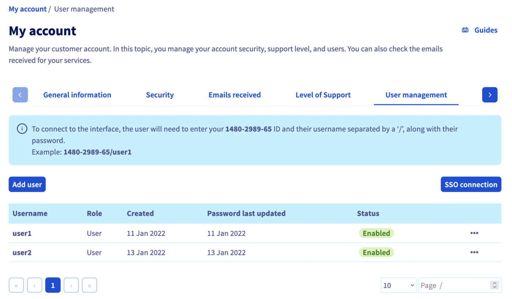{.thumbnail}

Geben Sie die XML-Metadaten Ihres AD FS ein. In diesem Fall ist das `Name des Gruppenattributs` optional. Klicken Sie auf `Bestätigen`{.action}.

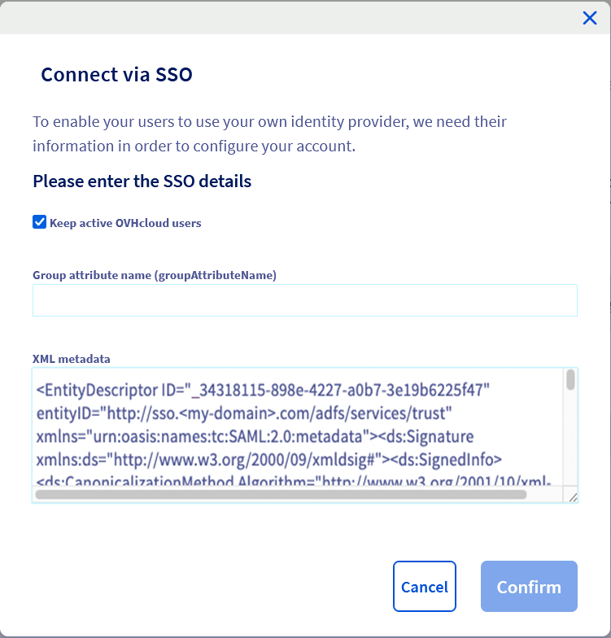{.thumbnail}

Sie sollten nun Ihren AD FS als Identity Provider sowie die Standardgruppen sehen können.

{.thumbnail}

Für weitere Informationen klicken Sie auf den Link unter der `URL des SSO Dienstes`.

{.thumbnail}

{.thumbnail}

Mit dem Button `...`{.action} können Sie den SSO aktualisieren oder löschen und die Details einsehen.

{.thumbnail}

Ihr AD FS gilt nun als vertrauenswürdiger Identity Provider. Dennoch müssen im OVHcloud Account Gruppen hinzugefügt werden.

> [!warning]
> Wenn Sie sich in diesem Schritt über SSO verbinden, wird wahrscheinlich eine Fehlermeldung `Not in valid groups` angezeigt.
>
> Ihr OVHcloud Account überprüft, ob der authentifizierende Benutzer zu einer bestehenden Gruppe auf dem Account gehört.
>

Überprüfen Sie hierzu, welche Informationen dem von AD FS zurückgegebenen Attribut "Group" entsprechen.

Verwenden Sie zur Verdeutlichung das folgende Beispiel des Benutzers "John Doe" eines Active Directory, wie im Bild dargestellt.

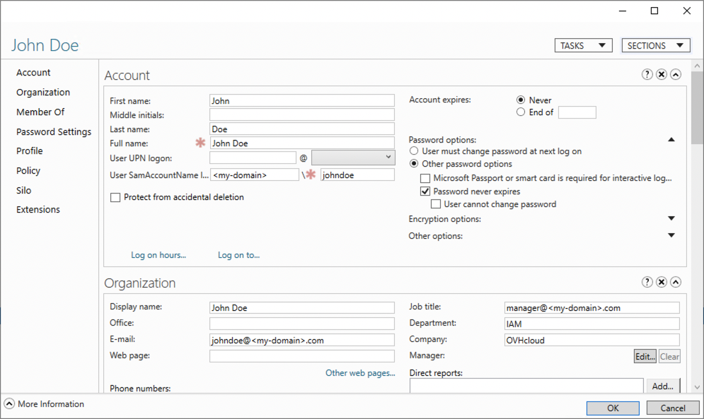{.thumbnail}

Überprüfen Sie die Entsprechungstabelle in AD FS:

{.thumbnail}

In diesem Beispiel ist das Attribut "Gruppe", das von Active Directory für den Benutzer "John Doe" zurückgegeben wird: "title". Dies entspricht dem "job title", dessen Wert `manager@<my-domain>.com` ist.

Sie können dies auch in der SAML *Assertion* überprüfen:

```xml
<AttributeStatement>
    <Attribute Name="http://schemas.xmlsoap.org/claims/Group">
        <AttributeValue>manager@<my-domain>.com</AttributeValue>
    </Attribute>
    ...
</AttributeStatement>
```

Das bedeutet, dass Sie die Gruppe `manager@<my-domain>.com` zu Ihrem OVHcloud Account hinzufügen müssen und damit einer Rolle zuweisen. Andernfalls kann Ihr OVHcloud Account nicht feststellen, welche Rechte der Benutzer hat.

Fügen Sie diese hinzu, indem Sie auf den Button `Gruppe deklarieren`{.action} klicken und die Felder ausfüllen:

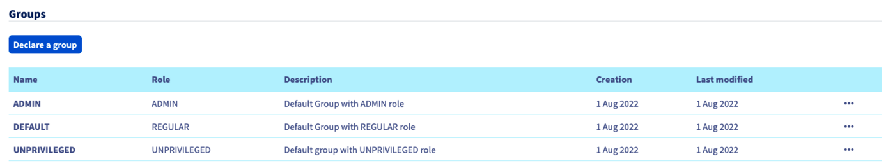{.thumbnail}

{.thumbnail}

Anschließend können Sie überprüfen, ob die Gruppe zu Ihrem OVHcloud Account im Bereich `Gruppen` hinzugefügt wurde:

{.thumbnail}

Wenn Sie sich später mit dem Active Directory Benutzer "John Doe" verbinden, erkennt Ihr OVHcloud Account, dass der Benutzer die von seiner Gruppe definierte Rolle "REGULAR" hat.

Anschließend können Sie sich von Ihrem Account ausloggen und sich mit Ihrem AD FS als Identity Provider neu verbinden.

### Verbindung via SSO

Geben Sie auf der [OVHcloud Login-Seite](https://www.ovh.com/auth/?action=gotomanager&from=https://www.ovh.de/&ovhSubsidiary=de) Ihre [Kundenkennung](/pages/account_and_service_management/account_information/ovhcloud-account-creation#was-ist-meine-kundenkennung) ein, gefolgt von **/idp***. Klicken Sie ohne ein Passwort einzugeben auf `Login`{.action}.

{.thumbnail}

Sie werden dann auf die Loginseite Ihres AD FS weitergeleitet. Geben Sie Login und Passwort eines Benutzers Ihres Active Directory LDAP ein und klicken Sie dann auf den Button `Sign in`{.action} .

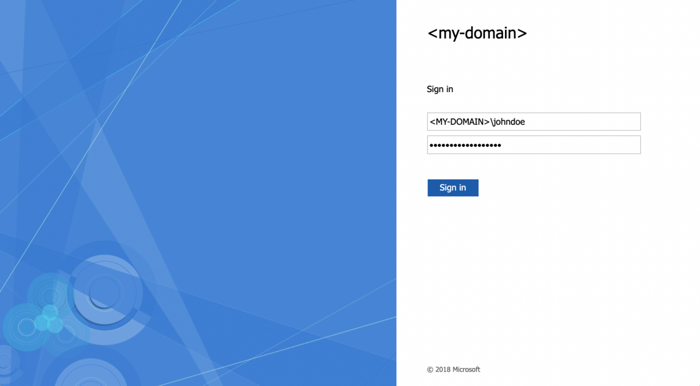{.thumbnail}

Sie sind nun mit derselben Kundenkennung eingeloggt, jedoch über AD FS SSO und mit Ihrem Active Directory Benutzer.

{.thumbnail}

## Weiterführende Informationen

[OVHcloud Kunden-Account erstellen](/pages/account_and_service_management/account_information/ovhcloud-account-creation)

[OVHcloud Kunden-Account absichern und persönliche Informationen verwalten](/pages/account_and_service_management/account_information/all_about_username)

[Das Passwort Ihres Kunden-Accounts anlegen und verwalten ](/pages/account_and_service_management/account_information/manage-ovh-password)

[Den OVHcloud Kunden-Account mit der Zwei-Faktor-Authentifizierung absichern](/pages/account_and_service_management/account_information/secure-ovhcloud-account-with-2fa)

Für den Austausch mit unserer User Community gehen Sie auf <https://community.ovh.com/en/>.
