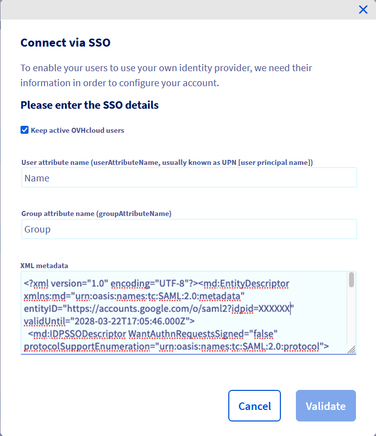

**Dernière mise à jour le 01/06/2023**

## Objectif

Vous pouvez utiliser l'authentification SSO (*Single Sign-On*) pour vous connecter à votre compte OVHcloud. Pour activer ces connexions, votre compte OVHcloud et vos comptes Google Workspace doivent être configurés à l'aide des authentifications SAML (*Security Assertion Markup Language*).

**Ce guide vous explique comment associer votre compte OVHcloud à un service Google Workspace externe.**

## Prérequis

- Être administrateur d'un service Google Workspace
- Disposer d'un [compte OVHcloud](/pages/account_and_service_management/account_information/ovhcloud-account-creation)
- Être connecté à votre [espace client OVHcloud](https://www.ovh.com/auth/?action=gotomanager&from=https://www.ovh.com/fr/&ovhSubsidiary=fr)

## En pratique

> [!primary]
>
> Afin qu’un prestataire de services (c'est à dire votre compte OVHcloud) puisse établir une connexion SSO avec un fournisseur d’identité (c'est à dire votre service Google Workspace), l’essentiel est d’établir une relation de confiance mutuelle en enregistrant la connexion SSO dans les deux services.
>

### Enregistrer OVHcloud sur Google Workspace

Votre Google Workspace agit en tant que fournisseur d'identité. Les demandes d'authentification de votre compte OVHcloud ne seront acceptées que si vous l'avez d'abord déclaré comme organisme tiers de confiance.

Cela signifie qu'il doit être ajouté en tant que `Web and mobile apps`.

Connectez vous sur l'interface d'administration de [Google Workspace](https://admin.google.com) avec votre compte administrateur.

Rendez vous dans `Apps`{.action} puis `Web and mobile apps`{.action}.

{.thumbnail}

Cliquez sur `Add app`{.action} puis sur `Add custom SAML app`{.action}.

Dans l'étape  « App details », ajoutez un nom pour cette interconnexion. Si vous n'avez pas d'inspiration, **OVHcloud** est un nom qui convient. Cliquez sur `Continue`{.action}.

{.thumbnail}

Dans l'étape « Google Identity Provider details », téléchargez le fichier de métadonnées en cliquant sur `Download metadata`{.action} puis cliquez sur `Continue`{.action}.

{.thumbnail}

Dans l'étape « Service provider details », complétez les champs `ACS URL` et `Entity ID` avec les valeurs de votre région : 

 - Region EU : **ACS URL** : `https://www.ovhcloud.com/eu/auth/saml/acs` et **Entity ID** : `https://www.ovhcloud.com/eu/auth/`
 - Region CA : **ACS URL** : `https://www.ovhcloud.com/ca/auth/saml/acs` et **Entity ID** : `https://www.ovhcloud.com/ca/auth/`

Cliquez sur `Continue`{.action}.

{.thumbnail}

Dans l'étape « Attribute mapping », ajoutez le mapping suivant :

 - **First Name** : Name
 - **Last Name** : Surname
 - **Primary email** : E-Mail Address

Cliquez sur `Finish`{.action}.

{.thumbnail}

Activez l'accès à cette application en cliquant sur `OFF for everyone`{.action} dans la rubrique « User Access ». Cliquez sur `ON for everyone`{.action} puis sur le bouton `SAVE`{.action}

{.thumbnail}

{.thumbnail}

> [!primary]
>
> L'ajout d'accès d'une application à des utilisateurs peut prendre plusieurs heures avant d'être effectif.
>

Votre service Google Workspace fait désormais confiance à OVHcloud en tant que fournisseur de services. L'étape suivante consiste à vous assurer que le compte OVHcloud fait confiance à votre Google Workspace en tant que fournisseur d'identité.

### Établir la confiance du compte OVHcloud et configurer la connexion

L'ajout de votre Google workspace en tant que fournisseur d'identité de confiance s'effectue dans [l'espace client OVHcloud](https://www.ovh.com/auth/?action=gotomanager&from=https://www.ovh.com/fr/&ovhSubsidiary=fr) où vous pouvez fournir les métadonnées du fournisseur d'identité.

[Connectez-vous](https://www.ovh.com/auth/?action=gotomanager&from=https://www.ovh.com/fr/&ovhSubsidiary=fr) et cliquez sur votre profil en haut à droite.

{.thumbnail}

Cliquez sur votre nom pour accéder à la page de gestion de votre profil.

{.thumbnail}

Ouvrez l'onglet `Gestion des utilisateurs`{.action}.

{.thumbnail}

Cliquez sur le bouton `Connexion SSO`{.action}.

{.thumbnail}

Renseignez les métadonnées XML de votre service Google Workspace. Complétez le champ « Nom d'attribut de groupe » avec la valeur `Group`. Cliquez sur `Confirmer`{.action}.

{.thumbnail}

Vous devez maintenant retrouver votre Google Workspace en tant que fournisseur d'identité, ainsi que les groupes par défaut.

{.thumbnail}

Pour plus d'informations, cliquez sur le lien situé sous « URL du service SSO ».

{.thumbnail}

Le bouton `...`{.action} permet de mettre à jour ou de supprimer le SSO, et d’en consulter les détails.

{.thumbnail}

Votre Google Workspace est maintenant considéré comme fournisseur d'identité de confiance. Cependant, vous devez tout de même ajouter des groupes à votre compte OVHcloud.

> [!warning]
> Si vous essayez à ce stade de vous connecter via SSO, un message d'erreur `Not in valid groups` s'affichera probablement.
>
> En effet, votre compte OVHcloud vérifie si l'utilisateur s'authentifiant appartient à un groupe existant sur le compte.
>

Pour cela, vous devez autoriser les groupes qui seront transmis de Google Workspace vers OVHcloud. Ces groupes sont les mêmes que ceux utilisés pour catégoriser vos utilisateurs.

Pour cela, connectez vous sur l'interface d'administration de [Google Workspace](https://admin.google.com) avec votre compte administrateur

Rendez vous dans `Apps`{.action} puis `Web and mobile apps`{.action}.

{.thumbnail}

Cliquez sur la ligne de l'application que vous avez ajoutée précédemment.

{.thumbnail}

Cliquez sur `SAML attribute mapping`{.action} pour éditer le mapping des informations partagées entre Google Workspace et OVHcloud.

{.thumbnail}

Dans la catégorie « Group membership (optional) », ajoutez tous les groupes que vous souhaitez autoriser à se connecter sur OVHcloud. Dans le champ « App attribute », indiquez `Group`.

Vous devez ensuite attribuer des **rôles** à ces groupes d'utilisateurs chez OVHcloud. Dans le cas contraire, votre compte OVHcloud ne sait pas ce que l'utilisateur est autorisé à faire et, par défaut, aucun droit n'est attribué.

{.thumbnail}

Depuis votre espace client OVHcloud, ajoutez un groupe en cliquant sur le bouton `Déclarer un groupe`{.action} et en remplissant les champs :

 - **Nom de groupe** : nom du groupe au sein de Google Workspace
 - **Privilège** : niveau de droit accordé à ce groupe

{.thumbnail}

{.thumbnail}

Vous pourrez ensuite vérifier que le groupe est ajouté à votre compte OVHcloud dans la section « Groupes » :

{.thumbnail}

Lorsque vous vous connecterez par la suite avec un utilisateur du group **Intern**, votre compte OVHcloud reconnaîtra que l'utilisateur a le rôle « UNPRIVILEGED » spécifié par son groupe.

Vous pourrez ensuite vous déconnecter de votre compte et vous reconnecter avec votre Google Workspace en tant que fournisseur d'identité.

### Connexion via SSO

Sur [la page d'identification OVHcloud](https://www.ovh.com/auth/?action=gotomanager&from=https://www.ovh.com/fr/&ovhSubsidiary=fr), renseignez votre [identifiant](/pages/account_and_service_management/account_information/ovhcloud-account-creation#quel-est-mon-identifiant-client) suivi de **/idp** sans mot de passe et cliquez sur le bouton `Login`{.action} .

{.thumbnail}

Vous êtes ensuite redirigé vers votre page de connexion Google Workspace. Entrez un login/password d'un utilisateur de votre Google Workspace, puis cliquez sur le bouton `Sign in`{.action} .

{.thumbnail}

Vous êtes maintenant connecté avec le même identifiant client, mais via votre utilisateur Google Workspace.

{.thumbnail}

## Aller plus loin

[Créer un compte OVHcloud](/pages/account_and_service_management/account_information/ovhcloud-account-creation)

[Sécuriser mon compte OVHcloud et gérer mes informations personnelles](/pages/account_and_service_management/account_information/all_about_username)

[Définition et gestion du mot de passe de votre compte](/pages/account_and_service_management/account_information/manage-ovh-password)

[Sécuriser son compte OVHcloud avec la double authentification](/pages/account_and_service_management/account_information/secure-ovhcloud-account-with-2fa)

Échangez avec notre communauté d'utilisateurs sur <https://community.ovh.com/>.
