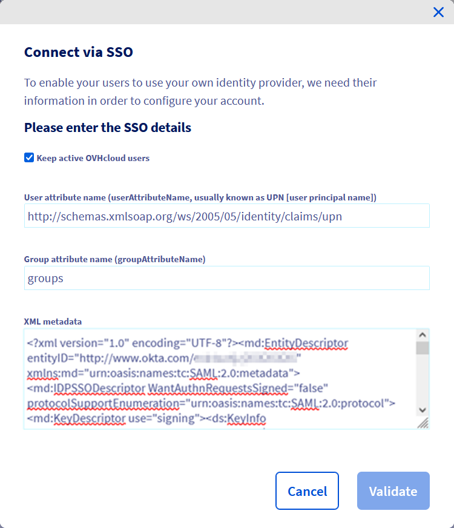

## Wprowadzenie

Możesz użyć uwierzytelnienia SSO (*Single Sign-On*), aby zalogować się do Twojego konta OVHcloud. Aby aktywować te połączenia, Twoje konto oraz konta Okta muszą być skonfigurowane przez SAML (*Security Assertion Markup Language*).

**Niniejszy przewodnik wyjaśnia, jak powiązać Twoje konto OVHcloud z zewnętrzną usługą Okta.**

## Wymagania początkowe

- Posiadanie statusu administratora usługi Okta
- Posiadanie [konta OVHcloud](/pages/account_and_service_management/account_information/ovhcloud-account-creation)
- Dostęp do [Panelu klienta OVHcloud](https://www.ovh.com/auth/?action=gotomanager&from=https://www.ovh.pl/&ovhSubsidiary=pl)

## W praktyce

> [!primary]
>
> Aby usługodawca (na przykład Twoje konto OVHcloud) nawiązał połączenie SSO z dostawcą tożsamości (na przykład z usługą Okta), należy przede wszystkim nawiązać relację zaufania, rejestrując połączenie SSO w obu usługach.
>

### Zarejestruj OVHcloud w Okta

Twoja usługa Okta działa jako dostawca tożsamości. Zlecenia uwierzytelnienia Twojego konta OVHcloud zostaną przyjęte tylko wtedy, gdy wcześniej zadeklarowałeś je jako zaufaną organizację trzecią.

Oznacza to, że musi zostać dodany jako `Applications`.

Zaloguj się do interfejsu administracyjnego Okta za pomocą konta administratora.

Przejdź do `Applications`{.action}, a następnie ponownie do `Applications`{.action}.

{.thumbnail}

Kliknij `Create App Integration`{.action} i wybierz `SAML 2.0`{.action}.

{.thumbnail}

W etapie "General Settings" dodasz nazwę dla tej aplikacji, na przykład **OVHcloud** i logo, jeśli chcesz. Kliknij `Next`{.action}.

{.thumbnail}

Na etapie "Configure SAML" uzupełnij pola `Single sign-on URL` i `Audience URI` wartościami Twojego regionu: 

- Region UE: **Single sign-on URL**: `https://www.ovhcloud.com/eu/auth/saml/acs` i **URI**: `https://www.ovhcloud.com/eu/auth/`
- Region CA: **Single sign-on URL**: `https://www.ovhcloud.com/ca/auth/saml/acs` i **URI**: `https://www.ovhcloud.com/ca/auth/`

{.thumbnail}

Następnie zdefiniuj `Attribute Statements`:

- **Name**: `http://schemas.xmlsoap.org/ws/2005/05/identity/claims/upn` i **Value**: `user.login`
- **Name**: `http://schemas.xmlsoap.org/ws/2005/05/identity/claims/emailaddress` i **Value**: `user.email`
- **Name**: `http://schemas.xmlsoap.org/ws/2005/05/identity/claims/name` i **Value**: `user.displayName`

Zdefiniuj `Group Attribute Statements`:

- **Name**: `groups` i **Filter**: `Matches regex:.*` (Dostosuj filtr, jeśli chcesz być bardziej precyzyjny)

Kliknij `Next`{.action}.

{.thumbnail}

Na etapie "Feedback" wybierz opcję z funkcji i kliknij `Finish`{.action}.

Następnie otwórz aplikację, przejdź do zakładki `Assignments`{.action} i przypisz do aplikacji użytkowników lub grupy.

{.thumbnail}

Przed przejściem do następnej sekcji przejdź do zakładki `Sign On`{.action}, przejdź do **Metadata URL** i zapisz dostarczony plik XML.

{.thumbnail}

Twoja usługa Okta jest od tej pory zaufana w OVHcloud jako dostawca usług. Następnym krokiem jest upewnienie się, że konto OVHcloud zaufa Twojej Okta jako dostawcy tożsamości.

### Zapisz Okta na koncie OVHcloud i skonfiguruj połączenie

Aby dodać Okta jako zaufanego dostawcę tożsamości, należy dostarczyć metadane dostawcy tożsamości w [Panelu klienta OVHcloud](https://www.ovh.com/auth/?action=gotomanager&from=https://www.ovh.pl/&ovhSubsidiary=pl).

Po zalogowaniu kliknij Twój profil w prawym górnym rogu.

{.thumbnail}

Kliknij Twoją nazwę, aby przejść do strony zarządzania profilem.

{.thumbnail}

Otwórz zakładkę `Zarządzanie użytkownikami`{.action}.

{.thumbnail}

Kliknij przycisk `Logowanie SSO`{.action}.

{.thumbnail}

Wpisz metadane XML usługi Okta. Uzupełnij pole "Nazwa atrybutu grupy" wartością `groups`. Kliknij na `Zatwierdź`{.action}.

{.thumbnail}

Teraz możesz odnaleźć Okta jako dostawcę tożsamości, a także grupy domyślne.

{.thumbnail}

Aby uzyskać więcej informacji, kliknij link pod "URL usługi SSO".

{.thumbnail}

Przycisk `...`{.action} pozwala na aktualizację lub usunięcie certyfikatu SSO i na zapoznanie się z jego szczegółami.

{.thumbnail}

Twoja usługa Okta jest teraz uważana za zaufanego dostawcę tożsamości. Jednocześnie należy dodać grupy do konta OVHcloud.

> [!warning]
> Jeśli spróbujesz zalogować się przez SSO, prawdopodobnie wyświetli się komunikat błędu `Not in valid groups`.
>
> Twoje konto OVHcloud sprawdza, czy użytkownik loguje się do grupy istniejącej na koncie.
>

Należy teraz przypisać **roles** grupom użytkowników Okta w OVHcloud. W przeciwnym razie Twoje konto OVHcloud nie wie, co użytkownik może zrobić i domyślnie nie przyznaje mu żadnych uprawnień.

W Panelu klienta dodaj grupę klikając przycisk `Zgłoś grupę`{.action} i wypełniając pola:

- **Group name**: Nazwa grupy w Okta
- **Role**: Poziom praw przyznanych tej grupie

{.thumbnail}

{.thumbnail}

Następnie możesz sprawdzić, czy grupa została dodana do Twojego konta OVHcloud w sekcji "Grupy":

{.thumbnail}

Po zalogowaniu się później z użytkownikiem grupy **Intern** Twoje konto OVHcloud potwierdzi, że użytkownik ma rolę "UNPRIVILEGED" określoną przez jego grupę.

Następnie będziesz mógł wylogować się z konta i ponownie zalogować się do Okta jako dostawcy danych.

### Logowanie przez SSO

Na [stronie logowania OVHcloud](https://www.ovh.com/auth/?action=gotomanager&from=https://www.ovh.pl/&ovhSubsidiary=pl) wpisz swój [identyfikator](/pages/account_and_service_management/account_information/ovhcloud-account-creation#jaki-jest-moj-identyfikator-klienta), po którym następuje **/idp** bez hasła i kliknij przycisk `Logowanie`{.action}.

{.thumbnail}

Zostaniesz przekierowany na stronę logowania do Okta. Wprowadź identyfikator i hasło użytkownika Okta, następnie kliknij przycisk `Sign in`{.action}.

{.thumbnail}

Teraz jesteś zalogowany tym samym identyfikatorem klienta, ale za pomocą użytkownika Okta.

{.thumbnail}

## Sprawdź również

[Utworzenie konta OVHcloud](/pages/account_and_service_management/account_information/ovhcloud-account-creation)

[Zabezpieczenie konta OVHcloud i zarządzanie danymi osobowymi](/pages/account_and_service_management/account_information/all_about_username)

[Konfiguracja i zarządzanie hasłem do konta](/pages/account_and_service_management/account_information/manage-ovh-password)

[Zabezpieczenie konta OVHcloud za pomocą weryfikacji dwuetapowej](/pages/account_and_service_management/account_information/secure-ovhcloud-account-with-2fa)

Przyłącz się do społeczności naszych użytkowników na stronie <https://community.ovh.com/en/>.