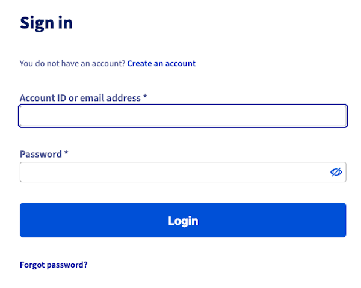
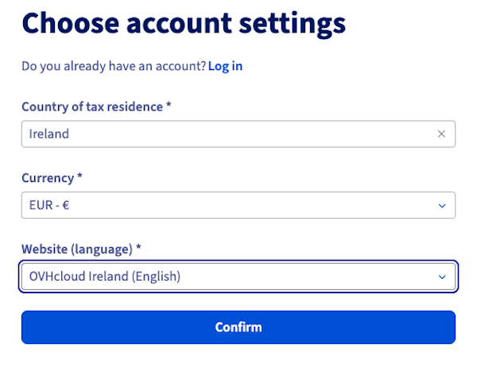
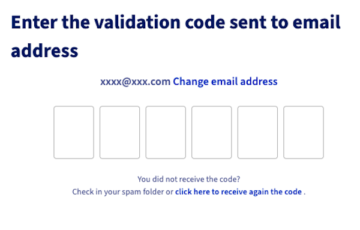
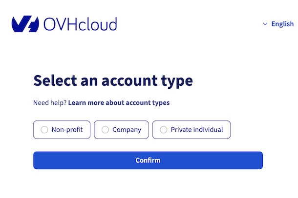

## Objetivo

Para utilizar os serviços da OVHcloud, primeiro deve criar a sua conta.
A criação de uma conta pode ser realizada antes ou durante a encomenda do seu primeiro serviço OVHcloud.

**Saiba como criar uma conta OVHcloud.**

## Requisitos

- Dispor de um endereço de e-mail válido e acessível

## Instruções

### Como criar a minha conta OVHcloud?

Para criar uma conta OVHcloud, vá a [esta página](/links/manager) e clique em `Criar uma conta`{.action}.

{.thumbnail}

Indique o seu país de residência fiscal, especifique a sua moeda e o idioma pretendido para gerir os seus serviços na Área de Cliente OVHcloud. A seguir, clique em `Validar`{.action}.

{.thumbnail}

De seguida, introduza o seu endereço de e-mail e crie uma palavra-passe de acesso à conta OVHcloud.

|Informações|Descrição|
|---|---|
|Endereço de e-mail|Introduza um endereço de e-mail **válido e ao qual tem acesso**.  Não utilize um endereço de e-mail associado a um domínio gerido pela Área de Cliente. Se este domínio for interrompido, já não receberá as nossas notificações.|
|Palavra-passe|A sua palavra-passe deve ser única (criada e utilizada apenas para a sua conta OVHcloud) e suficientemente complexa.  Para criar uma palavra-passe eficaz, consulte os conselhos do [nosso guia sobre a gestão da palavra-passe](/pages/account_and_service_management/account_information/manage-ovh-password#instrucoes).|

Depois de preencher o primeiro formulário, ser-lhe-á enviado um código de utilização única para o endereço de e-mail que introduziu. Este código permitirá validar o seu endereço de e-mail. Introduza-o nas casas previstas para esse efeito.

{.thumbnail}

> [!primary]
> Se não recebeu o e-mail com o código, verifique as pastas "spam"/"correio indesejável" do seu endereço de e-mail.
>
> Pode ativar o envio de um novo código ao clicar no link previsto para o efeito na parte inferior desta página.
>
> Se o endereço de e-mail que introduziu não for válido ou não estiver disponível, clique no botão `Alterar o endereço de e-mail`{.action}.
>

Uma vez o código introduzido e validado, deve definir o **tipo de conta** entre as escolhas propostas:

- **Associação**: A conta "Associação" deve ser criada apenas por associações e outras organizações sem fins lucrativos, como fundações, sindicatos profissionais ou congregações religiosas.
- **Administração pública**: A conta "Administração pública" deve ser criada apenas por organismos públicos.
- **Empresa**: A conta "Empresa" deve ser criada por todas as pessoas coletivas (exceto administração pública e associações) e por todas as pessoas singulares (empresários individuais) que adquiram produtos da OVHcloud no âmbito da sua atividade profissional.
- **Particular**: A conta "Particular" deve ser criada apenas pelas pessoas singulares que adquiram produtos da OVHcloud para as suas necessidades privadas, fora do âmbito de uma atividade profissional.

{.thumbnail}

De seguida, ser-lhe-á pedido que indique os seus dados. Verifique se as informações introduzidas estão corretas.

Após a criação da conta, será automaticamente direcionado para a página inicial, denominada "painel de controlo", da sua conta.

### Qual é o meu identificador de cliente? 

Cada conta de cliente da OVHcloud está associada a um identificador único, também chamado *NIC-handle*.

Costuma ser composto por duas letras iniciais, seguidas de algarismos, e termina com «-ovh». Por exemplo: **aa00000-ovh**. 
Para a maioria das contas fora da Europa, é frequentemente substituído pelo endereço de e-mail principal indicado na conta OVHcloud.

Este identificador de cliente permite-lhe:

- efetuar encomendas em linha;
- ligar-se à Área de Cliente para gerir o conjunto dos seus serviços;
- identificar-se quando contacta o suporte da OVHcloud, facilitando assim o tratamento das suas questões.

> [!success]
> Tome nota do seu identificador de utilizador, pois precisará dele para cada ligação à sua conta.
>
> **Dica: Use um gerenciador de palavras-passe**
>
> Programas específicos permitem guardar e proteger os seus identificadores de acesso (identificador e palavra-passe) à conta OVHcloud. 
> Pode, por exemplo, utilizar o gestor de palavras-passe **KeePass**. Trata-se de um programa livre e gratuito. 
> O princípio é simples: uma palavra-passe principal – que deve ser suficientemente complexa, mas que tem de memorizar – permite aceder a uma base de dados que reúne todas as suas ID de utilizador e palavras-passe. Estas podem ser muito complexas porque o programa consegue lembrar-se delas. 
> Este programa permite também gerar palavras-passe complexas aleatórias que irá memorizar para cada um dos seus sites ou aplicações.

## Saiba mais

Agora que a sua conta OVHcloud foi criada, recomendamos que siga as nossas [recomendações sobre a segurança da sua conta e a gestão dos seus dados pessoais](/pages/account_and_service_management/account_information/all_about_username).

Consulte também os nossos guias para:

[Aceder à Área de Cliente OVHcloud](/pages/account_and_service_management/account_information/ovhcloud-account-login)

[Alterar a palavra-passe da sua conta OVHcloud](/pages/account_and_service_management/account_information/manage-ovh-password)

[Proteger a sua conta OVHcloud com a dupla autenticação](/pages/account_and_service_management/account_information/secure-ovhcloud-account-with-2fa)

Fale com nossa [comunidade de utilizadores](/links/community).