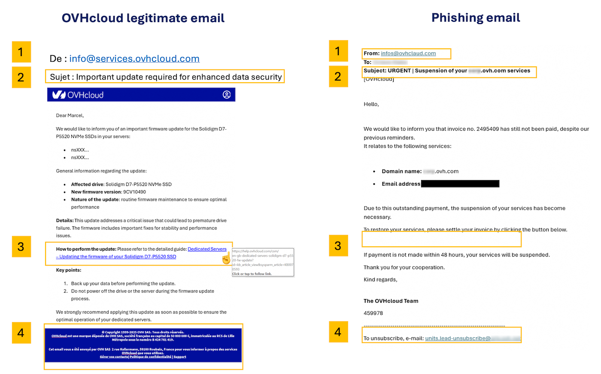

## Ziel

Phishing ist eine betrügerische Methode, mit der Internetnutzer dazu verleitet werden sollen, persönliche Daten (Zugangsdaten, Passwörter etc.) und/oder Bankdaten preiszugeben, indem ein vertrauenswürdiger Dritter oder eine vertrauenswürdige Website vorgetäuscht wird. 
In der Praxis geschieht dies häufig durch das Versenden einer E-Mail, in der Sie aufgefordert werden, auf einen Link zu klicken. Dieser Link leitet Sie zu einem Formular weiter, das in betrügerischer Absicht die Farben einer Marke nachahmt und Sie auffordert, Ihre persönlichen Daten einzugeben.

**Diese Anleitung erklärt, wie Sie eine Phishing-E-Mail erkennen und was zu tun ist, wenn Sie auf einen betrügerischen Link geklickt haben.**

<iframe class="video" width="560" height="315" src="https://www.youtube-nocookie.com/embed/RED6EuCLFjk?si=9ppewOVm_bXymThM" title="YouTube video player" frameborder="0" allow="accelerometer; autoplay; clipboard-write; encrypted-media; gyroscope; picture-in-picture; web-share" referrerpolicy="strict-origin-when-cross-origin" allowfullscreen></iframe>

## In der praktischen Anwendung

### Ich habe eine E-Mail oder SMS im Namen von OVHcloud erhalten. Wie erkenne ich, ob sie legitim ist?

#### Erkennen einer Phishing-E-Mail

Prüfen Sie zunächst, ob die empfangene E-Mail auch auf der Seite [Meine Kommunikation](/links/control-panel/account-messages) in Ihrem OVHcloud Kundencenter sichtbar ist. Dort finden Sie Kopien aller offiziellen E-Mails, die von OVHcloud gesendet wurden.

Hier finden Sie einige Tipps, um eine echte OVHcloud E-Mail visuell von einem Phishing-Versuch zu unterscheiden.

Klicken Sie auf das Bild, um es zu vergrößern. Die Details und Erklärungen finden Sie in der nachfolgenden Tabelle.

{.thumbnail}

> [!primary]
>
> Die Zahlen in der Tabelle entsprechen denen im obigen Bild.

|Nummer - Beschreibung|Legitime OVHcloud E-Mail|Betrügerische Phishing-E-Mail|
|---|---|---|
|1 - Absender|Stellen Sie sicher, dass die E-Mail von einer Adresse gesendet wird, die mit einem Domainnamen (oder einer Subdomain, z. B. `events.ovhcloud.com`) endet, der zu OVHcloud gehört (siehe nachfolgende Liste).|Der E-Mail-Absender ist sehr wahrscheinlich eine Adresse, die nicht von OVHcloud stammt.|
|2 - Betreff|Stellen Sie sicher, dass Ihre OVHcloud Kundenkennung (NIC Handle) **(die normalerweise mit den Initialen der Person beginnt, die den OVHcloud Account erstellt hat)** und/oder Ihre Account-E-Mail-Adresse im Betreff der Nachricht erscheinen.|Häufig ist die E-Mail als \[SPAM] markiert und **Ihre Kundenkennung wird nicht angezeigt oder ist falsch**.|
|3 - Link|**Klicken Sie nicht darauf, sondern bewegen Sie den Mauszeiger über den Link oder die Schaltfläche**, und Sie sehen direkt das Ziel (unten oder am unteren Rand Ihres Browsers). In unserem Beispiel zeigt der Link korrekt auf eine Adresse unter https://www.ovh.com/. Wenn Sie auf einen Link klicken, überprüfen Sie stets die Adresse im Browser. OVHcloud verwendet eine Reihe bekannter Domainnamen, in der Regel ovhcloud.com oder ovh.com (siehe nachfolgende Listen für legitime Domains und Tipps zur Überprüfung verdächtiger Links).|In einer Phishing-E-Mail stammt der Link nicht von einer offiziellen OVHcloud Seite. **Klicken Sie nicht darauf.**|
|4 - E-Mail-Kopf- und Fußzeile|OVHcloud sendet E-Mails in den Formaten TXT und HTML. Die Kopfzeile enthält das OVHcloud Logo, und die Fußzeile enthält rechtliche Informationen zu OVHcloud.|Die Kopf- oder Fußzeile kann Links enthalten, die nichts mit OVHcloud zu tun haben. **Klicken Sie nicht auf diese Links.**|

/// details | **Liste der legitimen OVHcloud Domainnamen** (Zum Anzeigen klicken)

- ovhcloud.com
- ovh.com
- ovh.fr
- services.ovhcloud.com
- news.ovhcloud.com
- clientmanager.fr
- kimsufi.com
- soyoustart.com
- ovh.ca
- ovh.com.au
- ovh.co.uk
- ovh.ie
- ovh.de
- ovh.es
- ovh.it
- ovh.lt
- ovh-hosting.fi
- ovh.net
- ovh.nl
- ovh.pl
- ovh.pt
- ovh.sn
- ovh.us
- robot.ovh.net

E-Mails können auch von echten Subdomains gesendet werden, wie zum Beispiel:

- events.ovhcloud.com
- news.soyoustart.com
- services.kimsufi.com

///

/// details | **Tipps zur Überprüfung eines verdächtigen Links** (Zum Anzeigen klicken)

**Lesen Sie die URL von rechts nach links**

Der tatsächliche Domainname befindet sich direkt vor dem ersten einzelnen `/` in der Adresse. Phishing-URLs setzen häufig Wörter vor die Domain, um sie legitim erscheinen zu lassen:

- `https://www.ovhcloud.com/account/login` — die tatsächliche Domain ist **ovhcloud.com** ✓
- `https://ovhcloud.com.login-secure.xyz/account` — die tatsächliche Domain ist **login-secure.xyz** ✗

Um die tatsächliche Domain zu finden, schauen Sie in die Adressleiste und lesen Sie **vom ersten `/` rückwärts** — die letzten beiden Teile vor diesem Schrägstrich sind die tatsächliche Domain.

**Achten Sie auf ähnlich aussehende Zeichen**

Angreifer tauschen manchmal Buchstaben gegen visuell ähnliche Zeichen aus, um überzeugende Fälschungen zu erstellen:

- `ovhcIoud.com` (großes I statt kleines L)
- `0vhcloud.com` (Null statt Buchstabe O)
- `ovhclould.com` (zusätzlicher Buchstabe)

Wenn etwas nicht ganz richtig aussieht, klicken Sie nicht darauf. Geben Sie stattdessen `ovhcloud.com` manuell in Ihrem Browser ein.

**URL-Verkürzer sind ein Warnsignal**

Kurze Links wie `bit.ly/xxx`, `tinyurl.com/xxx` oder `t.co/xxx` verbergen das tatsächliche Ziel. OVHcloud verwendet **niemals** URL-Verkürzer in offiziellen E-Mails.

**Auf Mobilgeräten: Lang drücken statt mit der Maus zeigen**

Auf einem Smartphone oder Tablet können Sie den Mauszeiger nicht über einen Link bewegen. Drücken Sie stattdessen **lang** (drücken und halten) auf den Link, ohne den Finger anzuheben. Es wird eine Vorschau der vollständigen URL angezeigt. Wenn die Domain unbekannt ist, öffnen Sie den Link nicht.

**Im Zweifelsfall: Rufen Sie die Website direkt auf**

Der sicherste Reflex: **Klicken Sie niemals auf einen Link in einer E-Mail, um auf Ihren Account zuzugreifen**. Öffnen Sie stattdessen Ihren Browser und geben Sie `www.ovhcloud.com` selbst ein, dann melden Sie sich von dort aus an. Wenn OVHcloud tatsächlich eine Aktion von Ihnen erfordert, finden Sie die Benachrichtigung in Ihrem Kundencenter.

///

#### Erkennen einer Phishing-SMS

OVHcloud sendet Ihnen **niemals** einen Link per SMS. Die von uns versendeten SMS-Nachrichten beziehen sich in der Regel auf die [Zwei-Faktor-Authentifizierung in Ihrem OVHcloud Kundencenter](/pages/account_and_service_management/account_information/secure-ovhcloud-account-with-2fa).

Nachfolgend finden Sie 2 Beispiele für SMS-Nachrichten. Die erste ist legitim und entspricht der Zwei-Faktor-Authentifizierung. Die zweite SMS ist betrügerisch.

{.thumbnail}

#### Wie melde ich eine Phishing-E-Mail?

Wenn Sie nach Durchführung der oben beschriebenen Prüfungen sicher sind, dass Sie eine Phishing-E-Mail erhalten haben, die OVHcloud imitiert, können Sie diese melden, indem Sie die E-Mail als Datei (`.eml` oder `.msg`) speichern und als **Anhang** in einer neuen Nachricht an **<fraude@ovh.com>** senden.

Diese Dateiformate bewahren die versteckten technischen Informationen (sogenannte "Header"), die unsere Teams benötigen, um die Quelle des Betrugs zurückzuverfolgen und dagegen vorzugehen.

> [!warning]
>
> **Leiten Sie die Phishing-E-Mail nicht direkt weiter.** Beim Weiterleiten versendet Ihr eigenes Postfach den betrügerischen Inhalt, was dazu führen kann, dass Ihre E-Mail-Adresse als Spam eingestuft wird. Speichern Sie die E-Mail stattdessen als Datei und hängen Sie sie an eine **neue** Nachricht an.

**So speichern Sie eine E-Mail als Datei:**

Klicken Sie auf die Überschrift, die zu der von Ihnen verwendeten E-Mail-Anwendung passt.

**E-Mail-Software (Desktop)**

/// details | **Outlook für Windows**

Es gibt zwei Versionen von Outlook für Windows: **klassisches Outlook** und **neues Outlook**. Um die Versionen zu unterscheiden, geben Sie "Outlook" in die Windows-Suchleiste ein. Die klassische Version zeigt den Zusatz *"(classic)"*, während das neue Outlook keine besondere Kennzeichnung hat.

{.thumbnail .h-500}

**Klassisches Outlook:**

1. Wählen Sie die Phishing-E-Mail in Ihrem Posteingang aus (öffnen Sie sie nicht).
2. Klicken Sie in der Menüleiste auf `Datei`{.action} und dann auf `Speichern unter`{.action}.
3. Wählen Sie im Dropdown-Menü "Dateityp" die Option **Outlook-Nachrichtenformat - Unicode (.msg)**.
4. Wählen Sie einen Speicherort auf Ihrem Computer (z. B. den Desktop) und klicken Sie auf `Speichern`{.action}.

Sie können die E-Mail auch per **Drag-and-Drop** aus Ihrem Posteingang direkt auf Ihren Desktop ziehen. Dadurch wird eine `.msg`-Datei erstellt, die Sie Ihrer Meldung anhängen können.

**Neues Outlook:**

1. Klicken Sie in der Nachrichtenliste mit der **rechten Maustaste** auf die Phishing-E-Mail.
2. Wählen Sie `Speichern unter`{.action} und dann `Als EML speichern`{.action}.
3. Wählen Sie einen Speicherort auf Ihrem Computer und klicken Sie auf `Speichern`{.action}.

///

/// details | **Thunderbird**

1. Klicken Sie mit der rechten Maustaste auf die Phishing-E-Mail in Ihrem Posteingang.
2. Wählen Sie `Speichern unter`{.action}.
3. Die E-Mail wird als `.eml`-Datei gespeichert. Wählen Sie einen Speicherort auf Ihrem Computer und klicken Sie auf `Speichern`{.action}.

///

/// details | **Apple Mail (macOS)**

1. Wählen Sie die Phishing-E-Mail in Ihrem Posteingang aus.
2. Klicken Sie in der Menüleiste auf `Ablage`{.action} > `Sichern unter`{.action}.
3. Wählen Sie das Format **E-Mail-Quelltext**, wählen Sie einen Speicherort auf Ihrem Computer und klicken Sie auf `Sichern`{.action}.

///

**Webmail (Browser)**

/// details | **OWA - Outlook Web Application**

1. Öffnen Sie die Phishing-E-Mail.
2. Klicken Sie auf die **drei horizontalen Punkte** (⋯) oben rechts in der E-Mail.
3. Wählen Sie `Ansicht`{.action} > `Nachrichtenquelle anzeigen`{.action}.
4. Markieren Sie den gesamten Text (`Strg+A` oder `Cmd+A`), kopieren Sie ihn (`Strg+C` oder `Cmd+C`), fügen Sie ihn in einen Texteditor ein (z. B. Notepad oder TextEdit) und speichern Sie die Datei mit der Endung `.eml`.

///

/// details | **Roundcube (OVHcloud Webmail)**

1. Wählen Sie die Phishing-E-Mail in Ihrem Posteingang aus.
2. Klicken Sie in der Symbolleiste auf `Mehr`{.action} (oder das **⋮**-Symbol).
3. Wählen Sie `Download (.eml)`{.action}.
4. Die Datei wird in Ihrem Download-Ordner gespeichert.

///

/// details | **Zimbra (OVHcloud Webmail)**

1. Wählen Sie die Phishing-E-Mail in Ihrem Posteingang aus.
2. Klicken Sie in der Symbolleiste auf `Mehr`{.action}.
3. Wählen Sie `Original anzeigen`{.action}. Der Rohinhalt der E-Mail wird in einem neuen Browser-Tab geöffnet.
4. Verwenden Sie in diesem neuen Tab `Strg+S` (oder `Cmd+S` unter macOS), um die Seite zu speichern. Speichern Sie die Datei mit der Endung `.eml` (wenn Ihr Browser `.txt` vorschlägt, benennen Sie die Datei nach dem Speichern um).

///

/// details | **Gmail**

1. Öffnen Sie die Phishing-E-Mail.
2. Klicken Sie auf die **drei vertikalen Punkte** (⋮) oben rechts in der E-Mail.
3. Wählen Sie `Nachricht herunterladen`{.action}.
4. Eine `.eml`-Datei wird in Ihrem Download-Ordner gespeichert.

///

Sobald Sie die Datei gespeichert haben, erstellen Sie eine **neue E-Mail** an **<fraude@ovh.com>** und hängen Sie die Datei an.

> [!primary]
>
> Bitte beachten Sie, dass die von Ihnen bereitgestellten Informationen an Dritte weitergegeben werden können, um uns bei der Bekämpfung dieser Bedrohungen zu helfen.
>

### Ich habe meine persönlichen Daten eingegeben: Was soll ich tun?

Klicken Sie auf die nachfolgenden Überschriften, um die Anweisungen anzuzeigen.

/// details | **Wenn Sie Ihre Kreditkartennummer auf einer betrügerischen Website eingegeben haben**

Kontaktieren Sie umgehend Ihre Bank, um Ihre Karte sperren zu lassen. Geben Sie das Datum und wenn möglich die Uhrzeit an, zu der Sie Ihre Kreditkartennummer eingegeben haben.

**Nur Ihre Bank kann betrügerische Transaktionen stornieren, die möglicherweise ohne Ihr Wissen durchgeführt wurden.**

///

/// details | **Wenn Sie Ihr OVHcloud Passwort auf einer betrügerischen Website eingegeben haben**

Öffnen Sie die Seite [Kontosicherheit](/links/control-panel/account-security) und ändern Sie Ihr Passwort.

In unserer Anleitung [Passwort Ihres Kunden-Accounts ändern](/pages/account_and_service_management/account_information/manage-ovh-password) finden Sie Anweisungen zum Ändern Ihres Passworts über das OVHcloud Kundencenter sowie unsere Empfehlungen zur Erstellung eines sicheren Passworts und zum Speichern in einem Passwort-Manager.

Wir empfehlen Ihnen dringend, die [Zwei-Faktor-Authentifizierung](/pages/account_and_service_management/account_information/secure-ovhcloud-account-with-2fa) zu aktivieren, um Ihren Account dauerhaft zu schützen.

> [!primary]
>
> Um die Sicherheit Ihrer Daten zu gewährleisten, muss Ihr Passwort die folgenden Kriterien erfüllen:
>
> - Es muss mindestens 12 Zeichen umfassen.
> - Es muss mindestens 1 Großbuchstaben, 1 Kleinbuchstaben und 1 Ziffer enthalten.
> - Es muss Sonderzeichen enthalten (z. B. `%`, `#`, `:`, `$`, `*`).
> - Es darf kein Wort aus dem Wörterbuch sein.
> - Es darf keine persönlichen Daten enthalten (z. B. Vorname, Nachname oder Geburtsdatum).
> - Es darf nicht als Passwort für andere Benutzerkonten verwendet werden.
> - Es muss in einem Passwort-Manager gespeichert sein.
> - Es muss alle drei Monate geändert werden.
> - Es darf mit keinem zuvor verwendeten Passwort identisch sein.
>
///

## Weiterführende Informationen

[Passwort Ihres Kunden-Accounts ändern und verwalten](/pages/account_and_service_management/account_information/manage-ovh-password)

[Ihren OVHcloud Account mit der Zwei-Faktor-Authentifizierung absichern](/pages/account_and_service_management/account_information/secure-ovhcloud-account-with-2fa)

[Ihren OVHcloud Account absichern und Ihre persönlichen Daten verwalten](/pages/account_and_service_management/account_information/all_about_username)

Treten Sie unserer [User Community](/links/community) bei.
