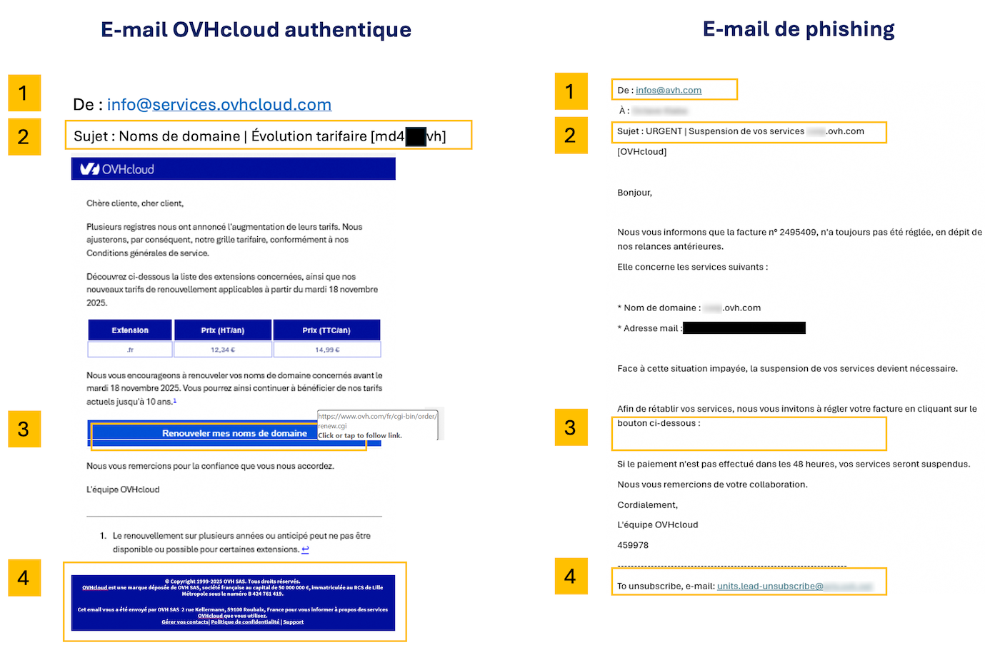
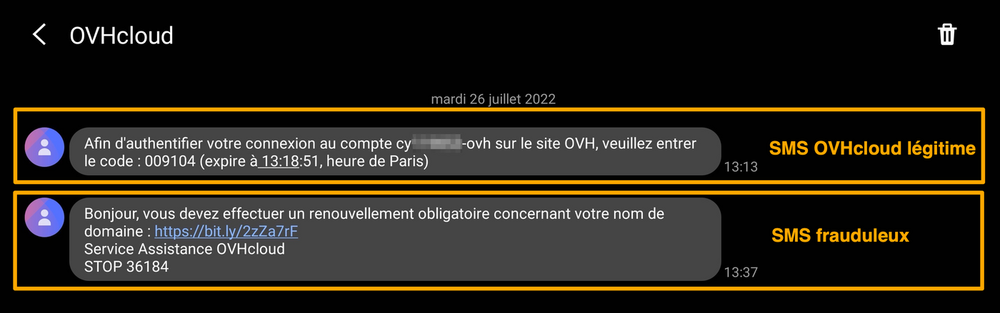

## Objectif

L'hameçonnage (ou *phishing* en anglais) est une technique frauduleuse destinée à leurrer l'internaute pour l'inciter à communiquer des données personnelles (comptes d'accès, mots de passe, etc.) et/ou bancaires en se faisant passer pour un tiers ou un site de confiance. 
Dans la pratique, il s'agit souvent de l’envoi d’un e-mail ou d'un SMS vous invitant à cliquer sur un lien. Ce lien vous redirige vers un formulaire qui reprend frauduleusement les couleurs d’une marque et vous invite à entrer vos identifiants personnels.

**Ce guide vous explique comment reconnaître un e-mail ou un SMS de phishing et quelles mesures prendre si vous avez cliqué sur un lien frauduleux.**

<iframe class="video" width="560" height="315" src="https://www.youtube-nocookie.com/embed/85GEi97-n20?si=xEJpLr9I7G1CgEaq" title="YouTube video player" frameborder="0" allow="accelerometer; autoplay; clipboard-write; encrypted-media; gyroscope; picture-in-picture; web-share" referrerpolicy="strict-origin-when-cross-origin" allowfullscreen></iframe>

## En pratique

### J'ai reçu un e-mail ou un SMS au nom d'OVHcloud, comment savoir s'il est légitime ?

#### Identifier un e-mail de phishing

<!-- CP-STEPS-START:check-messages -->
En priorité, vérifiez si l'e-mail que vous avez reçu est aussi visible sur la page [Mes communications](/links/control-panel/account-messages). Vous y retrouverez les copies des e-mails officiels envoyés par OVHcloud.
<!-- CP-STEPS-END:check-messages -->

Par ailleurs, voici quelques éléments pour vous aider à distinguer visuellement un authentique e-mail OVHcloud d'une tentative de phishing.

Cliquez sur l'image pour l'agrandir. Retrouvez les détails et explications dans le tableau ci-dessous.

{.thumbnail}

> [!primary]
> 
> Les numéros du tableau correspondent à ceux visibles dans l'image ci-dessus.

|Numéro - description|E-mail OVHcloud légitime|E-mail de phishing frauduleux|
|---|---|---|
|1 - Expéditeur|Vérifiez que l’adresse utilisée pour l’envoi de l’e-mail se termine par un nom de domaine (ou un sous-domaine, par exemple `events.ovhcloud.com` ) appartenant à OVHcloud (voir la liste ci-dessous) |L'expéditeur de l'e-mail sera très probablement une adresse qui ne vient pas d'OVHcloud.|
|2 - Objet|Vérifiez que votre identifiant **(qui commence généralement par les initiales de la personne ayant créé le compte OVHcloud)** et/ou l’adresse e-mail de votre compte figurent dans l’objet du message.|Très souvent, l'e-mail sera marqué comme \[SPAM] et **votre identifiant n'apparaîtra pas ou sera incorrect**.|
|3 - Lien|**Sans cliquer dessus, passez votre pointeur de souris sur le lien ou le bouton** et vous en verrez directement la cible (juste en dessous ou tout en bas de votre navigateur). Dans notre exemple, le lien renvoie bien vers une adresse https://www.ovh.com/. Lorsque vous cliquez sur un lien, vérifiez toujours l'adresse dans le navigateur. OVHcloud utilise un ensemble de noms de domaines reconnaissables, généralement ovhcloud.com ou ovh.com (voir ci-dessous la liste des domaines légitimes et les astuces pour vérifier un lien suspect).|Dans un e-mail de phishing, le lien ne sera pas celui d'une page officielle OVHcloud. **Ne cliquez pas dessus.**|
|4 - En-tête et pied de page de l'e-mail|OVHcloud envoie des e-mails dans les formats TXT et HTML. L'en-tête contiendra le logo OVHcloud, le pied de l'e-mail contiendra des informations légales liées à OVHcloud|Il se peut que l'en-tête ou le pied de page contiennent des liens qui n'ont rien à voir avec OVHcloud. **Ne cliquez pas sur ces liens.**|

/// details | **Liste des noms de domaines OVHcloud légitimes** (cliquez pour l'afficher)

- ovhcloud.com
- ovh.com
- ovh.fr
- services.ovhcloud.com
- news.ovhcloud.com
- clientmanager.fr
- kimsufi.com
- soyoustart.com
- ovh.ca
- ovh.com.au
- ovh.co.uk
- ovh.ie
- ovh.de
- ovh.es
- ovh.it
- ovh.lt
- ovh-hosting.fi
- ovh.net
- ovh.nl
- ovh.pl
- ovh.pt
- ovh.sn
- ovh.us
- robot.ovh.net

Des e-mails peuvent aussi provenir de sous-domaines authentiques :

- events.ovhcloud.com
- news.soyoustart.com
- services.kimsufi.com

///

/// details | **Astuces pour vérifier un lien suspect** (cliquez pour afficher)

**Lire l'URL de droite à gauche**

Le vrai nom de domaine se trouve juste avant le premier `/` dans l'adresse. Les URL de phishing ajoutent souvent des mots avant le domaine pour le rendre crédible :

- `https://www.ovhcloud.com/account/login` — le vrai domaine est **ovhcloud.com** ✓
- `https://ovhcloud.com.login-secure.xyz/account` — le vrai domaine est **login-secure.xyz** ✗

Pour trouver le vrai domaine, regardez la barre d'adresse et lisez **depuis le premier `/` vers la gauche** — les deux dernières parties avant cette barre oblique sont le domaine réel.

**Attention aux caractères ressemblants**

Les fraudeurs remplacent parfois des lettres par des caractères visuellement similaires pour créer des adresses trompeuses :

- `ovhcIoud.com` (I majuscule à la place du L minuscule)
- `0vhcloud.com` (zéro à la place de la lettre O)
- `ovhclould.com` (lettre supplémentaire)

Si quelque chose vous semble inhabituel, ne cliquez pas. Tapez `ovhcloud.com` manuellement dans votre navigateur.

**Les raccourcisseurs d'URL sont un signal d'alerte**

Les liens courts tels que `bit.ly/xxx`, `tinyurl.com/xxx` ou `t.co/xxx` masquent la destination réelle. OVHcloud n'utilise **jamais** de raccourcisseurs d'URL dans ses e-mails officiels.

**Sur mobile : appui long au lieu du survol**

Sur un téléphone ou une tablette, vous ne pouvez pas survoler un lien. À la place, effectuez un **appui long** (maintenez le doigt sur le lien sans le relâcher). Un aperçu de l'URL complète apparaîtra. Si le domaine vous est inconnu, n'ouvrez pas le lien.

**En cas de doute, accédez directement au site**

Le réflexe le plus sûr : **ne cliquez jamais sur un lien dans un e-mail pour accéder à votre compte**. Ouvrez plutôt votre navigateur et tapez `www.ovhcloud.com` vous-même, puis connectez-vous depuis le site. Si OVHcloud nécessite une action de votre part, vous verrez la notification dans votre espace client.

///

#### Identifier un SMS de phishing

OVHcloud ne vous transmettra **jamais** de lien par SMS. Les SMS que nous envoyons sont généralement liés à la [double authentification dans votre espace client](/pages/account_and_service_management/account_information/secure-ovhcloud-account-with-2fa).

Vous trouverez ci-dessous 2 exemples de SMS, le premier est légitime et correspond à la double authentification. Le second SMS est frauduleux.

{.thumbnail}

#### Comment signaler un e-mail de phishing ?

Après avoir effectué les vérifications expliquées au-dessus, si vous êtes certain d'avoir reçu un e-mail de phishing usurpant l’identité d’OVHcloud, vous pouvez nous le signaler en enregistrant l’e-mail sous forme de fichier (`.eml` ou `.msg`) et en l’envoyant en **pièce jointe** d’un nouveau message à l’adresse **<fraude@ovh.com>**.

Ces formats de fichiers conservent les informations techniques cachées (appelées « en-têtes ») dont nos équipes ont besoin pour remonter à la source de la fraude et agir.

> [!warning]
>
> **Ne transférez pas directement l’e-mail de phishing.** En le transférant, c’est votre propre boîte mail qui envoie le contenu frauduleux, ce qui peut entraîner le blocage de votre adresse e-mail considérée comme émettrice de spam. Enregistrez plutôt l’e-mail sous forme de fichier et joignez-le à un **nouveau** message.

**Comment enregistrer un e-mail sous forme de fichier :**

Cliquez sur le titre correspondant à l’application de messagerie que vous utilisez.

**Logiciels de messagerie (bureau)**

/// details | **Outlook pour Windows**

Il existe deux versions d’Outlook pour Windows : **Outlook classique** et le **nouvel Outlook**. Pour les distinguer, tapez « Outlook » dans la barre de recherche Windows. La version classique affiche la mention *« (classique) »*, tandis que le nouvel Outlook n’a pas de mention spéciale.

{.thumbnail .h-500}

**Outlook classique :**

1. Sélectionnez l’e-mail de phishing dans votre boîte de réception (ne l’ouvrez pas).
2. Cliquez sur `Fichier`{.action} dans la barre de menu, puis sur `Enregistrer sous`{.action}.
3. Dans le menu déroulant « Type de fichier », sélectionnez **Format de message Outlook - Unicode (.msg)**.
4. Choisissez un emplacement sur votre ordinateur (par exemple le Bureau) et cliquez sur `Enregistrer`{.action}.

Vous pouvez également **glisser-déposer** l’e-mail depuis votre boîte de réception directement sur votre Bureau. Cela créera un fichier `.msg` que vous pourrez joindre à votre signalement.

**Nouvel Outlook :**

1. Dans la liste des messages, faites un **clic droit** sur l’e-mail de phishing.
2. Sélectionnez `Enregistrer sous`{.action}, puis choisissez `Enregistrer en tant que fichier EML`{.action}.
3. Choisissez un emplacement sur votre ordinateur et cliquez sur `Enregistrer`{.action}.

///

/// details | **Thunderbird**

1. Faites un clic droit sur l’e-mail de phishing dans votre boîte de réception.
2. Sélectionnez `Enregistrer sous`{.action}.
3. L’e-mail sera enregistré sous forme de fichier `.eml`. Choisissez un emplacement sur votre ordinateur et cliquez sur `Enregistrer`{.action}.

///

/// details | **Apple Mail (macOS)**

1. Sélectionnez l’e-mail de phishing dans votre boîte de réception.
2. Dans la barre de menu, cliquez sur `Fichier`{.action} > `Enregistrer sous`{.action}.
3. Choisissez le format **Source brute du message**, sélectionnez un emplacement sur votre ordinateur et cliquez sur `Enregistrer`{.action}.

///

**Webmail (navigateur)**

/// details | **OWA - Outlook Web Application**

1. Ouvrez l’e-mail de phishing.
2. Cliquez sur les **trois points horizontaux** (⋯) en haut à droite de l’e-mail.
3. Sélectionnez `Afficher`{.action} > `Afficher la source du message`{.action}.
4. Sélectionnez tout le texte (`Ctrl+A` ou `Cmd+A`), copiez-le (`Ctrl+C` ou `Cmd+C`), collez-le dans un éditeur de texte brut (par exemple le Bloc-notes ou TextEdit), et enregistrez le fichier avec l’extension `.eml`.

///

/// details | **Roundcube (Webmail OVHcloud)**

1. Sélectionnez l’e-mail de phishing dans votre boîte de réception.
2. Cliquez sur `Plus`{.action} (ou l’icône **⋮**) dans la barre d’outils.
3. Sélectionnez `Télécharger (.eml)`{.action}.
4. Le fichier sera enregistré dans votre dossier Téléchargements.

///

/// details | **Zimbra (Webmail OVHcloud)**

1. Sélectionnez l’e-mail de phishing dans votre boîte de réception.
2. Cliquez sur `Plus`{.action} dans la barre d’outils.
3. Sélectionnez `Afficher l’original`{.action}. Le contenu brut de l’e-mail s’ouvrira dans un nouvel onglet du navigateur.
4. Dans ce nouvel onglet, utilisez `Ctrl+S` (ou `Cmd+S` sur macOS) pour enregistrer la page. Enregistrez le fichier avec l’extension `.eml` (si votre navigateur propose `.txt`, renommez le fichier après l’enregistrement).

///

/// details | **Gmail**

1. Ouvrez l’e-mail de phishing.
2. Cliquez sur les **trois points verticaux** (⋮) en haut à droite de l’e-mail.
3. Sélectionnez `Télécharger le message`{.action}.
4. Un fichier `.eml` sera enregistré dans votre dossier Téléchargements.

///

Une fois le fichier enregistré, créez un **nouvel e-mail** à destination de **<fraude@ovh.com>** et joignez-y le fichier.

> [!primary]
>
> Veuillez noter que les informations que vous nous communiquerez pourront être partagées à des tiers afin de nous permettre de lutter contre ces menaces.
>

### J'ai saisi mes informations personnelles : que faire ?

Cliquez sur les titres ci-dessous pour afficher les instructions.

/// details | **Si vous avez entré votre numéro de carte bancaire sur un site frauduleux**

Contactez rapidement votre banque pour faire opposition sur votre moyen de paiement. Indiquez-leur la date et si possible l’heure à laquelle vous avez entré votre numéro de carte bancaire.

**Votre banque est la seule à pouvoir annuler les transactions frauduleuses qui pourraient avoir été effectuées à votre insu.**

///

/// details | **Si vous avez entré votre mot de passe OVHcloud sur un site frauduleux**

<!-- CP-STEPS-START:change-password-security -->
Ouvrez la page [Sécurité du compte](/links/control-panel/account-security) et modifiez immédiatement votre mot de passe. 
<!-- CP-STEPS-END:change-password-security -->

Vous trouverez, sur notre guide « [Modifier le mot de passe de votre compte](/pages/account_and_service_management/account_information/manage-ovh-password) », la méthode pour modifier votre mot de passe depuis votre espace client, ainsi que nos recommandations pour générer un mot de passe efficace et le sauvegarder dans un gestionnaire de mots de passe. 

Nous vous conseillons fortement d’activer également la [double authentification](/pages/account_and_service_management/account_information/secure-ovhcloud-account-with-2fa) pour sécuriser durablement votre compte.

> [!primary]
>
> Pour rappel, afin de sécuriser efficacement vos données, votre mot de passe doit :
>
> - comporter au minimum douze caractères ;
> - comporter au moins 1 lettre majuscule, 1 lettre minuscule et 1 chiffre ;
> - comporter des caractères spéciaux (par exemple : `%`, `#`, `:`, `$`, `*`) ;
> - ne pas être tiré du dictionnaire ;
> - ne pas comporter d’informations personnelles (votre prénom, nom ou date de naissance) ;
> - ne pas être utilisé pour plusieurs accès utilisateur ;
> - être stocké dans un coffre-fort de mots de passe ;
> - être changé tous les trois mois ;
> - être différent des mots de passe précédents.
>

///

## Aller plus loin

[Définir et gérer le mot de passe de votre compte](/pages/account_and_service_management/account_information/manage-ovh-password)

[Sécuriser son compte OVHcloud avec la double authentification](/pages/account_and_service_management/account_information/secure-ovhcloud-account-with-2fa)

[Sécuriser mon compte OVHcloud et gérer mes informations personnelles](/pages/account_and_service_management/account_information/all_about_username)

Échangez avec notre [communauté d'utilisateurs](/links/community).