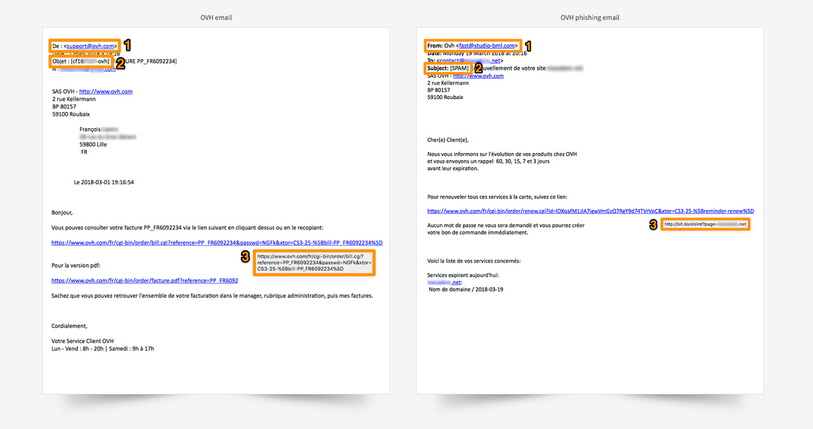

## Sumário

O phishing é o envio de um e-mail que o convida a clicar numa ligação que o redirige para um formulário. Este último assume fraudulentamente a aparência de uma determinada marca e pede-lhe que introduza as suas informações pessoais.

**Este guia explica como reconhecer um e-mail de phishing e o que fazer depois de clicar numa ligação fraudulenta.**

## Requisitos

- Sem requisitos específicos.

## Instruções

### Recebi um e-mail de phishing em nome da OVHcloud

#### Identificar um e-mail de phishing

Recebeu um e-mail em nome da OVHcloud e quer ter a certeza de que é autêntico? Aqui ficam alguns elementos para o ajudar a distinguir visualmente um e-mail da OVHcloud de uma tentativa de phishing.

{.thumbnail}

> [!alert]
> 
> Verifique se estão reunidas as três condições seguintes:
> 

|Número - descrição|E-mail da OVHcloud|E-mail de phishing|
|---|---|---|
|1 - Remetente|Certifique-se de que o endereço utilizado para o envio do e-mail termina em «@ovhcloud.com», «@ovh.com», «@soyoustart.com» ou «@kimsufi.com».|Na maioria dos casos, o e-mail será identificado como «spam» entre parêntesis retos e o seu ID não aparecerá OU estará incorreto.|O remetente do e-mail será forçosamente um endereço que não pertence à OVHcloud.|
|2 - Assunto|Certifique-se de que o seu ID **(que começa pela primeira letra do sobrenome registado na OVHcloud, seguida da primeira letra do nome)** e/ou o endereço de e-mail da sua conta figuram no assunto da mensagem.|Na maioria dos casos, o e-mail será identificado como «spam» entre parêntesis retos e o seu ID não aparecerá OU estará incorreto.|
|3 - Ligação|Passe o ponteiro do rato sobre a ligação e, sem ter de clicar nela, verá diretamente o conteúdo (na parte inferior do navegador). Aqui, a ligação reencaminha efetivamente para  https://www.ovh.com/.|No nosso exemplo, ao passar o ponteiro do rato sobre a ligação, verá que esta não tem nada que ver com a OVHcloud. Não clique nela.|

> [!primary]
> 
> Se for cliente das marcas Kimsufi ou So you Start, nunca terá de pagar nada à OVHcloud. Portanto, ignore este tipo de e-mail.
> 

#### Denunciar um e-mail de phishing

Se, depois das verificações explicadas acima, tem a certeza de que recebeu efetivamente um e-mail de phishing a usurpar a identidade da OVHcloud, faça-nos chegar o máximo de informações possível (pelo menos o conteúdo do e-mail) através do seguinte endereço: **<fraud@ovh.com>**.

> [!primary]
> 
> As informações que nos comunicar poderão ser partilhadas com terceiros, de modo a permitir-nos lutar contra tais ameaças.Introduzi as minhas informações pessoais: o que fazer?
>

#### Usou número do cartão bancário num site fraudulento

A única coisa a fazer é contactar rapidamente o seu banco para cancelar o cartão. Indique a data e, se possível, a hora em que introduziu o número do seu cartão bancário.

**Só o seu banco poderá anular as eventuais transações efetuadas de forma fraudulenta.**

#### Usou a palavra-passe da OVHcloud num site fraudulento

Aceda à [Área de Cliente](https://www.ovh.com/auth/?action=gotomanager&from=https://www.ovh.pt/&ovhSubsidiary=pt){.external} e altere imediatamente a palavra-passe. Aconselhamos vivamente a ativação do segundo método de autenticação para garantir a segurança da sua conta.

> [!primary]
>
> Para proteger ao máximo os seus dados, a palavra-passe deve respeitar algumas recomendações:
>
> - conter pelo menos 12 caracteres;
> - conter pelo menos três tipos de caracteres;
> - não existir no dicionário;
> - não conter informações pessoais (nome, sobrenome ou data de nascimento);
> - não ser utilizada por vários utilizadores;
> - estar armazenada num cofre-forte de palavras-passe;
> - ser alterada a cada três meses;
> - ser diferente das palavras-passe anteriores.
>

## Quer saber mais?

Fale com a nossa comunidade de utilizadores: <https://community.ovh.com/en/>.
