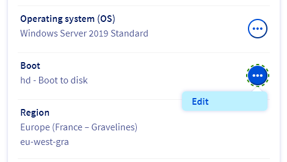

 
<style>
details>summary {
    color:rgb(33, 153, 232);
    cursor: pointer;
}
details>summary::before {
    content:'\25B6';
    padding-right:1ch;
}
details[open]>summary::before {
    content:'\25BC';
}
details.support {
    margin: 0.5rem 0;
    border: 2px solid #0050D5;
    border-radius: 4px;
    background: #73E3FF;
}
details.support > summary {
    padding: 0.5rem 1rem;
    font-weight: 600;
    color: #000E9C;
    background: #73E3FF;
    cursor: pointer;
    list-style: none;
}
details.support > summary::before {
    content: '\25B6';
    display: inline-block;
    margin-right: 0.5ch;
    transition: transform 0.2s;
}
details.support[open] > summary::before {
    content: '\25BC';
}
details.support:hover {
    border: 2px solid #00185E;
    border-radius: 4px;
    transition: border-color 0.5s ease;
}
details.support[open] > summary {
    background: #4AB0F5;
}
details.support > :not(summary) {
    padding: 0.5rem 0.75rem;
    box-sizing: border-box;
}
.img-row {
    display: flex;
    gap: 0.5rem;
    justify-content: center;
}
.img-row img {
    max-width: 99%;
    height: auto;
}
</style>
 
## Objective
 
Lorem ipsum dolor sit amet, consectetur adipiscing elit. Vivamus quis tempus lorem. Sed vitae sem massa. Quisque malesuada mauris nec lacinia fermentum. Morbi et tempor dui. Sed diam magna, ullamcorper eu consectetur nec, iaculis sit amet tellus. Morbi eu purus sapien. Proin ac purus sit amet arcu hendrerit rhoncus. Phasellus eget porttitor sapien, non dignissim dui. Morbi tempus risus in augue gravida, quis ultricies metus scelerisque.
 
**Lorem ipsum dolor sit amet, consectetur adipiscing elit.**
 
<iframe class="video" width="560" height="315" src="https://www.youtube-nocookie.com/embed/s-_nstgu8oc?si=KWVlSCO3oAPMhSZS" title="YouTube video player" frameborder="0" allow="accelerometer; autoplay; clipboard-write; encrypted-media; gyroscope; picture-in-picture; web-share" referrerpolicy="strict-origin-when-cross-origin" allowfullscreen></iframe>
 
 
## Requirements and links
 
- A [Virtual Private Server](/links/bare-metal/vps) in your OVHcloud account
- Access to the [OVHcloud Control Panel](/links/manager)
- Link to [another guide](/pages/bare_metal_cloud/virtual_private_servers/rescue)
- link to [a category from the index](/products/account-and-service-management-account-information-getting-started)
 
- This [External link](https://discord.gg/ovhcloud) should open a new tab
- [Link to an sub-part of this guide furher down the page](#highlighting)
- [Link to an HTML anchor furher down the page](#anchor-link)
 
## Instructions
 
### Image insertion
 
This is an an image from the parent `images` folder into this guide's folder:
 
{.thumbnail}
 
### Tables
 
| Syntax      | Description |
| ----------- | ----------- |
| Header      | Title       |
| Paragraph   | Text        |
 
### Text boxes
 
> [!warning]
>
> Nunc hendrerit augue at nisi porttitor, suscipit mattis risus malesuada. Nunc tincidunt ante sed tellus interdum, hendrerit porttitor sapien scelerisque.
>
 
> [!primary]
>
> Nunc hendrerit augue at nisi porttitor, suscipit mattis risus malesuada. Nunc tincidunt ante sed tellus interdum, hendrerit porttitor sapien scelerisque.
>
 
> [!success]
>
> Nunc hendrerit augue at nisi porttitor, suscipit mattis risus malesuada. Nunc tincidunt ante sed tellus interdum, hendrerit porttitor sapien scelerisque.
>
 
> [!alert]
>
> Nunc hendrerit augue at nisi porttitor, suscipit mattis risus malesuada. Nunc tincidunt ante sed tellus interdum, hendrerit porttitor sapien scelerisque.
>
 
> Nunc hendrerit augue at nisi porttitor, suscipit mattis risus malesuada. Nunc tincidunt ante sed tellus interdum, hendrerit porttitor sapien scelerisque.
 
 
### API call
 
> [!api]
>
> @api {v1} /domain GET /domain
>
 
### Code blocks
 
- 1st code block:
 
```bash
service networking restart
```
 
- 2nd code-block:
 
```yaml
network:
    version: 2
    ethernets:
        eth0:
            dhcp6: no
            match:
              name: eth0
            addresses:
              - "YOUR_IPV6/IPv6_PREFIX"
            gateway6: "IPv6_GATEWAY"
            routes:
              - to: "IPv6_GATEWAY"
                scope: link
```
 
 
### Tabs
 
> [!tabs]
> 1st tab title
>>
>> > [!api]
>> >
>> > @api {v1} /cloud GET /cloud/project/{serviceName}/database/cassandra
>> >
> 2nd tab title
>>
>> Lorem ipsum dolor sit amet, consectetur adipiscing elit. Donec a placerat nisl. Nullam nisl libero, volutpat ut est vitae, porta sodales lacus. Nullam mattis in quam ut gravida.<br>
>> Morbi suscipit molestie lacus, sit amet commodo enim tristique malesuada. Maecenas ultricies tortor eu erat pellentesque ultrices.
>>
>>{.thumbnail}
>>
> 3rd tab title
>>
>> ```console
>> your code
>> ```
 
### Highlighting
 
Lorem ipsum dolor sit amet, consectetur adipiscing `elit`. Vivamus quis `tempus lorem`{.action}. **Sed vitae sem massa**. Quisque malesuada *mauris nec lacinia fermentum*.
 
## Bank of images
 
This image is generated from <https://github.com/ovh/docs/blob/develop/pages/assets/screens/other/browsers/errors/http-500.png>
 
{.thumbnail}
 
This image is generated from <https://github.com/ovh/docs/blob/develop/pages/assets/screens/other/cms/wordpress/admin-interface.png>
 
{.thumbnail}
 
## Details (collapsible sections)
 
### Basic example
 
/// details | Basic example summary
 
Lorem ipsum dolor sit amet, consectetur adipiscing elit. Etiam sollicitudin tristique porttitor. Curabitur sollicitudin auctor feugiat. Quisque quam nibh, efficitur nec ligula nec, mattis vulputate risus. Vivamus condimentum erat in felis dignissim eleifend. Phasellus justo nulla, iaculis eu bibendum vel, dictum non lacus. Nunc sodales sem a velit molestie sollicitudin. Duis sit amet condimentum massa, tristique accumsan nisi.
 
Cras vitae suscipit risus. Curabitur tempus odio in mi congue, at dignissim velit suscipit. Nam cursus ipsum dui, sed vestibulum tellus accumsan ac. Mauris ullamcorper erat non commodo aliquam. Vivamus elementum tortor et neque ornare, quis placerat nisl suscipit. Cras finibus rhoncus dapibus. Nullam convallis laoreet urna, at iaculis nibh pellentesque quis. Pellentesque habitant morbi tristique senectus et netus et malesuada fames ac turpis egestas. Morbi pellentesque vel ipsum id gravida.
 
Lorem ipsum dolor sit amet, consectetur adipiscing `elit`. Vivamus quis `tempus lorem`{.action}. **Sed vitae sem massa**. Quisque malesuada *mauris nec lacinia fermentum*.
 
 
///
 
### Examples with multiple formats
 
/// details | This example contains an image
 
The image should appear below:
 
{.thumbnail}
 
///
 
/// details | This example contains an image from the assets folder
 
The image should appear below:
 
{.thumbnail}
 
///
 
/// details | This example contains a list
 
To do this:
 
- do this
- do that
- also do this
 
To do this other thing:
 
- do this
- do that
- also do this
 
///
 
/// details | This example contains our text boxes
 
> [!warning]
>
> Nunc hendrerit augue at nisi porttitor, suscipit mattis risus malesuada. Nunc tincidunt ante sed tellus interdum, hendrerit porttitor sapien scelerisque.
>
 
> [!primary]
>
> Nunc hendrerit augue at nisi porttitor, suscipit mattis risus malesuada. Nunc tincidunt ante sed tellus interdum, hendrerit porttitor sapien scelerisque.
>
 
> [!success]
>
> Nunc hendrerit augue at nisi porttitor, suscipit mattis risus malesuada. Nunc tincidunt ante sed tellus interdum, hendrerit porttitor sapien scelerisque.
>
 
> [!alert]
>
> Nunc hendrerit augue at nisi porttitor, suscipit mattis risus malesuada. Nunc tincidunt ante sed tellus interdum, hendrerit porttitor sapien scelerisque.
>
 
> Nunc hendrerit augue at nisi porttitor, suscipit mattis risus malesuada. Nunc tincidunt ante sed tellus interdum, hendrerit porttitor sapien scelerisque.
 
///
 
/// details | This example contains an API call
 
The API call should appear below:
 
> [!api]
>
> @api {v1} /domain GET /domain
>
 
///
 
/// details | This example contains code snippets
 
- 1st code block:
 
```bash
service networking restart
```
 
- 2nd code-block:
 
```yaml
network:
    version: 2
    ethernets:
        eth0:
            dhcp6: no
            match:
              name: eth0
            addresses:
              - "YOUR_IPV6/IPv6_PREFIX"
            gateway6: "IPv6_GATEWAY"
            routes:
              - to: "IPv6_GATEWAY"
                scope: link
```
///
 
/// details | This example contains tabs
 
> [!tabs]
> 1st tab title
>>
>> > [!api]
>> >
>> > @api {v1} /cloud GET /cloud/project/{serviceName}/database/cassandra
>> >
> 2nd tab title
>>
>> Lorem ipsum dolor sit amet, consectetur adipiscing elit. Donec a placerat nisl. Nullam nisl libero, volutpat ut est vitae, porta sodales lacus. Nullam mattis in quam ut gravida.<br>
>> Morbi suscipit molestie lacus, sit amet commodo enim tristique malesuada. Maecenas ultricies tortor eu erat pellentesque ultrices.
>>
>>{.thumbnail}
>>
> 3rd tab title
>>
>> ```console
>> your code
>> ```
 
///
 
 
### Warning format <a name="anchor-link"></a>
 
##### Basic example
 
/// details | Basic example summary
 
    type: warning
Lorem ipsum dolor sit amet, consectetur adipiscing elit. Etiam sollicitudin tristique porttitor. Curabitur sollicitudin auctor feugiat. Quisque quam nibh, efficitur nec ligula nec, mattis vulputate risus. Vivamus condimentum erat in felis dignissim eleifend. Phasellus justo nulla, iaculis eu bibendum vel, dictum non lacus. Nunc sodales sem a velit molestie sollicitudin. Duis sit amet condimentum massa, tristique accumsan nisi.
 
Cras vitae suscipit risus. Curabitur tempus odio in mi congue, at dignissim velit suscipit. Nam cursus ipsum dui, sed vestibulum tellus accumsan ac. Mauris ullamcorper erat non commodo aliquam. Vivamus elementum tortor et neque ornare, quis placerat nisl suscipit. Cras finibus rhoncus dapibus. Nullam convallis laoreet urna, at iaculis nibh pellentesque quis. Pellentesque habitant morbi tristique senectus et netus et malesuada fames ac turpis egestas. Morbi pellentesque vel ipsum id gravida.
///
 
##### Examples with multiple formats
 
/// details | This example contains an image
    type: warning
The image should appear below:
{.thumbnail}
///
 
/// details | This example contains an image from the assets folder
The image should appear below:
{.thumbnail}
///
 
/// details | This example contains a list
    type: warning
To do this:
- do this
- do that
- also do this
 
To do this other thing:
 
- do this
- do that
- also do this
///
 
/// details | This example contains our text boxes
    type: warning
> [!warning]
>
> Nunc hendrerit augue at nisi porttitor, suscipit mattis risus malesuada. Nunc tincidunt ante sed tellus interdum, hendrerit porttitor sapien scelerisque.
>
 
> [!primary]
>
> Nunc hendrerit augue at nisi porttitor, suscipit mattis risus malesuada. Nunc tincidunt ante sed tellus interdum, hendrerit porttitor sapien scelerisque.
>
 
> [!success]
>
> Nunc hendrerit augue at nisi porttitor, suscipit mattis risus malesuada. Nunc tincidunt ante sed tellus interdum, hendrerit porttitor sapien scelerisque.
>
 
> [!alert]
>
> Nunc hendrerit augue at nisi porttitor, suscipit mattis risus malesuada. Nunc tincidunt ante sed tellus interdum, hendrerit porttitor sapien scelerisque.
>
 
> Nunc hendrerit augue at nisi porttitor, suscipit mattis risus malesuada. Nunc tincidunt ante sed tellus interdum, hendrerit porttitor sapien scelerisque.
///
 
/// details | This example contains an API call
    type: warning
The API call should appear below:
 
> [!api]
>
> @api {v1} /domain GET /domain
>
 
///
 
/// details | This example contains code snippets
    type: warning
- 1st code block:
 
```bash
service networking restart
```
 
- 2nd code-block:
 
```yaml
network:
    version: 2
    ethernets:
        eth0:
            dhcp6: no
            match:
              name: eth0
            addresses:
              - "YOUR_IPV6/IPv6_PREFIX"
            gateway6: "IPv6_GATEWAY"
            routes:
              - to: "IPv6_GATEWAY"
                scope: link
```
///
 
/// details | This example contains tabs
    type: warning
> [!tabs]
> 1st tab title
>>
>> > [!api]
>> >
>> > @api {v1} /cloud GET /cloud/project/{serviceName}/database/cassandra
>> >
> 2nd tab title
>>
>> Lorem ipsum dolor sit amet, consectetur adipiscing elit. Donec a placerat nisl. Nullam nisl libero, volutpat ut est vitae, porta sodales lacus. Nullam mattis in quam ut gravida.<br>
>> Morbi suscipit molestie lacus, sit amet commodo enim tristique malesuada. Maecenas ultricies tortor eu erat pellentesque ultrices.<br><br>
>>{.thumbnail}<br>
> 3rd tab title
>>
>> ```console
>> your code
>> ```
///
 
/// details | This example contains text highlighting
    type: warning
Lorem ipsum dolor sit amet, consectetur adipiscing `elit`. Vivamus quis `tempus lorem`{.action}. **Sed vitae sem massa**. Quisque malesuada *mauris nec lacinia fermentum*.
///
 
### Open format
 
##### Basic example
 
/// details | Basic example summary
    open: True
Lorem ipsum dolor sit amet, consectetur adipiscing elit. Etiam sollicitudin tristique porttitor. Curabitur sollicitudin auctor feugiat. Quisque quam nibh, efficitur nec ligula nec, mattis vulputate risus. Vivamus condimentum erat in felis dignissim eleifend. Phasellus justo nulla, iaculis eu bibendum vel, dictum non lacus. Nunc sodales sem a velit molestie sollicitudin. Duis sit amet condimentum massa, tristique accumsan nisi.
 
Cras vitae suscipit risus. Curabitur tempus odio in mi congue, at dignissim velit suscipit. Nam cursus ipsum dui, sed vestibulum tellus accumsan ac. Mauris ullamcorper erat non commodo aliquam. Vivamus elementum tortor et neque ornare, quis placerat nisl suscipit. Cras finibus rhoncus dapibus. Nullam convallis laoreet urna, at iaculis nibh pellentesque quis. Pellentesque habitant morbi tristique senectus et netus et malesuada fames ac turpis egestas. Morbi pellentesque vel ipsum id gravida.
///
 
##### Examples with multiple formats
 
/// details | This example contains an image
    open: True
The image should appear below:
{.thumbnail}
///
 
/// details | This example contains an image from the assets folder
 
The image should appear below:
{.thumbnail}
 
///
 
/// details | This example contains a list
    open: True
To do this:
- do this
- do that
- also do this
 
To do this other thing:
 
- do this
- do that
- also do this
///
 
/// details | This example contains our text boxes
    open: True
> [!warning]
>
> Nunc hendrerit augue at nisi porttitor, suscipit mattis risus malesuada. Nunc tincidunt ante sed tellus interdum, hendrerit porttitor sapien scelerisque.
>
 
> [!primary]
>
> Nunc hendrerit augue at nisi porttitor, suscipit mattis risus malesuada. Nunc tincidunt ante sed tellus interdum, hendrerit porttitor sapien scelerisque.
>
 
> [!success]
>
> Nunc hendrerit augue at nisi porttitor, suscipit mattis risus malesuada. Nunc tincidunt ante sed tellus interdum, hendrerit porttitor sapien scelerisque.
>
 
> [!alert]
>
> Nunc hendrerit augue at nisi porttitor, suscipit mattis risus malesuada. Nunc tincidunt ante sed tellus interdum, hendrerit porttitor sapien scelerisque.
>
 
> Nunc hendrerit augue at nisi porttitor, suscipit mattis risus malesuada. Nunc tincidunt ante sed tellus interdum, hendrerit porttitor sapien scelerisque.
///
 
/// details | This example contains an API call
    open: True
The API call should appear below:
 
> [!api]
>
> @api {v1} /domain GET /domain
>
 
///
 
/// details | This example contains code snippets
    open: True
- 1st code block:
 
```bash
service networking restart
```
 
- 2nd code-block:
 
```yaml
network:
    version: 2
    ethernets:
        eth0:
            dhcp6: no
            match:
              name: eth0
            addresses:
              - "YOUR_IPV6/IPv6_PREFIX"
            gateway6: "IPv6_GATEWAY"
            routes:
              - to: "IPv6_GATEWAY"
                scope: link
```
///
 
/// details | This example contains tabs
    open: True
> [!tabs]
> 1st tab title
>>
>> > [!api]
>> >
>> > @api {v1} /cloud GET /cloud/project/{serviceName}/database/cassandra
>> >
> 2nd tab title
>>
>> Lorem ipsum dolor sit amet, consectetur adipiscing elit. Donec a placerat nisl. Nullam nisl libero, volutpat ut est vitae, porta sodales lacus. Nullam mattis in quam ut gravida.<br>
>> Morbi suscipit molestie lacus, sit amet commodo enim tristique malesuada. Maecenas ultricies tortor eu erat pellentesque ultrices.<br><br>
>>{.thumbnail}<br>
> 3rd tab title
>>
>> ```console
>> your code
>> ```
///
 
/// details | This example contains text highlighting
    open: True
Lorem ipsum dolor sit amet, consectetur adipiscing `elit`. Vivamus quis `tempus lorem`{.action}. **Sed vitae sem massa**. Quisque malesuada *mauris nec lacinia fermentum*.
///
 
### Combination
 
/// details | Basic example summary
    open: True
    type: warning
Lorem ipsum dolor sit amet, consectetur adipiscing elit. Etiam sollicitudin tristique porttitor. Curabitur sollicitudin auctor feugiat. Quisque quam nibh, efficitur nec ligula nec, mattis vulputate risus. Vivamus condimentum erat in felis dignissim eleifend. Phasellus justo nulla, iaculis eu bibendum vel, dictum non lacus. Nunc sodales sem a velit molestie sollicitudin. Duis sit amet condimentum massa, tristique accumsan nisi.
 
Cras vitae suscipit risus. Curabitur tempus odio in mi congue, at dignissim velit suscipit. Nam cursus ipsum dui, sed vestibulum tellus accumsan ac. Mauris ullamcorper erat non commodo aliquam. Vivamus elementum tortor et neque ornare, quis placerat nisl suscipit. Cras finibus rhoncus dapibus. Nullam convallis laoreet urna, at iaculis nibh pellentesque quis. Pellentesque habitant morbi tristique senectus et netus et malesuada fames ac turpis egestas. Morbi pellentesque vel ipsum id gravida.
///
 
### Details into tabs
 
> [!tabs]
> 1st tab title
>>
>> /// details | This example contains text highlighting
>>
>> Lorem ipsum dolor sit amet, consectetur adipiscing elit. Etiam sollicitudin tristique porttitor. Curabitur sollicitudin auctor feugiat. Quisque quam nibh, efficitur nec ligula nec, mattis vulputate risus. Vivamus condimentum erat in felis dignissim eleifend. Phasellus justo nulla, iaculis eu bibendum vel, dictum non lacus. Nunc sodales sem a velit molestie sollicitudin. Duis sit amet condimentum massa, tristique accumsan nisi.
>> ///
> 2nd tab title
>>
>> /// details | This example contains text highlighting
>>    type: warning
>> Lorem ipsum dolor sit amet, consectetur adipiscing elit. Etiam sollicitudin tristique porttitor. Curabitur sollicitudin auctor feugiat. Quisque quam nibh, efficitur nec ligula nec, mattis vulputate risus. Vivamus condimentum erat in felis dignissim eleifend. Phasellus justo nulla, iaculis eu bibendum vel, dictum non lacus. Nunc sodales sem a velit molestie sollicitudin. Duis sit amet condimentum massa, tristique accumsan nisi.
>> ///
> 3rd tab title
>>
>> /// details | This example contains text highlighting
>>    open: True
>> Lorem ipsum dolor sit amet, consectetur adipiscing elit. Etiam sollicitudin tristique porttitor. Curabitur sollicitudin auctor feugiat. Quisque quam nibh, efficitur nec ligula nec, mattis vulputate risus. Vivamus condimentum erat in felis dignissim eleifend. Phasellus justo nulla, iaculis eu bibendum vel, dictum non lacus. Nunc sodales sem a velit molestie sollicitudin. Duis sit amet condimentum massa, tristique accumsan nisi.
>> ///


### Test MD hackz

<div>

<p>Lorem ipsum dolor sit amet, consectetur adipiscing elit. Etiam sollicitudin tristique porttitor. Curabitur sollicitudin auctor feugiat. Quisque quam nibh, efficitur nec ligula nec, mattis vulputate risus.</p>

</div>

<div markdown="block">

<ul>
<li><strong>You seek personalized advice or you would like to discuss a topic that is not covered in detail by our documentation?</strong><br>
    Join the [OVHcloud Community](/links/community) to search for your topic and reach out to other users.</li>
</li>
  <li>**You seek personalized advice or you would like to discuss a topic that is not covered in detail by our documentation?**<br>
    Join the [OVHcloud Community](/links/community) to search for your topic and reach out to other users.</li>
</ul>


> Vivamus condimentum erat in felis dignissim eleifend.  
> Phasellus justo nulla, **iaculis eu bibendum vel**, dictum non lacus. Nunc sodales sem a velit molestie sollicitudin. Duis sit amet condimentum massa, tristique accumsan nisi.

[partner portal](/links/partner)

Cras vitae suscipit risus. Curabitur tempus odio in mi congue, at dignissim velit suscipit. Nam cursus ipsum dui, sed vestibulum tellus accumsan ac. Mauris ullamcorper erat non commodo aliquam. Vivamus elementum tortor et neque ornare, quis placerat nisl suscipit. Cras finibus rhoncus dapibus. Nullam convallis laoreet urna, at iaculis nibh pellentesque quis. Pellentesque habitant morbi tristique senectus et netus et malesuada fames ac turpis egestas. Morbi pellentesque vel ipsum id gravida.

> [!primary]
>
> Nunc hendrerit augue at nisi porttitor, suscipit mattis risus malesuada. Nunc tincidunt ante sed tellus interdum, hendrerit porttitor sapien scelerisque.
>

</div>


### Images side-by-side via flexbox

<div class="img-row">
  
  
</div>

### Styled info message html

<details class="support">
<summary>Information regarding the administration and configuration of OVHcloud services</summary>
<div>
<p>When using OVHcloud guides, please be aware of the following conditions:</p>

  <ul>
    <li>User instructions aim to provide as many details as possible but cannot cover individual use cases. You might need to adapt the pertinent actions to your requirements.</li>
    <li>The OVHcloud ecosystem is built for flexibility and freedom of choice. Customers are therefore responsible for the secure and proper configuration of their services. To prevent data loss, we strongly recommend to apply backup strategies to all your important data.</li>
    <li>Our guides and tutorials may reference third‑party software or services in combination with OVHcloud solutions.<br>The technical support provided by OVHcloud does not include the configuration of systems or products outside of our responsibility. This includes but is not limited to:
      <ul>
        <li>Operating systems and user interfaces (Windows, Debian, Plesk, etc.).</li>
        <li>Any other third‑party software (FTP clients, email software, etc.).</li>
        <li>Services offered by other providers (DNS, APIs, user interfaces, etc.).</li>
      </ul>
    </li>
  </ul>

<p>To receive the appropriate assistance for any issues you might experience, follow these guidelines:</p>

<ul>
  <li><strong>You seek personalized advice or you would like to discuss a topic that is not covered in detail by our documentation?</strong><br>
    Join the <a href="/links/community">OVHcloud Community</a> to search for your topic and reach out to other users.</li>

  <li><strong>You would like to share feedback to improve a guide page or you want to report insufficient information on a specific page?</strong><br>
    Use the buttons in the right‑hand sidebar under “Did this page help you?” to let us know.</li>

  <li><strong>You would like to propose a concrete documentation update?</strong><br>
    Click the “Contribute” button to edit this page.</li>

  <li><strong>You need to report an incident regarding your OVHcloud service or you are experiencing difficulties in the OVHcloud Control Panel?</strong><br>
    Create a support request in our <a href="https://help.ovhcloud.com/csm?id=csm_get_help">Help Center</a>.</li>

  <li><strong>You require professional assistance for your project or you need help with tasks outside our support scope?</strong><br>
    Visit our <a href="/links/partner">partner portal</a> to search for experts who are familiar with OVHcloud solutions.</li>

  <li><strong>You are looking for more detailed information regarding our support levels and Professional Services?</strong><br>
    Please visit our web pages for <a href="/links/support">OVHcloud support levels</a> and <a href="/links/professional-services">OVHcloud Professional Services</a>.</li>
</ul>

</div>
</details>

#### Test
<details class="support">
<summary>Information regarding the administration and configuration of OVHcloud services</summary>
<div markdown="block">
<p>When using OVHcloud guides, please be aware of the following conditions:</p>

  <ul>
    <li>User instructions aim to provide as many details as possible but cannot cover individual use cases. You might need to adapt the pertinent actions to your requirements.</li>
    <li>The OVHcloud ecosystem is built for flexibility and freedom of choice. Customers are therefore responsible for the secure and proper configuration of their services. To prevent data loss, we strongly recommend to apply backup strategies to all your important data.</li>
    <li>Our guides and tutorials may reference third‑party software or services in combination with OVHcloud solutions.<br>The technical support provided by OVHcloud does not include the configuration of systems or products outside of our responsibility. This includes but is not limited to:
      <ul>
        <li>Operating systems and user interfaces (Windows, Debian, Plesk, etc.).</li>
        <li>Any other third‑party software (FTP clients, email software, etc.).</li>
        <li>Services offered by other providers (DNS, APIs, user interfaces, etc.).</li>
      </ul>
    </li>
  </ul>

<p>To receive the appropriate assistance for any issues you might experience, follow these guidelines:</p>

<ul>
  <li><strong>You seek personalized advice or you would like to discuss a topic that is not covered in detail by our documentation?</strong><br>
    Join the [OVHcloud Community](/links/community) to search for your topic and reach out to other users.</li>

  <li><strong>You would like to share feedback to improve a guide page or you want to report insufficient information on a specific page?</strong><br>
    Use the buttons in the right‑hand sidebar under “Did this page help you?” to let us know.</li>

  <li><strong>You would like to propose a concrete documentation update?</strong><br>
    Click the “Contribute” button to edit this page.</li>

  <li><strong>You need to report an incident regarding your OVHcloud service or you are experiencing difficulties in the OVHcloud Control Panel?</strong><br>
    Create a support request in our <a href="https://help.ovhcloud.com/csm?id=csm_get_help">Help Center</a>.</li>

  <li><strong>You require professional assistance for your project or you need help with tasks outside our support scope?</strong><br>
    Visit our <a href="/links/partner">partner portal</a> to search for experts who are familiar with OVHcloud solutions.</li>

  <li><strong>You are looking for more detailed information regarding our support levels and Professional Services?</strong><br>
    <span markdown="span">Please visit our web pages for [OVHcloud support levels](/links/support) and [OVHcloud Professional Services](/links/professional-services).</span></li>
</ul>

</div>
</details>

## Go further
