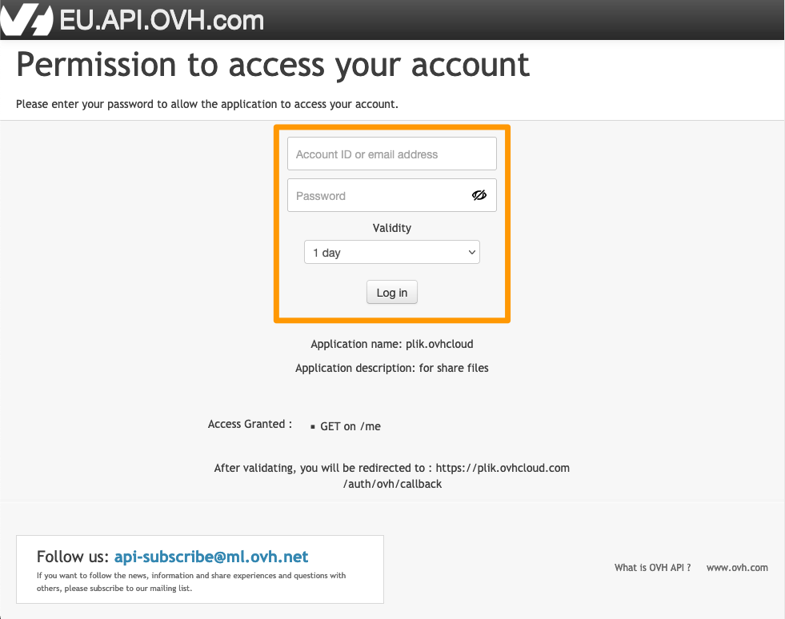
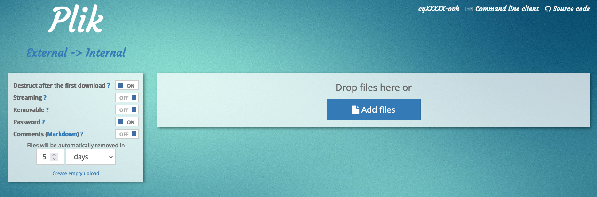
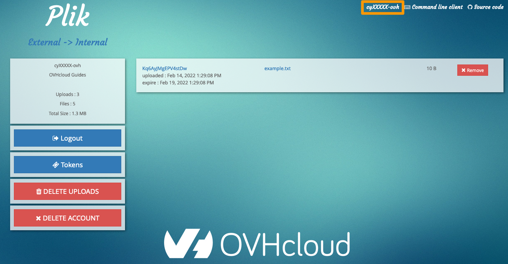

> [!primary]
> Esta tradução foi automaticamente gerada pelo nosso parceiro SYSTRAN. Em certos casos, poderão ocorrer formulações imprecisas, como por exemplo nomes de botões ou detalhes técnicos. Recomendamos que consulte a versão inglesa ou francesa do manual, caso tenha alguma dúvida. Se nos quiser ajudar a melhorar esta tradução, clique em "Contribuir" nesta página.
>

## Objetivo

A ferramenta online [Plik](https://plik.ovhcloud.com) permite partilhar ficheiros entre diferentes pessoas, oferecendo opções de segurança de acesso a esses ficheiros.

**Saiba como utilizar a ferramenta online Plik para partilhar ficheiros.**

## Requisitos

- Ter uma [conta OVHcloud](/pages/account_and_service_management/account_information/ovhcloud-account-creation)

## Instruções

### Ligação API

Primeiro aceda à página <https://plik.ovhcloud.com>.

Para transferir ficheiros, deve estar autenticado. Clique em `Login with OVH`{.action}.

Ligue-se à sua conta OVHcloud, o que dará à API OVHcloud o acesso à ferramenta Plik. 
Introduza as suas informações de identificação e clique no botão `Log in`{.action} para continuar.

> [!primary]
>
> Se ativou a [dupla autenticação](/pages/account_and_service_management/account_information/secure-ovhcloud-account-with-2fa) na sua conta, deverá introduzir o código fornecido pelo método de autenticação que definiu na sua conta. 

### Transferir ficheiros

Depois de aceder, clique na palavra `Plik`{.action} no canto superior esquerdo para aceder ao menu de adição de ficheiros.

Clique em `Add files`{.action} e selecione o ficheiro a adicionar ou faça um "arrastar-largar" dos seus ficheiros.

> [!primary]
>
> O tamanho dos ficheiros está limitado a 10GB.
>

Estão disponíveis várias opções para configurar os seus pagamentos de telecomunicações:

- `Destruct after the first download` - Esta opção eliminará o seu ficheiro removido após o primeiro download.
- `Streaming` - O ficheiro não será armazenado no servidor. Em vez disso, o telepagamento de ficheiros começa quando o utilizador remoto inicia o download.
- `Removable` - Permite aos utilizadores finais eliminar o ficheiro de teledifusão.
- `Password` - Proteja o seu telepagamento impondo um identificador e uma palavra-passe que o utilizador remoto deverá introduzir.
- `Comments` - Adicione comentários ao seu download. A linguagem *markdown* está a ser usada.
- `Files will be automatically removed in` - Escolha o número de dias (30 no máximo), de horas ou de minutos no fim dos quais deseja que os seus ficheiros telecarregados sejam automaticamente eliminados.

> [!primary]
>
> Quando protege o seu telepagamento com uma palavra-passe, o nome de utilizador predefinido é "plik".
>

Depois de adicionar os seus ficheiros e selecionar as opções pretendidas, clique no botão `Upload`{.action} verde no lado esquerdo. Isto abrirá uma nova página com os seus ficheiros juntos.

As opções de download estão disponíveis.

### Descarregar ficheiros

Na página de download, estão disponíveis novas opções:

- `Zip archive` - Posto todos os ficheiros que transmitiu numa pasta comprimida.
- `Add files` - Permite-lhe adicionar outros ficheiros.
- `Delete` - Eliminar todos os ficheiros previamente telecarregados.

Também pode eliminar ficheiros um por um ao clicar no botão `X`{.action} à direita de cada ficheiro.

Para que outras pessoas possam descarregar os seus ficheiros, aceda ao ficheiro individual com o nome do ficheiro. 
Pode também ligá-los a todos os ficheiros da sessão partilhando-lhes o URL situado na barra de endereços do seu browser. 
Também pode partilhar o código QR à esquerda. Se tiver transmitido vários ficheiros, o código QR permitirá descarregar cada um dos ficheiros.

### Opções da conta

Clique no seu identificador no canto superior direito para aceder às opções da conta.

Através deste menu, pode desligar-se, gerar tokens para utilizar a ferramenta Plik em linha de comandos, eliminar cada telepagamento (através do botão `Remove`{.action} situado à direita de cada telepagamento) ou eliminá-los todos (através do botão `DELETE UPLOADS`{.action}).

## Saiba mais

Fale com a nossa comunidade de utilizadores em <https://community.ovh.com/en/>.
