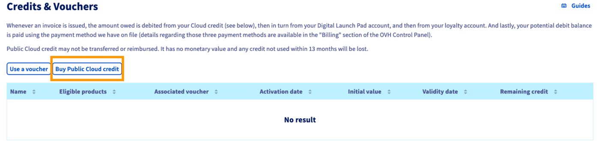
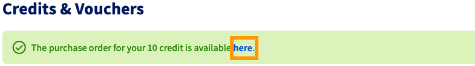

> [!primary]
> Questa traduzione è stata generata automaticamente dal nostro partner SYSTRAN. I contenuti potrebbero presentare imprecisioni, ad esempio la nomenclatura dei pulsanti o alcuni dettagli tecnici. In caso di dubbi consigliamo di fare riferimento alla versione inglese o francese della guida. Per aiutarci a migliorare questa traduzione, utilizza il pulsante "Contribuisci" di questa pagina.
>

**Ultimo aggiornamento: 04/02/2022**

## Obiettivo

L'opzione di "credito Cloud" ti permette di assegnare un importo specifico al tuo progetto Public Cloud, che servirà come metodo di pagamento predefinito per la [fatturazione del progetto](/pages/public_cloud/compute/analyze_billing). 
Questo significa che il credito Cloud viene addebitato per primo e che il debito viene successivamente saldato con gli altri metodi di pagamento disponibili. Per saperne di più, consulta le [guide alla fatturazione del Public Cloud](/products/account-and-service-management-managing-billing-payments-and-services).

**Questa guida ti mostra come aggiungere credito al tuo account Public Cloud tramite l’utilizzo di un voucher oppure generando un buono d’ordine.**

## Prerequisiti

- Un progetto [Public Cloud](https://www.ovhcloud.com/it/public-cloud/) nel tuo account OVHcloud
- Avere accesso allo [Spazio Cliente OVHcloud](https://www.ovh.com/auth/?action=gotomanager&from=https://www.ovh.it/&ovhSubsidiary=it)

## Procedura

Accedi allo [Spazio Cliente OVHcloud](https://www.ovh.com/auth/?action=gotomanager&from=https://www.ovh.it/&ovhSubsidiary=it), accedi alla sezione `Public Cloud`{.action} e seleziona il tuo progetto Public Cloud. Apri `Credit and Vouchers`{.action} nel menu a sinistra.

> [!warning]
>
Si noti che gli stanziamenti aggiunti in questa sezione non possono essere trasferiti né rimborsati. Non hanno valore monetario e il credito non utilizzato entro 13 mesi dall'acquisto viene perso.
>

### Aggiungi credito

Clicca sul pulsante `Acquista credito Cloud`{.action}.

{.thumbnail}

Inserisci l'importo (IVA esclusa) che vuoi aggiungere nella tua valuta. Clicca su `Genera ordine`{.action} per confermare l'operazione.

{.thumbnail}

A questo punto sarà generato un buono d’ordine. Clicca sul link nell'ambito della notifica per consultarlo e disporre il pagamento.

{.thumbnail}

Una volta effettuato il pagamento, il tuo credito comparirà nella lista `Crediti e voucher`.

### Utilizza un voucher

Clicca sul pulsante `Attiva un voucher`{.action}.

{.thumbnail}

Nella nuova finestra, inserisci il codice del voucher e clicca su `Conferma`{.action}.

{.thumbnail}

Il saldo del voucher comparirà nella lista `Crediti e voucher`.

> [!primary]
>
Poiché i periodi di validità dei voucher sono generalmente più limitati, prima del credito Public Cloud verrà utilizzato il saldo del voucher.
>

## Per saperne di più

Contatta la nostra Community di utenti all’indirizzo <https://community.ovh.com/en/>.
