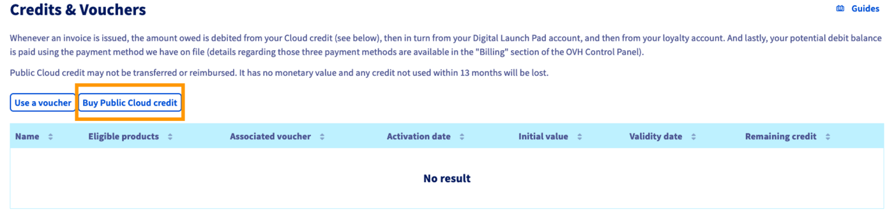
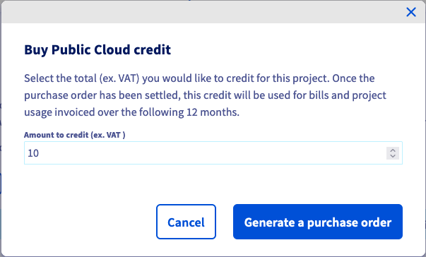
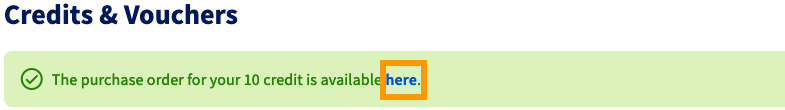
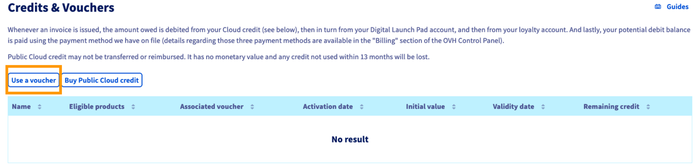
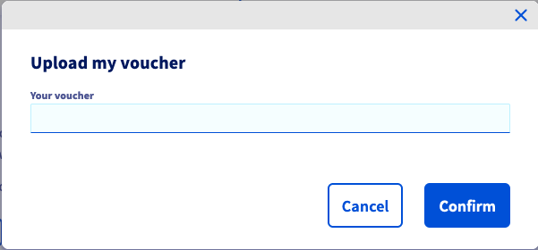

## Obiettivo

L'opzione di "credito Cloud" ti permette di assegnare un importo specifico al tuo progetto Public Cloud, che servirà come metodo di pagamento predefinito per la [fatturazione del progetto](/pages/public_cloud/public_cloud_cross_functional/analyze_billing). 
Questo significa che il credito Cloud viene addebitato per primo e che il debito viene successivamente saldato con gli altri metodi di pagamento disponibili. Per saperne di più, consulta le [guide alla fatturazione del Public Cloud](/products/account-and-service-management-managing-billing-payments-and-services).

**Questa guida ti mostra come aggiungere credito al tuo account Public Cloud tramite l’utilizzo di un voucher oppure generando un buono d’ordine.**

## Prerequisiti

- Un progetto [Public Cloud](/links/public-cloud/public-cloud) nel tuo account OVHcloud

<!-- CP-NAV-START:publiccloud-projects -->
---

### Accesso allo Spazio Cliente OVHcloud

- **Link diretto:** [Public Cloud Projects](/links/control-panel/publiccloud-projects)
- **Percorso di navigazione:** `Public Cloud`{.action} > Seleziona il tuo project

---
<!-- CP-NAV-END:publiccloud-projects -->

## Procedura

Apri `Crediti e voucher`{.action} nel menu a sinistra sotto **Impostazioni**.

> [!warning]
>
> Si noti che gli stanziamenti aggiunti in questa sezione non possono essere trasferiti né rimborsati. Non hanno valore monetario e il credito non utilizzato entro 13 mesi dall'acquisto viene perso.
>

### Aggiungi credito

Clicca sul pulsante `Acquista credito Cloud`{.action}.

{.thumbnail}

Inserisci l'importo (IVA esclusa) che vuoi aggiungere nella tua valuta. Clicca su `Genera ordine`{.action} per confermare l'operazione.

{.thumbnail}

A questo punto sarà generato un buono d’ordine. Clicca sul link nell'ambito della notifica per consultarlo e disporre il pagamento.

{.thumbnail}

Una volta effettuato il pagamento, il tuo credito comparirà nella lista `Crediti e voucher`.

### Utilizza un voucher

Clicca sul pulsante `Attiva un voucher`{.action}.

{.thumbnail}

Nella nuova finestra, inserisci il codice del voucher e clicca su `Conferma`{.action}.

{.thumbnail}

Il saldo del voucher comparirà nella lista `Crediti e voucher`.

> [!primary]
>
> I periodi di validità dei voucher sono generalmente limitati a 1 mese; si consiglia di utilizzarli il prima possibile. Il saldo del voucher verrà utilizzato prima del credito Public Cloud.
>

## Per saperne di più

Contatta la nostra [Community di utenti](/links/community).