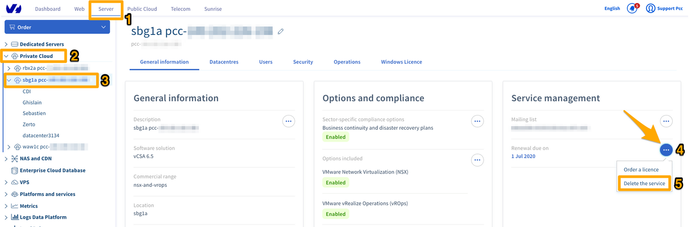

## Ziel

Unser Hosted Private Cloud Angebot entspricht nicht mehr Ihren Anforderungen? Oder haben Sie eine neue Infrastruktur bestellt, um die alte zu ersetzen? Dann können Sie diese Infrastruktur kündigen, sobald Sie alle Ihre dort gespeicherten Daten gesichert haben.  

**Diese Anleitung erklärt, wie Sie einen Hosted Private Cloud Dienst kündigen können.** 

## Voraussetzungen

- Sie verfügen über eine [Hosted Private Cloud](https://www.ovhcloud.com/de/enterprise/products/hosted-private-cloud/) Infrastruktur.
- Sie haben Zugriff auf Ihr [OVHcloud Kundencenter](https://www.ovh.com/auth/?action=gotomanager&from=https://www.ovh.de/&ovhSubsidiary=de).

## In der praktischen Anwendung

Bei Hosted Private Cloud gibt es keine Mindestvertragslaufzeit. Wie jedoch in den [Besonderen Geschäftsbedingungen](https://www.ovh.de/support/agb-vertrage/){.external} beschrieben, ist jeder angebrochene Monat fällig und im Voraus zu bezahlen.

>[!warning]
>
> Bevor Sie Ihre Private Cloud kündigen, achten Sie bitte darauf, alle Daten sicherzustellen, die Sie behalten möchten. Mit der Kündigung geht nämlich das komplette Löschen Ihrer Private Cloud und aller darin enthaltener Daten einher.
>

### Schritt 1: Beantragen Sie die Kündigung in Ihrem OVHcloud Kundencenter

Melden Sie sich in Ihrem [OVHcloud Kundencenter](https://www.ovh.com/auth/?action=gotomanager&from=https://www.ovh.de/&ovhSubsidiary=de){.external} an, gehen Sie in den Bereich `Hosted Private Cloud`{.action} (1), klicken Sie auf `Private Cloud`{.action} (2) und wählen Sie die Private Cloud aus der Liste aus (3), die Sie kündigen möchten.

Klicken Sie im Reiter „Allgemeine Informationen“ in der Tabelle  „Dienstverwaltung“ auf den Button `...`{.action} (4) rechts neben dem Datum der Verlängerung. Klicken Sie dann auf `Dienst löschen`{.action} (5).

{.thumbnail}

Bitte beachten Sie, dass diese Aktion alle Daten auf dieser Infrastruktur löscht, sobald Sie die Kündigung bestätigen. Bei einer Kündigung vor Monatsende erfolgt keine anteilige Rückzahlung.

Klicken Sie auf `Bestätigen`{.action} um die Kündigung zu beantragen.

{.thumbnail}

Sie sehen dann eine Bestätigung Ihres Antrags. Die Bestätigung der Kündigung wird Ihnen per E-Mail an die Adresse zugesandt, die mit dem Account bei OVHcloud verbunden ist.

{.thumbnail}

### Schritt 2: Die Kündigung bestätigen

Aufgrund Ihrer Anfrage wird Ihnen eine Bestätigung der Kündigung per E-Mail an die Adresse zugesandt, die mit dem Account bei OVHcloud verbunden ist. 

Diese E-Mail können Sie auch in Ihrem OVHcloud Kundencenter einsehen. Klicken Sie auf Ihren Namen oben rechts, dann auf `E-Mails vom Support`{.action}.

{.thumbnail}

Der Betreff der E-Mail ist:

> **Löschen Ihrer Private Cloud pcc-xxx-xxx-xxx-xxx**.

Die E-Mail enthält einen Link, über den Sie die Kündigung Ihrer Private Cloud bestätigen können.

> [!primary]
>
> Bitte beachten Sie, dass dieser Link nur **72 Stunden** gültig ist. Wir empfehlen Ihnen daher, die Kündigung ab dem 25\. eines Monats zu beantragen.
>

Außerdem können Sie den Antrag auf Kündigung über folgendes API von OVHcloud bestätigen:

> [!api]
>
> @api {v1} /dedicatedCloud POST /dedicatedCloud/{serviceName}/confirmTermination
>

In diesem Fall müssen Sie das Token zur Bestätigung eingeben. Es befindet sich in der E-Mail zur Bestätigung der Kündigung.

## Weiterführende Informationen

Für den Austausch mit unserer User Community gehen Sie auf <https://community.ovh.com/en/>.
