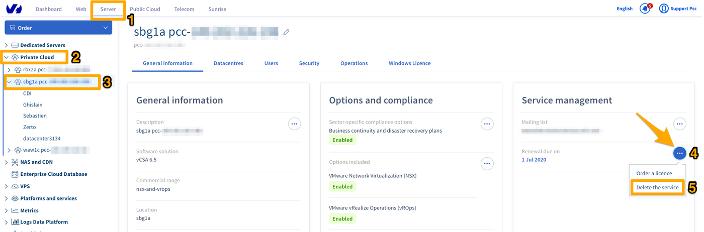
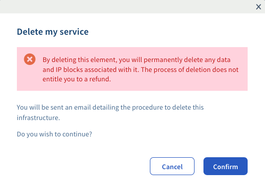

## Objectif

Si votre offre Private Cloud ne vous convient plus, ou que vous avez commandé une nouvelle infrastructure pour remplacer l'ancienne, vous pouvez demander la résiliation de cette infrastructure, une fois toutes vos données récupérées.

**Découvrez comment demander la résiliation d'une offre Private Cloud** 

## Prérequis

- Posséder un produit [Private Cloud](https://www.ovhcloud.com/fr/enterprise/products/hosted-private-cloud/).

<!-- CP-NAV-START:privatecloud-vmware-vsphere -->
---

### Accès à l'espace client OVHcloud

- **Lien direct :** [VMware vSphere](/links/control-panel/privatecloud-vmware-vsphere)
- **Pour accéder à vos services :** `Hosted Private Cloud`{.action} > `Managed VMware vSphere`{.action} > Sélectionnez votre service vSphere

---
<!-- CP-NAV-END:privatecloud-vmware-vsphere -->

## En pratique

L'offre Private Cloud est sans engagement. Cependant, comme indiqué dans les [Conditions Particulières du Service](http://www.ovh.com/fr/support/documents_legaux/conditions_particulieres_dedicated_cloud_2014.pdf), tout mois commencé est dû et payable d’avance.

>[!warning]
>
> Avant de résilier votre offre, veuillez prendre garde à récupérer toutes les données que vous souhaitez conserver. En effet, la résiliation entrainera la suppression intégrale de votre Private Cloud et toutes les données qu'il contient.
>

### Étape 1 : demander la résiliation depuis l'espace client OVHcloud

<!-- CP-STEPS-START:cancel-step1 -->
Dans le tableau « Gestion du service » de l'onglet `Informations Générales`{.action}, cliquez sur le bouton `...`{.action} (4) à droite de la date de renouvellement. Cliquez enfin sur `Supprimer le service`{.action} (5).

{.thumbnail}

Prenez alors connaissance du fait que cette action supprimera toute donnée présente sur l'infrastructure dès la confirmation de la résiliation. Aucun remboursement au prorata ne sera effectué si l'infrastructure est résiliée avant la fin du mois.

Cliquez sur `Valider`{.action} pour demander la résiliation.

{.thumbnail}

Une notification de confirmation de votre demande vous sera alors présentée. La procédure de confirmation de la résiliation vous est envoyée par e-mail, à l'adresse liée au compte OVHcloud.

{.thumbnail}
<!-- CP-STEPS-END:cancel-step1 -->

### Étape 2 : confirmer la résiliation

Suite à votre demande, un e-mail de confirmation de résiliation vous est envoyé à l'adresse liée au compte OVHcloud. 

<!-- CP-STEPS-START:cancel-step2 -->
Vous pouvez également retrouver cet e-mail dans votre espace client OVHcloud. Cliquez sur votre nom en haut à droite puis sur `E-mails de service`{.action}.

{.thumbnail}
<!-- CP-STEPS-END:cancel-step2 -->

L'objet de l'e-mail est :

> **Suppression de votre Private Cloud pcc-xxx-xxx-xxx-xxx**".

L'e-mail contient un lien cliquable qui vous permettra de confirmer la résiliation de votre offre.

> [!primary]
>
> Attention, ce lien est valable pendant **72 heures**. Nous vous conseillons donc de formuler votre demande de résiliation à partir du 25 du mois.
>

Vous pouvez également valider la demande de résiliation via l'API OVHcloud suivante :

> [!api]
>
> @api {v1} /dedicatedCloud POST /dedicatedCloud/{serviceName}/confirmTermination
>

Vous devrez alors renseigner le token de validation disponible dans l'e-mail de confirmation de résiliation.

## Aller plus loin

Échangez avec notre [communauté d'utilisateurs](/links/community).