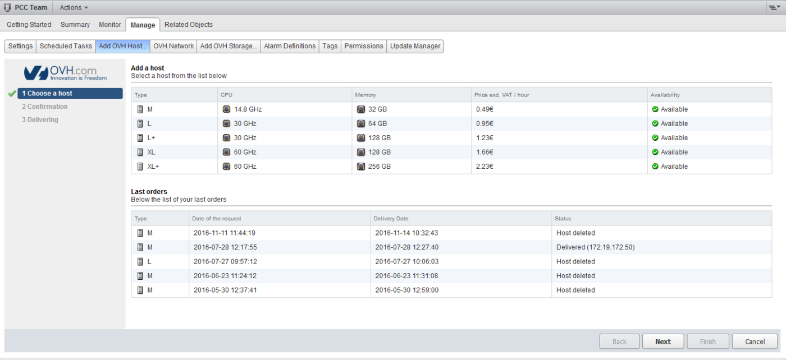
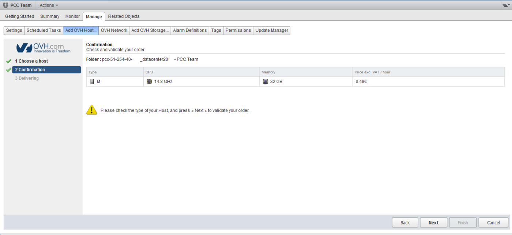
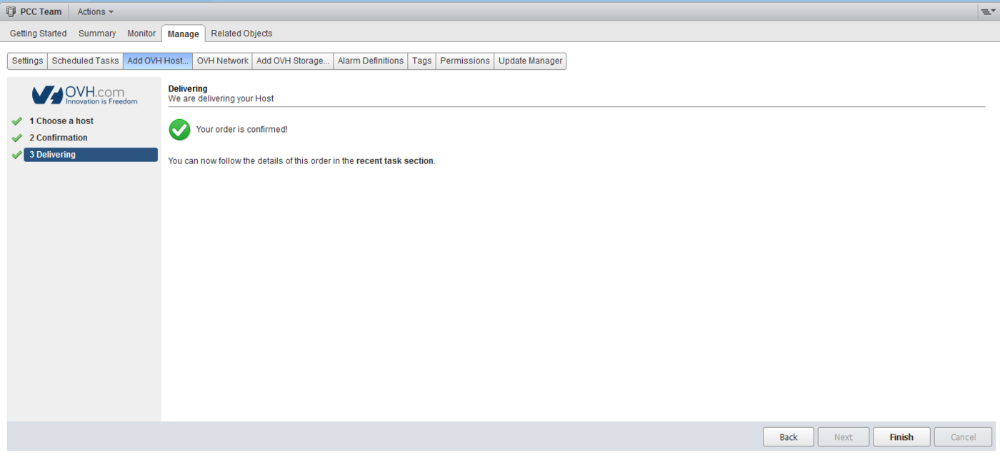
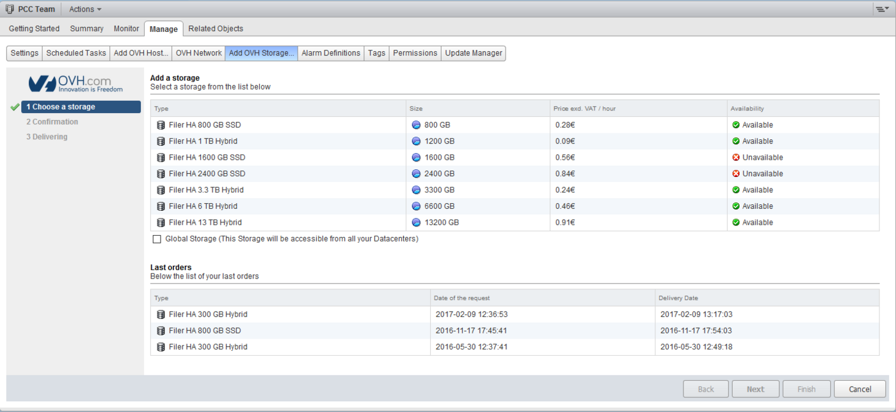
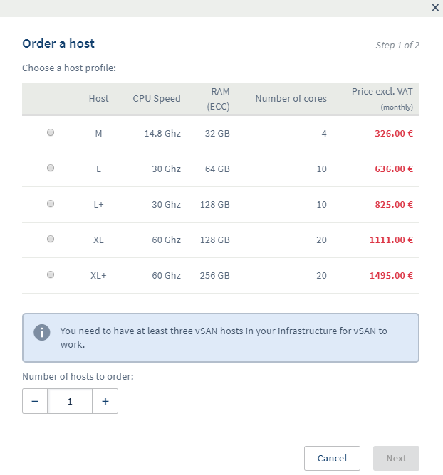
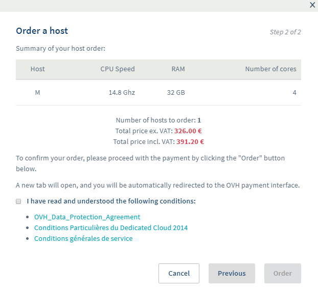
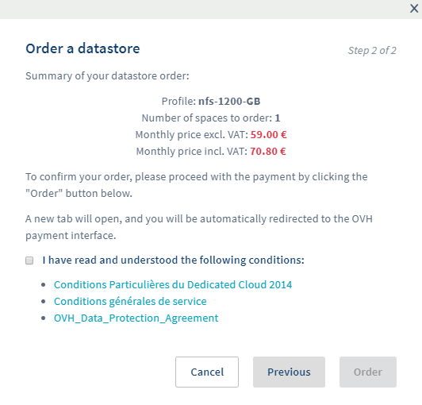
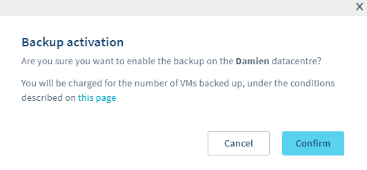

## Objective

The Hosted Private Cloud offer has two types of billing (hourly and monthly) for renewing and ordering additional resources.

**This guide explains how Hosted Private Cloud billing works**

## Instructions

### Infrastructure billing

The Hosted Private Cloud solution is billed automatically on the first day of each month.

When you renew your service, you will be charged to your OVHcloud account, and your solution will be renewed for one month. From this point onwards, there are three possible cases:

- Your OVHcloud account is not credited, but you have a means of payment registered in your OVHcloud account. A debt will be created on the first day of the month, and will be repaid automatically a few days later using your payment method.

- Your OVHcloud account has already been credited. It will be debited on the first day of the month, and no debt will be created.

- Your OVHcloud account is not credited and you do not have a means of payment registered. If this is the case, you will need to make a payment before the 9th of the month, otherwise your infrastructure will have its network cut off.

If your account is credited but not sufficiently, a debt will be created for the remaining amount. If a payment method is registered, the first case will apply, otherwise the last case will apply.

### Infrastructure order

When you place a new order, you pay for a full month's rental of the infrastructure. After one month's rental, a pro rata invoice will be drawn up to align the renewal date with the 1st of the month.

#### Example

You order your infrastructure on May 20th, your offer will be created on May 20th and will expire on June 20th. On June 20th, you will have a pro rata bill that covers the period from June 21st to June 30th, and your offer will expire on July 1st. It will then be renewed every first month, as explained above.

### Hourly resources

In your vSphere client, you can order resources (hosts and datastores) by the hour, via the `Add OVH Host`{.action} and `Add OVH Storage`{.action} tabs.

#### Hourly billing

These hourly resources are billed on the following month's invoice.

##### Example:

If you order a host on the 25th of the month and delete it on the 29th, you will see the host's hourly consumption on the following month's invoice.

If you keep this host for the following month, you will also see the consumption since the 25th and the hourly billing will start again from zero on the first day of the month.

If you keep a 2016/2018 SDDC or Dedicated Cloud host billed on an hourly basis for an entire month, the hourly cost will be charged at the monthly price. 

If you keep a Premier range host billed on an hourly basis for an entire month, the hourly price for the resource, as shown on [this page](https://www.ovhcloud.com/es-es/enterprise/products/hosted-private-cloud/hosts/), will be applied. The hourly cost is no longer included in the monthly price.

#### Ordering a Host via the vSphere Client

On your vSphere client, go to the `Add OVH Host`{.action} tab, and you will see the different types of hosts compatible with your infrastructure.

You will find a summary of their CPU/RAM resources, their availability in real time and the price per hour.

Further down, you will find a second table with the history of your hosts.

{.thumbnail}

By clicking `Next`{.action}, you will land on the summary and confirmation request for your order.

{.thumbnail}

Click `Next`{.action} again, and the command will be executed. You can then click on the `Finish`{.action} button to return to the first page of this tab.

{.thumbnail}

#### Ordering a Datastore via the vSphere Client

The procedure for ordering a datastore is similar to that for ordering a host.

Go to your vSphere client, then click on the `Add OVH Storage`{.action} tab. You will find a list of datastores compatible with your infrastructure, their size, real-time availability and hourly rates.

{.thumbnail}

The `Global Storage` box allows you to make the datastore accessible from all the datacentres of your Hosted Private Cloud.

If you have several datacentres in your infrastructure, the datastore will be accessible from each of them. However, it cannot be used on multiple separate Hosted Private Cloud infrastructures.

### Monthly resources

You can order monthly resources via the OVHcloud Control Panel, in the `datacentre`{.action} tab of your Hosted Private Cloud.

#### Monthly billing

Our invoicing system is based on the pro rata temporis principle, which is applied as soon as the resource is ordered.

##### Example:

If you order a resource on June 5th, you will be billed for the period from June 5th to June 30th.

#### Ordering a Host via the Control Panel

In the OVHcloud Control Panel, you can order a host by clicking the `Order host`{.action} button. A window will open, giving you the choice of hosts in your infrastructure, with CPU/RAM resources and the monthly price ex. VAT.

You can order several at once.

{.thumbnail}

By clicking `Next`{.action}, you will have a summary of the order, and will be asked to accept the terms of use for the service.

{.thumbnail}

A purchase order will be issued, and once paid, delivery will begin.

#### Ordering a Datastore via the Control Panel

The procedure for ordering a datastore is similar to that for ordering a host.

In the OVHcloud Control Panel, the different types of datastore will be displayed in the window that opens, by clicking on `Order a datastore`{.action}.

{.thumbnail}

Then confirmation.

{.thumbnail}

In the OVHcloud Control Panel, there is no indication of availability. If a resource is not available, the order will remain on hold, and as a result, the rental period will only start when the resource is delivered.

### Windows licenses

From your OVHcloud Control Panel, you can activate SPLA licenses in order to [deploy Windows virtual machines with an OVHcloud license](/pages/hosted_private_cloud/hosted_private_cloud_powered_by_vmware/ovf_template).

After clicking the `Activate SPLA`{.action} button, the following window will open:

{.thumbnail}

Once you have confirmed the various conditions, you will be asked to validate a free purchase order so that the option can be activated.

This license will be billed at the beginning of the following month, based on the number of machines deployed and powered on in the previous month.

Billing is based on the pricing table available on [this page](https://www.ovhcloud.com/es-es/enterprise/products/hosted-private-cloud/images-licenses/). 

#### Examples

- You have an SDDC infrastructure with two L hosts. On this infrastructure, you boot two Windows Standard virtual machines. In this case, you will be charged €50 ex. VAT (2 x €25).

- You have an SDDC infrastructure with two L hosts and two XL hosts. On this infrastructure, you boot two Windows Standard virtual machines on the L hosts. During the month, one of the virtual machines is moved onto an XL host. In this case, you will be charged €75 ex. VAT (€25 + €50).

- You have a Hosted Private Cloud infrastructure with two M hosts. On this infrastructure, you start 11 Windows Standard virtual machines, and you create a DRS rule so that the 11 virtual machines are always on the same host. In this case, you will be charged €130 excl. VAT corresponding to a "Datacenter" license

- You have a Hosted Private Cloud infrastructure with two L+ hosts. On this infrastructure, you start three Windows Standard virtual machines and one Windows Datacenter virtual machine.

There are two cases here:

1. The virtual machines remain on the same host. In this case, you will only be billed for the *Datacenter* license, i.e. €260 ex. VAT.

2. One of the virtual machines is moved to the other host, in this case you will be charged the *Datacenter* license and a *Standard* license, i.e. €300 ex. VAT (€260 + €40).

A virtual machine will be billed upon startup for an entire month, regardless of the duration of use.

### Veeam Backup

From your OVHcloud Control Panel, you can enable the Veeam option, which will allow you to back up your virtual machines.

Activation is done on the button available in the `Backup`{.action} tab. You will need to confirm the activation in the window that opens.

{.thumbnail}

A Windows virtual machine will then be deployed on your infrastructure for a fixed cost of €20 ex. VAT, whatever your range and host types.

Each virtual machine backed up will cost €10 ex. VAT per month.

Veeam billing is calculated at the end of the month, and is visible on the next month's bill.

#### Example

You add your first virtual machine to your backup on June 5th. At the end of June, your backup will be processed and you will be charged €30 ex. VAT on July 1st.

- Veeam is billed at €10 ex. VAT/VM from activation and the first day of the month. If you remove a virtual machine from the backup during the month, it will be billed until the end of the month.

- Your virtual machine added on June 5th is deleted by you on July 16th. At the end of July, your backup will be processed, and you will be billed on August 1st for this machine. However, you will no longer be billed on September 1st.

## Go further

Join our community of users on <https://community.ovh.com>.
