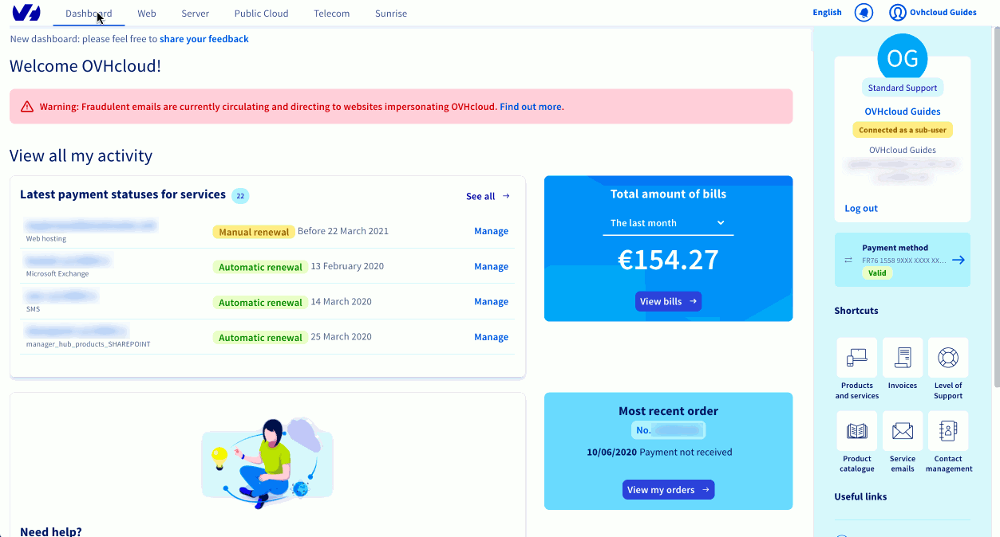

## Wprowadzenie

Najczęściej zadawane pytania dotyczące śledzenia zamówień OVHcloud.

### Jak zapłacić za nowe zamówienie?

Możesz opłacić zamówienie tylko po zalogowaniu się do konta klienta. Wybierz sposób płatności zarejestrowany na Twoim koncie lub dodaj nowy. Jeśli regulujesz płatność kartą kredytową, możliwe, że Twój bank wyśle Ci w wiadomości SMS kod służący do uwierzytelnienia transakcji. Zostaniesz poproszony o jego wprowadzenie na określonym etapie realizacji płatności. Po zaksięgowaniu wpłaty OVHcloud wyśle Ci stosowną informację i powiadomi o statusie realizacji zamówienia.

#### Wskazówki i porady

<!-- CP-STEPS-START:pay-new-order -->
Zamknąłeś stronę z Twoim zamówieniem? Otwórz stronę [Moje zamówienia](/links/control-panel/billing-orders). Następnie będziesz mógł wyświetlić zamówienie i uregulować należność.
<!-- CP-STEPS-END:pay-new-order -->

### Jak mogę sprawdzić status mojej płatności?

<!-- CP-STEPS-START:check-payment-status -->
Otwórz stronę [Faktury](/links/control-panel/billing-invoices). Jeśli któraś z faktur oznaczona jest jako oczekująca na płatność, zaproponujemy Ci uregulowanie salda.

#### Wskazówki i porady

Na stronie [Moje sposoby płatności](/links/control-panel/billing-payment-methods) możesz dodać sposób płatności. Umożliwi Ci to opłacanie faktur w sposób automatyczny.
<!-- CP-STEPS-END:check-payment-status -->

### Jak mogę śledzić status mojego zamówienia?

<!-- CP-STEPS-START:track-order-status -->
Otwórz stronę [Moje zamówienia](/links/control-panel/billing-orders).
<!-- CP-STEPS-END:track-order-status -->

#### Wskazówki i porady

Aby ułatwić Ci zarządzanie zamówieniami, oddajemy w do Twojej dyspozycji [szczegółowy przewodnik](/pages/account_and_service_management/managing_billing_payments_and_services/managing_ovh_orders).

### Jak mogę zmienić zamówienie?

Nie można zmienić zamówienia. Niemniej jednak, w przypadku nieuregulowania płatności, zamówienie wygaśnie w sposób automatyczny.

#### Wskazówki i porady

Jeśli zapłaciłaś/eś już za Twoje zamówienie, zapraszamy do skontaktowania się z [naszym działem obsługi klienta](https://www.ovhcloud.com/pl/contact/).

### Jak anulować zamówienie?

W przypadku nieuregulowania płatności, Twoje zamówienie zostanie automatycznie anulowane po upływie jego ważności.
Jako osoba prywatna, jeżeli zapłaciłaś/eś już za Twoje zamówienie, ale zamówienie to nie łączy się ze spersonalizowaną usługą (jak nazwa domeny) lub z daną licencją (jak Office 365 lub licencje systemów operacyjnych, paneli administracyjnych i dystrubycji), masz możliwość rezygnacji w ciągu 14 dni. Oddajemy do Twojej dyspozycji [szczegółowy przewodnik](/pages/account_and_service_management/managing_billing_payments_and_services/managing_ovh_orders#korzystanie-z-prawa-do-odstapienia-od-umowy), gdzie znajdziesz wszystkie niezbędne informacje na ten temat.

#### Wskazówki i porady

Jako osoba reprezentująca firmę, nie podlegasz rozporządzeniom artykułu wstępnego Kodeksu konsumenckiego w kwestii prawa odstąpienia od umowy w ciągu 14 dni.

### Dlaczego moja usługa nie została dostarczona?

<!-- CP-STEPS-START:service-not-delivered -->
Ewentualne opóźnienie w dostarczeniu zamówionej usługi może być spowodowane kilkoma przyczynami.
Aby zagwarantować swoim klientom pełną ochronę, OVHcloud zwraca szczególną uwagę na kwestię bezpieczeństwa transakcji finansowych. W tym celu wdrożyliśmy procedurę losowego zatwierdzania płatności, która może powodować opóźnienia w realizacji zamówienia. Aby sprawdzić, czy właśnie ta procedura nie jest przyczyną opóźnienia, możesz sprawdzić status Twoich płatności w Panelu klienta, w sekcji `Płatności`{.action}.

Inną przyczyną może być faktura, która wciąż nie została zapłacona. Jeżeli ma to miejsce, prosimy o uregulowanie odpowiadającego jej salda udając się do sekcji `Moje sposoby płatności`{.action} w Twoim Panelu klienta.

{.thumbnail}

#### Wskazówki i porady

Na stronie [Moje sposoby płatności](/links/control-panel/billing-payment-methods) możesz dodać sposób płatności. Umożliwi Ci to opłacanie faktur w sposób automatyczny.
<!-- CP-STEPS-END:service-not-delivered -->

## Sprawdź również

Dołącz do [grona naszych użytkowników](/links/community).