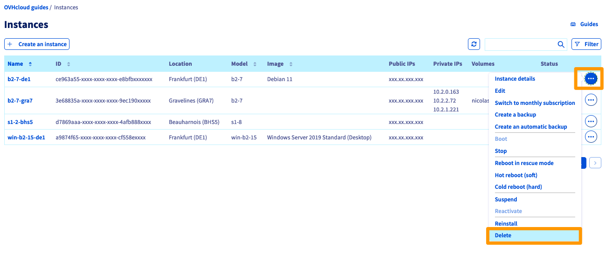

> [!primary]
> Diese Übersetzung wurde durch unseren Partner SYSTRAN automatisch erstellt. In manchen Fällen können ungenaue Formulierungen verwendet worden sein, z.B. bei der Beschriftung von Schaltflächen oder technischen Details. Bitte ziehen Sie im Zweifelsfall die englische oder französische Fassung der Anleitung zu Rate. Möchten Sie mithelfen, diese Übersetzung zu verbessern? Dann nutzen Sie dazu bitte den Button "Beitragen" auf dieser Seite.
>

## Ziel

Sie möchten einen oder mehrere OVHcloud Dienste kündigen. In dieser Anleitung erfahren Sie, wie Sie Abonnements über das OVHcloud Kundencenter beenden können.

- Beachten Sie zunächst die Informationen im nachfolgenden Abschnitt "[Was passiert, wenn ein OVHcloud Dienst gekündigt wird?](#consequences)".
- Folgen Sie den Schritten im Bereich "[Wie kann ich mein Abonnement kündigen?](#terminate)".

> [!primary]
>
> Ihre Meinung zu erhalten, ist für uns sehr wichtig. So können wir unsere Dienstleistungen so weiterentwickeln, dass sie Ihren Bedürfnissen und Erwartungen am besten entsprechen.
>
> Bitte teilen Sie uns Ihre Erfahrungen mit OVHcloud Diensten mit, indem Sie das Formular ausfüllen. Wir danken Ihnen im Voraus für Ihren Beitrag zur Verbesserung unserer Produkte.
>

## Was passiert, wenn ein OVHcloud Dienst gekündigt wird? 

Die Kündigung eines OVHcloud Dienstes bedeutet, dass er am Ende der Vertragslaufzeit **endgültig** eingestellt wird (unter Ausnahme von [Domainnamen](#domain)). Sie können Ihre Dienstleistung bis zu 24 Stunden vor dem Vertragsende kündigen oder [eine laufende Kündigungsanfrage zurückziehen](#cancel).

Handelt es sich um ein E-Mail-Angebot, einen Server oder ein Webhosting, so werden alle betroffenen Daten gelöscht, **ohne dass eine Wiederherstellung möglich ist**.

Handelt es sich um einen Domainnamen, wird er wieder in Umlauf gebracht und **kann von anderen Kunden bestellt werden**.

Sie sollten also vor einer Kündigung **sicherstellen**, dass Folgendes zutrifft:

- Der Vorgang betrifft nur Dienste, die Sie nicht mehr verwenden möchten.
- Sie verfügen erforderlichenfalls über eine bereits *funktionale* Alternative.
- Wenn nötig sind alle betroffenen Daten an anderer Stelle gesichert.

> [!primary]
> **Kündigung eines Domainnamens**
>
> Nach Ihrer Kündigung und dem Ende des laufenden Abonnements bleibt Ihr generischer Domainname (.com, .org, .net, etc.) für die sog. "*grace period*" (ca. 7 Tage) und dann für einen "*Redemption*"-Zeitraum (ca. 35 bis 40 weitere Tage) reserviert. Das bedeutet, dass nur Sie selbst berechtigt sind, ihn während dieser Zeiträume verlängern.
>
Weitere Informationen finden Sie in den [FAQ](/pages/account_and_service_management/managing_billing_payments_and_services/how_to_use_automatic_renewal#faq) am Ende unserer Anleitung zur [Verlängerung von OVHcloud Diensten](/pages/account_and_service_management/managing_billing_payments_and_services/how_to_use_automatic_renewal).
>

## Voraussetzungen

- Sie sind der "Administrator-Kontakt" des Dienstes, den Sie kündigen möchten (weitere Informationen finden Sie in [dieser Anleitung](/pages/account_and_service_management/account_information/managing_contacts#definition)).
- Sie haben Zugriff auf Ihr [OVHcloud Kundencenter](/links/manager).
- Sie haben aktive OVHcloud Dienste (die nicht wegen eines Zahlungsverzugs gesperrt sind).

## In der praktischen Anwendung

Das Kündigungsverfahren ist für die meisten OVHcloud Dienste gleich.

Es gibt jedoch auch **Sonderfälle**, die [weiter unten](#specific-cases) in dieser Anleitung detailliert beschrieben werden.

## Wie kann ich ein Abonnement kündigen? 

Um das Abonnement Ihres Dienstes zu kündigen, loggen Sie sich in Ihr [OVHcloud Kundencenter](/links/manager) ein, klicken Sie oben rechts auf den Account-Namen und dann auf den Button `Produkte und Dienste`{.action}.

{.thumbnail}

Klicken Sie dann rechts neben dem Dienst, den Sie kündigen möchten, auf den Button `...`{.action} und dann auf `Meine Vertragsbindung kündigen`{.action}.

{.thumbnail}

Bitte geben Sie die Gründe für Ihre Kündigungsanfrage an und klicken Sie dann auf `Bestätigen`{.action}.

> [!primary]
>
> Ihre Meinung zu erhalten, ist für uns sehr wichtig. So können wir unsere Dienstleistungen so weiterentwickeln, dass sie Ihren Bedürfnissen und Erwartungen am besten entsprechen.
>
> Bitte teilen Sie uns Ihre Erfahrungen mit OVHcloud Diensten mit, indem Sie das Formular ausfüllen. Wir danken Ihnen im Voraus für Ihren Beitrag zur Verbesserung unserer Produkte. 
>

Die Kündigung Ihrer Dienstleistung erfolgt zum **Datum des Inkrafttretens** in der Tabelle "Meine Dienste". Wenn der Status "Kündigung angefordert" nicht angezeigt wird, aktualisieren Sie die Seite.

{.thumbnail}

### Sonderfälle 

#### MX Plan E-Mail 

Die meisten MX Plan Dienstleistungen sind an ein Hosting gebunden. Wenn dies der Fall ist und Sie diese E-Mail-Option löschen möchten, folgen Sie [den Anweisungen in dieser Anleitung](/pages/web_cloud/web_hosting/activate-email-hosting/#beenden-ihrer-e-mail-option-in-verbindung-mit-dem-webhosting). **Achtung**, das Löschen eines MX Plan führt zur endgültigen Löschung aller zugehörigen Daten und gewährt keine Rückerstattung.

Wenn Ihr MX Plan E-Mail-Angebot unabhängig von einem Webhosting bestellt wurde, folgen Sie [der detaillierten Vorgehensweise oben](#terminate).

#### E-Mail Pro 

Um [E-Mail Pro](https://www.ovhcloud.com/de/emails/email-pro/) zu kündigen, folgen Sie den Anweisungen in [dieser Anleitung](/pages/web_cloud/email_and_collaborative_solutions/email_pro/manage_billing_emailpro#konten-entfernen).

#### Hosted Exchange 

Um [Hosted Exchange](https://www.ovhcloud.com/de/emails/hosted-exchange/) zu kündigen, folgen Sie den Anweisungen in [dieser Anleitung](/pages/web_cloud/email_and_collaborative_solutions/microsoft_exchange/manage_billing_exchange#accounts-entfernen).

#### Private Exchange 

Um [Private Exchange](https://www.ovhcloud.com/de/emails/private-exchange/) zu kündigen, folgen Sie den Anweisungen in [dieser Anleitung](/pages/web_cloud/email_and_collaborative_solutions/microsoft_exchange/manage_billing_exchange#accounts-entfernen_1).

#### Office 365 CSP1 

Um [Office 365 CSP1](https://www.ovhcloud.com/de/collaborative-tools/microsoft-365/) zu kündigen, folgen Sie den Anweisungen in [dieser Anleitung](/pages/web_cloud/email_and_collaborative_solutions/microsoft_office/office_csp1#ihre-abonnements-verwalten).

#### Office 365 CSP2 

Um [Office 365 CSP2](https://www.ovhcloud.com/de/collaborative-tools/microsoft-365/) zu kündigen, folgen Sie den Anweisungen in [dieser Anleitung](/pages/web_cloud/email_and_collaborative_solutions/microsoft_office/office_csp2#ihre-abos-verwalten).

#### Sectigo SSL Zertifikat 

Bei den [Sectigo SSL](https://www.ovhcloud.com/de/web-hosting/options/ssl/) Angeboten ist eine Kündigung vor Ablauf nicht möglich, da diese nicht automatisch verlängert werden. Es genügt also, wenn Sie diese zum nächsten Termin nicht verlängern.

#### Managed Bare Metal 

Um Ihren [Managed Bare Metal](https://www.ovhcloud.com/de/managed-bare-metal/) Dienst zu kündigen, folgen Sie den Anweisungen in [dieser Anleitung](/pages/bare_metal_cloud/managed_bare_metal/how-to-cancel).

#### VMware on OVHcloud 

Um Ihre [VMware on OVHcloud](https://www.ovhcloud.com/de/hosted-private-cloud/) zu kündigen, folgen Sie den Anweisungen in [dieser Anleitung](/pages/account_and_service_management/managing_billing_payments_and_services/comment_resilier_le_private_cloud).

### Public Cloud 

Jeder Public Cloud Dienst kann gelöscht werden, indem Sie rechts neben dem betreffenden Dienst `...`{.action} und dann auf `Löschen`{.action} klicken, wie im folgenden Beispiel für eine Instanz abgebildet:

{.thumbnail}

Die OVHcloud Public Cloud basiert auf dem Prinzip *Pay as you go* (weitere Details finden Sie auf unserer Seite zum [Abrechnungsmodus Public Cloud](/pages/public_cloud/compute/analyze_billing)). Sie zahlen am Monatsende nur für die Zeit, in der die Ressourcen tatsächlich genutzt wurden.

Sie können Ihren [aktuellen Verbrauch](/pages/public_cloud/compute/analyze_billing#aktuelle-ressourcennutzung-anzeigen) auch über das OVHcloud Kundencenter einsehen und per E-Mail benachrichtigt werden, wenn die Projektion Ihres Nutzungsvolumens einen bestimmten Grenzwert überschreitet.

## Wie kann ich die Kündigung eines Abonnements abbrechen? 

> [!warning]
>
> Sie können eine Kündigungsanfrage nur bis zu 24 Stunden vor dem Kündigungsdatum stornieren.
>

Um eine Kündigungsanfrage zurückzunehmen, loggen Sie sich in Ihr [OVHcloud Kundencenter](/links/manager) ein, klicken Sie oben rechts auf Ihren Account-Namen und dann auf den Button `Produkte und Dienstleistungen`{.action}.

Klicken Sie dann auf den Button `...`{.action} rechts neben der Dienstleistung, für die eine Kündigung beantragt wurde, und dann auf `Kündigung des Dienstes stornieren`{.action} 

{.thumbnail}

Klicken Sie dann auf `Stornierung bestätigen`{.action}.

Die Kündigung wird mit sofortiger Wirkung rückgängig gemacht. Aktualisieren Sie die Seite "Meine Dienste", wenn Sie immer noch den Status "Kündigung angefordert" sehen.

## FAQ

> [!faq]
>
> Ich kann eine Dienstleistung nicht kündigen. Was soll ich tun?
>> Wenn Sie eine Dienstleistung nicht kündigen können (die Schaltfläche `Meine Vertragsbindung kündigen`{.action} ist nicht verfügbar), kann diese zu den detaillierten Sonderfällen [weiter oben in dieser Anleitung](#specific-cases) gehören.
>> Überprüfen Sie außerdem, ob die folgenden Bedingungen erfüllt sind:
>>
>> - Sie müssen der "Administrator-Kontakt" des Dienstes sein. Weitere Informationen finden Sie in [dieser Anleitung](/pages/account_and_service_management/account_information/managing_contacts#definition).
>> - Der Dienst wird **automatisch** verlängert. Wenn Ihr Dienst die [manuelle Verlängerung](/pages/account_and_service_management/managing_billing_payments_and_services/how_to_use_automatic_renewal#auto-vs-manual) nutzt, wird er erst am Ablaufdatum gesperrt und nach einigen Tagen gelöscht.
>> - Der Dienst wurde nicht suspendiert, insbesondere aufgrund einer nicht beglichenen Rechnung. Stellen Sie sicher, dass die [Zahlungen](/pages/account_and_service_management/managing_billing_payments_and_services/invoice_management#pay-bills) und [Verlängerungen](/pages/account_and_service_management/managing_billing_payments_and_services/how_to_use_automatic_renewal#renewal-management) Ihrer Dienste auf dem neuesten Stand sind.
>>
>> Wenn Sie Ihren Dienst immer noch nicht kündigen können, kontaktieren Sie unsere Support-Teams, indem Sie ein Ticket im [Help Center](https://help.ovhcloud.com/csm?id=csm_get_help) öffnen.
> Wie kann ich alle meine Dienstleistungen kündigen?
>> Sie müssen den Kündigungsprozess für jede Dienstleistung durchführen. Es ist nicht möglich, mehrere Dienstleistungen gleichzeitig zu kündigen oder eine globale Kündigung seitens unseres Kundendienstes zu veranlassen.
> Wie kann ich meinen OVHcloud Kunden-Account löschen?
>> Die Schließung Ihres OVHcloud Kunden-Accounts und die Löschung Ihrer personenbezogenen Daten ist nur unter diesen Voraussetzungen möglich:
>>
>> 1. Sie haben keine Dienstleistungen mehr im Bereich "[Meine Dienste](https://www.ovh.com/manager/dedicated/#/billing/autoRenew)". Ist dies nicht der Fall, müssen Sie zunächst deren Kündigung beantragen und auf deren Löschung warten.
>> 2. Sie haben keine ausstehenden Rechnungen. Ist das nicht der Fall, müssen Sie die Zahlung vornehmen, indem Sie in den Massenaktionen auf der Seite "[Meine Rechnungen](https://www.ovh.com/manager/#/dedicated/billing/history)" auf den Button `Sofort zahlen`{.action} klicken.
>> 3. Sie haben keine laufenden Bestellungen. Prüfen Sie diese auf [dieser Seite](https://www.ovh.com/manager/#/dedicated/billing/orders/orders).
>> 4. Ihr Prepaid-Konto ist ausgeglichen (Saldo 0,00€). Prüfen Sie dies auf [dieser Seite](https://www.ovh.com/manager/#/dedicated/billing/payment/ovhaccount).
>>
>> Wenn die oben genannten Bedingungen erfüllt sind, können Sie die Löschung Ihres OVHcloud Accounts und der zugehörigen Daten beantragen, indem Sie folgende Schritte ausführen:
>>
>> 1. Loggen Sie sich ein und gehen Sie zum [OVHcloud Help Center](https://help.ovhcloud.com/csm?id=csm_get_help).
>> 2. Klicken Sie auf den Button `Ticket erstellen`{.action}.
>> 3. Wählen Sie den Zweck `Verwalten Sie IhrenOVHcloud Kunden-Account` aus.
>> 4. Geben Sie `Ich möchte meinen OVHcloud Account schließen` an und folgen Sie den angezeigten Schritten.

## Weiterführende Informationen

[Verlängerung Ihrer OVHcloud Dienste verwalten](/pages/account_and_service_management/managing_billing_payments_and_services/how_to_use_automatic_renewal)

Für den Austausch mit unserer User Community gehen Sie auf <https://community.ovh.com/en/>.
