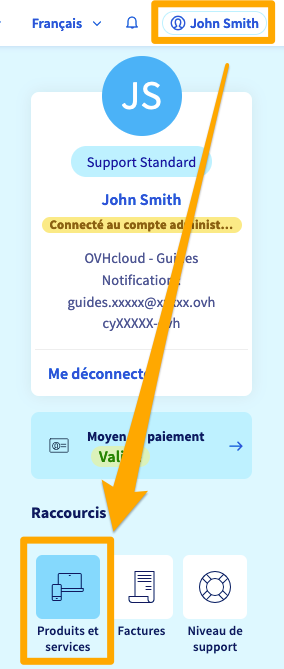
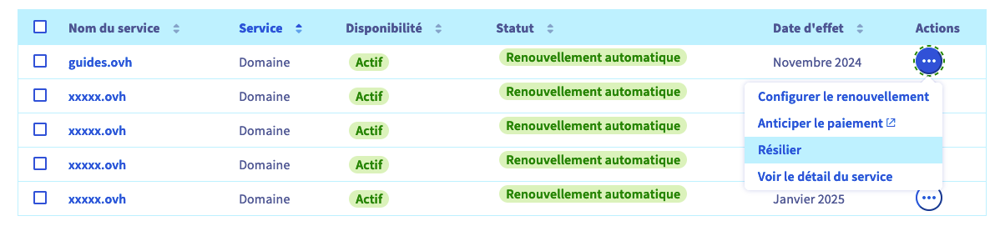
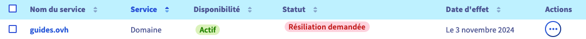
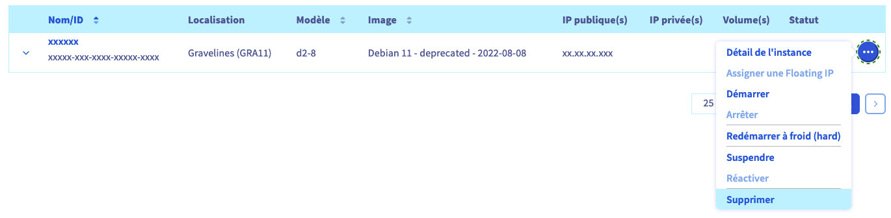
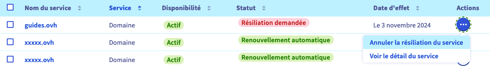

## Objectif

Vous souhaitez résilier un ou plusieurs services OVHcloud. Ce guide vous indiquera comment interrompre votre abonnement depuis l'espace client OVHcloud.

- Tout d'abord, prenez connaissance de la partie « Que se passe-t-il lorsqu'un service OVHcloud est résilié ? » ci-dessous.
- Choisissez ensuite le produit concerné dans la partie « [Comment résilier votre abonnement ?](#terminate) ».

### Que se passe-t-il lorsqu'un service OVHcloud est résilié ? 

La « résiliation » d'un service OVHcloud implique qu'il sera interrompu **de façon définitive** à la fin de l'abonnement en cours (avec une exception, toutefois, pour les [noms de domaines](#domain)). 
Vous pouvez résilier votre service ou [annuler une demande de résiliation](#cancel) jusqu'à 24 heures avant la date de fin d'abonnement.

S'il s'agit d'une offre de messagerie, d'un serveur ou d'un hébergement Web, l'ensemble des données concernées seront supprimées **sans possibilité de récupération**. 
S'il s'agit d'un nom de domaine ou d'un numéro de téléphone, ils seront remis en circulation et pourront être **commandés par d'autres clients**.

Avant de procéder à la résiliation d'un service, vous devez donc être **certain** :

- que l'opération va concerner un service que vous ne souhaitez plus utiliser ;
- que vous possédez une solution **fonctionnelle** pour le remplacer ;
- que vous avez sauvegardé l'ensemble des données concernées.

> [!primary]
> **Résiliation d'un nom de domaine**
>
> Suite à votre résiliation et à la fin de l'abonnement en cours, votre nom de domaine générique (.com, .org. net, etc.) vous reste « réservé » pendant une période dite « de « *grâce* » (environ 7 jours) puis pendant celle de « *rédemption* » (environ 35 à 40 jours supplémentaires). Cela signifie que vous seul serez en mesure de le renouveler pendant ces périodes. Pour plus de détails, consultez la [FAQ](/pages/account_and_service_management/managing_billing_payments_and_services/how_to_use_automatic_renewal#faq) en bas de notre guide « [Comment renouveler mes services OVHcloud](/pages/account_and_service_management/managing_billing_payments_and_services/how_to_use_automatic_renewal) ».
>

## Prérequis

- Etre le « contact administrateur » du service à résilier (pour plus d'informations, consultez [ce guide](/pages/account_and_service_management/account_information/managing_contacts#definition))
- Avoir accès à votre [espace client OVHcloud](/links/manager) ;
- Posséder des services OVHcloud actifs (non suspendus pour un défaut de paiement)

## En pratique

La procédure de résiliation est identique pour la majorité des services OVHcloud.

Des **cas particuliers** existent néanmoins et sont détaillés [plus bas](#specific-cases) dans ce guide.

### Comment résilier votre abonnement ? 

Pour résilier l'abonnement à votre service, connectez-vous à votre [espace client OVHcloud](/links/manager), cliquez sur votre nom en haut à droite puis sur le bouton `Produits et services`{.action}.

{.thumbnail}

Cliquez ensuite sur le bouton `...`{.action} à droite du service à résilier, puis sur `Résilier`{.action}.

{.thumbnail}

Précisez les raisons de votre demande de résiliation puis cliquez sur `Valider`{.action}.

> [!primary]
>
> Obtenir votre avis est essentiel pour nous. Cela nous permet de faire évoluer nos services, afin qu'ils répondent au mieux à vos besoins et à vos attentes.
>
> N'hésitez donc pas à nous en dire plus sur votre expérience personnelle avec OVHcloud via le formulaire proposé lors de la résiliation. Nous vous remercions par avance de votre contribution à l'amélioration de nos produits.
>

La résiliation de votre service aura lieu à la **date d'effet** indiquée dans le tableau « Mes services ». Si vous ne voyez pas le statut « Résiliation demandée » apparaître, rafraîchissez la page.

{.thumbnail}

### Cas particuliers 

#### E-mail MX Plan 

La plupart des services MX Plan sont liés à un hébergement. Si c'est le cas et que vous souhaitez supprimer cette option e-mail, suivez [les instructions de ce guide](/pages/web_cloud/web_hosting/activate-email-hosting/#suppression-de-loffre-e-mail-liee-a-votre-hebergement-web). **Attention**, la suppression d'un MX Plan entraîne l'effacement définitif de toutes les données correspondantes et n'octroie aucun remboursement.

Si votre offre e-mail MX Plan a été commandée indépendamment de tout hébergement, suivez [la procédure détaillée ci-dessus](#terminate)

#### Managed Bare Metal 

Pour résilier votre offre [Managed bare metal](https://www.ovhcloud.com/fr-ca/managed-bare-metal/), suivez les instructions de [ce guide](/pages/bare_metal_cloud/managed_bare_metal/how-to-cancel).

#### VMware on OVHcloud 

Pour résilier votre offre [VMware on OVHcloud](https://www.ovhcloud.com/fr-ca/enterprise/products/hosted-private-cloud/), suivez les instructions de [ce guide](/pages/account_and_service_management/managing_billing_payments_and_services/comment_resilier_le_private_cloud).

#### Public Cloud 

Chaque service [Public Cloud](https://www.ovhcloud.com/fr-ca/public-cloud/) peut être supprimé depuis l'onglet `Public Cloud`{.action} de l'espace client.

Sélectionnez un service à gauche, cliquez sur le bouton `...`{.action} à droite du service concerné, puis sur `Supprimer`{.action}, comme dans l'exemple ci-dessous pour une instance :

{.thumbnail}

Le Public Cloud OVHcloud repose sur le principe du *Pay as you go* (retrouvez plus de détails sur notre page d'[informations concernant le mode de facturation Public Cloud](/pages/public_cloud/compute/analyze_billing)). Vous ne payez en fin de mois que pour le temps d'utilisation effectif des ressources.

Vous pouvez également [consulter votre consommation actuelle](/pages/public_cloud/compute/analyze_billing#consulter-sa-consommation-actuelle) depuis l'espace client OVHcloud et être alerté par e-mail lorsque la projection de votre consommation dépasse un certain seuil.

## Comment annuler la résiliation de votre abonnement ? 

> [!warning]
>
> Vous pouvez annuler une demande de résiliation jusqu'à 24 heures avant la date de fin d'abonnement.
>

Pour annuler une demande de résiliation, connectez-vous à votre [espace client OVHcloud](/links/manager), cliquez sur votre nom en haut à droite puis sur le bouton `Produits et services`{.action}.

Cliquez ensuite sur le bouton `...`{.action} à droite du service faisant l'objet d'une demande de résiliation puis sur `Annuler la résiliation du service`{.action} 

{.thumbnail}

Enfin, cliquez sur `Confirmer l'annulation`{.action}.

L'annulation de la résiliation est à effet immédiat. Rafraîchissez la page « Mes services » si vous voyez toujours le statut « Résiliation demandée ».

## FAQ

> [!faq]
>
> Je ne parviens pas à résilier un service. Que faire ?
>> Si vous ne parvenez pas à résilier un service (le bouton `Résilier`{.action} n'est pas proposé), celui-ci peut faire partie des cas particuliers détaillés [plus haut dans ce guide](#specific-cases).
>> Vérifiez également que les conditions suivantes sont bien remplies :
>>
>> - Vous devez être le « contact administrateur » du service. Pour plus d'informations, consultez [ce guide](/pages/account_and_service_management/account_information/managing_contacts#definition).
>> - Le service est en **renouvellement automatique**. Si votre service est en [renouvellement manuel](/pages/account_and_service_management/managing_billing_payments_and_services/how_to_use_automatic_renewal#auto-vs-manual), il sera suspendu à sa date d'expiration puis supprimé au bout de quelques jours.
>> - Le service n'est pas suspendu, notamment en raison d'un défaut de régularisation d'une facture. Vérifiez que vous êtes à jour dans les [paiements](/pages/account_and_service_management/managing_billing_payments_and_services/invoice_management#pay-bills) et [renouvellements](/pages/account_and_service_management/managing_billing_payments_and_services/how_to_use_automatic_renewal#renewal-management) de vos services.
>>
>> Si vous ne parvenez toujours pas à résilier votre service, contactez nos équipes du support en ouvrant un ticket depuis le [centre d'aide](https://help.ovhcloud.com/csm?id=csm_cases_requests).
> Comment résilier tous mes services ?
>> Vous devez effectuer la procédure de résiliation pour chaque service de façon unitaire. Il n'est pas possible de résilier plusieurs services à la fois ou de demander une résiliation globale à nos équipes du support client.
> Comment supprimer mon compte OVHcloud ?
>> La fermeture de votre compte client OVHcloud et la suppression de vos données personnelles n'est possible que si :
>>
>> 1. Vous n'avez plus de services visibles dans la section « [Mes Services](https://www.ovh.com/manager/dedicated/#/billing/autoRenew) ». Dans le cas contraire, vous devrez dans un premier temps demander leur résiliation et attendre leur suppression.
>> 2. Vous n'avez pas de factures en attente de paiement. Dans le cas contraire, vous devez procéder à leur règlement en cliquant sur le bouton `Régler immédiatement`{.action} dans les actions de masses de la page « [Mes factures](https://www.ovh.com/manager/#/dedicated/billing/history) ».
>> 3. Vous n'avez pas de commande en cours. Vérifiez-le sur [cette page](https://www.ovh.com/manager/#/dedicated/billing/orders/orders).
>> 4. Votre compte prépayé n'est pas positif. Vérifiez-le sur [cette page](https://www.ovh.com/manager/#/dedicated/billing/payment/ovhaccount).
>>
>> Si les conditions ci-dessus sont remplies, vous pouvez demander à supprimer votre compte OVHcloud et les données liées en suivant ces étapes :
>>
>> 1. Connectez-vous au [Centre d'aide OVHcloud](https://help.ovhcloud.com/csm?id=csm_cases_requests)
>> 2. Cliquez sur le bouton `Créer un ticket`{.action}
>> 3. Sélectionnez le motif `Gérez votre compte client OVHcloud`
>> 4. Précisez `Je veux fermer mon compte client OVHcloud` et suivez les étapes décrites.

## Aller plus loin 

[Gérer le renouvellement de mes services](/pages/account_and_service_management/managing_billing_payments_and_services/how_to_use_automatic_renewal)

Échangez avec notre communauté d'utilisateurs sur <https://community.ovh.com/>.
