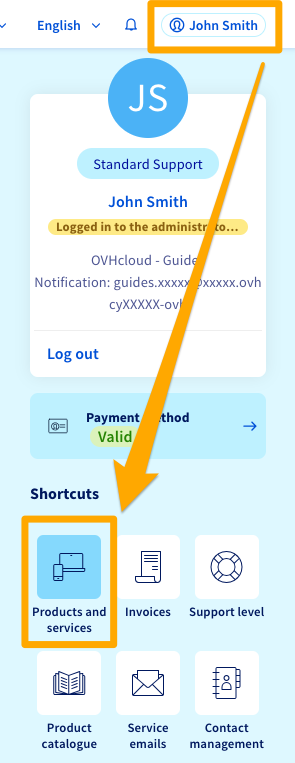
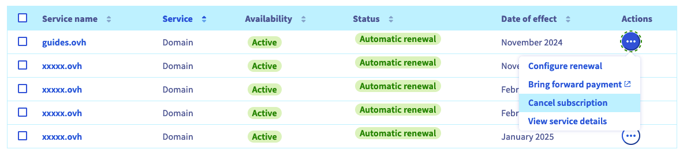
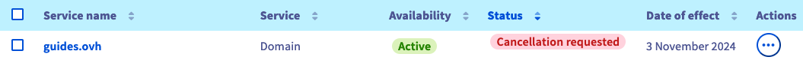
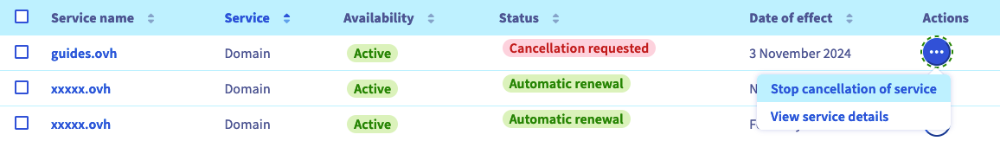

> [!primary]
> Questa traduzione è stata generata automaticamente dal nostro partner SYSTRAN. I contenuti potrebbero presentare imprecisioni, ad esempio la nomenclatura dei pulsanti o alcuni dettagli tecnici. In caso di dubbi consigliamo di fare riferimento alla versione inglese o francese della guida. Per aiutarci a migliorare questa traduzione, utilizza il pulsante "Contribuisci" di questa pagina.
>

## Obiettivo

Vuoi disattivare uno o più servizi OVHcloud. Questa guida ti mostra come interrompere l’abbonamento dallo Spazio Cliente OVHcloud.

- Per prima cosa, consulta la sezione "Cosa succede quando un servizio OVHcloud viene disattivato." di seguito.
- Seleziona il servizio nella sezione "[Come disdire l’abbonamento?](#terminate)".

### Cosa succede quando un servizio OVHcloud viene disattivato? 

La "disattivazione" di un servizio OVHcloud comporta l'interruzione **definitiva** del servizio al termine dell'abbonamento in corso (con un'eccezione, tuttavia, per i [domini](#domain)). È possibile disattivare il servizio o [annullare una richiesta di disattivazione](#cancel) fino a 24 ore prima della data di scadenza dell'abbonamento.

Se si tratta di un servizio di posta elettronica, di un server o di un hosting Web, tutti i dati in questione verranno eliminati **senza possibilità di recupero**.

Se si tratta di un dominio o di un numero di telefono, saranno rimessi in circolazione e potranno essere **ordinati da altri clienti**.

Questo implica che, prima di disattivarsi, devi essere **certo**:

- che l'operazione riguarderà un servizio che non vuoi più utilizzare;
- se necessario, possiedi una soluzione *funzionale* per sostituirla;
- aver salvato, se necessario, tutti i dati pertinenti.

> [!primary]
> **Disattivazione di un dominio**
>
> In seguito alla disattivazione e al termine dell'abbonamento in corso, il dominio generico (.com, .org. net, ecc...) resta "riservato" per un periodo detto "di *grazia*" (circa 7 giorni) e poi per quello di "*redemption*" (circa 35-40 giorni supplementari). Questo significa che solo tu sarai in grado di rinnovarlo durante questi periodi. Per maggiori informazioni, consulta la [FAQ](/pages/account_and_service_management/managing_billing_payments_and_services/how_to_use_automatic_renewal#faq) in fondo alla nostra guida "[Come rinnovare i miei servizi OVHcloud](/pages/account_and_service_management/managing_billing_payments_and_services/how_to_use_automatic_renewal)".
>

## Prerequisiti

- Essere il "contatto amministratore" del servizio da disattivare (per maggiori informazioni, consulta [questa guida](/pages/account_and_service_management/account_information/managing_contacts#definition))
- Avere accesso allo [Spazio Cliente OVHcloud](https://www.ovh.com/auth/?action=gotomanager&from=https://www.ovh.it/&ovhSubsidiary=it)
- Disporre di servizi OVHcloud attivi (non sospesi per mancato pagamento)

## Procedura

La procedura di disattivazione è la stessa per la maggior parte dei servizi OVHcloud.

Esistono tuttavia **casi particolari**, descritti in dettaglio [più in basso](#specific-cases) in questa guida.

### Come disattivare l’abbonamento 

Per disattivare l’abbonamento al servizio, accedi al tuo [Spazio Cliente OVHcloud](https://www.ovh.com/auth/?action=gotomanager&from=https://www.ovh.com/it/&ovhSubsidiary=it), clicca sul tuo nome in alto a destra e poi sul pulsante `Prodotti e servizi`{.action}.

{.thumbnail}

Clicca sul pulsante `...`{.action} in corrispondenza del servizio da disattivare e seleziona `Rescindi l'impegno contrattuale`{.action}.

{.thumbnail}

Indica i motivi della richiesta di disattivazione e clicca su `Conferma`{.action}.

> [!primary]
>
> Ottenere la vostra opinione è essenziale per noi. In questo modo possiamo far evolvere i nostri servizi in modo che rispondano al meglio alle tue esigenze e aspettative.
>
> Per maggiori informazioni sulla tua esperienza personale con OVHcloud, consulta il form proposto al momento della disattivazione. Ti ringraziamo fin d'ora per il tuo contributo al miglioramento dei nostri prodotti.
>

La disattivazione del servizio avverrà alla **data di entrata in vigore** indicata nella tabella "I tuoi servizi". Se non vedi lo stato "Disattivazione richiesta", aggiorna la pagina.

{.thumbnail}

### Casi particolari 

#### MX Plan 

La maggior parte dei servizi MX Plan sono associati a un hosting. Se è il caso, e vuoi eliminare questa opzione email, segui [le istruzioni contenute in questa guida](/pages/web_cloud/web_hosting/activate-email-hosting#elimina-il-servizio-email-associato-allhosting-web). **Attenzione**, la cancellazione di un MX Plan comporta la cancellazione definitiva di tutti i dati ad esso associati e non dà diritto ad alcun rimborso.

Se il servizio di posta MX Plan è stato ordinato indipendentemente dall’hosting, segui [la procedura descritta sopra](#terminate).

#### E-mail Pro 

Per disattivare la tua offerta [Email Pro](https://www.ovhcloud.com/it/emails/email-pro/), segui le indicazioni di questa [guida](/pages/web_cloud/email_and_collaborative_solutions/email_pro/manage_billing_emailpro#elimina-account).

#### Hosted Exchange 

Per disattivare la soluzione [Hosted Exchange](https://www.ovhcloud.com/it/emails/hosted-exchange/), segui le indicazioni di questa [guida](/pages/web_cloud/email_and_collaborative_solutions/microsoft_exchange/manage_billing_exchange#elimina-account).

#### Private Exchange 

Per disattivare la tua offerta [Private Exchange](https://www.ovhcloud.com/it/emails/private-exchange/), segui le indicazioni di questa [guida](/pages/web_cloud/email_and_collaborative_solutions/microsoft_exchange/manage_billing_exchange#elimina-account_1).

#### Office 365 csp 1 

Per disattivare la tua offerta [Office 365 csp 1](https://www.ovhcloud.com/it/collaborative-tools/microsoft-365/), segui questa [guida](/pages/web_cloud/email_and_collaborative_solutions/microsoft_office/office_csp1#gestisci-i-tuoi-abbonamenti).

#### Office 365 csp 2 

Per disattivare la tua offerta [Office 365 csp 2](https://www.ovhcloud.com/it/collaborative-tools/microsoft-365/reseller/), segui questa [guida](/pages/web_cloud/email_and_collaborative_solutions/microsoft_office/office_csp2#gestisci-i-tuoi-abbonamenti).

#### Certificato SSL Sectigo 

Le offerte [SSL Sectigo](https://www.ovhcloud.com/it/web-hosting/options/ssl/) non possono essere disattivate prima della scadenza, in quanto non vengono rinnovate automaticamente. Sarà quindi sufficiente non rinnovarli alla prossima scadenza.

#### SMS 

Non esiste una procedura di disattivazione relativa alle [offerte SMS](https://www.ovhcloud.com/it/sms/). Un account SMS non genera alcun abbonamento mensile o fatturazione. I crediti SMS hanno una durata illimitata.

Per eliminare un account SMS, contatta il nostro supporto aprendo un ticket dal [centro assistenza](https://help.ovhcloud.com/csm?id=csm_get_help).

#### Managed Bare Metal 

Per disattivare la soluzione [Managed bare metal](https://www.ovhcloud.com/it/managed-bare-metal/), segui le indicazioni di questa [guida](/pages/bare_metal_cloud/managed_bare_metal/how-to-cancel).

#### VMware on OVHcloud 

Per disattivare la soluzione [VMware on OVHcloud](https://www.ovhcloud.com/it/enterprise/products/hosted-private-cloud/), segui le istruzioni di questa [guida](/pages/account_and_service_management/managing_billing_payments_and_services/comment_resilier_le_private_cloud).

#### Public Cloud 

Ogni servizio [Public Cloud](https://www.ovhcloud.com/it/public-cloud/) può essere eliminato cliccando sul pulsante `...`{.action} a destra del servizio interessato e poi su `Elimina`{.action}, come nell'esempio seguente per un'istanza:

{.thumbnail}

Il Public Cloud OVHcloud si basa sul principio del *Pay as you go* (per maggiori informazioni, consulta la pagina [relativa alla fatturazione Public Cloud](/pages/public_cloud/compute/analyze_billing)). Alla fine del mese viene fatturato solo il tempo di utilizzo effettivo delle risorse.

Accedi allo Spazio Cliente OVHcloud per [consultare i tuoi consumi correnti](/pages/public_cloud/compute/analyze_billing#consulta-lo-stato-dei-tuoi-consumi) e vieni avvisato via email quando la proiezione dei tuoi consumi supera una determinata soglia.

## Come annullare la rescissione del tuo abbonamento? 

> [!warning]
>
> Puoi annullare una richiesta di disattivazione del servizio fino a 24 ore prima della data di scadenza dell'abbonamento.
>

Per annullare una richiesta di disattivazione, accedi allo [Spazio Cliente OVHcloud](https://www.ovh.com/auth/?action=gotomanager&from=https://www.ovh.it/&ovhSubsidiary=it), clicca sul tuo nome in alto a destra e poi sul pulsante `Prodotti e servizi`{.action}.

Clicca sui tre puntini `...`{.action} in corrispondenza del servizio richiesto e seleziona `Annulla la disattivazione del servizio`{.action} 

{.thumbnail}

Infine clicca su `Conferma l'annullamento`{.action}.

L'annullamento della disattivazione ha effetto immediato. Aggiorna la pagina "I tuoi servizi" se visualizzi ancora lo stato "Disattivazione richiesta".

## FAQ

> [!faq]
>
> Non riesco a disattivare un servizio. Cosa fare?
>> Se non riesci a disattivare un servizio (il pulsante `Rescindi l'impegno contrattuale`{.action} non è proposto), questo potrebbe essere uno dei casi particolari descritti [più sopra in questa guida](#specific-cases).
>> Verificare che siano soddisfatte le seguenti condizioni:
>>
>> - È necessario essere il contatto amministratore del servizio. Per ulteriori informazioni, vedere [questa guida](/pages/account_and_service_management/account_information/managing_contacts#definition).
>> - Il servizio è in **rinnovo automatico**. Se il tuo servizio è in [rinnovo manuale](/pages/account_and_service_management/managing_billing_payments_and_services/how_to_use_automatic_renewal#auto-vs-manual), verrà sospeso alla data di scadenza e poi eliminato dopo alcuni giorni.
>> - Il servizio non è sospeso, in particolare a causa di un mancato pagamento di una fattura. Verificare di essere aggiornati in [pagamenti](/pages/account_and_service_management/managing_billing_payments_and_services/invoice_management#pay-bills) e [rinnovi](/pages/account_and_service_management/managing_billing_payments_and_services/how_to_use_automatic_renewal#renewal-management) dei servizi.
>>
>> Se non riesci ancora a disattivare il servizio, contatta il nostro supporto aprendo un ticket dal [centro assistenza](https://help.ovhcloud.com/csm?id=csm_get_help).
> Come disattivare tutti i tuoi servizi?
>> La procedura di disattivazione deve essere eseguita per ciascun servizio in modo unitario. Non è possibile disattivare più servizi contemporaneamente o richiedere una disattivazione globale ai nostri team di assistenza clienti.
> Come eliminare un account OVHcloud?
>> La chiusura del tuo account cliente OVHcloud e la cancellazione dei tuoi dati personali è possibile solo se:
>>
>> 1. Non disponi più di servizi visibili nella sezione "[I tuoi servizi](https://www.ovh.com/manager/dedicated/#/billing/autoRenew)". In caso contrario, dovrai prima richiederne la disattivazione e attenderne l’eliminazione.
>> 2. Non ci sono fatture in attesa di pagamento. In caso contrario, è necessario procedere al loro pagamento cliccando sul pulsante `Salda subito`{.action} nelle azioni di massa nella pagina "[Le mie fatture](https://www.ovh.com/manager/#/dedicated/billing/history)".
>> 3. Non sono presenti ordini in corso. Verificatelo su [questa pagina](https://www.ovh.com/manager/#/dedicated/billing/orders/orders).
>> 4. Il tuo conto prepagato non è positivo. Verifica la tua password all’indirizzo [questa pagina](https://www.ovh.com/manager/#/dedicated/billing/payment/ovhaccount).
>>
>> Se le condizioni di cui sopra sono soddisfatte, puoi richiedere di eliminare il tuo account OVHcloud e i dati ad esso associati seguendo questi step:
>>
>> 1. Connettiti al [Help Center di OVHcloud](https://help.ovhcloud.com/csm?id=csm_get_help)
>> 2. Clicca sul pulsante `Crea un ticket`{.action}
>> 3. Seleziona il motivo `Gestisci il tuo account cliente OVHcloud`
>> 4. Indica `Voglio chiudere il mio account cliente OVHcloud` e segui gli step descritti.

## Per saperne di più 

[Gestire il rinnovo dei servizi OVHcloud](/pages/account_and_service_management/managing_billing_payments_and_services/how_to_use_automatic_renewal)

Contatta la nostra Community di utenti all’indirizzo <https://community.ovh.com/en/>.
