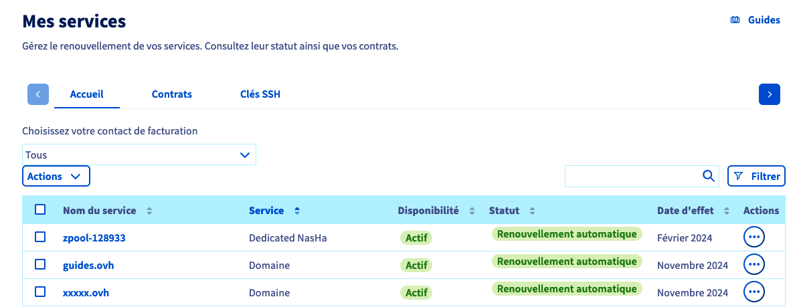
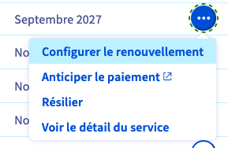
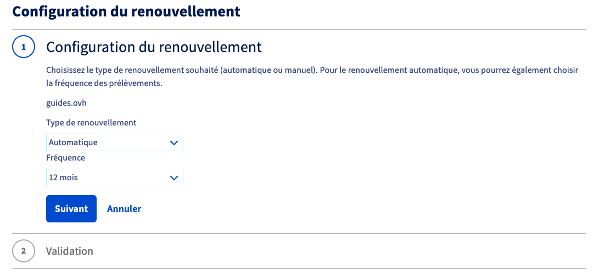
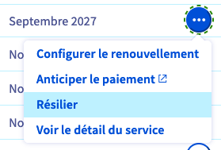
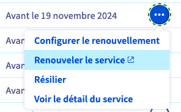
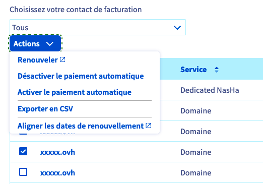

## Objectif

Le menu **Mes services** de votre espace client OVHcloud vous permet de vérifier le statut de vos services, de les renouveler, de modifier leur type de renouvellement, de régulariser des factures ou d'anticiper leur paiement.

Ce guide vous permettra de :

- [Comprendre les différences entre le renouvellement automatique et le renouvellement manuel](#auto-vs-manual)
- [Déterminer quel type de renouvellement est appliqué sur vos services](#renewal-type)
- [Connaître les différentes actions possibles pour chacun de vos services](#actions)
- [Découvrir quelles actions peuvent être groupées sur plusieurs services](#group-actions)

**Découvrez comment gérer vos services et leur renouvellement dans votre espace client OVHcloud.**

> [!primary]
>
> Selon votre lieu de résidence, la législation locale, ainsi que les solutions concernées, certains détails de ce guide peuvent varier ou ne pas s'appliquer à votre situation. Pour toute information, consultez vos contrats OVHcloud depuis votre [espace client](/links/manager) : cliquez sur votre nom en haut à droite de votre écran, sur `Produits et services`{.action} puis sur l'onglet `Contrats`{.action}.
>

<iframe class="video" width="560" height="315" src="https://www.youtube-nocookie.com/embed/dfpPCa0mUyo" frameborder="0" allow="accelerometer; autoplay; encrypted-media; gyroscope; picture-in-picture" allowfullscreen></iframe>

## Prérequis

Avant de poursuivre la lecture de ce guide, vous devez remplir les conditions suivantes :

- Avoir accès à votre [espace client OVHcloud](/links/manager)
- Posséder des services OVHcloud actifs
- Être [contact de facturation](/pages/account_and_service_management/account_information/managing_contacts#definition) de vos services OVHcloud
- Disposer d'un moyen de paiement valide dans votre compte OVHcloud. Consultez notre guide « [Gérer vos moyens de paiement](/pages/account_and_service_management/managing_billing_payments_and_services/manage-payment-methods) ».

## Les différents types de renouvellement

**Cliquez sur l'un ou l'autre des onglets ci-dessous.**

> [!tabs]
> **Le renouvellement automatique**
>>
>> Par défaut, à la souscription, vos services sont paramétrés en **renouvellement automatique**. Ce mode vous permet de vous assurer que vos services sont systématiquement reconduits à échéance de l'abonnement.
>> Exemple : vous avez souscrit un hébergement Web le 15 janvier 2024. Il sera automatiquement renouvelé le 15 janvier 2025 et le montant correspondant à son abonnement annuel sera prélevé de votre moyen de paiement par défaut.
>>
>> Si vous avez enregistré un moyen de paiement dans votre espace client, vos factures seront automatiquement prélevées sur celui-ci.
>> Si vous n'avez enregistré aucun [moyen de paiement](/pages/account_and_service_management/managing_billing_payments_and_services/manage-payment-methods), une facture vous sera adressée par e-mail. Il vous suffira alors de la régler en ligne.
>>
>> Pour les services ayant une fréquence de renouvellement automatique supérieure à 1 mois (3 mois, 6 mois, 12 mois), un rappel vous est également envoyé par e-mail le mois précédent la date de renouvellement automatique, récapitulant les services allant être renouvelés prochainement.
>>Si vous ne souhaitez pas prolonger l'un de ces services, il vous suffit alors [de le résilier dans votre espace client](/pages/account_and_service_management/managing_billing_payments_and_services/how_to_cancel_services).
>>
>> **Attention**, l'absence d'un moyen de paiement dans votre compte ne déclenche pas une résiliation automatique de vos services. Pour résilier des services, consultez notre guide « [Comment résilier vos services OVHcloud ](/pages/account_and_service_management/managing_billing_payments_and_services/how_to_cancel_services) ».
>>
> **Le renouvellement manuel**
>>
>> Si vous ne souhaitez pas de renouvellement automatique et donc de prélèvement automatique, vous pouvez modifier le type de renouvellement pour certains produits (Domaines, Hébergements, VPS, Serveurs dédiés) et les passer en renouvellement **manuel**.
>>
>> Ce mode de renouvellement peut être utile :
>>
>> - si vous n'êtes pas certain de vouloir conserver le service à échéance ;
>> - si vous ne souhaitez pas que vos factures soient prélevées automatiquement sur votre moyen de paiement.
>>
>> Si vous choisissez le renouvellement manuel, vous recevrez plusieurs relances par e-mail avant échéance, chacune contenant un lien permettant de renouveler en ligne les services arrivant à expiration.
>> Vous pourrez aussi simplement effectuer le règlement depuis votre espace client.
>>
>> **Attention**, si vous n'effectuez pas de paiement pour un service en renouvellement manuel, celui-ci sera **suspendu** à sa date d'expiration puis **supprimé** au bout de quelques jours.
>> En revanche, si vous ne souhaitez pas conserver ce service, il n'est pas nécessaire d'en demander la résiliation.

## En pratique

Connectez-vous à votre [espace client OVHcloud](/links/manager). 
Cliquez sur votre nom dans le coin supérieur droit puis choisissez `Produits et services`{.action}.

{.thumbnail}

### Afficher le type de renouvellement 

La page **Mes services** contient un tableau de gestion de vos services OVHcloud. Vous pouvez y retrouver leurs noms, le type de service, la disponibilité du service (`Actif` par défaut), son statut (type de renouvellement, action à réaliser, etc.), la prochaine date d'effet du renouvellement ou de la résiliation ainsi qu'un bouton `...`{.action} dédié aux actions possibles pour chaque service.

{.thumbnail}

> [!success]
> Des outils de tri, de filtrage et de recherche sont disponibles au-dessus du tableau.
> Vous pouvez ainsi trier les colonnes par ordre croissant ou décroissant, rechercher le nom d'un de vos services ou encore appliquer un filtre pour n'afficher que certains de vos services selon les critères de votre choix.
>
> Vos critères de filtrage seront alors affichés au dessus du tableau. Voici un exemple de filtre permettant d'afficher les noms de domaines dont le renouvellement est manuel et dont la date de fin d'abonnement expire avant un mois.
>
> {.thumbnail}

### Les actions pour chaque service

> [!primary]
>
> Selon le service, s'il est éligible ou non au renouvellement manuel, certaines actions ne seront pas disponibles.
>

À droite d'un service, cliquez sur le bouton `...`{.action} dans la colonne `Actions` puis sur l'action de votre choix.

{.thumbnail}

**Chaque action est détaillée dans un des onglets ci-dessous.**

> [!tabs]
> **Configurer le renouvellement**
>>
>> {.thumbnail}
>>
>> Cliquez sur l'action `Configurer le renouvellement`{.action}. Selon le service choisi, vous pouvez le paramétrer en renouvellement manuel ou choisir la fréquence de renouvellement automatique. Le cas échéant, vous pourrez donc choisir le type de renouvellement, ainsi que la fréquence de celui-ci.
>>
>> {.thumbnail}
>>
>> En fonction du choix effectué, vous seront précisées les futures dates de prélèvement, le moyen de paiement qui sera utilisé et la date d'expiration du service.
>>
> **Anticiper le paiement**
>>
>> {.thumbnail}
>>
>> Cette action est proposée pour les services en **renouvellement automatique**. 
>>
>> Vous serez redirigé vers une interface de paiement en ligne.
>>
>> Vous pouvez renouveler ces services à tout moment avant leur expiration, ainsi que choisir la durée de leur renouvellement.
>> Dans ce cas, la durée de validité souscrite sera rajoutée au temps de validité en cours. Vous ne perdrez pas le temps de validité restant.
>>
> **Résilier**
>>
>> {.thumbnail}
>>
>> Cette action est proposée pour les services paramétrés en **renouvellement automatique**.
>>
>> En choisissant cette action, le renouvellement et le prélèvement automatiques sont désactivés pour le service que vous avez sélectionné.
>>
>> Pour plus d'informations sur la résiliation des services OVHcloud, suivez les instructions du guide « **[Comment résilier vos services OVHcloud ](/pages/account_and_service_management/managing_billing_payments_and_services/how_to_cancel_services)** ».
>>
> **Renouveler le service**
>>
>> {.thumbnail}
>>
>> Cette action est uniquement proposée pour les services en **renouvellement manuel**.
>>
>> Vous serez alors redirigé vers une interface de paiement en ligne.
>> Vous pouvez renouveler ces services à tout moment avant leur expiration, ainsi que choisir la durée de leur renouvellement.
>>
> **Régler ma facture**
>>
>> {.thumbnail}
>>
>> Une mention `Facture à payer` s'affiche lorsqu'une facture est en attente de règlement et lorsque :
>>
>> - vous possédez des services en renouvellement automatique ;
>> - vous n'avez pas enregistré de moyen de paiement permettant d'effectuer un prélèvement pour le règlement de vos factures.
>>
>> Il vous suffit alors de choisir l'action `Régler ma facture`{.action} qui vous redirigera vers une plateforme de paiement en ligne.
>>

### Les actions groupées

Vous avez la possibilité d'effectuer des actions groupées, en sélectionnant plusieurs services dans le tableau puis en cliquant sur le bouton `Actions`{.action}.

{.thumbnail}

Le tableau ci-dessous détaille les actions groupées possibles.

|Actions possibles|Description|
|---|---|
|Renouveler|Renouvelez plusieurs services en une seule fois. Vous serez redirigé vers une page permettant de choisir la durée de renouvellement souhaitée et pourrez réaliser un paiement en ligne.|
|Désactiver le paiement automatique|Désactivez le renouvellement automatique sur plusieurs services en une seule fois. Si l'un ou plusieurs de vos services ne sont pas compatibles avec le renouvellement manuel, cela vous sera indiqué lors de la validation.|
|Activer le paiement automatique|Réactivez le renouvellement automatique sur plusieurs services en une seule fois. Seuls les services éligibles seront mis à jour.|
|Exporter en CSV|Exportez dans un fichier csv l'ensemble de vos services et leurs dates d'expiration.|
|Aligner les dates de renouvellement|Permet d'aligner la date d'expiration de vos services à un jour calendaire. Seuls les services éligibles pourront être mis à jour.|

## FAQ

> [!faq]
>
> On me demande de saisir un  « NIC » et un mot de passe lorsque je veux anticiper le paiement de mon service. Qu'est-ce que le NIC ?
>> Le NIC (ou NIC-handle) désigne votre identifiant client OVHcloud qui se présente sous la forme **xx11111-ovh**. Le mot de passe demandé est le mot de passe d'accès à votre compte OVHcloud. Si vous ne le connaissez plus, modifiez-le en suivant [ces instructions](/pages/account_and_service_management/account_information/manage-ovh-password).
> Où puis-je retrouver mon identifiant client (NIC) OVHcloud ?
>> Il est affiché dans votre espace client, en cliquant sur votre nom en haut à droite. Il figure également en haut à droite de toutes vos factures. Il est aussi renseigné dans l'e-mail de confirmation de création du compte, les messages de confirmation de commande ou de renouvellement, ainsi que dans les notifications de connexion à votre compte.
> Je n'arrive pas à me connecter à mon compte OVHcloud pour renouveler mes services, que faire ?
>> Consultez la partie « [Que faire si je ne parviens pas à me connecter ?](/pages/account_and_service_management/account_information/ovhcloud-account-login#que-faire-si-je-ne-parviens-pas-a-me-connecter) » de notre guide « [Se connecter à l'espace client OVHcloud](/pages/account_and_service_management/account_information/ovhcloud-account-login) ».
> Je veux activer le renouvellement automatique mais j'obtiens un message d'erreur. Que dois-je faire ?
>> Pour que le renouvellement automatique puisse être activé sur vos services, vous devez avoir ajouté un moyen de paiement valide dans votre compte OVHcloud. Si ce n'est pas le cas ou si le moyen de paiement est expiré, un message d'erreur appparaîtra dans l'espace client lors de vos tentatives d'activation du renouvellement automatique. Consultez notre guide « [Gérer vos moyens de paiement](/pages/account_and_service_management/managing_billing_payments_and_services/manage-payment-methods) » pour vérifier ou ajouter un moyen de paiement.
> Mon moyen de paiement n'est plus valide. Comment ajouter un nouveau moyen de paiement ?
>> Consultez notre guide « [Gérer mes moyens de paiement](/pages/account_and_service_management/managing_billing_payments_and_services/manage-payment-methods) ». Avant de pouvoir supprimer un moyen de paiement obsolète, vous devez ajouter un nouveau moyen de paiement valide dans votre compte OVHcloud.
> J'ai oublié de renouveler mon nom de domaine à temps, que faire ?
>> Commencez par vérifier le statut du nom de domaine en utilisant l'outil [Whois d'un nom de domaine](https://www.ovhcloud.com/fr-ca/domains/whois/).
>> S'il s'agit d'un nom de domaine générique (.com, .org. net, etc.), celui-ci vous reste « réservé » pendant une période dite « de « *grâce* » (environ 7 jours) puis pendant celle de « *rédemption* » (environ 35 à 40 jours supplémentaires). Ces délais sont variables et dépendent de l'extension et des règles du registre détenant l'extension. Pendant ces deux périodes, vous seul serez en mesure de renouveler le nom de domaine.
>> Pendant la période de grâce, vous pourrez le renouveler via l'espace client, en suivant les étapes de ce guide.
>> Pendant la periode de rédemption, le domaine n'est plus géré par OVHcloud. Son renouvellement via votre espace client occasionnera des frais supplémentaires (qui varient en fonction de l'extension).
>> Au delà de la période de rédemption, le nom de domaine entre dans une phase de suppression pouvant s'étaler sur plusieurs jours, avant de retomber dans le domaine public. Si vous souhaitez alors en récupérer l'usage, nous vous conseillons d'utiliser l'outil [Whois d'un nom de domaine](https://www.ovhcloud.com/fr-ca/domains/whois/) pour vérifier sa disponibilité régulièrement.
> Je ne souhaite pas renouveler mon nom de domaine mais le transférer vers un autre bureau d'entregistrement que OVHcloud. Comment faire ?
>> Suivez les instructions de notre guide « [Transférer un nom de domaine vers un autre bureau d'enregistrement](/pages/web_cloud/domains/transfer_outgoing_domain) ».
> Je ne veux plus de prélèvement automatique mais je ne veux pas résilier mon service. Que dois-je faire ?
>> Si votre service le permet, vous pouvez utiliser l'action [Configurer le renouvellement](#actions) et ainsi choisir un renouvellement manuel.
> J'ai renouvelé mon service pour 12 mois. Est-ce que je peux revenir sur mon choix ?
>> Une fois le renouvellement d'un service effectué, il n'est pas possible de l'annuler. Vous pouvez néanmoins choisir un autre type de renouvellement ou de résilier le service mais ces 2 options ne pourront être prises en compte qu'à la fin de l'abonnement en cours, c'est à dire à l'issue des 12 mois.
> Mon site web est suspendu car je n'ai pas renouvelé mes services à temps. Je viens de renouveler mes services. Combien de temps dois-je attendre pour que mon site web soit de nouveau accessible ?
>> Le délai de rétablissement varie en fonction des services concernés.
>> Si uniquement votre Hébergement Web était suspendu et a été renouvelé, il faut compter un délai moyen de 2 heures pour que votre site soit de nouveau accessible.
>> Si votre nom de domaine était également suspendu et a été renouvelé, le délai peut alors être plus long et aller jusqu'à 48 heures, correspondant au délai de propagation DNS.
>> Afin de vous prémunir d'une indisponibilité d'accès pour tous vos services critiques, nous vous préconisons de privilégier le renouvellement automatique et de [vérifier régulièrement que vos moyens de paiement sont à jour](/pages/account_and_service_management/managing_billing_payments_and_services/manage-payment-methods).
> L'abonnement de mon service expire en juillet 2024. Nous sommes en janvier 2024 et je veux le renouveler pour un an. Est-ce que l'abonnement expirera alors en juillet 2025 ou en janvier 2025 ?
>> Lorsque vous prolongez le renouvellement d'un service (pour 1 an ou une période plus courte), cette période s'ajoute à la prochaine date d'effet visible dans le tableau « Mes services » . Dans votre cas, votre service sera renouvelé jusqu'en juillet 2025.
> L'abonnement de mon service a expiré le 1er janvier 2024 et j'ai oublié de le renouveler. Je viens de le renouveler le 16 janvier 2024 pour 6 mois mais je constate qu'il expirera le 1er juillet 2024 et non le 16 juillet 2024. Est-ce que c'est normal ?
>> Oui, c'est en effet normal, le renouvellement commence à la date d'expiration de l'abonnement.

## Aller plus loin

Ce guide n'a pas répondu à votre question ? Consultez notre [FAQ sur la facturation et le paiement](/pages/account_and_service_management/managing_billing_payments_and_services/faq-billing)

[Gérer vos moyens de paiement](/pages/account_and_service_management/managing_billing_payments_and_services/manage-payment-methods)

[Comment résilier des services OVHcloud](/pages/account_and_service_management/managing_billing_payments_and_services/how_to_cancel_services)

[Informations concernant le mode de facturation Public Cloud](/pages/public_cloud/compute/analyze_billing)

[Gérer la facturation de vos comptes Exchange](/pages/web_cloud/email_and_collaborative_solutions/microsoft_exchange/manage_billing_exchange)

Échangez avec notre communauté d'utilisateurs sur <https://community.ovh.com/>.
