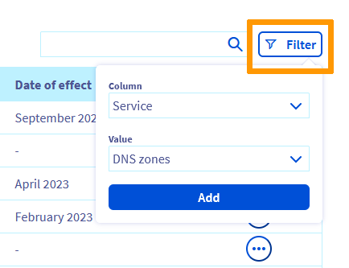
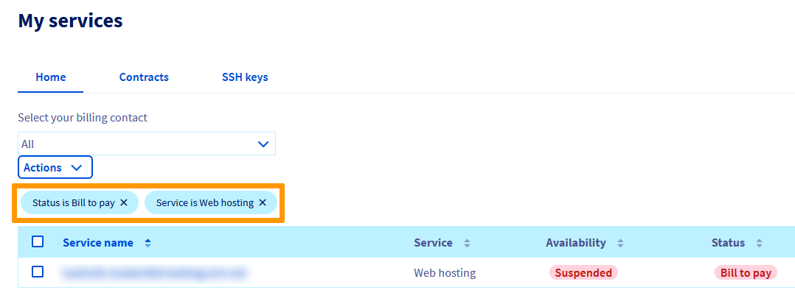

## Objectif

Le menu **Mes services** de votre espace client OVHcloud vous permet de vérifier le statut de vos services, de modifier leur type de renouvellement, de régulariser des factures ou d'anticiper leur paiement.

**Découvrez comment fonctionne le renouvellement de vos services OVHcloud.**

> [!primary]
>
> Selon votre lieu de résidence, la législation locale, ainsi que les solutions concernées, certains détails de ce guide peuvent varier ou ne pas s'appliquer à votre situation. Pour toute information, consultez vos contrats OVHcloud depuis votre [espace client](https://www.ovh.com/auth/?action=gotomanager&from=https://www.ovh.com/fr/&ovhSubsidiary=fr) : cliquez sur votre nom en haut à droite de votre écran, sur `Gestion des services`{.action} puis sur l'onglet `Contrats`{.action}.
>

<iframe width="560" height="315" src="https://www.youtube-nocookie.com/embed/dfpPCa0mUyo" frameborder="0" allow="accelerometer; autoplay; encrypted-media; gyroscope; picture-in-picture" allowfullscreen></iframe>

## Prérequis

- Avoir accès à votre [espace client OVHcloud](https://www.ovh.com/auth/?action=gotomanager&from=https://www.ovh.com/fr/&ovhSubsidiary=fr)
- Posséder des services OVHcloud actifs
- Être [contact de facturation](/pages/account_and_service_management/account_information/managing_contacts#definition) de vos services OVHcloud
- Disposer d'un moyen de paiement valide dans votre compte OVHcloud. Consultez notre guide « [Gérer vos moyens de paiement](/pages/account_and_service_management/managing_billing_payments_and_services/manage-payment-methods) ».

## Les différents types de renouvellement

**Cliquez sur l'un ou l'autre des onglets ci-dessous.**

> [!tabs]
> **Le renouvellement automatique**
>>
>> Par défaut, à la souscription, vos services sont paramétrés en **renouvellement automatique**. Ce mode vous permet de vous assurer que vos services soient systématiquement reconduits à échéance de l'abonnement.
>>
>> Si vous avez enregistré un moyen de paiement dans votre espace client, vos factures seront automatiquement prélevées sur celui-ci.
>> Si vous n'avez enregistré aucun [moyen de paiement](/pages/account_and_service_management/managing_billing_payments_and_services/manage-payment-methods), une facture vous sera adressée par e-mail. Il vous suffira alors de la régler en ligne.
>>
>> Pour les services ayant une fréquence de renouvellement automatique supérieure à 1 mois (3 mois, 6 mois, 12 mois), un rappel vous est également envoyé par e-mail le mois précédent, récapitulant les services allant être renouvelés prochainement.
>>Si vous ne souhaitez pas prolonger l'un de ces services, il vous suffit alors [de le résilier dans votre espace client](/pages/account_and_service_management/managing_billing_payments_and_services/how_to_cancel_services).
>>
> **Le renouvellement manuel**
>>
>> Si vous ne souhaitez pas de renouvellements et de prélèvements automatiques, vous pouvez modifier le type de renouvellement pour certains produits (Domaines, Hébergements, VPS, Serveurs dédiés) et les passer en renouvellement **manuel**.
>>
>> Ce mode de renouvellement peut être utile :
>>
>> - si vous n'êtes pas certain de vouloir conserver le service à échéance ;
>> - si vous ne souhaitez pas que vos factures soient prélevées automatiquement sur votre moyen de paiement.
>>
>> Si vous choisissez le renouvellement manuel, vous recevrez plusieurs relances par e-mail avant échéance, chacune contenant un lien permettant de renouveler en ligne les services arrivant à expiration. 
>> Vous pourrez aussi simplement effectuer le règlement depuis votre espace client.
>>
>> **Attention**, si vous n'effectuez pas de paiement pour un service en renouvellement manuel, celui-ci sera **suspendu** à sa date d'expiration puis **supprimé** au bout de quelques jours.
>> En revanche, si vous ne souhaitez pas conserver ce service, il n'est pas nécessaire d'en demander la résiliation.

## En pratique

Connectez-vous à votre [espace client OVHcloud](https://www.ovh.com/auth/?action=gotomanager&from=https://www.ovh.com/fr/&ovhSubsidiary=fr). 
Cliquez sur votre nom dans le coin supérieur droit puis choisissez `Produits et services`{.action}.

{.thumbnail}

### Afficher le type de renouvellement

La page `Mes services` contient un tableau de gestion de vos services OVHcloud. Vous pouvez y retrouver leurs noms, le type de service, la disponibilité du service (`Actif` par défaut), son statut (type de renouvellement, action à réaliser, etc.), la prochaine date d'effet du renouvellement ou de la résiliation ainsi qu'un bouton `...` dédié aux actions possibles pour chaque service.

{.thumbnail}

> [!success]
> Des outils de tri, de filtre et de recherche sont disponibles au-dessus du tableau.
> Vous pouvez ainsi trier les colonnes par ordre croissant ou décroissant, rechercher le nom d'un de vos services ou encore appliquer un filtre pour n'afficher que certains de vos services selon les critères de votre choix.
> {.thumbnail}
> Vos critères de filtrage seront alors affichés au dessus du tableau. Voici un exemple de filtre permettant d'afficher les hébergements pour lesquels une facture est en attente de réglement.
> {.thumbnail}

### Les actions pour chaque service

> [!primary]
>
> Selon le service, s'il est éligible ou non au renouvellement manuel, certaines actions ne seront pas disponibles.
>

À droite d'un service, cliquez sur le bouton `...`{.action} dans la colonne `Actions` puis sur l'action de votre choix.

{.thumbnail}

**Chaque action est détaillée dans un des onglets ci-dessous.**

> [!tabs]
> **Configurer le renouvellement**
>> Cliquez sur l'action `Configurer le renouvellement`{.action}.
>>
>> Selon le service choisi, vous pouvez le paramétrer en renouvellement manuel ou choisir la fréquence de renouvellement automatique. Le cas échéant, vous pourrez donc choisir le type de renouvellement, ainsi que la fréquence de celui-ci.
>>
>> {.thumbnail}
>>
>> En fonction du choix effectué, les informations suivantes vous seront précisées :
>>
>> - les futures dates de prélèvement ;
>> - le moyen de paiement qui sera utilisé ;
>> - la date d'expiration du service.
>>
> **Anticiper le paiement**
>> Cette action est proposée pour les services en **renouvellement automatique**. 
>>
>> Vous serez redirigé vers une interface de paiement en ligne.
>>
>> Vous pouvez renouveler ces services à tout moment avant leur expiration, ainsi que choisir la durée de leur renouvellement.
>> Dans ce cas, la durée de validité souscrite sera rajoutée au temps de validité en cours. Vous ne perdrez pas le temps de validité restant.
>>
> **Résilier**
>> Cette action est proposée pour les services paramétrés en **renouvellement automatique**.
>>
>> En choisissant cette action, le renouvellement et le prélèvement automatiques sont désactivés pour le service que vous avez sélectionné.
>>
>> Pour plus d'informations sur la résiliation des services OVHcloud, suivez les [instructions de ce guide](/pages/account_and_service_management/managing_billing_payments_and_services/how_to_cancel_services)
>>
> **Renouveler le service**
>> Cette action est uniquement proposée pour les services en **renouvellement manuel**.
>>
>> Vous serez alors redirigé vers une interface de paiement en ligne.
>> Vous pouvez renouveler ces services à tout moment avant leur expiration, ainsi que choisir la durée de leur renouvellement.
>>
> **Régler ma facture**
>> Une mention `Facture à payer` s'affiche lorsqu'une facture est en attente de règlement et lorsque :
>>
>> - vous possédez des services en renouvellement automatique ;
>> - vous n'avez pas enregistré de moyen de paiement permettant d'effectuer un prélèvement pour le règlement de vos factures.
>>
>> Il vous suffit alors de choisir l'action `Régler ma facture`{.action} qui vous redirigera vers une plateforme de paiement en ligne.
>>

### Les actions groupées

Vous avez la possibilité d'effectuer des actions groupées, en sélectionnant plusieurs services dans le tableau puis en cliquant sur le bouton `Actions`{.action}.

{.thumbnail}

Le tableau ci-dessous détaille les actions groupées possibles.

|Actions possibles|Description|
|---|---|
|Renouveler|Renouvelez plusieurs services en une seule fois. Vous serez redirigé vers une page permettant de choisir la durée de renouvellement souhaitée et pourrez réaliser un paiement en ligne.|
|Désactiver le paiement automatique|Désactivez le renouvellement automatique sur plusieurs services en une seule fois. Si l'un ou plusieurs de vos services ne sont pas compatibles avec le renouvellement manuel, cela vous sera indiqué lors de la validation.|
|Activer le paiement automatique|Réactivez le renouvellement automatique sur plusieurs services en une seule fois. Seuls les services éligibles seront mis à jour.|
|Exporter en CSV|Exportez dans un fichier csv l'ensemble de vos services et leurs dates d'expiration.|
|Aligner les dates de renouvellement|Permet d'aligner la date d'expiration de vos services à un jour calendaire. Seuls les services éligibles pourront être mis à jour.|

## Aller plus loin

[Gérer vos moyens de paiement](/pages/account_and_service_management/managing_billing_payments_and_services/manage-payment-methods)

[Comment résilier des services OVHcloud](/pages/account_and_service_management/managing_billing_payments_and_services/how_to_cancel_services)

[Informations concernant le mode de facturation Public Cloud](/pages/public_cloud/compute/analyze_billing)

[Gérer la facturation de vos comptes Exchange](/pages/web_cloud/email_and_collaborative_solutions/microsoft_exchange/manage_billing_exchange)

Échangez avec notre communauté d'utilisateurs sur <https://community.ovh.com/>.
