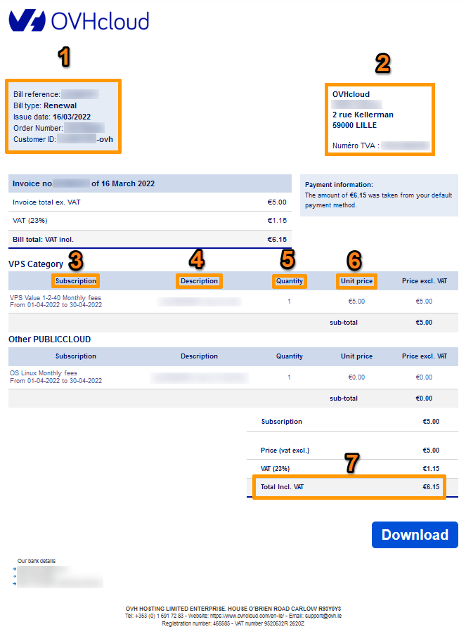
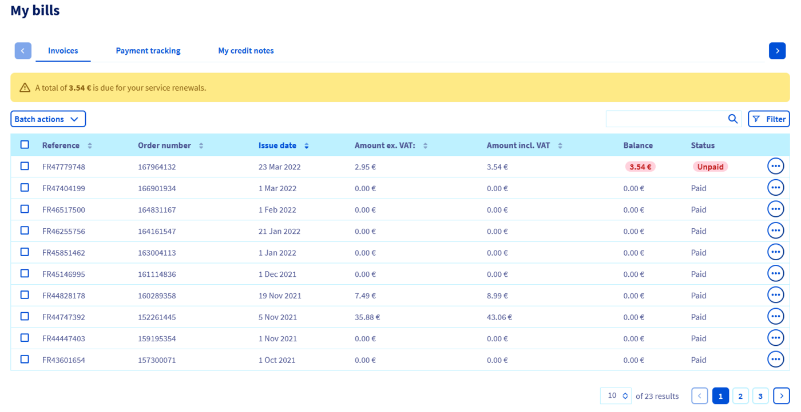
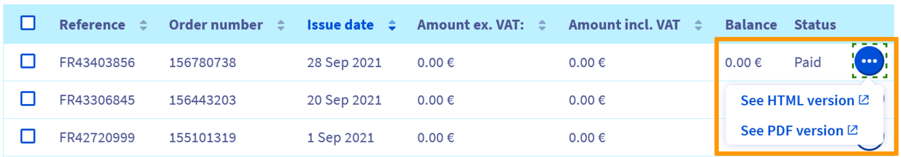
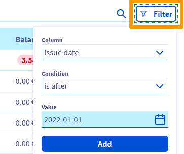
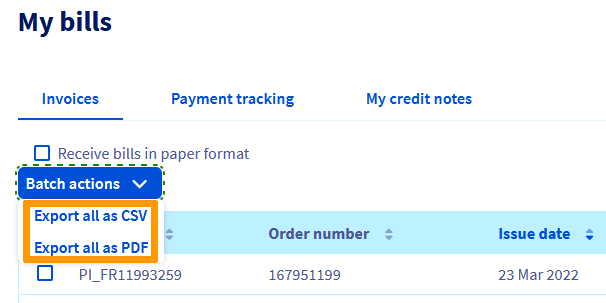
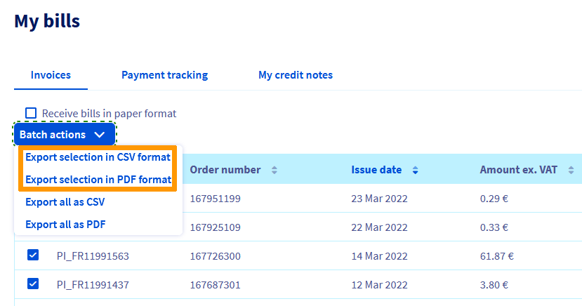
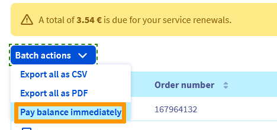
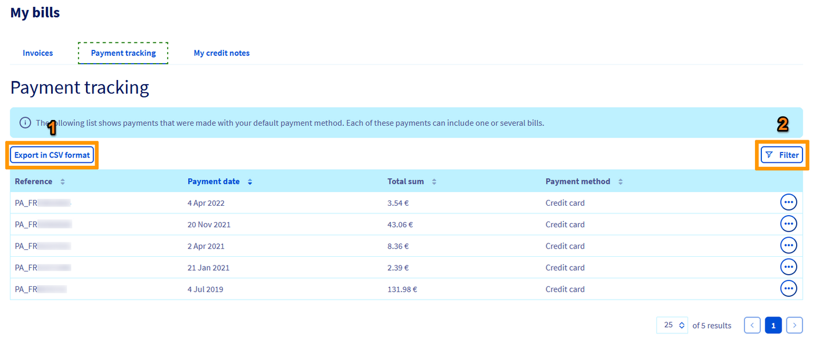

## Ziel

OVHcloud stellt Ihnen einen Bereich zur Verfügung, über den Sie Ihre Rechnungen einsehen, verwalten und begleichen können.

**Diese Anleitung erklärt, wie Sie Ihre Rechnungen über Ihr OVHcloud Kundencenter verwalten.**

> [!primary]
>
> In Abhängigkeit von Ihrem Wohnsitz und der dort geltenden Rechtsordnung sowie den betreffenden Produkten können einige Details von den hier angeführten Informationen abweichen und/oder Teile dieser Anleitung nicht auf Ihre Situation zutreffen. Im Zweifelsfall beachten Sie bitte die auf der Seite [Meine Verträge](/links/control-panel/billing-contracts) verfügbaren OVHcloud Verträge.
>

<iframe class="video" width="560" height="315" src="https://www.youtube-nocookie.com/embed/iiQmopMhzik" frameborder="0" allow="accelerometer; autoplay; encrypted-media; gyroscope; picture-in-picture" allowfullscreen></iframe>

## Voraussetzungen

- Sie sind [Rechnungskontakt](/pages/account_and_service_management/account_information/managing_contacts) Ihres Dienstes.

<!-- CP-NAV-START:billing-invoices -->
---

### Zugriff auf das OVHcloud Kundencenter

- **Direkter Link:** [Meine Rechnungen](/links/control-panel/billing-invoices)
- **Navigationspfad:** Klicken Sie oben rechts auf Ihren Namen > `Meine Rechnungen`{.action}

---
<!-- CP-NAV-END:billing-invoices -->

## In der praktischen Anwendung

> [!primary]
>
> Jede Rechnung wird Ihnen per E-Mail in Form eines klickbaren Links gesendet, auf den Sie direkt zugreifen können, indem Sie sich in Ihrem [OVHcloud Kundencenter](/links/control-panel/billing-invoices) authentifizieren. Alle Rechnungen sind auch weiterhin über die Startseite Ihres Kundencenters verfügbar.
>

### Aufbau Ihrer Rechnung

Die Rechnung zu Ihrer OVHcloud Dienstleistung wird Ihnen nach einer Bezahlung oder Verlängerung gesendet. Sie listet die Beträge für den Kauf oder die Verlängerung Ihrer Produkte sowie deren Gültigkeitsdauer auf.

{.thumbnail}

|Nummer|Beschreibung|
|---|---|
|1|Rechnungsinformationen: Referenz, Ausstellungsdatum, Bestellschein, Zahlungsart und Kundenkennung|
|2|Informationen des Rechnungskontakts.|
|3|Produkt: eine Beschreibung der Dienstleistung und des Abrechnungszeitraums|
|4|Referenz: die Referenz des abgerechneten Dienstes|
|5|Menge: die Anzahl der Einheiten des in Rechnung gestellten Dienstes|
|6|Stückpreis (ohne MwSt) eines Dienstes|
|7|Gesamtbetrag (einschließlich aller Steuern) der Rechnung|

### Der Abrechnungsbereich in Ihrem Kundencenter

#### Rechnungen einsehen und verwalten

Um Ihre Rechnungen einzusehen, öffnen Sie die Seite [Meine Rechnungen](/links/control-panel/billing-invoices).

{.thumbnail}

Sie gelangen dann auf eine Übersichtsseite, auf der alle Ihre Rechnungen aufgelistet werden:

{.thumbnail}

> [!primary]
>
> Wurde eine Rechnung noch nicht beglichen (`Status` Unbezahlt), wird der geschuldete Betrag in rot in der Spalte `Stand` ausgewiesen.
>

In jeder Tabellenzeile finden Sie folgende Informationen:

- Die `Referenz`{.action} der Rechnung
- Die `Bestellnummer`{.action}
- Das `Ausstellungsdatum`{.action} der Rechnung
- Der `Betrag ohne MwSt`{.action}
- Der `Betrag inkl. MwSt`{.action}
- Den `Stand`{.action} des Ausgleichs
- Den `Status`{.action} der Rechnung (`Bezahlt` oder `Unbezahlt`)

Wenn Sie auf einen der Buttons `...`{.action} rechts neben der Tabelle klicken, können Sie auch:

- `Die HTML Version anzeigen`{.action}: Die Rechnung wird in Ihrem Browser in einem neuen Tab angezeigt.
- `Die PDF-Version anzeigen`{.action}: Es wird automatisch eine PDF-Version Ihrer Rechnung erstellt, die Sie herunterladen können.

{.thumbnail}

> [!primary]
>
> Wenn eine Ihrer Rechnungen noch aussteht, erscheint ein Button `Mein Konto sofort ausgleichen`{.action}, wenn Sie auf `...`{.action} klicken.
>

##### **Filter**

Es stehen Ihnen mehrere Filter zur Verfügung:

{.thumbnail}

Um zu einer bestimmten Rechnung zu gelangen, können Sie die Referenz, die Nummer der zugehörigen Bestellung oder das Ausstellungsdatum angeben.

##### **Massenaktionen**

Im Menü `Massenaktionen`{.action} können Sie dann die Zusammenfassung Ihrer Rechnungen im Format *.csv* oder *.pdf* * exportieren. In den so erstellten Dateien sind der Betrag, die Bezugsnummer und das Ausstellungsdatum anzugeben.

Wenn Sie alle Ihre Rechnungen exportieren möchten, verwenden Sie die Buttons `Alles im CSV-Format exportieren`{.action} oder `Alles im PDF-Format exportieren`{.action}.

{.thumbnail}

Wenn Sie nur einen Teil davon exportieren möchten, setzen Sie in der ersten Spalte der Tabelle ein Häkchen, um die Rechnungen auszuwählen, die Sie interessieren. Zwei neue Aktionen, `Die Auswahl im CSV-Format exportieren`{.action} und `Die Auswahl im PDF-Format exportieren`{.action}, sind dann im Menü `Massenaktionen`{.action} verfügbar.

{.thumbnail}

#### Rechnungen bezahlen 

Um Ihre ausstehenden Rechnungen zu begleichen, klicken Sie einfach auf das Menü `Massenaktionen`{.action} und dann auf den Button `Mein Konto sofort ausgleichen`{.action}.

{.thumbnail}

Es wird dann ein [Bestellschein](/pages/account_and_service_management/managing_billing_payments_and_services/managing_ovh_orders#der-bestellschein) entsprechend der Rechnungsbeträge erstellt. Nach Bezahlung ist Ihr Konto ausgeglichen.

#### Die Stornierung einer Rechnung beantragen

> [!primary]
>
> Um die Kündigung Ihrer Dienstleistung zu beantragen, folgen Sie den Anweisungen in [dieser Anleitung](/pages/account_and_service_management/managing_billing_payments_and_services/how_to_cancel_services).
>

Wenn Sie eine Rechnung erhalten haben, die Sie nicht für rechtmäßig halten, und Sie eine Erstattung beantragen oder Ihre Rechnung geltend machen möchten, klicken Sie oben rechts auf Ihrem Bildschirm auf Ihren Namen und dann auf `Ein Ticket erstellen`{.action}.

### Zahlungsverfolgung

Die Zahlungshistorie finden Sie in `Meine Rechnungen`{.action} und dann `Zahlungsverfolgung`{.action}. So können Sie jede Rechnung mit der zugehörigen Zahlung verbinden.

{.thumbnail}

In diesem Bereich können Sie Ihre Zahlungsbelege auch im *.csv* Format exportieren, indem Sie den Button `Export als CSV-Datei`{.action} (1) klicken. Über den Button `Filtern`{.action} (2) stehen Ihnen auch mehrere Filter zur Verfügung.

> [!primary]
>
> Sollten Sie einen Unterschied zwischen gezahltem Betrag und Rechnungsbetrag feststellen, dann hatten Sie auf Ihrem OVHcloud Konto ein Guthaben, von dem der Rechnungsbetrag automatisch abgezogen wurde.
>

## Weiterführende Informationen

[Verlängerung Ihrer OVHcloud Dienste verwalten](/pages/account_and_service_management/managing_billing_payments_and_services/how_to_use_automatic_renewal)

[Zahlungsarten verwalten](/pages/account_and_service_management/managing_billing_payments_and_services/manage-payment-methods)

Treten Sie unserer [User Community](/links/community) bei.