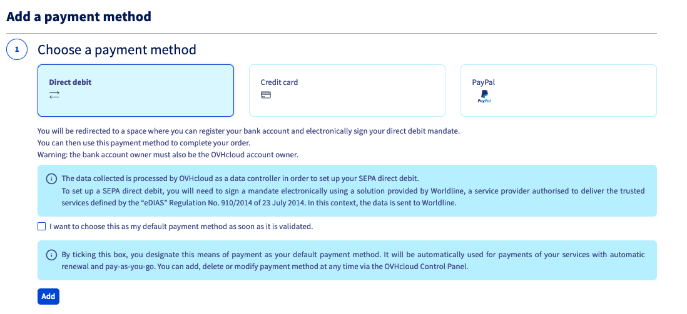
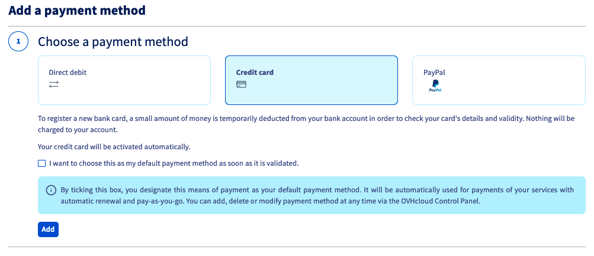
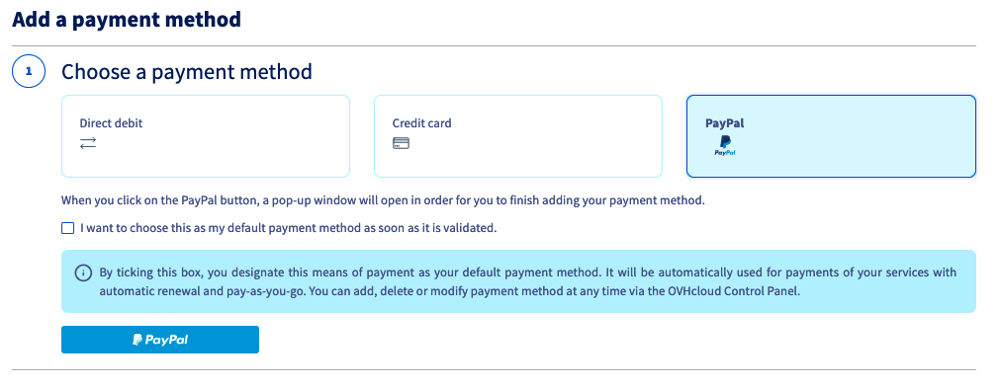

## Obiettivo

Nello Spazio Cliente OVHcloud puoi salvare e gestire diversi metodi di pagamento.

## Prerequisiti

- Disporre di un metodo di pagamento valido

<!-- CP-NAV-START:billing-payment-methods -->
---

### Accesso allo Spazio Cliente OVHcloud

- **Link diretto:** [Modalità di pagamento](/links/control-panel/billing-payment-methods)
- **Percorso di navigazione:** Clicca sul tuo nome in alto a destra > `I miei metodi di pagamento`{.action}

---
<!-- CP-NAV-END:billing-payment-methods -->

## Procedura 

<!-- CP-STEPS-START:instructions-overview -->
Apri la pagina [I miei metodi di pagamento](/links/control-panel/billing-payment-methods).

{.thumbnail}

Visualizzi una tabella con tutti i metodi di pagamento salvati sul tuo account cliente. Da questa pagina è possibile: 

- Aggiungere un metodo di pagamento
- Modificare il metodo di pagamento predefinito
- Modifica la descrizione del metodo di pagamento
- Eliminare un metodo di pagamento
<!-- CP-STEPS-END:instructions-overview -->

### Aggiungere un metodo di pagamento

<!-- CP-STEPS-START:register-payment-method -->
Al momento del primo ordine, ti viene chiesto di registrare una modalità di pagamento per garantire il rinnovo del tuo servizio tramite prelievo automatico.

Questo metodo di pagamento viene utilizzato di default per tutti i rinnovi e ti viene proposto di saldare nuovi ordini.

Puoi salvare altri metodi di pagamento, in modo che vengano proposti al momento dei tuoi nuovi ordini o utilizzati di default per i tuoi futuri addebiti.

È possibile salvare 3 metodi di pagamento:

- Prelievo bancario
- Carta bancaria
- Account PayPal

Per farlo, clicca su `Aggiungi un metodo di pagamento` e seleziona il metodo di pagamento da utilizzare.

{.thumbnail}

Segui gli step successivi per il salvataggio del metodo di pagamento. Al primo step, ti viene proposto di selezionare la casella `Una volta confermata, voglio impostare questa modalità di pagamento come predefinita.`{.action}, in modo che sia utilizzata per i futuri acquisti o prelievi automatici.

#### Prelievo bancario

> [!warning]
>
> - L'utilizzo del prelievo bancario è possibile solo per i conti clienti francesi, belgi, tedeschi, spagnoli, irlandesi, italiani e olandesi.
>
> - Il titolare del conto bancario deve corrispondere al proprietario dell'account OVHcloud.

Per registrare un prelievo sul tuo conto bancario, verrai reindirizzato verso uno spazio che permetterà la registrazione di questo account e la firma elettronica del tuo mandato di prelievo.

{.thumbnail}

Se la tua banca è registrata dal nostro partner, la registrazione del conto bancario sarà immediata. In caso contrario, può essere necessario un periodo di circa 48 ore.

#### Carta bancaria

{.thumbnail}

Per salvare una nuova carta bancaria, verrai reindirizzato all'interfaccia sicura del nostro provider di pagamento. Per verificare il numero e la validità della carta inserita verrà effettuato un tentativo di prelievo presso il tuo istituto bancario. 
Non verrà addebitato alcun importo e la tua carta bancaria verrà attivata entro pochi minuti.

#### Account PayPal

{.thumbnail}

Seleziona `PayPal`{.action} come modalità di pagamento. Clicca sul pulsante `PayPal`{.action}. Si aprirà una finestra contestuale per accedere al tuo account PayPal® e registrarlo come metodo di pagamento autorizzato presso OVHcloud.

Il tuo account PayPal® sarà attivo in pochi minuti.
<!-- CP-STEPS-END:register-payment-method -->

### Modificare il metodo di pagamento predefinito

<!-- CP-STEPS-START:change-default-payment-method -->
Le fatture di rinnovo dei servizi vengono sempre prelevate dal tuo metodo di pagamento predefinito. Se intendi modificarlo, è necessario aggiungere un nuovo metodo di pagamento nel tuo Spazio Cliente.

Clicca quindi su `...`{.action}a destra del nuovo metodo di pagamento e poi su `Imposta questo metodo di pagamento come predefinito`.

{.thumbnail}

> **Vorrei sostituire il metodo di pagamento predefinito con un altro, come fare?**
>
> - Step 1: aggiungi il nuovo metodo di pagamento
> - Step 2: definisci il nuovo metodo di pagamento come metodo di pagamento predefinito
> - Step 3: elimina il metodo di pagamento precedente
>
<!-- CP-STEPS-END:change-default-payment-method -->

### Eliminare un metodo di pagamento

<!-- CP-STEPS-START:delete-payment-method -->
Se non vuoi più utilizzare uno dei tuoi metodi di pagamento, puoi eliminarlo cliccando su `...`{.action} a destra. Clicca su `Elimina questo metodo di pagamento`{.action}.

{.thumbnail}

Per eliminare tutti i metodi di pagamento, tutti i servizi devono essere in [rinnovo manuale](/pages/account_and_service_management/managing_billing_payments_and_services/how_to_use_automatic_renewal#il-rinnovo-manuale).
<!-- CP-STEPS-END:delete-payment-method -->

#### Eliminare un metodo di pagamento tramite le API OVHcloud

L’eliminazione di un metodo di pagamento può essere effettuato tramite le API. Per farlo clicca su questo link [https://eu.api.ovh.com/](/links/api).

Ottieni l’ID del metodo di pagamento: 

> [!api]
>
> @api {v1} /me GET /me/payment/method
>

Elimina il metodo di pagamento utilizzando l'ID precedentemente ottenuto:

> [!api]
>
> @api {v1} /me DELETE /me/payment/method/{paymentMethodId}
>

> [!primary]
>
> Per maggiori informazioni, consulta la guida [Iniziare a utilizzare le API OVHcloud](/pages/manage_and_operate/api/first-steps).
>
> In caso di difficoltà nell'identificazione dei metodi di pagamento tramite le API OVHcloud, utilizza la funzione `Modifica la descrizione`{.action} (pulsante `...`{.action} a destra dello schermo) nella sezione [Modalità di pagamento](#payment_methods) della pagina [I miei metodi di pagamento](/links/control-panel/billing-payment-methods).
>

### Il conto prepagato

#### Cos'è il conto prepagato?

<!-- CP-STEPS-START:prepaid-account-overview -->
Il *conto prepagato* è presente nella pagina [I miei metodi di pagamento](/links/control-panel/billing-payment-methods) al momento della creazione. che permette di accreditare in anticipo il tuo account cliente e utilizzare questi fondi per il pagamento degli ordini e delle fatture di rinnovo.

Ricaricando regolarmente il tuo account, assicurati che il [rinnovo automatico](/pages/account_and_service_management/managing_billing_payments_and_services/how_to_use_automatic_renewal#il-rinnovo-automatico) dei tuoi servizi non venga mai interrotto per mancato pagamento.

Per effettuare questa operazione, accedi alla sezione `Modalità di pagamento` dello Spazio Cliente:

- Apri la pagina [I miei metodi di pagamento](/links/control-panel/billing-payment-methods).
- seleziona la scheda `Il tuo conto prepagato`{.action}.

{.thumbnail}
<!-- CP-STEPS-END:prepaid-account-overview -->

#### Come funziona?

Per ogni scadenza, se disponi di servizi impostati con *rinnovo automatico*, l'importo della tua fattura viene prelevato dal tuo conto prepagato.

In assenza di fondi sufficienti, il saldo del tuo conto passerà in negativo e resterà in attesa di pagamento.

Se disponi di una modalità di pagamento valida registrata sul tuo account cliente, l'importo verrà automaticamente prelevato entro 24 ore e il saldo sarà azzerato. senza alcun impatto sullo stato dei tuoi servizi.

Se non hai salvato nessuna modalità di pagamento, dovrai saldare l'importo in sospeso dal tuo Spazio Cliente entro 7 giorni per evitare interruzioni di servizio.

Se non hai impostato nessuna modalità di pagamento registrata, ti consigliamo di impostare una **soglia di allarme** per assicurarti che disporrai di fondi sufficienti per le tue prossime fatture:

<!-- CP-STEPS-START:prepaid-account-alert -->
{.thumbnail}

Se il credito disponibile sul tuo conto prepagato scende al di sotto del limite definito, riceverai immediatamente un'email di notifica.
<!-- CP-STEPS-END:prepaid-account-alert -->

#### Come accreditare il vostro conto prepagato?

<!-- CP-STEPS-START:prepaid-account-credit -->
Nella scheda `Il tuo conto prepagato`{.action}, clicca sul pulsante `Accredita`{.action}.

{.thumbnail}

Nella nuova finestra, indica l'importo da accreditare, clicca su `Continua`{.action} e poi su `Ordina`{.action}.

{.thumbnail}

Nella nuova finestra, seleziona il metodo di pagamento che preferisci e salda il tuo ordine.
<!-- CP-STEPS-END:prepaid-account-credit -->

## Per saperne di più

Contatta la nostra [Community di utenti](/links/community).