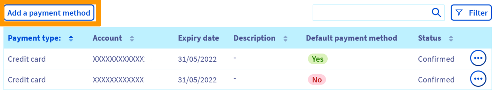
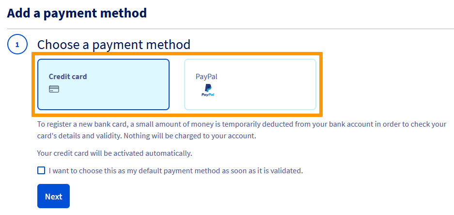
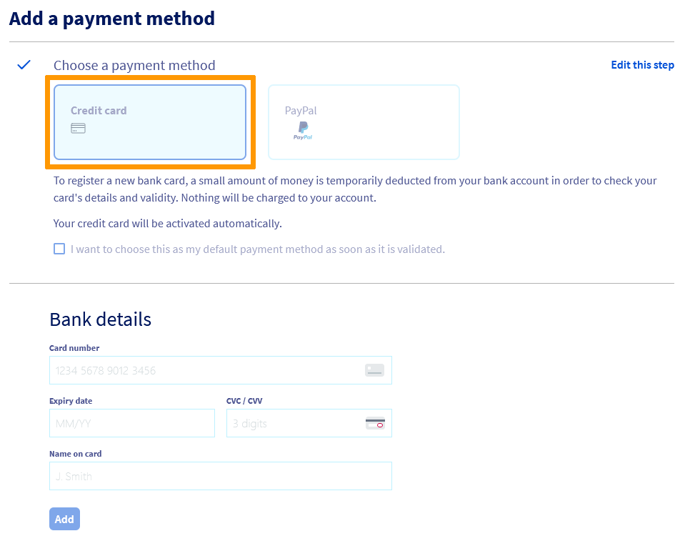
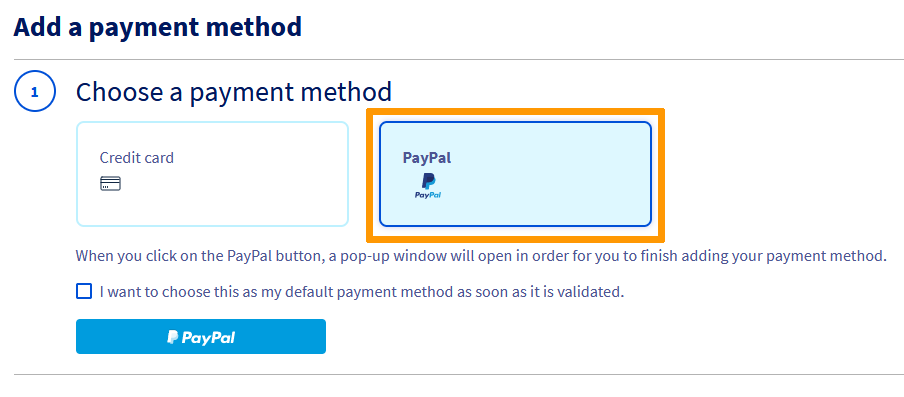
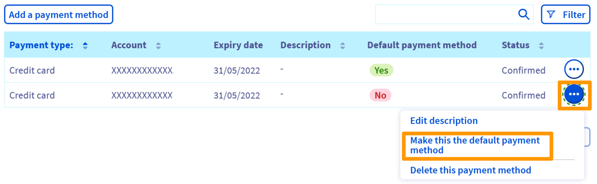
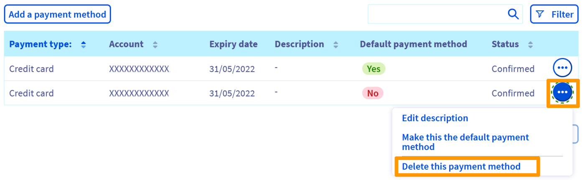
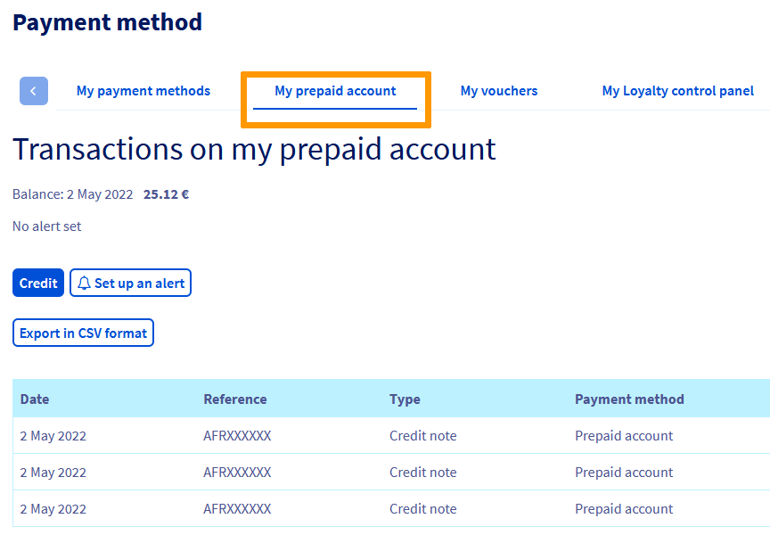
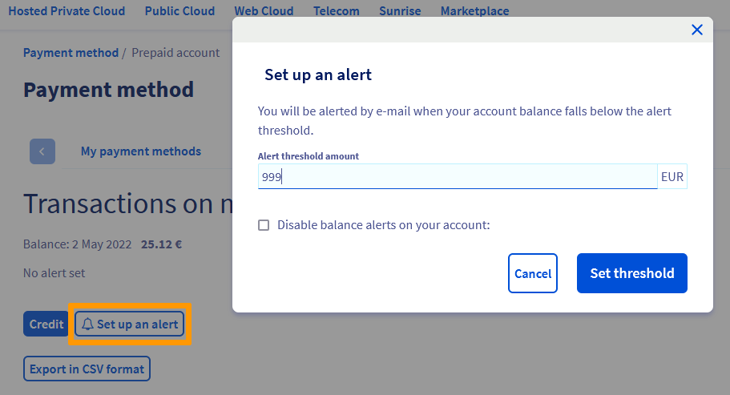
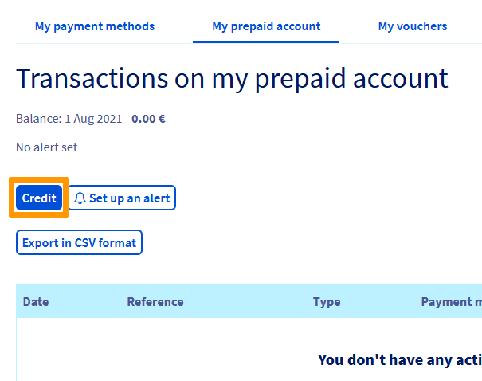
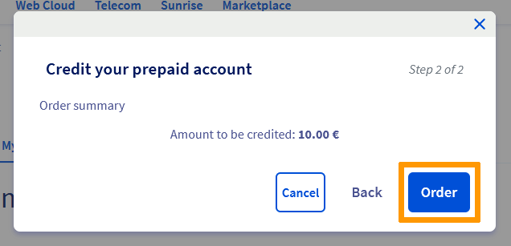

## Wprowadzenie

W Panelu klienta OVHcloud możesz dodać różne sposoby płatności i zarządzać nimi.

## Wymagania początkowe

- Posiadanie ważnego sposobu płatności

<!-- CP-NAV-START:billing-payment-methods -->
---

### Dostęp do Panelu klienta OVHcloud

- **Link bezpośredni:** [Sposoby płatności](/links/control-panel/billing-payment-methods)
- **Ścieżka nawigacji:** Kliknij swoją nazwę w prawym górnym rogu > `Moje sposoby płatności`{.action}

---
<!-- CP-NAV-END:billing-payment-methods -->

## W praktyce 

<!-- CP-STEPS-START:instructions-overview -->
Otwórz stronę [Moje sposoby płatności](/links/control-panel/billing-payment-methods).

{.thumbnail}

Wyświetli się strona z tabelą wyszczególniającą sposoby płatności zapisane na Twoim koncie klienta. W Panelu klienta można:

- Dodać sposób płatności
- Zmienić domyślny sposób płatności
- Zmień opis Twojego sposobu płatności
- Usunąć sposób płatności
<!-- CP-STEPS-END:instructions-overview -->

### Dodanie sposobu płatności

<!-- CP-STEPS-START:register-payment-method -->
Podczas pierwszego zamówienia zostaniesz poproszony o zarejestrowanie sposobu płatności, aby zapewnić automatyczne pobranie płatności za odnowienie usługi.

Ten sposób płatności jest używany domyślnie dla wszystkich odnowień i jest proponowany do uregulowania nowych zamówień.

Możesz również zarejestrować inne sposoby płatności, które będą proponowane podczas składania nowych zamówień lub będą używane domyślnie dla przyszłych poleceń zapłaty.

Można dodać 2 różne sposoby płatności:

- Karta bankowa
- Konto PayPal

W tym celu kliknij przycisk `Dodaj sposób płatności`{.action}.

{.thumbnail}

Wybierz metodę płatności, której chcesz użyć:

{.thumbnail}

Postępuj zgodnie z poniższą procedurą, aby dodać sposób płatności. Na pierwszym etapie zostaniesz poproszony o zaznaczenie kratki `Chcę wybrać ten sposób płatności jako domyślny od chwili jego zatwierdzenia`{.action}, tak aby był on używany przy kolejnych zakupach lub automatycznych pobraniach.

#### Karta bankowa

{.thumbnail}

Aby zarejestrować nową kartę bankową, zostaniesz przekierowany do bezpiecznego interfejsu naszego dostawcy płatności. W celu potwierdzenia rejestracji i ważności Twojej karty, należy zalogować się do Twojego banku. 
Kwota nie zostanie pobrana, a Twoja karta bankowa zostanie aktywowana po kilku minutach.

#### Konto PayPal

{.thumbnail}

Wybierz `PayPal`{.action} jako sposób płatności. Kliknij przycisk `PayPal`{.action}. Otworzy się wówczas okno, w którym zaloguj się do Twojego konta PayPal® i zapisz je jako sposób płatności zatwierdzony przez OVHcloud.

Twoje konto PayPal® zostanie włączone za kilka minut.
<!-- CP-STEPS-END:register-payment-method -->

### Zmienić domyślny sposób płatności

<!-- CP-STEPS-START:change-default-payment-method -->
Faktury za odnowienie usług są zawsze opłacane przy użyciu domyślnego sposobu płatności. Jeśli chcesz go zmienić, musisz najpierw dodać nowy sposób płatności w Panelu klienta.

Kliknij przycisk `...`{.action} znajdujący się po prawej stronie nowego sposobu płatności, a następnie wybierz opcję `Ustaw te metode płatności jako domyślna`{.action}.

{.thumbnail}

> **Chcę zastąpić mój domyślny sposób płatności innym sposobem płatności?**
>
> - Etap 1: dodaj nowy sposób płatności
> - Etap 2: definiuj nowy sposób płatności jako domyślny sposób płatności
> - Etap 3: usuń stary sposób płatności
>
<!-- CP-STEPS-END:change-default-payment-method -->

### Usunąć sposób płatności

<!-- CP-STEPS-START:delete-payment-method -->
Jeśli nie chcesz już korzystać ze swoich sposobów płatności, możesz je usunąć, klikając przycisk `...`{.action} znajdujący się po prawej stronie. Następnie kliknij polecenie `Usuń te sposób płatności`{.action}.

{.thumbnail}

Jeśli chcesz usunąć wszystkie Twoje sposoby płatności, wszystkie Twoje usługi muszą być [odnawiane ręcznie](/pages/account_and_service_management/managing_billing_payments_and_services/how_to_use_automatic_renewal#odnowienie-reczne).
<!-- CP-STEPS-END:delete-payment-method -->

#### Usuwanie sposobu płatności przez API OVHcloud

Sposób płatności można usunąć poprzez interfejs API, logując się do [https://eu.api.ovh.com/](/links/api).

Zacznij od uzyskania identyfikatora sposobu płatności:

> [!api]
>
> @api {v1} /me GET /me/payment/method
>

Następnie usuń sposób płatności, używając identyfikatora uzyskanego na poprzednim etapie:

> [!api]
>
> @api {v1} /me DELETE /me/payment/method/{paymentMethodId}
>

> [!primary]
>
> Aby uzyskać więcej informacji, zapoznaj się z przewodnikiem Pierwsze kroki z [API OVHcloud](/pages/manage_and_operate/api/first-steps).
>
> W przypadku trudności w identyfikacji sposobów płatności przy użyciu interfejsu API OVHcloud, skorzystaj z funkcji `Zmień opis`{.action} (przycisk `...`{.action} po prawej stronie ekranu) w części [Sposoby płatności](#payment_methods) na stronie [Moje metody płatności](/links/control-panel/billing-payment-methods).
>

### Konto prepaid

#### Czym jest konto przedpłacone?

<!-- CP-STEPS-START:prepaid-account-overview -->
*Konto prepaid* jest widoczne na stronie [Moje metody płatności](/links/control-panel/billing-payment-methods) od chwili jego utworzenia. Umożliwia zasilenie konta klienta z wyprzedzeniem i wykorzystanie tych środków do opłacania zamówień oraz faktur za odnowienie.

Tworząc regularnie konto, będziesz mógł sprawdzić, czy [automatyczne odnawianie](/pages/account_and_service_management/managing_billing_payments_and_services/how_to_use_automatic_renewal#odnowienie-automatyczne) usług nie zostanie przerwane z powodu braku płatności.

W tym celu przejdź do sekcji `Sposoby płatności` w Panelu klienta:

- kliknij Twoje imię w prawym górnym rogu, a następnie `Moje sposoby płatności`{.action} w menu po prawej stronie.
- wybierz kartę `Moje konto prezdplacone`{.action}.

{.thumbnail}
<!-- CP-STEPS-END:prepaid-account-overview -->

#### Jak działa?

W każdym terminie płatności, jeśli posiadasz usługi z opcją *automatycznego odnawiania*, kwota Twojej faktury jest pobierana z konta prepaid.

W przypadku braku wystarczających środków saldo Twojego konta zostanie ujemne i będzie nadal czeka na płatność.

Jeśli dysponujesz ważnym sposobem płatności zarejestrowanym na Twoim koncie klienta, kwota ta zostanie automatycznie pobrana w ciągu 24 godzin, a saldo zostanie wyrównane. Nie ma to żadnego wpływu na stan Twoich usług.

Natomiast jeśli nie masz ustawionego sposobu płatności, ureguluj saldo w Panelu klienta w ciągu 7 dni, aby uniknąć przerwy w dostępie do usługi.

Jeśli nie masz zarejestrowanego sposobu płatności, zalecamy ustawienie **progu alertu**, aby upewnić się, że dysponujesz funduszami wystarczającymi na kolejne faktury:

<!-- CP-STEPS-START:prepaid-account-alert -->
{.thumbnail}

Jeśli zasilenie dostępne na koncie przedpłaconym spada poniżej określonego limitu, otrzymasz e-mail z powiadomieniem.
<!-- CP-STEPS-END:prepaid-account-alert -->

#### Jak zasilić konto Skarbonka?

<!-- CP-STEPS-START:prepaid-account-credit -->
W zakładce `Moje konto prezdplacone`{.action} kliknij przycisk `Zasil`{.action}.

{.thumbnail}

W oknie, które się wyświetli wskaż kwotę do zasilenia, kliknij `Dalej`{.action}, a następnie `Zamów`{.action}.

{.thumbnail}

W formularzu zamówienia, który się wyświetla wybierz sposób płatności i ureguluj Twoje zamówienie.
<!-- CP-STEPS-END:prepaid-account-credit -->

## Sprawdź również

Dołącz do [grona naszych użytkowników](/links/community).