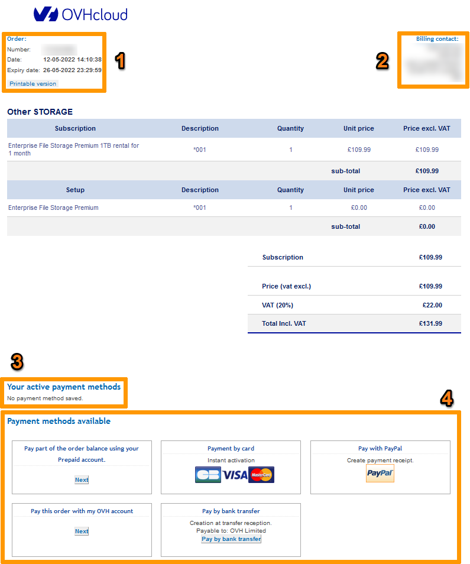
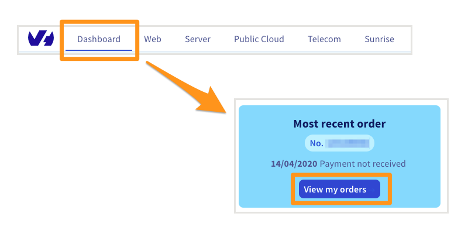
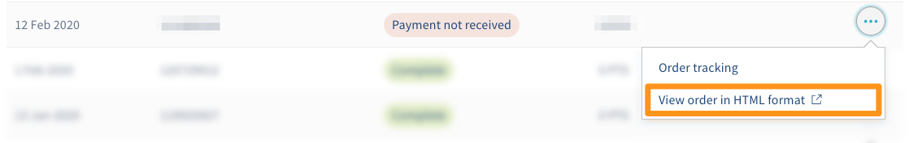
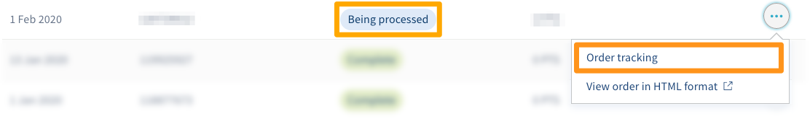
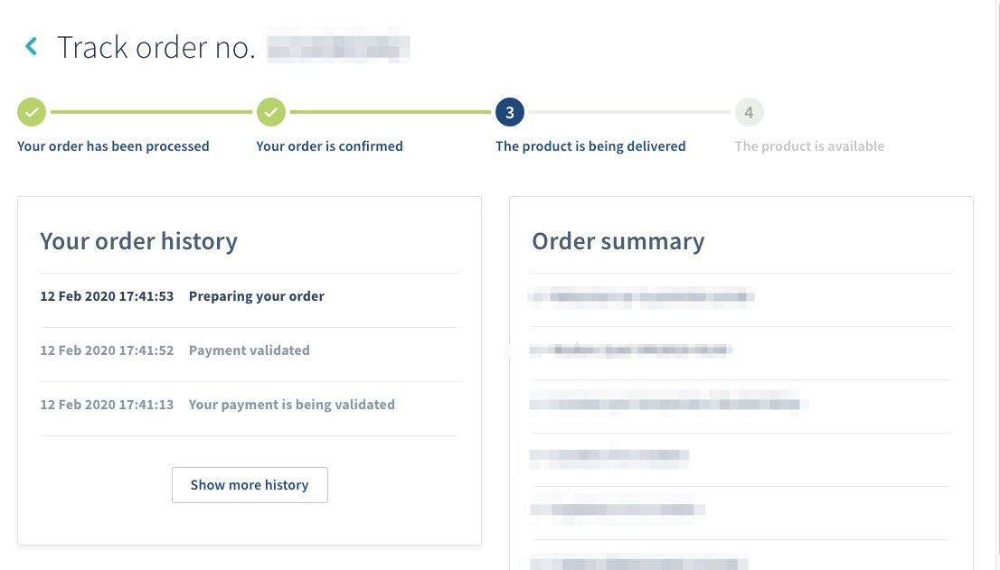

## Objetivo

Al realizar un pedido, puede realizar un seguimiento e interactuar con él desde el [área de cliente de OVHcloud](/links/control-panel/billing-orders).

**Esta guía explica cómo gestionar los pedidos desde el área de cliente de OVHcloud.**

> [!primary]
>
> Tenga en cuenta que, en función de su lugar de residencia y de la legislación vigente, así como del producto o servicios en cuestión, es posible que algunas secciones de esta guía sean diferentes para usted o no se apliquen a su caso particular. En caso de duda, consulte los contratos de OVHcloud disponibles en la página [Mis contratos](/links/control-panel/billing-contracts).
>

## Requisitos

- Haber realizado al menos un pedido en OVHcloud.

<!-- CP-NAV-START:billing-orders -->
---

### Acceso al área de cliente de OVHcloud

- **Enlace directo:** [Mis pedidos](/links/control-panel/billing-orders)
- **Ruta de navegación:** Haga clic en su nombre en la parte superior derecha > `Mis pedidos`{.action}

---
<!-- CP-NAV-END:billing-orders -->

## Procedimiento

### El pedido

La orden de pedido se genera al realizar el pedido. En él se enumeran los productos, su precio y los posibles descuentos que se hayan aplicado.

{.thumbnail}

|Número|Descripción|
|---|---|
|1|Número, fecha de creación y fecha de expiración de la orden de pedido. Si ha expirado, deberá volver a realizar el pedido.|
|2|Sus datos de facturación. Es necesario identificarse para mostrar y abonar la orden de pedido.|
|3|Formas de pago registradas en su cuenta de cliente. Para más información, consulte la guía [Gestionar mis formas de pago](/pages/account_and_service_management/managing_billing_payments_and_services/manage-payment-methods).|
|4|Formas de pago disponibles. Solo se mostrarán las formas de pago autorizadas en el país de origen de la cuenta o las asociadas al tipo de cuenta registrada.|

En cualquier momento puede consultar la orden de pedido desde la página [Mis pedidos](/links/control-panel/billing-orders), tal y como se explica a continuación.

### Acceder a los pedidos desde el área de cliente de OVHcloud.

Abra la página [Mis pedidos](/links/control-panel/billing-orders).

{.thumbnail}

A continuación se muestra un resumen de los pedidos realizados:

{.thumbnail}

Aquí, podrá ver los siguientes datos:

- la fecha en que se generó la orden de pedido;
- número de pedido;
- estado del pedido;
- Importe (IVA incluido) del pedido.

Estos son los posibles estados de un pedido:

|Estado|Significado|
|---|---|
|Pago no recibido|Este estado corresponde a una orden de pedido que aún no ha recibido pago. Si no abona el importe pendiente, el pedido expirará y se cancelará en la fecha indicada en la orden de pedido. Una vez transcurrido este plazo, si desea realizar la compra, solo tendrá que volver a realizar el pedido.|
|Validación|El pedido requiere una comprobación manual por parte de nuestro equipo (solamente en días laborables). Una vez finalizada esta comprobación, se validará el pedido. Si no fuera posible finalizar la operación, recibirá un mensaje de correo electrónico indicándole los justificantes que debe enviar.|
|Entrega en curso|El pedido está en curso de entregarse, tenga paciencia. Según el servicio, la entrega podría tardar desde unos pocos minutos hasta varias horas.|
|Entregado|El servicio ya se ha entregado. Las claves de acceso (en caso necesario) se han enviado por correo electrónico.|

Si desea ver el pedido en formato HTML, haga clic en `...`{.action} a la derecha de su pedido y, seguidamente, en `Ver la orden de pedido en formato HTML`{.action}.

{.thumbnail}

### Seguimiento del pedido

Una vez generada la orden de pedido, puede realizar el seguimiento de su pedido desde la página [Mis pedidos](/links/control-panel/billing-orders):

* Haga clic en el botón `...`{.action} delante del pedido.
* Seleccione `Seguimiento del pedido`{.action}. El seguimiento del pedido también puede mostrarse haciendo clic en el estado de un pedido en la columna `Estado`.

{.thumbnail}

Se abrirá una ventana en la que podrá realizar el seguimiento en cuatro pasos.

{.thumbnail}

## Más información

Interactúe con nuestra [comunidad de usuarios](/links/community)