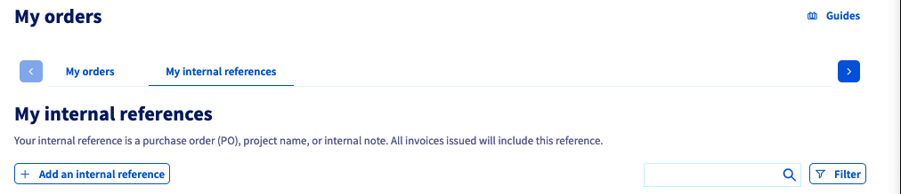
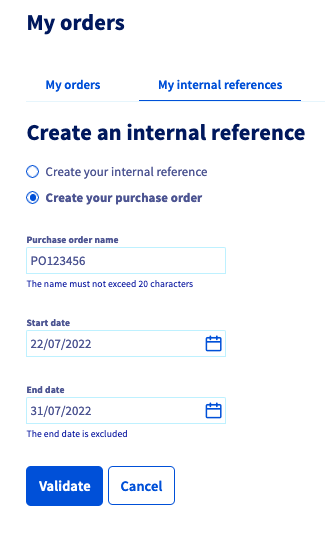
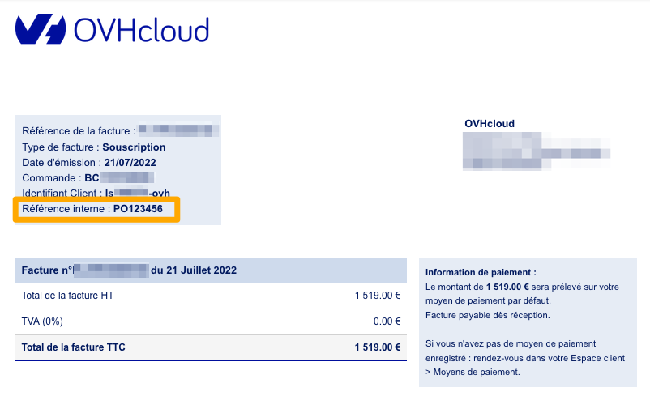
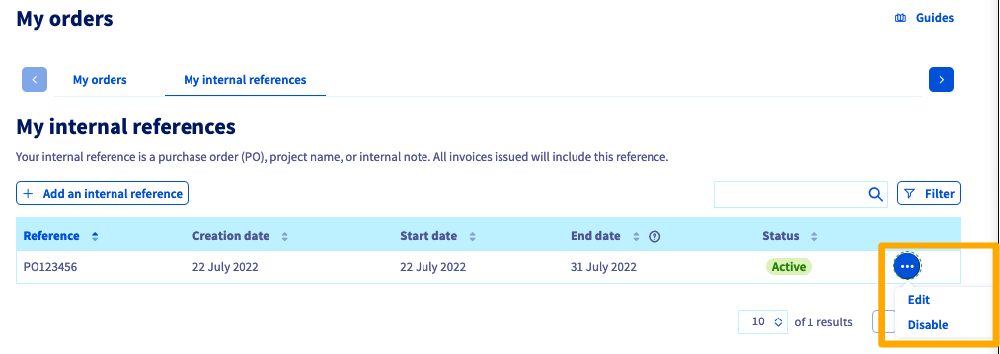

## Obiettivo

Questa guida ti mostra la nozione di Numero d'ordine o Purchase Order (PO) applicata alla fatturazione di OVHcloud.

<!-- CP-NAV-START:billing-orders -->
---

### Accesso allo Spazio Cliente OVHcloud

- **Link diretto:** [I miei ordini](/links/control-panel/billing-orders)
- **Percorso di navigazione:** Clicca sul tuo nome in alto a destra > `I miei ordini`{.action}

---
<!-- CP-NAV-END:billing-orders -->

## Procedura

### Numero d'ordine e Purchase Order (PO) Number

Nell'acquisto di beni o servizi, le imprese devono convalidare i buoni d'ordine. Nella maggior parte dei casi, la convalida viene effettuata restituendo un documento (formato cartaceo o digitale) all'intestazione dell'impresa che ricorda i beni o servizi acquistati precisando un numero d'ordine.
Nel mondo anglosassone, questo documento è chiamato **Purchase Order** ed è abbreviato in **PO**.

Per l'impresa che emette il PO, il documento ha lo scopo di controllare gli acquisti di beni e servizi presso i suoi fornitori, in particolare imponendo che tutte le fatture emesse indichino un numero d'ordine (PO Number).

Esistono essenzialmente due tipi di comandi, descritti di seguito.

#### Ordine chiuso/Purchase Order (PO)

Si tratta di un documento che conferma l'ordine di beni o servizi per una quantità fissa e per una durata fissa.

Per OVHcloud il documento deve quindi contenere almeno le seguenti informazioni:

* Ragione sociale del contraente
* Numero dell'ordine
* Tipo/i di servizi ordinati
* Quantità
* Prezzi unitari
* Data di inizio della validità
* Data di scadenza

#### Ordine aperto/Blancket Purchase Order (BPO)

Si tratta di un documento che conferma l'ordine di beni o servizi per una quantità variabile con un importo massimo e per una durata fissa.

Per OVHcloud il documento deve quindi contenere almeno le seguenti informazioni:

* Ragione sociale del contraente
* Numero dell'ordine
* Tipo/i di servizi ordinati
* Prezzi unitari
* Importo totale dell'ordine
* Data di inizio della validità
* Data di scadenza

### Come inserire un numero di Purchase Order (PO) nello Spazio Cliente OVHcloud

Apri la pagina [I miei ordini](/links/control-panel/billing-orders).

{.thumbnail}

Clicca sulla scheda `Le tue referenze interne`{.action} e poi sul pulsante `+ Aggiungi un referenza interna`{.action}.

{.thumbnail}

A seconda che tu voglia visualizzare sulle tue fatture la menzione `Referenza interna` **o** la menzione `Purchase Order`. 
Seleziona `Crea la tua referenza interna`{.action} o `Crea il tuo purchase order`{.action}.

Assegna un nome la tua referenza interna / Purchase Order nel campo previsto a tal fine, inserisci una **data di inizio** e una **data di fine** (la data di fine è esclusa) e clicca su `Confermare`{.action}.

> [!primary]
> Non puoi creare 2 referenze interne / Purchase Orders nello stesso periodo di tempo.

{.thumbnail}

Questa informazione verrà mostrata sulle fatture che corrispondono all'intervallo di tempo definito dall'utente.

{.thumbnail}

Nella scheda `Le tue referenze interne`{.action}, è possibile modificare o disattivare un riferimento già creato cliccando sul pulsante `...`{.action} a destra della referenza.

{.thumbnail}

> [!primary]
> Per disattivare/modificare una referenza a un altro **nello stesso intervallo di tempo**, utilizza l'opzione `Modificare`{.action} per modificare l'intervallo di tempo della prima referenza.

## Per saperne di più

Contatta la nostra [Community di utenti](/links/community).