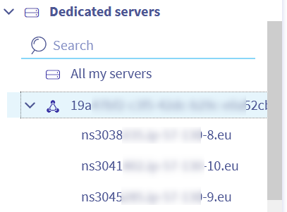
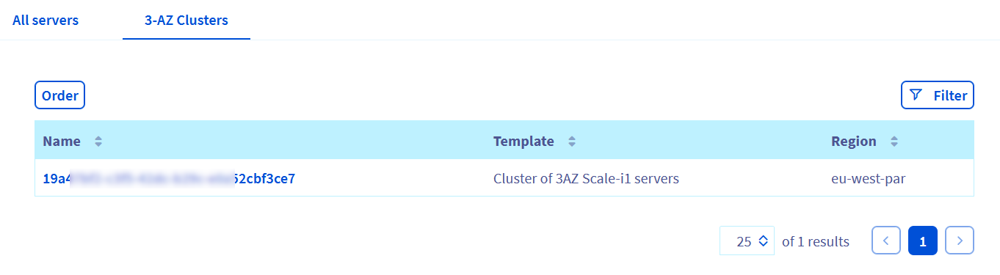
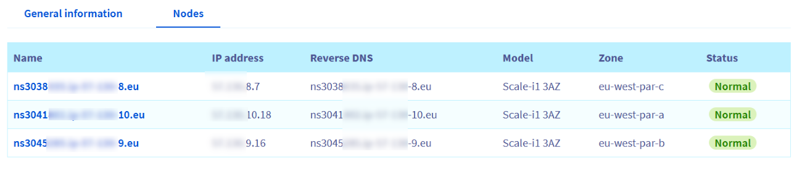
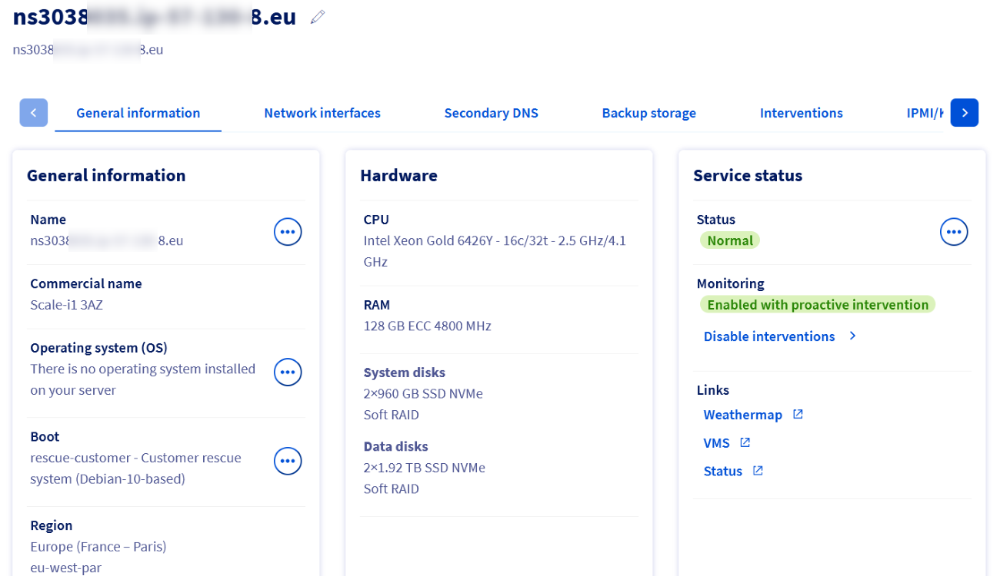

## Objectif

OVHcloud propose son service Bare Metal dans la [région 3-AZ](/links/bare-metal/regions), une évolution significative dans la stratégie de régionalisation de l'entreprise. Ce service, disponible dans l’agglomération de Paris, constitue un nouveau standard du secteur en matière de fiabilité et de performance des serveurs Bare Metal.

Le Bare Metal de la région 3-AZ répond aux besoins des clients qui ont besoin d’une haute disponibilité et d’une redondance dans leurs plans de continuité d’activité. Ce service fournit des serveurs Bare Metal dans trois datacenters proches de Paris, connectés par un réseau à faible latence. Il garantit une sécurité renforcée, des performances améliorées et des fonctionnalités ininterrompues, même en cas d'incidents localisés.

## Vue d'ensemble

### But du Service

La valeur de la région 3-AZ réside dans l’offre de trois serveurs identiques répartis sur trois zones de disponibilité au sein d’une même région. Cette configuration garantit une haute disponibilité et une redondance des données, tout en maintenant la continuité opérationnelle et en réduisant le risque de perte de données. La distribution stratégique des serveurs minimise la latence et améliore les performances des applications.

### La régionalisation chez OVHcloud

OVHcloud est présent dans le monde entier, notamment en Europe, aux États-Unis, au Canada et en Asie-Pacifique. L'introduction du concept de Région et le support des Zones de Disponibilité est une initiative stratégique visant à fournir aux clients une performance et une résilience optimales. La région parisienne est la première à adopter le modèle 3-AZ.

### Conseils de sélection de région

Pour des performances optimales, une région doit être sélectionnée au plus près de ses utilisateurs. Pour une disponibilité mondiale, les services doivent être répartis sur plusieurs régions. La région 3-AZ est idéale pour les clients à la recherche de la plus haute résilience et doit être utilisée pour créer des conceptions d'applications multi-AZ.

Vous pouvez lister ici vos clusters avec un nouvel onglet dans l'interface (les serveurs sont représentés dans la liste sous-jacente à un cluster comprenant 3 nœuds) :

{.thumbnail}

{.thumbnail}

Lors de la sélection de votre cluster, vous avez la liste des 3 serveurs qu'il contient :

{.thumbnail}

L'interface est toujours la même, il n'y a pas d'autres changements à ce niveau :

{.thumbnail}

## Aller plus loin

Échangez avec notre communauté d’utilisateurs sur <https://community.ovh.com/>.
