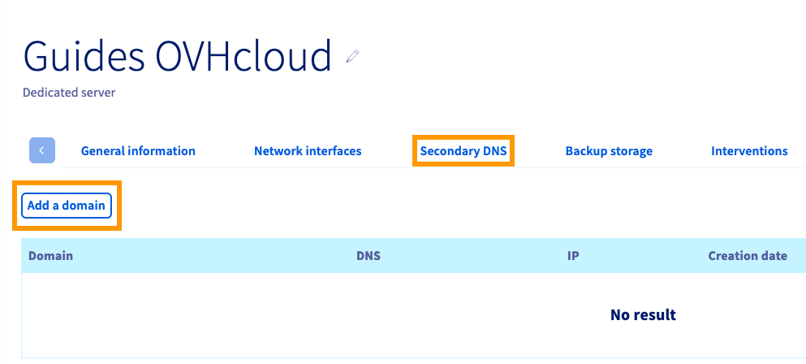
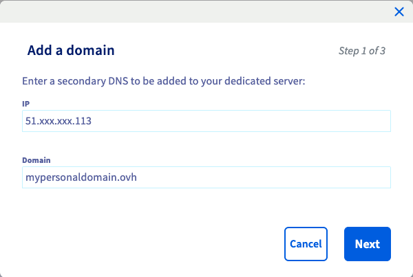
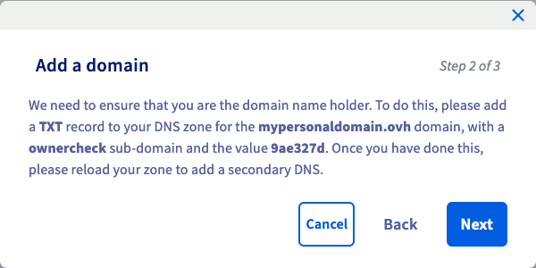
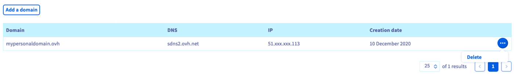
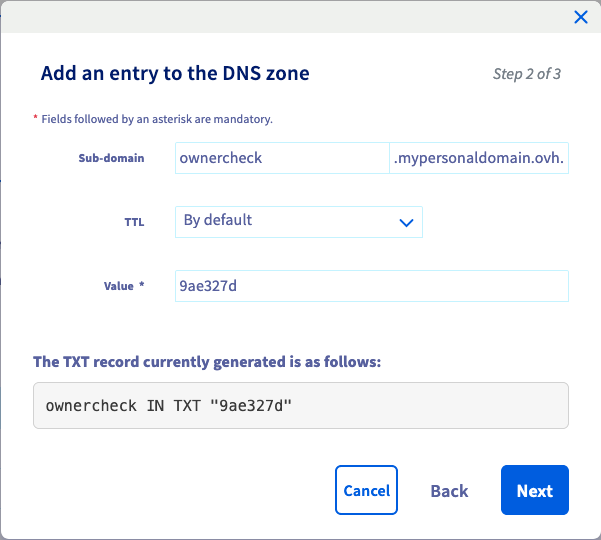

## Objective

If you are configuring your dedicated server as a DNS server, you can make use of the OVHcloud Secondary DNS service to host a secondary zone. This way, DNS for your domain will remain available even if the primary DNS server should become unresponsive.

**This guide explains how to add your domain name in the OVHcloud Control Panel in order to utilise an OVHcloud Secondary DNS server.**

## Requirements

- A domain name to which you have administrative access
- A [dedicated server](/links/bare-metal/bare-metal) in your OVHcloud account

<!-- CP-NAV-START:baremetal-dedicated-servers -->
---

### OVHcloud Control Panel Access

- **Direct link:** [Dedicated Servers](/links/control-panel/baremetal-dedicated-servers)
- **Navigation path:** `Bare Metal Cloud`{.action} > `Dedicated servers`{.action} > Select your server

---
<!-- CP-NAV-END:baremetal-dedicated-servers -->

> [!warning]
> OVHcloud is providing you with services for which you are responsible, with regard to their configuration and management. You are therefore responsible for ensuring they function correctly.
>
> This guide is designed to assist you in common tasks as much as possible. Nevertheless, we recommend that you contact a [specialist service provider](/links/partner) if you have difficulties or doubts concerning the administration, usage or implementation of services on a server.
>

## Instructions

### Adding a domain name 

<!-- CP-STEPS-START:add-domain -->
Switch to the tab `Secondary DNS`{.action} and click on the button `Add a domain`{.action}.

{.thumbnail}

Enter your IP address and the domain name to add, then click `Next`{.action}.

{.thumbnail}

Confirming with `Next`{.action} in this step will trigger the domain verification check. If you have not already fulfilled this requirement by adding a TXT record to your DNS zone, follow the instructions in the [guide section below](#verifyingdomain) first. Otherwise, continue by clicking on `Next`{.action}.

{.thumbnail}

After clicking on `Add`{.action} in the last window, the domain name will be added to the OVHcloud Secondary DNS server.

Added domain names will be listed in this tab and can be deleted by clicking on the `...`{.action} button. The name of the secondary DNS server will be displayed next to the domain name.

{.thumbnail}
<!-- CP-STEPS-END:add-domain -->

> [!primary]
>
> Other actions required to configure your own DNS for your domain(s) usually include:
>
> - Configuring a DNS service (such as *BIND*)
> - Configuring GLUE records
> - Authorising zone transfers
>
> Please refer to the corresponding manuals and external knowledge resources if you need further instructions for these administrative tasks.

### Verifying authorisation for the domain name 

<!-- CP-STEPS-START:verify-domain-cancel -->
It is necessary to confirm your authorisation to manage the domain name before it can be added to OVHcloud Secondary DNS. This is achieved via an automated DNS lookup on the subdomain *ownercheck.yourdomainname*. A unique string of characters is generated for this purpose and displayed in the OVHcloud Control Panel.

- If the domain is managed by an external registrar or uses external DNS servers at this point, log in to the control panel of your DNS provider and add a TXT record with the subdomain "ownercheck" and the value provided in step 2 of the ["Add a domain" dialogue box](#addingdomain).

- If the domain is managed by OVHcloud as its registrar and it uses OVHcloud DNS servers, close the window by clicking on `Cancel`{.action} first. Then you can follow the instructions in [this guide](/pages/web_cloud/domains/dns_zone_edit) to add the TXT record in your [OVHcloud Control Panel](/links/manager).

{.thumbnail}
<!-- CP-STEPS-END:verify-domain-cancel -->

After successfully adding the TXT record to the domain name's DNS zone, repeat the [steps above](#addingdomain) and finish the process.

## Go further

[Editing an OVHcloud DNS zone](/pages/web_cloud/domains/dns_zone_edit)

[How to get started with a Dedicated Server](/pages/bare_metal_cloud/dedicated_servers/getting-started-with-dedicated-server)

[Configuring IPv6 on Dedicated Servers](/pages/bare_metal_cloud/dedicated_servers/network_ipv6)

Join our [community of users](/links/community).