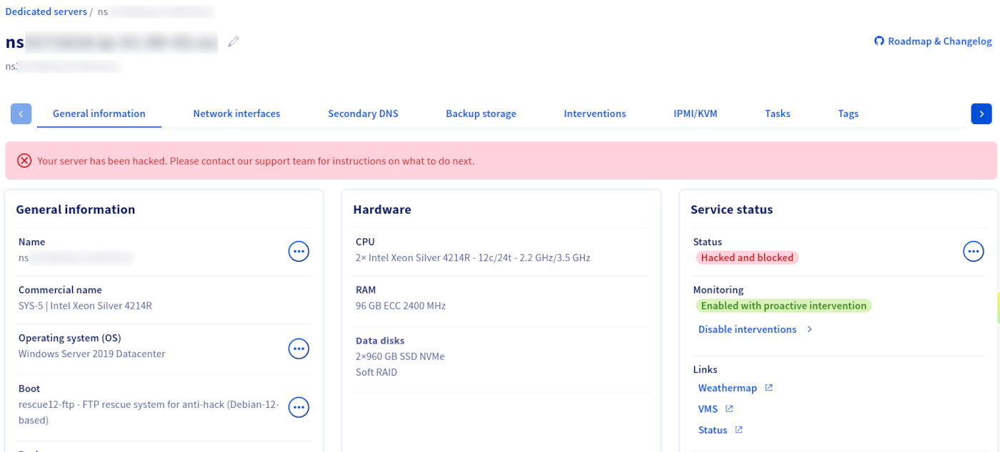
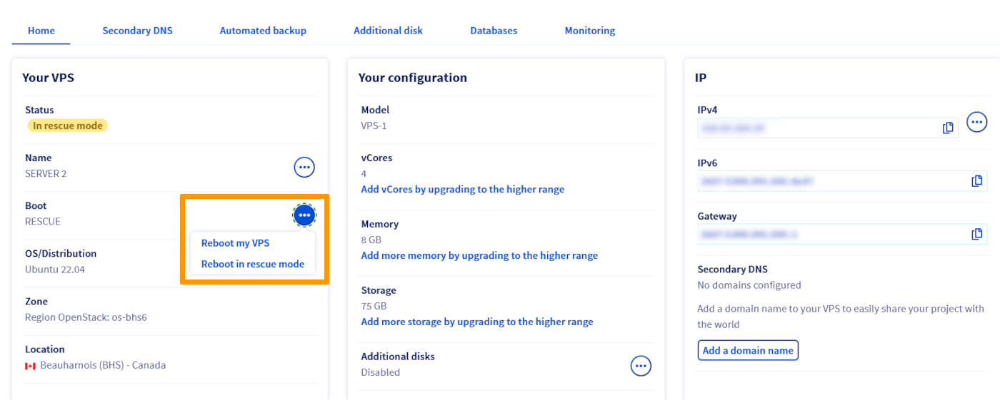

**Erfahren Sie, was passiert, wenn der Anti-Hack-Schutz von OVHcloud auf Ihrem Dedicated Server oder VPS aktiviert wird.**

## Voraussetzungen

- Sie verfügen über einen Dedicated Server oder VPS, der gehackt wurde.
- Sie haben Zugang zum [OVHcloud Kundencenter](/links/manager).

## Anti-Hack-Informationen

### Dedicated Server

Wenn der Anti-Hack-Schutz auf Ihrem Dedicated Server ausgelöst wird, sehen Sie eine Meldung im [OVHcloud Kundencenter](/links/manager): "*Ihr Server wurde gehackt. Bitte kontaktieren Sie unser Support-Team für Anweisungen zum weiteren Vorgehen.*"

Je nach Schweregrad des von OVHcloud ausgelösten Anti-Hack-Schutzes sind die folgenden Aktionen erlaubt/erforderlich, um den vollständigen Dienst auf dem Server wiederherzustellen.

| Status | Erwartete Aktionen |
| ------ | ----------- |
| Hacked | Den Server neu starten oder OVHcloud bitten, den Server neu zu installieren |
| HackedBlocked | Daten über FTP sammeln, während der Server im FTP-Rescue-System gebootet ist |

{.thumbnail}

Falls Ihr Server in den FTP-Rescue-Modus versetzt wird, öffnet OVHcloud auch ein Support-Ticket in Ihrem Namen mit folgendem Inhalt:

>
> Sehr geehrter Kunde,
>
> Da Ihr Server nsXXXXXXX.ip-XXX-XXX-XXX.eu eine zu große Bedrohung für unser Netzwerk darstellt,
hatten wir keine andere Wahl, als ihn in den Modus "Rescue FTP" zu versetzen. Eine E-Mail
mit einem Benutzernamen und einem Passwort wurde Ihnen zugesendet, damit Sie alle
noch im Speicherplatz befindlichen Daten einfach abrufen können.
>
> Bitte zögern Sie nicht, unseren technischen Support zu kontaktieren, damit diese
Situation nicht kritisch wird.
>
> Sie finden unten die von unserem System ermittelten Protokolle, die zu diesem Alert geführt haben.
>
> - BEGINN DER ZUSÄTZLICHEN INFORMATIONEN -
>
>  <Attack Details>
>
> - ENDE DER ZUSÄTZLICHEN INFORMATIONEN -
>
> Mit freundlichen Grüßen,
>
> OVHcloud Kundensupport
> Das OVHcloud-Team

### VPS

Wenn der Anti-Hack-Schutz auf Ihrem VPS ausgelöst wird, kann er je nach Schweregrad der erkannten Bedrohung in den Rescue-Modus versetzt werden.

{.thumbnail}

Falls Ihr VPS in den Rescue-Modus versetzt wird, öffnet OVHcloud auch ein Support-Ticket in Ihrem Namen mit folgendem Inhalt:

>
> Sehr geehrter Kunde,
>
> Auf Ihrem VPS vps-XXXXXXXX.vps.ovh.net wurde ungewöhnliche Aktivität festgestellt.
>
> Ihr VPS wurde in den Rescue-Modus versetzt. Dies ermöglicht es Ihnen, auf Ihrem VPS einzugreifen,
um die gemeldeten Probleme zu beheben. Eine E-Mail mit Informationen zum Rescue-Modus wurde Ihnen zugesendet.
>
> Aktionen können nicht mehr über Ihren Manager/Ihre API auf Ihrem VPS durchgeführt werden. Nur die folgenden Aktionen sind möglich:
>
> - Neuinstallation Ihres VPS.
> - Verwendung des Rescue-Modus zur Behebung der gemeldeten Probleme.
>
> Sobald die Probleme behoben sind, wenden Sie sich bitte an unseren technischen Support, um ihn wieder in den normalen Modus zu versetzen.
>
> Bitte zögern Sie nicht, unser technisches Support-Team zu kontaktieren, damit diese Situation nicht kritisch wird.
>
> Sie finden unten die von unserem System ermittelten Protokolle, die zu diesem Alert geführt haben.
>

> [!primary]
> **Bitte beachten Sie den letzten Teil der Nachricht:** "*Sobald die Probleme behoben sind, wenden Sie sich bitte an unseren technischen Support, um ihn wieder in den normalen Modus zu versetzen. Bitte zögern Sie nicht, unser technisches Support-Team zu kontaktieren, damit diese Situation nicht kritisch wird.*"
>

## Weiterführende Informationen

Treten Sie unserer [User Community](/links/community) bei.
