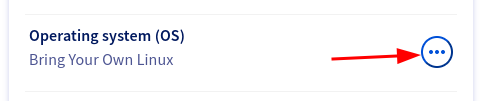
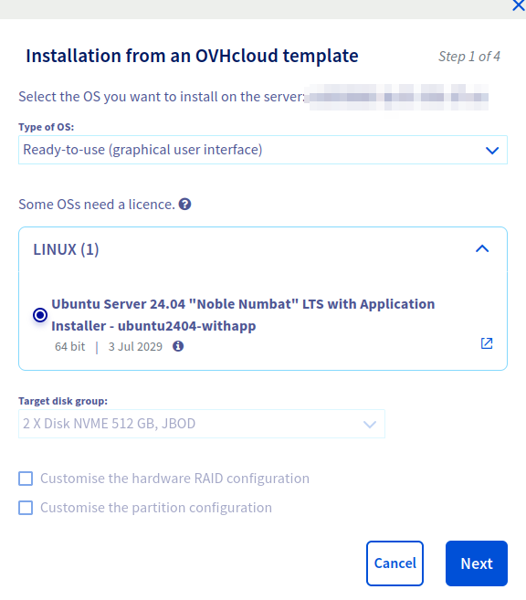
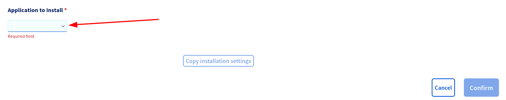

## Objectif

Le catalogue applicatif vous permet d'installer une application prête à l'emploi sur votre serveur dédié OVHcloud, sans connaissance préalable en administration système. Vous choisissez une application lors de la (ré)installation de votre serveur, puis vous complétez un court formulaire de configuration dans une interface web sécurisée. L'application est installée nativement, sécurisée en HTTPS et disponible en quelques minutes.

**Ce guide vous explique comment utiliser le catalogue applicatif sur votre serveur dédié OVHcloud.**

## Prérequis

- Disposer d'un [serveur dédié](/links/bare-metal/bare-metal) dans votre compte OVHcloud
- Être connecté à l'[espace client OVHcloud](/links/manager)
- Disposer d'un accès à l'[API OVHcloud](/pages/manage_and_operate/api/first-steps) (pour la partie « [Déploiement via l'API](#viaapi) » de ce guide)
- Disposer d'un navigateur web pour accéder à l'interface de configuration une fois l'installation terminée

<!-- CP-NAV-START:baremetal-dedicated-servers -->
---

### Accès à l'espace client OVHcloud

- **Lien direct :** [Serveurs dédiés](/links/control-panel/baremetal-dedicated-servers)
- **Chemin d'accès :** `Bare Metal Cloud`{.action} > `Serveurs dédiés`{.action} > Sélectionnez votre serveur

---
<!-- CP-NAV-END:baremetal-dedicated-servers -->

> [!warning]
>
> Tout comme une installation d'OS classique, une nouvelle installation avec le catalogue applicatif effacera l'intégralité des données présentes sur le serveur. Sauvegardez les données que vous souhaitez conserver avant de commencer.
>

## En pratique

### Fonctionnement du catalogue applicatif

Le déploiement d'une application se déroule en deux étapes :

1. **Sélection (à l'installation) :** vous (ré)installez votre serveur avec une image du catalogue applicatif et vous sélectionnez **une seule** application. C'est ici que vous choisissez *quelle* application vous souhaitez.
2. **Configuration (après le premier démarrage) :** une fois le serveur redémarré, un configurateur à usage unique se lance automatiquement et met à disposition une interface web sécurisée. Vous complétez un court formulaire (par exemple un nom de site et un mot de passe administrateur), puis l'application est installée automatiquement en HTTPS.

Une fois l'installation réussie, le configurateur **se supprime entièrement** du serveur. Il ne reste alors que votre application, sur laquelle vous disposez d'un accès root complet.

**Limites techniques :**

- **Une seule application** est déployable grâce au catalogue applicatif.
- Le **partitionnement personnalisé n'est pas disponible** pour cette installation.

> [!warning]
>
> Cela ne veut pas dire que vous ne pouvez pas exécuter d'autres applications sur le serveur, mais que seulement **UNE** application est déployable via le catalogue. Si vous souhaitez déployer d'autres applications, il faudra le faire manuellement.
>

### Applications disponibles

Le catalogue est régulièrement enrichi. Lors du lancement d'une installation, la liste à jour est affichée dans l'espace client OVHcloud. À date, les applications suivantes sont disponibles :

| Application | Catégorie | Description |
|---|---|---|
| WordPress | CMS | Système de gestion de contenu pour sites web et blogs |
| Nextcloud | Stockage cloud | Synchronisation de fichiers, agenda, contacts et collaboration auto-hébergés |
| PrestaShop | E-commerce | Plateforme e-commerce pour boutiques en ligne |
| Discourse | Communauté | Plateforme moderne de forum communautaire |
| Matomo | Web analytics | Plateforme d'analyse d'audience respectueuse de la vie privée |
| n8n | Automatisation | Plateforme d'automatisation de workflows avec plus de 400 intégrations |
| OpenClaw | IA | Passerelle d'assistant IA personnel hébergée sur votre serveur |
| FreePBX | Téléphonie | Système de gestion de PBX web basé sur Asterisk |
| CloudPanel | Panneau de contrôle | Panneau de contrôle serveur pour applications PHP et Node.js |
| HestiaCP | Panneau de contrôle | Panneau de contrôle web open source |
| FastPanel | Panneau de contrôle | Panneau de contrôle d'hébergement web |
| Coolify | Panneau de contrôle | Alternative PaaS auto-hébergeable à Heroku ou Vercel |
| Dokploy | Panneau de contrôle | PaaS auto-hébergé pour déployer depuis Git ou Docker |
| Easypanel | Panneau de contrôle | Panneau de contrôle serveur moderne basé sur Docker |
| OVHcloud Game Panel | Panneau de contrôle | Panneau web pour gérer des serveurs de jeux basés sur Docker |

**Méthodes de déploiement :**

- [Déploiement via l'espace client](#viacontrolpanel) : installez votre application depuis l'espace client OVHcloud.
- [Déploiement via l'API](#viaapi) : utilisez l'API OVHcloud pour intégrer l'installation à vos propres scripts et automatiser vos déploiements.

### Déploiement via l'espace client <a name="viacontrolpanel"></a>

1. Connectez-vous à l'[espace client OVHcloud](/links/control-panel/baremetal-dedicated-servers) et sélectionnez votre serveur dans `Bare Metal Cloud`{.action} > `Serveurs dédiés`{.action}.
2. Dans l'onglet `Informations générales`{.action}, en face de `Système d'exploitation (OS)`{.action}, cliquez sur le bouton `...`{.action} et sélectionnez l'option d'installation.

{.thumbnail}

3. Dans la fenêtre `Installation à partir d'un modèle OVHcloud`{.action}, réglez `Type d'OS`{.action} sur `Prêt à l'emploi (interface graphique)`{.action}, puis sélectionnez le modèle **Ubuntu Server 24.04 « Noble Numbat » LTS with Application Installer**. Choisissez votre groupe de disques cible, puis cliquez sur `Suivant`{.action}.

> [!primary]
>
> La personnalisation du partitionnement et de la configuration RAID matériel n'est pas disponible avec ce modèle : ces options restent donc désactivées.
>

{.thumbnail}

4. Poursuivez les étapes d'installation pour renseigner les paramètres généraux, tels que le nom d'hôte (hostname) du serveur et la clé SSH à ajouter au serveur.
5. À l'étape `Application à installer`{.action}, sélectionnez l'**unique application** que vous souhaitez déployer dans la liste déroulante, puis cliquez sur `Confirmer`{.action} pour lancer l'installation.

{.thumbnail}

Le serveur est réinstallé, puis le configurateur démarre automatiquement. Une fois l'installation terminée, suivez la section « [Configurer et accéder à votre application](#configure) » ci-dessous pour finaliser la mise en place.

### Déploiement via l'API <a name="viaapi"></a>

Vous pouvez déclencher la même installation via l'[API OVHcloud](/pages/manage_and_operate/api/first-steps). Utilisez l'appel `POST /dedicated/server/{serviceName}/reinstall` avec un système d'exploitation du catalogue applicatif, et indiquez l'application à installer dans la personnalisation `appToInstall`.

```json
{
  "operatingSystem": "ubuntu2404-withapp_64",
  "customizations": {
    "hostname": "myApplicationServer",
    "sshKey": "mySshKey",
    "appToInstall": "wordpress"
  }
}
```

La valeur `appToInstall` correspond à l'identifiant de l'application à déployer (par exemple `wordpress`, `nextcloud`, `prestashop` ou `discourse`). Une seule application peut être indiquée.

#### Configurer et accéder à votre application <a name="configure"></a>

Après l'installation, votre serveur démarre automatiquement le configurateur à usage unique. Pour finaliser la mise en place :

1. Ouvrez le configurateur dans votre navigateur web à l'adresse `https://<nom-de-votre-serveur>:10143/`, où `<nom-de-votre-serveur>` est le nom d'hôte canonique de votre serveur (sous la forme `ipXX.ip-A-B-C.<tld>` affichée dans l'espace client). Pour des raisons de sécurité, l'accès est protégé par un jeton d'authentification à usage unique fourni avec votre installation.
2. Complétez le court formulaire de configuration de votre application. Les champs dépendent de l'application ; par exemple, WordPress demande un nom de site, un mot de passe administrateur et un mot de passe de base de données.
3. Validez le formulaire. L'application est installée automatiquement et un certificat HTTPS [Let's Encrypt](https://letsencrypt.org/) gratuit et renouvelé automatiquement est émis pour le nom d'hôte de votre serveur. Vous pouvez suivre la progression de l'installation en temps réel.
4. Lorsque l'installation réussit, votre application est disponible à l'adresse `https://<nom-de-votre-serveur>/`. Le configurateur se supprime alors du serveur.

> [!primary]
>
> Le configurateur est à usage unique : il est conçu pour ne s'exécuter qu'une seule fois et disparaît après une installation réussie. Pour déployer une autre application, réinstallez votre serveur depuis le catalogue applicatif et sélectionnez la nouvelle application.
>

#### Les erreurs clientes fréquentes <a name="errors"></a>

| Symptôme | Cause | Solution |
|---|---|---|
| La page du configurateur ne se charge pas à l'adresse `https://<nom-de-votre-serveur>:10143/` | L'installation n'est pas encore terminée, ou l'accès entrant vers le port `10143` est bloqué. | Attendez la fin de l'installation, puis réessayez. Assurez-vous que votre pare-feu (y compris le [Firewall Network](/links/network/firewall) OVHcloud) autorise le trafic entrant vers votre serveur sur le port `10143`. |
| `401 Unauthorized` à l'ouverture du configurateur | Le jeton d'authentification est manquant ou incorrect. | Rouvrez le configurateur en utilisant exactement le lien et le jeton fournis avec votre installation. |
| L'application n'est pas joignable en HTTPS après l'installation | Le certificat Let's Encrypt n'a pas pu être émis, généralement parce que le port entrant `80`/`443` est bloqué ou que le nom d'hôte ne se résout pas. | Vérifiez que les ports `80` et `443` sont ouverts en entrée et que le nom d'hôte de votre serveur se résout publiquement, puis réinstallez si nécessaire. |
| Je souhaite déployer une seconde application depuis le catalogue | Une seule application est déployable via le catalogue. | Réinstallez le serveur pour déployer une autre application, ou installez l'application supplémentaire manuellement. |

## Aller plus loin

[API OVHcloud et installation d'un OS](/pages/bare_metal_cloud/dedicated_servers/api-os-installation)

[Comprendre le processus de démarrage des serveurs dédiés](/pages/bare_metal_cloud/dedicated_servers/boot-process)

Échangez avec notre [communauté d'utilisateurs](/links/community).
