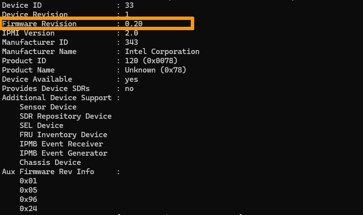
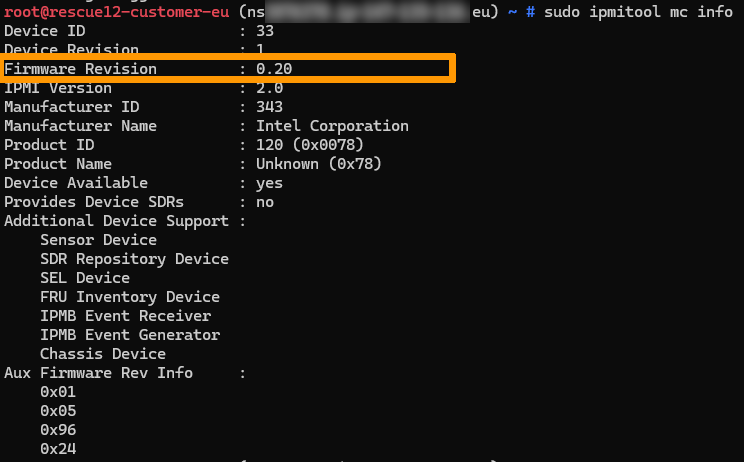

## Objetivo

Um controlador BMC (Baseboard Management Controller) é responsável pela gestão remota e pelo controlo de baixo nível do hardware do servidor. A versão desatualizada pode ter um impacto direto na segurança, estabilidade e capacidade de gestão do servidor. É necessário manter o firmware da controladora BMC atualizado para corrigir falhas de segurança, manter a estabilidade do sistema e atender aos requisitos de conformidade.

**Este guia indica-lhe os passos a seguir para verificar a versão do firmware BMC num servidor dedicado.**

## Requisitos

- Um [servidor dedicado](/links/bare-metal/bare-metal) no seu conta OVHcloud.
- Direitos de administrador (sudo).
- O seu servidor dedicado deve estar ligado à Internet (apenas se a ferramenta `ipmitool` ainda não estiver instalada).

> [!primary]
> Devido à configuração específica dos nossos serviços, a atualização do BMC é realizada exclusivamente através da automação OVHcloud, sob a supervisão dos nossos técnicos. Não é fornecido qualquer pacote ou mecanismo de atualização autónomo.
>


### Num Servidor Linux

Em primeiro lugar, tem de instalar a ferramenta `ipmitool`. Esta ferramenta permite interrogar o BMC através da interface IPMI. Para mais informações, consulte a documentação oficial: <https://linux.die.net/man/1/ipmitool>.

Consoante a distribuição Linux, o comando pode variar:

> [!tabs]
> **Debian/Ubuntu**
>>
>> ```sh
>> sudo apt update
>> sudo apt install ipmitool -y
>> ```
>>
> **RHEL/CentOS/AlmaLinux/Rocky Linux**
>>
>> ```sh
>> sudo dnf install epel-release -y
>> sudo dnf install ipmitool -y
>> ```
>> 

Verifique a versão do firmware BMC com o seguinte comando:

```sh
sudo ipmitool mc info
```

{.thumbnail} 

- Se a versão do firmware for inferior ou igual a 1.14, contacte o nosso apoio técnico criando um [ticket de assistência a partir do centro de ajuda OVHcloud](/links/support-contact) para solicitar uma atualização do firmware. 
- Se a versão for superior a 1.14, não é necessária nenhuma ação.

### Num Servidor Windows

Atualmente, não podemos fornecer a procedimento para servidores a funcionar com o sistema operativo Windows. Recomendamos que reinicie o seu servidor Windows no nosso ambiente [modo rescue](/pages/bare_metal_cloud/dedicated_servers/rescue_mode) para verificar a versão seguindo as instruções abaixo.

### Num Servidor em modo rescue

Depois de reiniciar o seu servidor no [modo rescue](/pages/bare_metal_cloud/dedicated_servers/rescue_mode), instale a ferramenta `ipmitool`.

```sh
root@rescue12-customer-eu (nsxxxxx.ip-xx-xx-xx.eu) ~ # apt install ipmitool -y
```

Em seguida, verifique a versão do firmware:

```sh
ipmitool mc info
```

{.thumbnail}

- Se a versão do firmware for inferior ou igual a 1.14, contacte o nosso apoio técnico criando um [ticket de assistência a partir do centro de ajuda OVHcloud](/links/support-contact) para solicitar uma atualização do firmware. 
- Se a versão for superior a 1.14, não é necessária nenhuma ação.

## Quer saber mais?

Para serviços especializados (indexação, desenvolvimento, etc.), contacte os [parceiros OVHcloud](/links/partner).

Se desejar beneficiar de um apoio no uso e configuração das suas soluções OVHcloud, sugerimos que consulte as nossas várias [ofertas de suporte](/links/support).

Fale com a nossa [comunidade de utilizadores](/links/community).