## Objective

OVHcloud dedicated servers use a network-based boot process (netboot) that provides flexibility and security benefits. This guide explains how the boot process works and why you should not change the default boot order directly in the BIOS/UEFI settings, but instead use the [OVHcloud Control Panel](/links/manager) or the [OVHcloud API](/links/api).

**This guide will help you understand:**

- How the OVHcloud boot process works
- The available boot modes
- Why PXE must remain first in the BIOS/UEFI boot order
- How microcode updates are applied automatically

## Requirements

- A [dedicated server](/links/bare-metal/bare-metal) in your OVHcloud account
- Access to the [OVHcloud API](/links/api) (optional)

<!-- CP-NAV-START:baremetal-dedicated-servers -->
---

### OVHcloud Control Panel Access

- **Direct link:** [Dedicated Servers](/links/control-panel/baremetal-dedicated-servers)
- **Navigation path:** `Bare Metal Cloud`{.action} > `Dedicated servers`{.action} > Select your server

---
<!-- CP-NAV-END:baremetal-dedicated-servers -->

## Instructions

### How the boot process works

OVHcloud dedicated servers use [iPXE](https://ipxe.org/), an advanced network boot firmware, to boot from the network. When you set a boot mode for your server, OVHcloud automatically configures the corresponding iPXE script. When the server powers on, it follows this sequence:

{.thumbnail}

1. **PXE boot via DHCP**: The server boots from the network using DHCP on the public interface.
2. **Download iPXE**: The DHCP server provides the server's public IP address and a filename to download iPXE.
3. **Query boot service**: iPXE queries an internal OVHcloud boot service to retrieve the script to execute.
4. **Execute script**: iPXE executes the script based on your configured boot mode.

This process happens every time your server boots.

### Boot modes

You can configure your server to boot in one of the following modes:

| Boot mode | Description | Use case |
|-----------|-------------|----------|
| **Boot to disk** | Boots the operating system installed on disk | Normal operation |
| **Customer rescue** | Boots into a temporary operating system | Troubleshooting, recovery, first-time setup |
| **Custom boot script** | Executes a user-defined iPXE script | Advanced use cases (volatile OS, custom deployment) |

#### Boot to disk

When set to **boot to disk**, the boot process follows these steps:

**1\. Microcode update**

The system downloads and applies the latest [CPU microcode](https://blog.ovhcloud.com/ovhcloud-microcode-management-at-scale/) for your processor (AMD or Intel). This happens transparently and provides security patches without requiring OS-level or BIOS/UEFI updates.

> [!primary]
>
> Microcode updates are verified (signature checked) before being applied. If the microcode download fails, the boot process continues normally — your server will still boot.
>

**2\. Boot to operating system**

- **Legacy boot servers**: iPXE uses [`sanboot`](https://ipxe.org/cmd/sanboot) to boot directly from the first disk.
- **UEFI boot servers**: iPXE uses [`sanboot`](https://ipxe.org/cmd/sanboot) to boot the EFI bootloader path (`efiBootloaderPath`) specified during [OS installation](/pages/bare_metal_cloud/dedicated_servers/getting-started-with-dedicated-server#install) (e.g. `\efi\debian\grubx64.efi`).

    When OVHcloud installs an operating system, the boot order is not modified (e.g. GRUB is installed with the `--no-nvram` option) to ensure PXE remains first.

    If `sanboot` fails (e.g. the specified file is broken or cannot be found), iPXE falls back to rEFInd, which auto-detects EFI bootloaders.

    The `efiBootloaderPath` can be changed via the [OVHcloud API](/links/api):

    > [!api]
    >
    > @api {v1} /dedicated/server PUT /dedicated/server/{serviceName}
    >

#### Customer rescue mode

A temporary operating system for troubleshooting, recovery, and initial configuration. Microcode updates are applied before booting into rescue, just as with boot to disk. For more information, see [Activating and using rescue mode](/pages/bare_metal_cloud/dedicated_servers/rescue_mode).

#### Custom boot scripts

For advanced use cases, you can configure a custom iPXE script via the [OVHcloud API](/links/api). For more information, see [Configuring a custom iPXE script](/pages/bare_metal_cloud/dedicated_servers/ipxe-scripts).

> [!warning]
>
> Custom boot scripts skip the automatic microcode loading described above.
>

### Why you must not change the boot order

> [!warning]
>
> Do not change the boot order in your server's BIOS/UEFI settings or via tools like `efibootmgr`. PXE (network boot) must remain the first boot option.
>
> If you install an operating system manually, ensure your bootloader does not modify the NVRAM boot order (e.g. use `grub-install --no-nvram`).
>

OVHcloud relies on the network boot process for:

- **Boot mode selection**: The boot service determines whether to boot to rescue, disk, or a custom script.
- **UEFI boot to disk**: OVHcloud does not create EFI boot entries — iPXE uses `efiBootloaderPath` to chain to the bootloader.
- **Microcode updates**: Security patches are applied during the boot process.

**If you change the boot order:**

- ❌ Boot mode changes made in the OVHcloud Control Panel or via the OVHcloud API will have no effect.
- ❌ UEFI servers may fail to boot (no EFI boot entry exists for the on-disk bootloader).
- ❌ Rescue mode will no longer be accessible.
- ❌ Microcode updates will no longer be applied automatically.
- ❌ OVHcloud support may be unable to assist with boot issues.

### Servers with private-only interfaces (OLA)

If your server uses **[OLA (OVHcloud Link Aggregation)](/pages/bare_metal_cloud/dedicated_servers/ola-enable-manager)** — a vRack-only configuration with no public interface — the standard netboot process will not work. Private networks cannot reach the OVHcloud DHCP and boot infrastructure.

In this case, you must deploy your own DHCP, TFTP, and boot services within your private network. For detailed instructions, see the guide on [Managing server reboot with OVHcloud Link Aggregation](/pages/bare_metal_cloud/dedicated_servers/pxe-with-full-private-dedicated).

> [!primary]
>
> As of February 2026, OVHcloud is working on native support for netboot over private networks. This guide will be updated when the feature becomes available.
>

## Go further

[OS installation](/pages/bare_metal_cloud/dedicated_servers/getting-started-with-dedicated-server#install)

[Activating and using rescue mode](/pages/bare_metal_cloud/dedicated_servers/rescue_mode)

[Configuring a custom iPXE script](/pages/bare_metal_cloud/dedicated_servers/ipxe-scripts)

[Managing server reboot with OVHcloud Link Aggregation](/pages/bare_metal_cloud/dedicated_servers/pxe-with-full-private-dedicated)

[OVHcloud microcode management at scale](https://blog.ovhcloud.com/ovhcloud-microcode-management-at-scale/)

Join our [community of users](/links/community).
