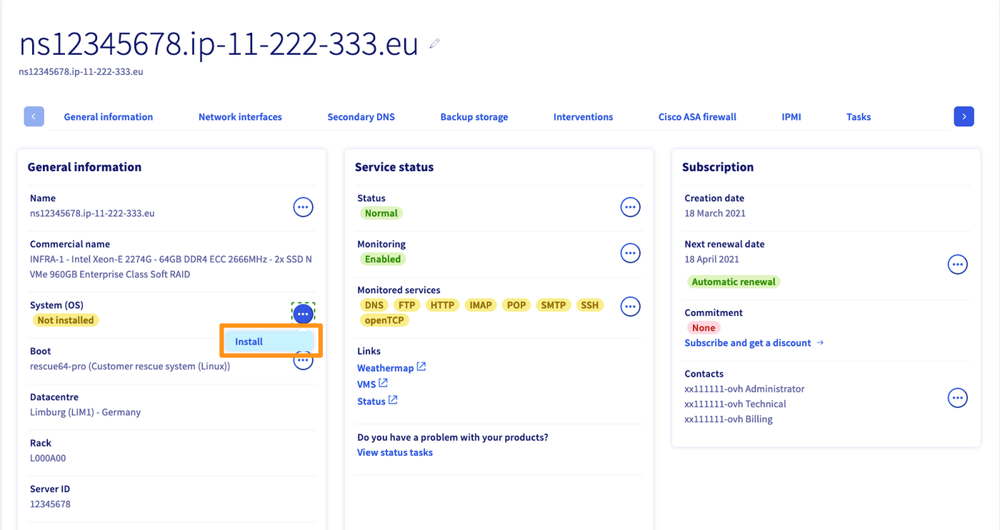
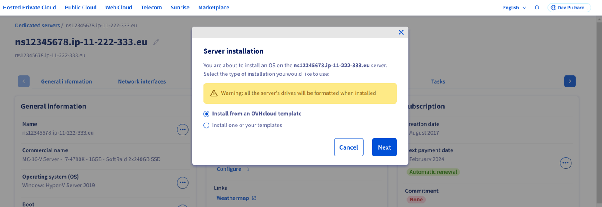
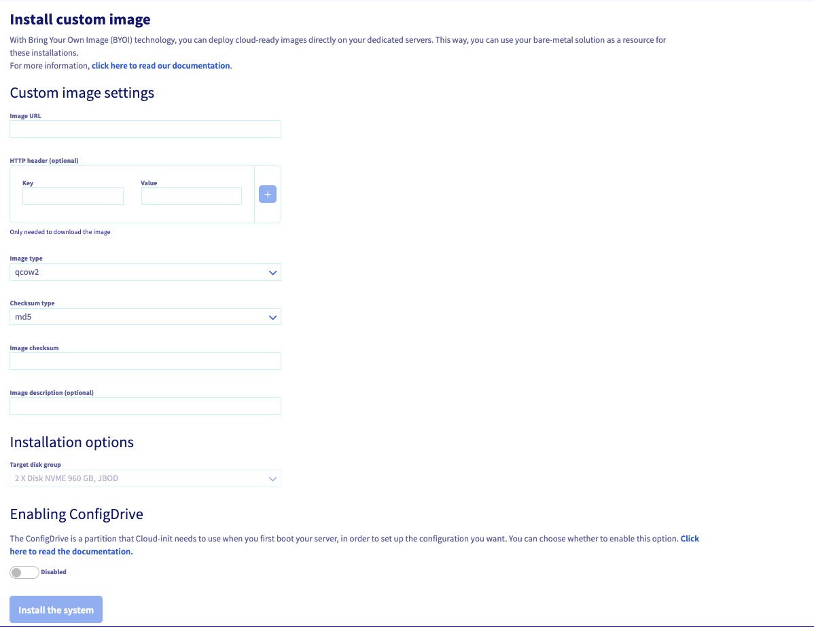
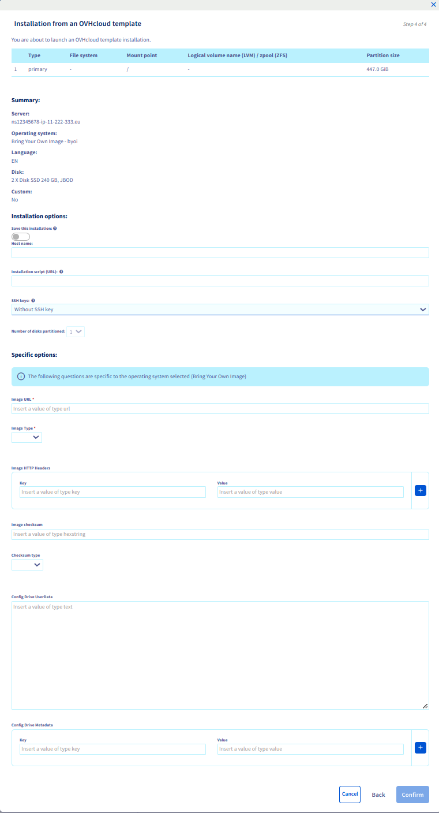

## Objective

The Bring Your Own Image feature (BYOI) enables you to deploy *cloudready* images directly on your dedicated server. You can therefore use the bare metal service as a resource for your deployments.

**What does *cloudready* mean?**

The *cloudready* standard generally means being agnostic of the infrastructure on which the image is deployed.
In addition to the requirement and limitations mentioned below, you must ensure that the image (downloaded or generated) answers correctly to the definition of technical expectations of a cloudready image.

**This guide explains how to use Bring Your Own Image (BYOI) on your OVHcloud dedicated server.**

## Requirements

- A [dedicated server](/links/bare-metal/bare-metal) in your OVHcloud account
- Access to the [OVHcloud Control Panel](/links/manager) (for the "[Deployment via Control Panel](#viacontrolpanel)" method)
- Access to the [OVHcloud API](/pages/manage_and_operate/api/first-steps) (for the "[Deployment via API](#viaapi)" section of this guide)
- Your image must be smaller than the Server RAM minus 3GiB

> [!warning]
>
> As with any classical OS installation, a new installation with BYOI will erase all the data on the server.
>

## Instructions

**Technical limitations:**

There are some technical limitations linked to the use of physical products such as dedicated servers. Here is a non-exhaustive list, to keep in mind during your deployment preparation:

- Boot type: **uefi** or **legacy**
- Partition type: **MBR** or **GPT**
- Image format: **qcow2** or **raw**

> [!warning]
> **About RAID:**
>
> - Bring Your Own Image (BYOI) does not support software RAID configuration at install-time, but you can use the service [Bring Your Own Linux (BYOLinux)](/pages/bare_metal_cloud/dedicated_servers/bring-your-own-linux) for that. Choose the custom image method that fits your needs: [Bring Your Own Image (BYOI) / Bring Your Own Linux (BYOLinux), a comparison sheet](/pages/bare_metal_cloud/dedicated_servers/bring-your-own-image-versus-bring-your-own-linux).
>
> - Hardware RAID is supported, if your server supports it, because it is configured before the image is deployed on disk.
>

**Deployment methods:**

- [Deployment via the Control Panel](#viacontrolpanel): allows you to simply deploy your image using the OVHcloud Control Panel.
- [Deployment via API](#viaapi): you can use the OVHcloud API to integrate images into your own scripts to automate deployments.

### Deploy your image via the Control Panel <a name="viacontrolpanel"></a>

Log in to the [OVHcloud Control Panel](/links/manager) and go to the `Bare Metal Cloud`{.action} section, then select your server under `Dedicated servers`{.action}.

In the `General information`{.action} tab, click the `...`{.action} button next to "System (OS)" then click `Install`{.action}.

{.thumbnail}

In the window that appears, select `Install from an OVHcloud template`{.action} and click `Next`{.action}.

{.thumbnail}

In the window that appears, select `Custom` in the menu, then `Bring Your Own Image - byoi`, and click `Next`{.action}.

{.thumbnail}

You will be redirected to the configuration page. Make sure your image URL is in the correct format. Complete the rest of the required fields on this page. Once you have confirmed that the information is correct, click `Confirm`{.action}.

You can find more details on the options in the [deployment options](#options) section below.

For more information and examples about Cloud-Init's ConfigDrive, please read the official documentation on [this page](https://cloudinit.readthedocs.io/en/22.1_a/topics/examples.html).

{.thumbnail}

### Deploy your image via the APIs <a name="viaapi"></a>

Log in to the [API console](https://api.ovh.com/) and go to the `/dedicated/server`{.action} section.

> [!api]
>
> @api {v1} /dedicated/server POST /dedicated/server/{serviceName}/install/start
>

The Bring Your Own Image (BYOI) payload should be similar to the following:

> [!warning]
>
> In the `userMetadata` section, only `imageURL` and `imageType` are mandatory.
>

```json
{
  "details": {
    "customHostname": "myCustomBYOI"
  },
  "templateName": "byoi_64",
  "userMetadata": [
    {
      "key": "sshKey",
      "value": "ssh-rsa AAAAB3NzaC1yc2EAAAADAQABAAAAgQC9xPpdqP3sx2H+gcBm65tJEaUbuifQ1uGkgrWtNY0PRKNNPdy+3yoVOtxk6Vjo4YZ0EU/JhmQfnrK7X7Q5vhqYxmozi0LiTRt0BxgqHJ+4hWTWMIOgr+C2jLx7ZsCReRk+fy5AHr6h0PHQEuXVLXeUy/TDyuY2JPtUZ5jcqvLYgQ== my-nuclear-power-plant"
    },
    {
      "key": "imageURL",
      "value": "https://cdimage.debian.org/cdimage/cloud/bullseye/20230124-1270/debian-11-generic-amd64-20230124-1270.raw"
    },
    {
      "key": "imageType",
      "value": "raw"
    },
    {
      "key": "httpHeaders0Key",
      "value": "Authorization"
    },
    {
      "key": "httpHeaders0Value",
      "value": "Basic bG9naW46cGFzc3dvcmQ="
    },
    {
      "key": "imageCheckSum",
      "value": "2cbd3dd5606ef95a5cfa47943b3ad453fcc43522915be7f559a296a71395f82f88e621e558df7aa5f3d2e62c20043f9430ad18c900e565a1c070066e8d008aaa"
    },
    {
      "key": "imageCheckSumType",
      "value": "sha512"
    },
    {
      "key": "configDriveUserData",
      "value": "I2Nsb3VkLWNvbmZpZwpzc2hfYXV0aG9yaXplZF9rZXlzOgogIC0gc3NoLXJzYSBBQUFBQjhkallpdz09IG15c2VsZkBteWRvbWFpbi5uZXQKCnVzZXJzOgogIC0gbmFtZTogcGF0aWVudDAKICAgIHN1ZG86IEFMTD0oQUxMKSBOT1BBU1NXRDpBTEwKICAgIGdyb3VwczogdXNlcnMsIHN1ZG8KICAgIHNoZWxsOiAvYmluL2Jhc2gKICAgIGxvY2tfcGFzc3dkOiBmYWxzZQogICAgc3NoX2F1dGhvcml6ZWRfa2V5czoKICAgICAgLSBzc2gtcnNhIEFBQUFCOGRqWWl3PT0gbXlzZWxmQG15ZG9tYWluLm5ldApkaXNhYmxlX3Jvb3Q6IGZhbHNlCnBhY2thZ2VzOgogIC0gdmltCiAgLSB0cmVlCmZpbmFsX21lc3NhZ2U6IFRoZSBzeXN0ZW0gaXMgZmluYWxseSB1cCwgYWZ0ZXIgJFVQVElNRSBzZWNvbmRzCg=="
    }
  ]
}
```

Even though the configDrive user data could be sent to the API directly in clear text by escaping special characters, it is recommended to send a base64-encoded script to the API. You can use the following UNIX/Linux command to encode your data:

```bash
cat my-data.yaml | base64 -w0
```

Here is the clear-text configDrive user data from the example above:

```yaml
#cloud-config
ssh_authorized_keys:
  - ssh-rsa AAAAB8djYiw== myself@mydomain.net

users:
  - name: patient0
    sudo: ALL=(ALL) NOPASSWD:ALL
    groups: users, sudo
    shell: /bin/bash
    lock_passwd: false
    ssh_authorized_keys:
      - ssh-rsa AAAAB8djYiw== myself@mydomain.net
disable_root: false
packages:
  - vim
  - tree
final_message: The system is finally up, after $UPTIME seconds
```

Once you completed the fields, start the deployment by clicking `Execute`{.action}.

#### Deployment options <a name="options"></a>

| Field | Description | Required |
|-|-|-|
| userMetadata/sshKey | SSH public key | ❌ |
| userMetadata/imageURL | Your image URL | ✅ |
| userMetadata/imageType | Your image format (qcow2, raw) | ✅ |
| userMetadata/imageCheckSum | Your image's checksum | ❌ |
| userMetadata/imageCheckSumType | Your image's checksum type (md5, sha1, sha256, sha512) | ❌ (except if checksum provided) |
| userMetadata/configDriveUserData | Your configDrive file content¹ | ❌ |
| userMetadata/configDriveMetadata | Custom Cloud-Init metadata | ❌ |
| userMetadata/httpHeaders?Key | HTTP Headers key  | ❌² |
| userMetadata/httpHeaders?Value | HTTP Headers value | ❌² |

¹ Can either be a `#cloud-config` or a script. It must be in one-line, and have `\n` for line-return<br />
² Use only if you need HTTP Headers, such as `Basic Auth`<br />

> [!primary]
>
> The ConfigDrive partition is used by cloud-init during the first server boot in order to apply your configurations. You can choose whether you want to use the default one, or a custom one (using `configDriveUserData`).
>

#### Common customer errors <a name="errors"></a>

The following table gives an overview of well known customer errors and how to fix them.

|Error message|Details|Solution(s)|
|---|---|---|
|Please provide checkSum AND checkSumType or none of them|You have specified only one of the arguments `imageCheckSum` and `imageCheckSumType`.|Either provide both arguments or none of them.|
|image provided format is `x` which does not match expected qcow2 format|Not matter what the file extension is, the real format has to be qcow2.|- Change the value of `imageType` to `raw`.<br />- Convert your image to qcow2.|
|image provided has a size of `n` bytes which is larger than `device` of `m` bytes|The image provided has a size that is bigger than the size of the disk chosen for the OS installation.|- If your server has several disk groups, you can try to reinstall the OS on another disk group by specifying the `diskgroupid` argument.<br />- You need to reduce the size of your image.|
|Can't write `t` on disk|Impossible to write qcow2/raw image on disk.|Modify your image so that the command `qemu-img convert -f "$imageType" -O raw $pathToImageFile "$device"` works.|
|Could not download, `t` image is too big to download in memory.|Your server doesn't have enough RAM to download the image.|You need to reduce the size of your image.|
|Could not download image located: `url`|Cannot download image from `imageURL`.|Check that a download with the `curl` command from your server works in rescue mode. If some HTTP specific headers are required, you can precise them with the `httpHeaders` argument.|
|image provided format is not of type raw because no partition table was found. It seems to contain: `x`|A raw image must contain a partition table.|Check that your image contains a partition table.|
|Bad `checkSumType` for downloaded file, got: `n` while expecting `m`.|Incorrect checksum.|- Please ensure that you have specified the correct checksum.<br />- Check that a download with the `curl` command from your server works in rescue mode.|

## Go further

[OVHcloud API & OS installation](/pages/bare_metal_cloud/dedicated_servers/api-os-installation)

[Bring Your Own Linux (BYOLinux)](/pages/bare_metal_cloud/dedicated_servers/bring-your-own-linux)

[Bring Your Own Image (BYOI) / Bring Your Own Linux (BYOLinux), a comparison sheet](/pages/bare_metal_cloud/dedicated_servers/bring-your-own-image-versus-bring-your-own-linux)

Join our user community on <https://community.ovh.com/en/>.
